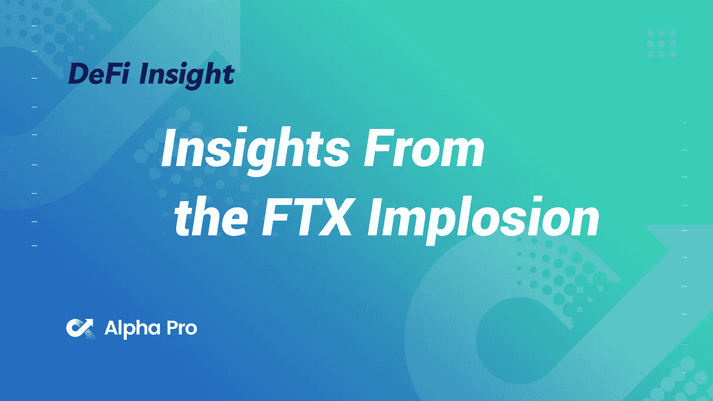
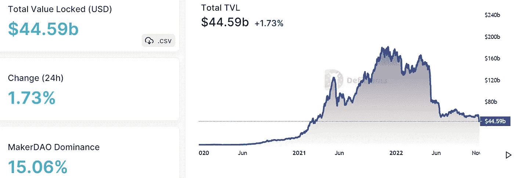
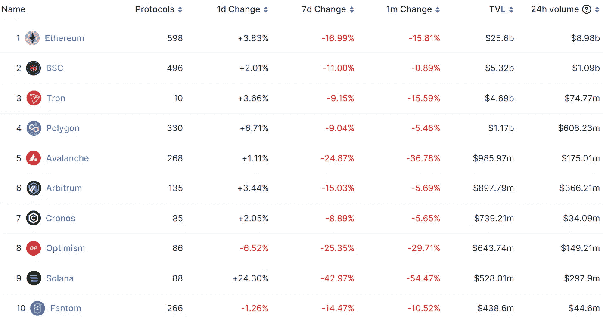
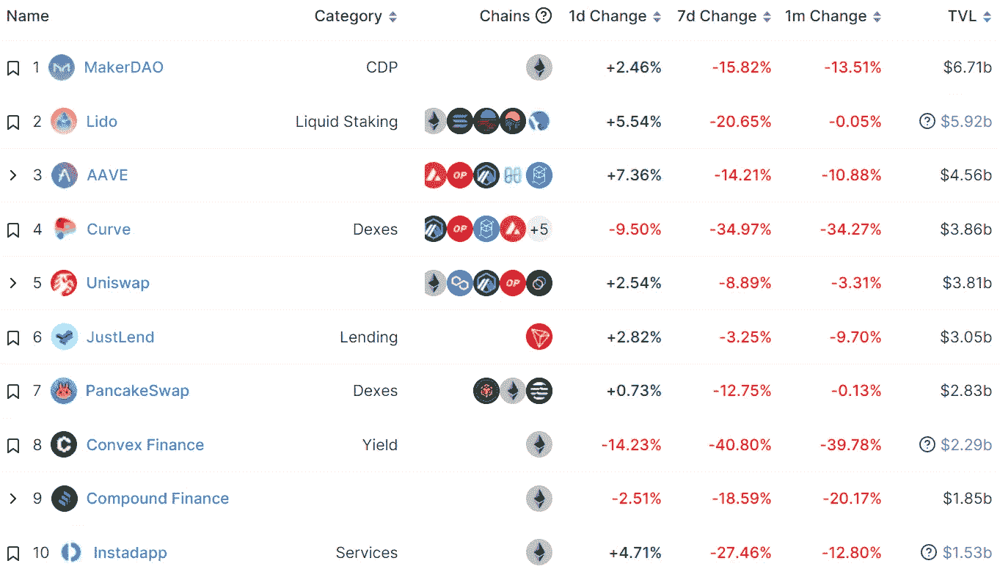
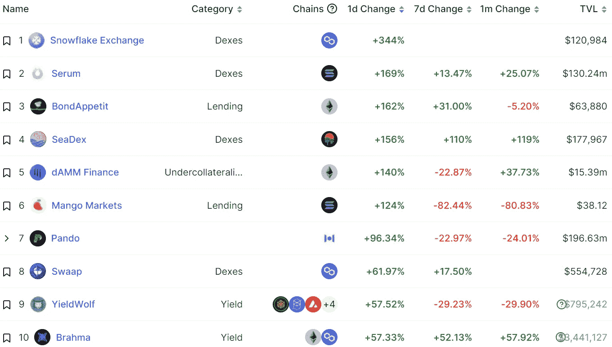
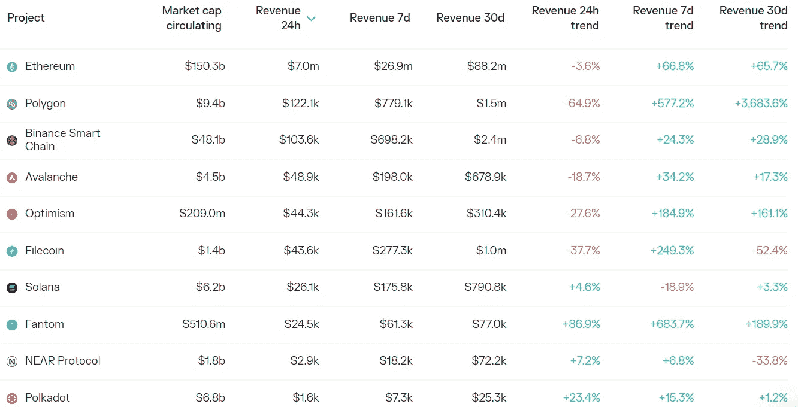
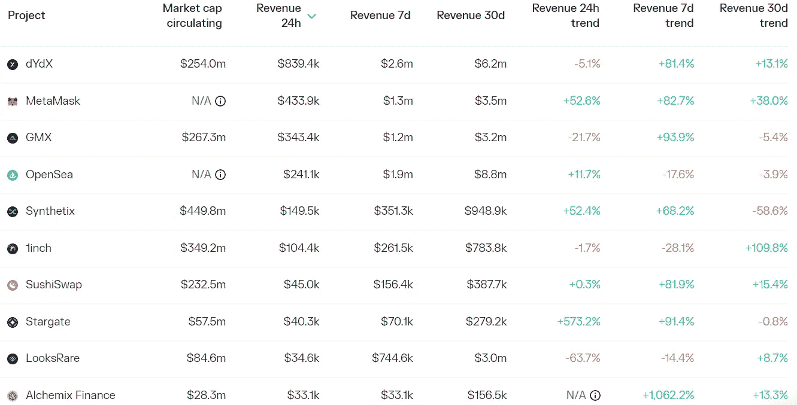

# DeFi Insight |来自 FTX 内爆的见解

> 原文：<https://medium.com/coinmonks/defi-insight-insights-from-the-ftx-implosion-f5380d7aad04?source=collection_archive---------18----------------------->

2022 年 11 月 11 日

*今日 DeFi 数据&由 DeFi Insight 为您带来的新闻*

> *"* 还有人因为这混乱的一周而筋疲力尽吗？
> 
> 我们回顾了昨天发生在 FTX 周围的一系列疯狂的事件。👈
> 
> 形势在迅速变化，还有很多我们不知道的。
> 
> 今天的时事通讯对数据进行了更深入的探究。
> 
> 用户什么时候开始从 FTX 集体提款的？
> 
> 阿拉米达在德菲有多少钱？
> 
> 哪些 DeFi 协议受到的冲击最大？*“@*[*来源*](https://newsletter.banklesshq.com/p/insights-from-the-ftx-implosion?utm_source=%2Finbox&utm_medium=reader2)

# 最新消息

## 德克斯/CEX/AMM

在对 FTX 的信心动摇后，[币安](https://decrypt.co/114160/binance-ftx-ftt-token-supply)仍持有 FTT 5%的供应量

FTX 的班克曼-弗里德悄悄地向红杉资本和其他风险投资公司投资了超过 5 亿美元

尽管 FTX 崩溃，一些投资者仍然一如既往地看好密码产业的未来

独家报道:这些投资者在 FTX 的崩溃中损失最大

FTX 重新开放巴哈马提款:南森

**[layer zero](https://twitter.com/PrimordialAA/status/1590817914592321536?s=20&t=Ppd-odALdbje9jDaQPIJ-Q)CEO:愿意 1:1 置换 FTX 持有的 280 万 STG**

****[layer zero](https://twitter.com/PrimordialAA/status/1590764525875499008?s=20&t=r172REDfC1ch09WsfnX4GA)宣布从 FTX 回购其 100%的股权和货币权利，目前持有价值 1.34 亿美元的资产****

******[创世纪](https://twitter.com/GenesisTrading/status/1590836596424998912?s=20&t=6Eoqr_-yv4Y5DtVpS8GIQg):衍生品部门有 1.75 亿美元被锁定在 FTX 的交易账户中******

********FTX 最新:[封锁](https://www.bloomberg.com/news/articles/2022-11-10/ftx-latest-bankman-fried-shuts-down-trading-firm-alameda?utm_content=crypto&utm_medium=social&utm_source=twitter&utm_campaign=socialflow-organic#xj4y7vzkg)叫停，SEC 调查，资产冻结加深危机********

********Tether 没有任何投资或贷款给[FTX/阿拉米达](https://twitter.com/paoloardoino/status/1590772281567215616)的计划********

********FTX 关于 [Tron](https://twitter.com/FTX_Official/status/1590763245488713729) 授信额度的公告********

********独家银行人为 FTX 寻求[94 亿美元](https://www.reuters.com/technology/exclusive-bankman-fried-seeks-94-bln-package-ftx-rescue-sources-2022-11-10/)一揽子救援-来源********

********[币安](https://www.theblock.co/post/185614/binance-hires-uk-director-invokes-need-to-comply-with-regulators)聘请英国董事，援引需要遵守的监管规定********

********[比特币基地](https://www.theblock.co/post/185626/coinbase-layoffs-more-than-60-recruiting-onboarding-employees)裁员 60 多名招聘、入职员工********

## ******贷款/CDP******

******Solend 从一笔水下贷款中积累了 600 万美元的坏账******

## ******第一层******

********[Aptos](https://www.theblock.co/post/184241/aptos-and-google-cloud-unveil-partnership-plan-for-accelerator-program?utm_source=twitter&utm_medium=social)与谷歌云宣布合作，计划加速器计划********

## ******稳定币******

********[系绳](https://tether.to/en/tether-proves-resilience-of-reserves-in-latest-attestation/)证明最近一次认证的储量弹性********

# ******数据和分析******

## ******锁定的总价值(TVL)******

******目前全网 DeFi 总锁定量为 445.9 亿美元，24 小时增长 1.73%。******

************

## ******TVL 评出的十大连锁酒店******

************

## ******|最新 TVL 十大项目******

************

## ******|过去 24 小时内 TVL 增长的前 10 个项目******

************

## ******协议收入******

## ******|累计总收入最高的项目(24H)_ 区块链(L1)******

************

## ******|累计总收入最高的项目(24H) _Dapps (L2)******

************

# ******深潜******

********[**下一波 Crypto 采用**](https://www.coindesk.com/webinars/the-next-wave-of-crypto-adoption-regulation-security-and-user-experience/) **:监管、安全和用户体验**********

**** [## 加密应用的下一波浪潮:监管、安全和用户体验

### 推动下一代加密采用者的因素是什么？尽管加密行业已经成熟，但新来者…

www.coindesk.com](https://www.coindesk.com/webinars/the-next-wave-of-crypto-adoption-regulation-security-and-user-experience/) 

**密码** [**金融危机**](https://www.apricitas.io/p/the-crypto-financial-crisis?utm_source=%2Finbox&utm_medium=reader2)

 [## 隐秘的金融危机

### 通过订阅，你将加入 17，000 多名阅读 Apricitas 周刊的人的行列！否则，喜欢或分享是最好的方式…

www.apricitas.io](https://www.apricitas.io/p/the-crypto-financial-crisis?utm_source=%2Finbox&utm_medium=reader2) 

# 报告

**[**FTX 垮台**](https://messari.io/report/ftx-meltdown-implications-and-insights) **:寓意与洞见 _ 梅萨里****

*   **追溯到加密技术的早期，第三大加密交易所 FTX 在银行挤兑期间停止了用户取款。据报道，资金缺口为 80 亿美元。**

****[**复合状态**](https://messari.io/report/state-of-compound-q3-2022?referrer=all-research)**Q3 2022**_ messari****

******搜索**[**Alpha**](https://www.theblockresearch.com/searching-for-alpha-sturdy-finance-and-metastreet-185266)**:稳健金融与 MetaStreet _**the block research****

******十月区块链** [**资金**](https://www.theblockresearch.com/october-blockchain-funding-recap-2-184926) **回顾** _theblockresearch****

******[**3s 层概述**](https://www.theblockresearch.com/an-overview-of-layer-3s-182539)**_ the block research********

********关于:********

****DeFi Insight 是顶级 DeFi 和加密新闻和更新的来源。****

******https://twitter.com/AlphaPro_io 推特:******

********https://medium.com/feed/@alphapro.project**RSS:******

******提供的信息应被视为发展新闻，而不是投资建议。******

> ******交易新手？尝试[加密交易机器人](/coinmonks/crypto-trading-bot-c2ffce8acb2a)或[复制交易](/coinmonks/top-10-crypto-copy-trading-platforms-for-beginners-d0c37c7d698c)**********