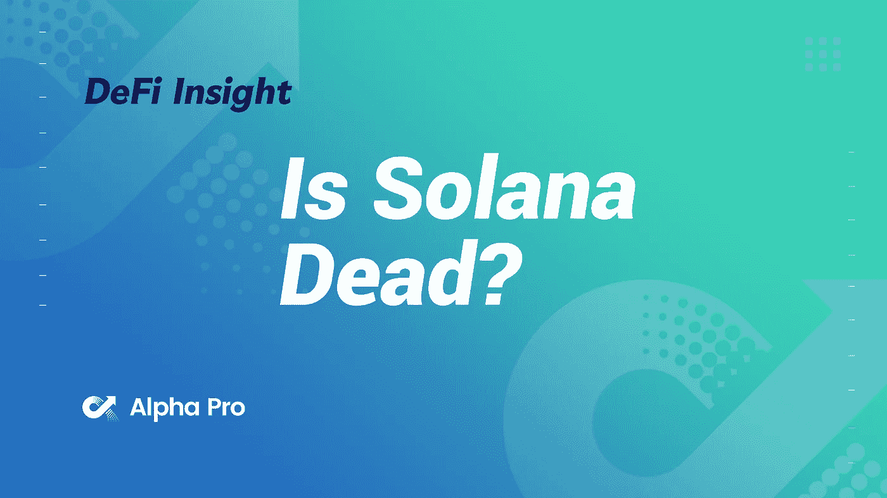
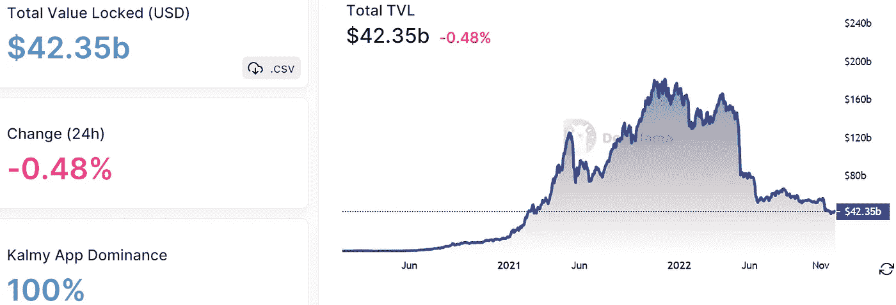
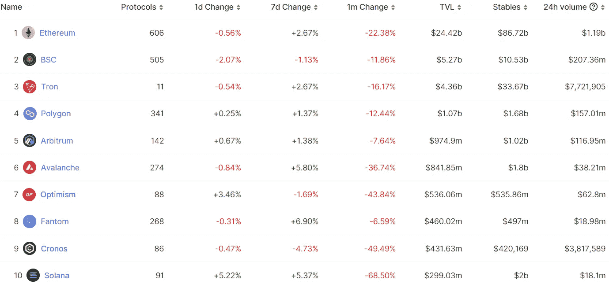
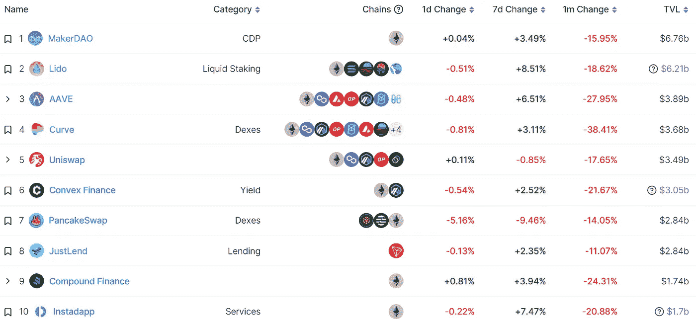
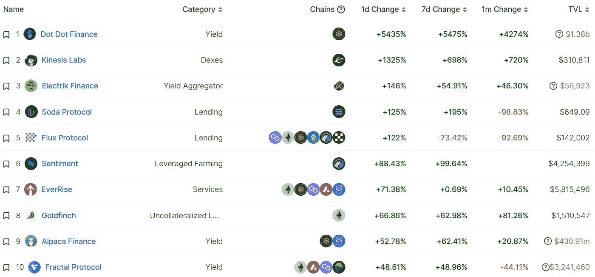
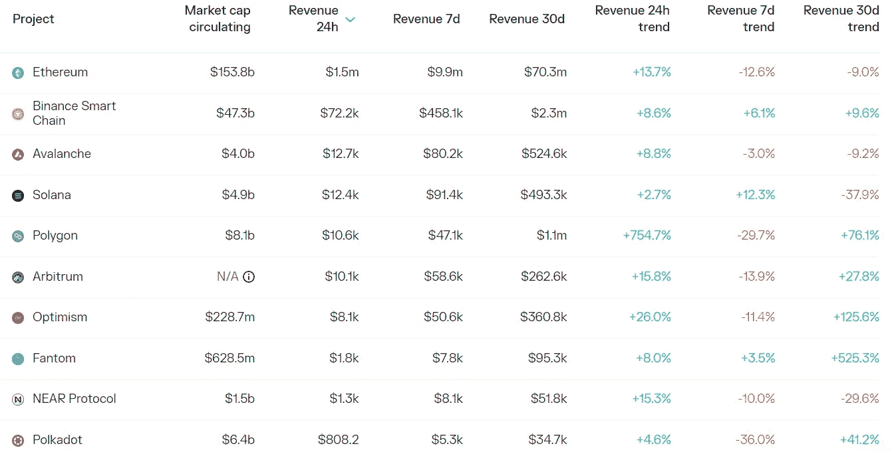
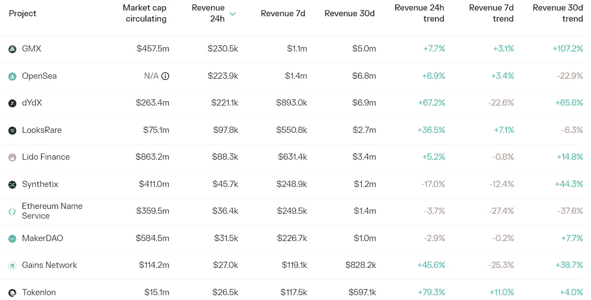

# DeFi Insight |索拉纳死了吗？

> 原文：<https://medium.com/coinmonks/defi-insight-is-solana-dead-a9c079a545af?source=collection_archive---------17----------------------->

2022 年 12 月 2 日

*今日 DeFi 数据&由 DeFi Insight 为您带来的新闻*

> *“*这是无法回避的事实——11 月对 crypto 来说是艰难的一个月。
> 
> 市场下跌，贷款人和基金像苍蝇一样下降，熊市的氛围完全生效。
> 
> 当我们继续在 FTX 和阿拉米达的废墟中跋涉时，很明显一些社区比其他社区遭受了更严重的打击。
> 
> 本周，我们将深入了解冲击索拉纳生态系统的艰难时期，探究该网络究竟是如何挣扎的，以及该社区在哪些方面表现出了韧性。*“@*[*来源*](https://newsletter.banklesshq.com/p/is-solana-dead?utm_source=%2Finbox&utm_medium=reader2)

# 最新消息

## 德克斯/CEX/AMM

在 FTX 崩溃之际，11 月份分散加密交易所的交易量几乎翻了一番

**[显著市场份额](https://twitter.com/lars0x/status/1598320476098535424):币安 75.1%，比特币基地 9.2%，北海巨妖 3.6%，FTX 3.1%**

**币安高管称公司的“集中交易”( T21)可能在 10 年内不复存在**

**比特币基地机构明年将把 USDC 机构奖励率从 1.5%提高到 2.36%**

**苹果要求比特币基地钱包 iOS 系统通过其应用内购买系统支付汽油费**

****[乔](https://joecontent.substack.com/p/trader-joe-to-deploy-onto-arbitrum)部署到仲裁一号上****

****BitMEX 的完全成熟的 PoL 系统现已投入使用****

## ****第一层****

******穗网现已结束 Testnet Wave 1******

******Fantom 将成为区块链平台的 YouTube/twitch——Andre cron je******

********Fantom:dApp[Gas](https://fantom.foundation/blog/dapp-gas-monetization-program/)货币化计划********

## ******贷款/CDP******

********将慧星 [USDC 市场](https://www.comp.xyz/t/increase-eth-supply-cap-in-usdc-comet-market/3817)上的 ETH 供应上限从 75，000 ETH 增加到 150，000 ETH——复合提案********

********/**由 [Aave](https://app.aave.com/governance/proposal/?proposalId=127) 社区发起的部署和激活 Aave StarkNet 桥的提案正在投票中******

## ****稳定币****

******、**上升的抵押贷款给[稳定的货币](https://www.wsj.com/articles/rising-tether-loans-add-risk-to-stablecoin-crypto-world-11669875590)、加密世界增加了风险****

******[WSJ&CO](https://tether.to/en/wsj-and-co-the-hypocrisy-of-mainstream-media-asleep-at-the-wheel-of-information/):主流媒体的虚伪，在信息的车轮下沉睡******

********11 月份 Stablecoin 链上调整后的交易量增长了 58.3%，达到创纪录的[9186 亿美元](https://twitter.com/lars0x/status/1598320439784349696)********

## ******支付******

********、**一个可嵌入和可定制的[平面到加密的 onramp](https://stripe.com/zh-cn-hk/blog/crypto-onramp)******

## ****空投****

******[港口协议](https://blog.comdex.one/all-about-harbor-airdrop-1b2f43bd65f8)将于 12 月 5 日分发令牌港口空投******

## ******钱包******

******俄罗斯 Sber 银行将 Metamask 整合到其区块链平台中******

## ******NFT******

********[魔法伊甸园](https://www.coindesk.com/web3/2022/12/01/magic-eden-launches-protocol-to-enforce-creator-royalties/)启动协议强制征收创作者版税********

********moon pay 推出[【灵魂捆绑】](https://www.theblock.co/post/191213/moonpay-to-roll-out-soulbound-nft-loyalty-program) NFT 忠诚度计划********

## ******基金******

********、** 645 家风投公司关闭[、3.47 亿美元](https://www.finsmes.com/2022/12/645-ventures-closes-347m-fourth-fund-and-first-select-fund.html)第四只基金和第一只精选基金******

## ****政策与法规****

******[FTX 投资者](https://www.bloomberg.com/news/articles/2022-12-01/ftx-investors-squeezed-by-us-for-information-on-firm-and-bankman-fried)被我们逼着提供公司和银行的信息******

******大臣称，英国的秘密议程不会因 FTX 崩溃而脱轨******

## ******锁定的总价值(TVL)******

******目前全网 DeFi 总锁定量为 423.5 亿美元，24 小时下降 0.48%。******

************

## ******TVL 评出的十大连锁酒店******

************

## ******|最新 TVL 十大项目******

************

## ******|过去 24 小时内 TVL 增长的前 10 个项目******

************

## ******协议收入******

## ******|累计总收入最高的项目(24H)_ 区块链(L1)******

************

## ******|累计总收入最高的项目(24H) _Dapps (L2)******

************

# ******深潜******

********5**[**连锁信号**](https://newsletter.banklesshq.com/p/5-on-chain-signals-that-weve-bottomed?utm_source=%2Finbox&utm_medium=reader2) **我们已经触底********

**** [## 5 个连锁信号表明我们已经触底

### 在 web3 中获取医疗保健💊亲爱的无银行国家，这是新的一个月，我们感到乐观！十一月是一个艰难的…

newsletter.banklesshq.com](https://newsletter.banklesshq.com/p/5-on-chain-signals-that-weve-bottomed?utm_source=%2Finbox&utm_medium=reader2) 

**[**入门指南**](https://newsletter.banklesshq.com/p/starknet-starkware-ethereum-rollup-chain-guide?utm_source=%2Finbox&utm_medium=reader2)**

** [## StarkNet 初学者指南

### 提升你的区块链审计水平👨‍💻亲爱的无银行国家，众所周知，我们是卷链的忠实粉丝…

newsletter.banklesshq.com](https://newsletter.banklesshq.com/p/starknet-starkware-ethereum-rollup-chain-guide?utm_source=%2Finbox&utm_medium=reader2) 

**[**CZ**](https://newsletter.banklesshq.com/p/is-cz-too-powerful-bd9?utm_source=%2Finbox&utm_medium=reader2)**是不是太厉害了？****

** [## CZ 是不是太厉害了？

### 我们刚刚更新了空投指南，为我们的无银行高级会员提供了一些新的空投预测，让他们可以更快…

newsletter.banklesshq.com](https://newsletter.banklesshq.com/p/is-cz-too-powerful-bd9?utm_source=%2Finbox&utm_medium=reader2) 

**[**Uniswap**](https://metaversal.banklesshq.com/p/trading-nfts-on-uniswap?utm_source=%2Finbox&utm_medium=reader2)交易 NFT**

** [## 在 Uniswap 上交易 NFT🦄

### 亲爱的无银行国家，2018 年，Uniswap 开创了自动做市商(AMM)模式，这一模式后来开始普及…

metaversal.banklesshq.com](https://metaversal.banklesshq.com/p/trading-nfts-on-uniswap?utm_source=%2Finbox&utm_medium=reader2) 

**引入准备金证明** [**交换指标**](https://insights.glassnode.com/proof-of-reserves/)

 [## 引入准备金证明交换指标

### 我们引入了一系列准备金证明指标来轻松监控交易所的链上准备金余额…

insights.glassnode.com](https://insights.glassnode.com/proof-of-reserves/) 

# 报告

**[**区块链游戏**](https://dappradar.com/blog/bga-game-report-october-november-2022) **尽管 FTX 崩溃 _** dappradar，但仍有弹性**

*   **尽管 FTX 崩溃了，但 Web3 游戏仍然是 dapp 行业的驱动力。在 10 月和 11 月，游戏活动几乎占了 DappRadar 在 50 个网络中跟踪的所有区块链活动的一半，11 月有 800，875 个每日唯一活跃钱包(UAW)与游戏的智能合约进行了交互。**

****2022 年回顾** [**乐观**](https://www.theblockresearch.com/2022-review-of-optimistic-rollups-191414) **上卷****_**the block research**

****11 月的数字:看看 crypto** [**交易所卷**](https://www.theblockresearch.com/november-by-the-numbers-3-191219) **、未平仓利息和矿工收入 _** theblockresearch**

****分析** [**创始人基金的**](https://www.theblockresearch.com/analyzing-founders-funds-crypto-portfolio-190655) **加密投资组合****_**the block research**

****[**镜头协议**](https://www.theblockresearch.com/lens-protocol-building-the-backbone-for-decentralized-social-190131) **:打造去中心化社交的中坚力量 _** theblockresearch****

******接下来是什么:通往** [**Crypto 的恢复**](https://messari.io/report/path-to-cryptos-recovery?referrer=all-research) **_** messari****

******[**上的 Bot 活动分散往来**](https://messari.io/report/bot-activity-on-decentralized-exchanges?referrer=all-research) **_** messari******

******[**投资**](https://coinshares.com/research/ethereum-investment-case) **案例为以太坊** **_** 共股******

******关于:******

****DeFi Insight 是顶级 DeFi 和加密新闻和更新的来源。****

******https://twitter.com/AlphaPro_io 推特:******

********❤RSS:**[**https://medium.com/feed/@alphapro.project**](https://medium.com/feed/@alphapro.project)******

****提供的信息应被视为发展新闻，而不是投资建议。****

> ****交易新手？尝试[加密交易机器人](/coinmonks/crypto-trading-bot-c2ffce8acb2a)或[复制交易](/coinmonks/top-10-crypto-copy-trading-platforms-for-beginners-d0c37c7d698c)**************