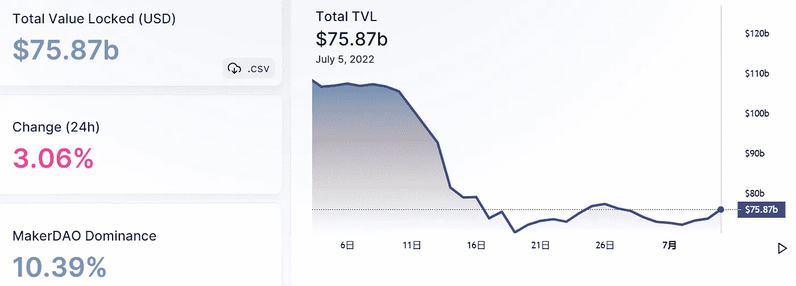
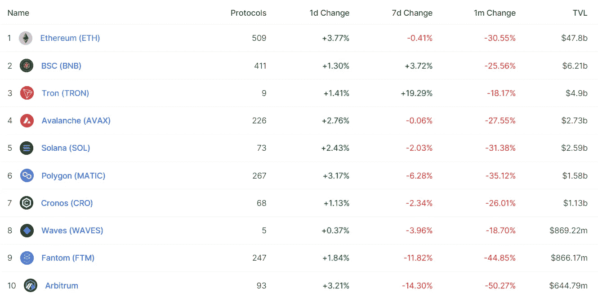
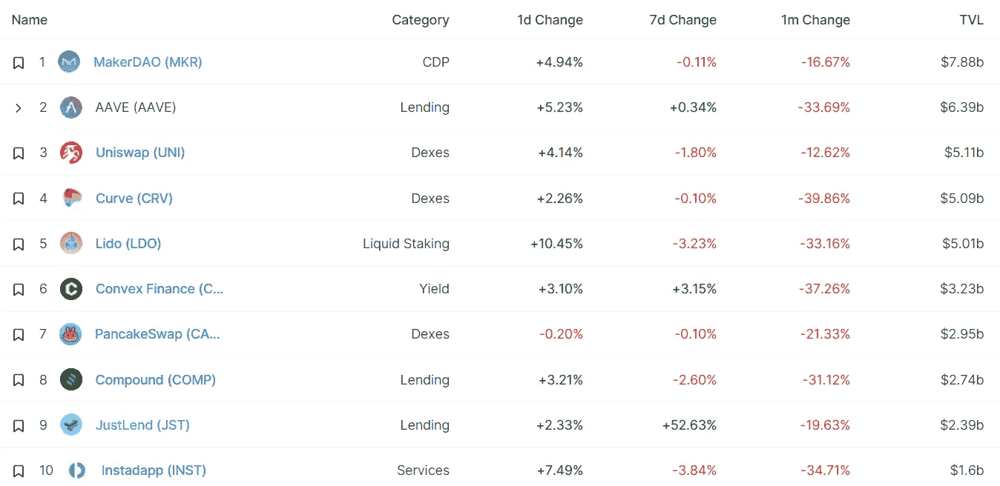
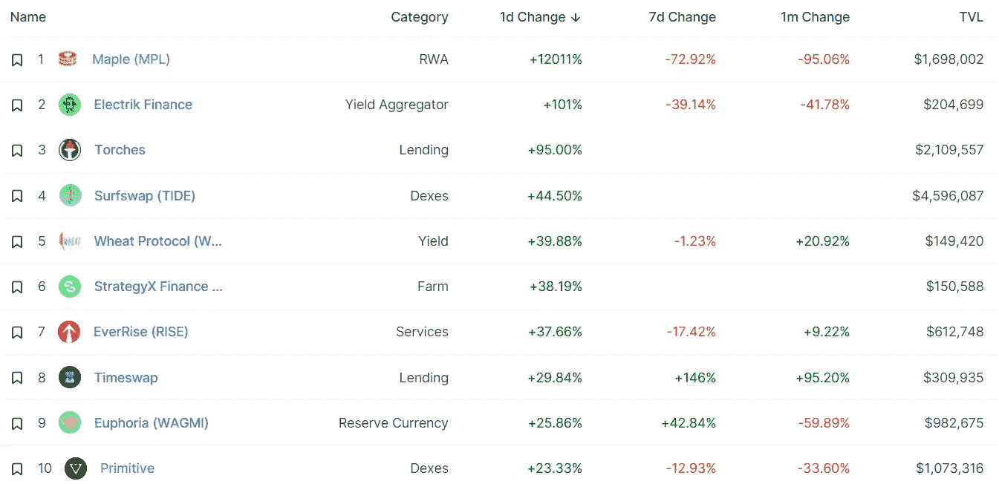
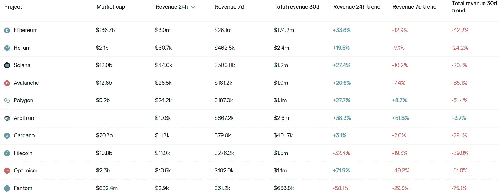
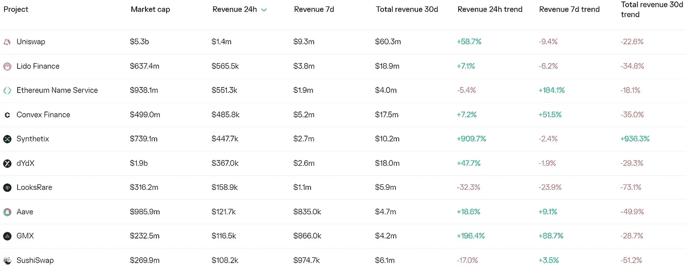
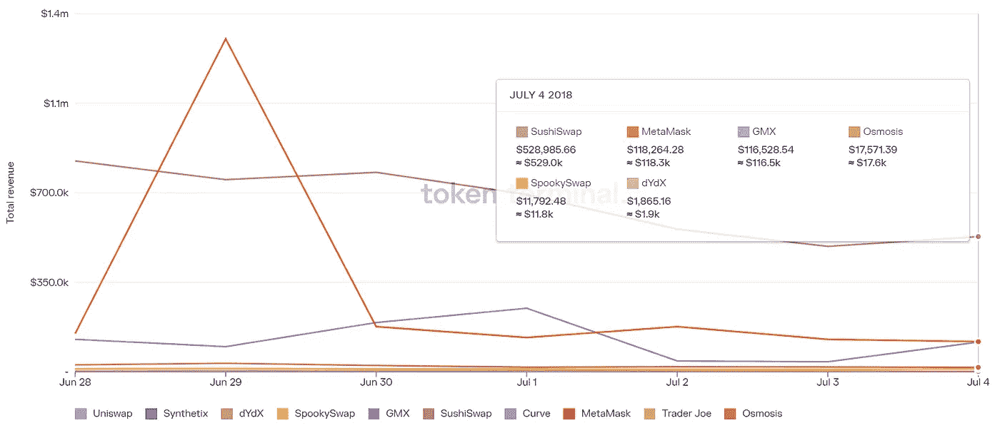
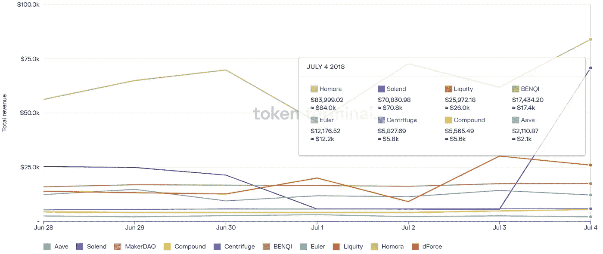

# DeFi Insight | L1s 表现优于 DeFi 这个圈子

> 原文：<https://medium.com/coinmonks/defi-insight-l1s-performed-better-than-defi-this-circle-24da871029de?source=collection_archive---------29----------------------->

2022 年 7 月 5 日

*今日 DeFi 数据&由 DeFi Insight 为您带来的新闻*

> *"* 当人们开始质疑他们在牛市中所相信的一切时，你知道这是一个周期的结束。
> 
> 最近的加密周期，开始于复合发射 COMP 并将产量农业的概念带给大众，正式结束于 Terra 被 Anchor 承诺的 20%产量和过度膨胀的 LUNA 杀死。
> 
> 这次事故引发了一系列反思，质疑 DeFi 其他项目的有效性。*“@*[*来源*](/dragonfly-research/defis-non-progress-this-cycle-ea322ad536dc)

# 最新消息

## 贷款

**[摄氏度](https://watcher.guru/news/celsius-network-pays-off-50-million-bitcoin-loan-liquidation-price-drops-to-8840)网络还清 5000 万美元比特币贷款，清算价格降至 8840 美元**

****、**临时变更[提款额度](https://coinloan.io/blog/temporary-change-in-withdrawal-limits/)**

## **外汇**

****[之字形隐形 3](https://blog.zigzag.exchange/zigzag-invisibl3-a-privacy-preserving-dex-bb335f17c0ce) —一种隐私保护指数****

******[航海家](https://cryptoslate.com/voyager-opens-withdrawals-for-transactions-submitted-prior-to-suspending-trading/)为暂停交易前提交的交易开通取款******

******随着新税的实施，印度加密交易所的交易停止了******

******FTX 政策主管称，在市场疯狂的情况下，其“优先事项没有改变”******

## ******交叉链******

******和谐提议增加气费，降低区块气限******

## ******第二层******

******为什么以太坊定标器 [Arbitrum](https://decrypt.co/104408/why-ethereum-scaler-arbitrum-hit-pause-on-odyssey-nft-campaign) 在奥德赛 NFT 战役中遭遇暂停******

## ******|令牌******

********/**外壳治理令牌将使用[$外壳](https://twitter.com/ShellProtocol/status/1543975592244101128?s=20&t=5Y87IOfIpqkK8K9_vME8eA)标记******

## ****钱包****

******元中止[【诺维】](https://9to5mac.com/2022/07/04/meta-novi-cryptocurrency-wallet/)加密货币数字钱包******

## ******政策与法规******

******议员们说，NFT 平台应该被欧盟反洗钱调查抓住******

********/**[巴西](https://news.bitcoin.com/brazil-creates-crypto-dedicated-investigation-unit/)成立专门的秘密调查小组******

## ****NFT****

******[另一方](https://twitter.com/OthersideMeta/status/1544023315160993793?s=20&t=w2RzcaZ8t_TUhAKuyueXMg)将于 7 月 6 日和 9 日进行两次负载测试，用户需持其他证书参加******

## ******基金******

******红杉资本的中国分公司筹集了 90 亿美元，超额完成目标******

******非洲基础设施公司[获得 1 . 5 亿美元](https://cointelegraph.com/news/african-infrastructure-firm-lands-150m-to-launch-crypto-water-token)来推出加密水令牌******

## ******观点******

********[区块链分析对于全球加密领域的持续增长至关重要](https://www.prweb.com/releases/blockchain_analytics_is_vital_for_sustaining_growth_in_the_global_crypto_sphere_raj_chowdhury/prweb18773019.htm):Raj Chowdhury********

> ******交易新手？尝试[加密交易机器人](/coinmonks/crypto-trading-bot-c2ffce8acb2a)或[复制交易](/coinmonks/top-10-crypto-copy-trading-platforms-for-beginners-d0c37c7d698c)******

# ******数据和分析******

## ******锁定的总价值(TVL)******

******目前全网 DeFi 总锁定量为 758.7 亿美元，24 小时增长 3.06%。******

************

## ******TVL 评出的十大连锁酒店******

************

## ******|最新 TVL 十大项目******

************

## ******|过去 24 小时内 TVL 增长的前 10 个项目******

************

## ******协议收入******

## ******|累计总收入最高的项目(24H)_ 区块链(L1)******

************

## ******|累计总收入最高的项目(24H) _Dapps (L2)******

************

## ******|前 10 大交易所的每日收入******

************

## ******|十大贷款协议的每日收入******

************

# ******深潜******

********[**自我主权**](https://bitcoinist.com/is-self-sovereignty-the-only-path-forward-for-defi/) **是 DeFi 的唯一出路吗？**********

**** [## 自我主权是 DeFi 前进的唯一道路吗？Bitcoinist.com

### 在没有集中的中介机构的情况下，获得分散的融资应该是可能的。不幸的是，大多数人只…

bitcoinist.com](https://bitcoinist.com/is-self-sovereignty-the-only-path-forward-for-defi/) 

**第 2 层可扩展性说明:**[**ZK 汇总如何测量子网**](/ngc-ventures/layer-2-scalability-explained-how-zk-rollups-measure-up-to-subnets-2c4eec6953c1)

 [## 第 2 层可扩展性解释:ZK 总结如何测量子网

### 背景

medium.com](/ngc-ventures/layer-2-scalability-explained-how-zk-rollups-measure-up-to-subnets-2c4eec6953c1) 

**以下是** [**实用令牌**](https://cryptoslate.com/heres-how-utility-tokens-can-drive-crypto-adoption-higher/) **如何推动加密采用率提高**

 [## 以下是实用程序令牌如何推动加密的采用

### TaschaLabs 的创始人 Tascha 最近提醒社区关于公用令牌的潜力，并说他们可以…

cryptoslate.com](https://cryptoslate.com/heres-how-utility-tokens-can-drive-crypto-adoption-higher/) 

# 报告

**[**比特币游客的驱逐**](https://insights.glassnode.com/the-week-onchain-week-27-2022/) _glassnode**

> **比特币已经锁定了历史上最差的月度价格表现之一，价格在 6 月份下跌了 37.9%。比特币已经几乎完全驱逐了市场游客，只剩下霍德勒的决心作为最后一道防线。**

****[**欧盟密码法规**](https://messari.io/article/analyst-note-eu-crypto-regulation-update) **更新** _messari****

******介绍** [**网页 5**](https://www.theblockresearch.com/introducing-web-5-153433)_ block research****

******[**比特币**](https://members.delphidigital.io/reports/bitcoin-closes-4th-consecutive-week-beneath-200-weekly-ma) **连续第 4 周收于 200 周 MA 下方** _delphidigital******

******关于:******

****DeFi Insight 是顶级 DeFi 和加密新闻和更新的来源。****

******https://twitter.com/AlphaPro_io 推特:******

********https://medium.com/feed/@alphapro.project**RSS:******

******提供的信息应被视为发展新闻，而不是投资建议。**********