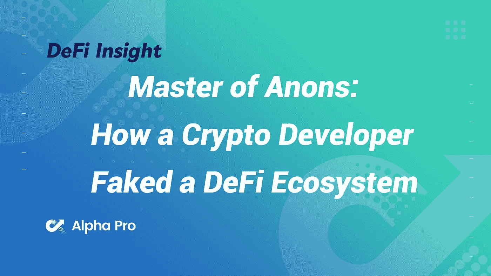
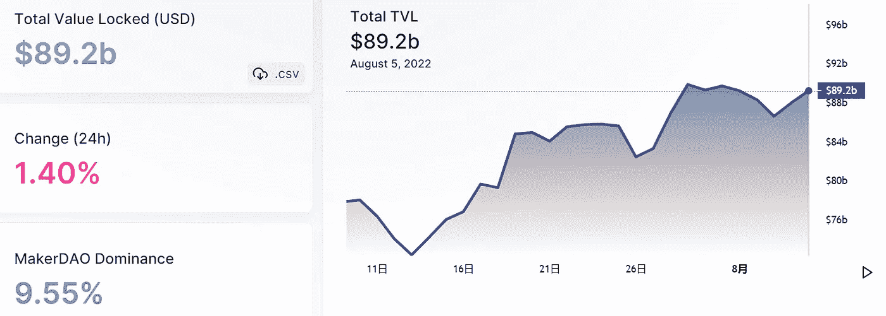
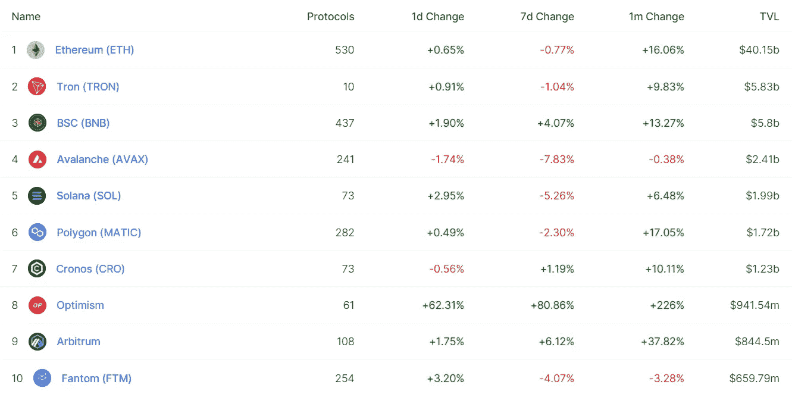
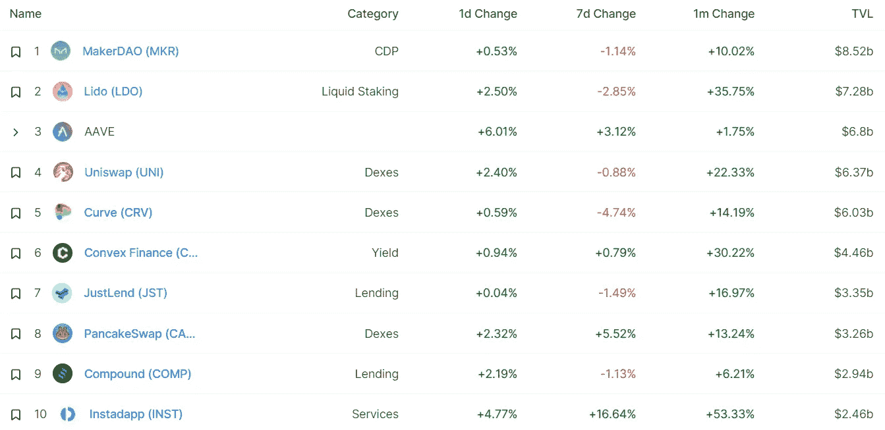
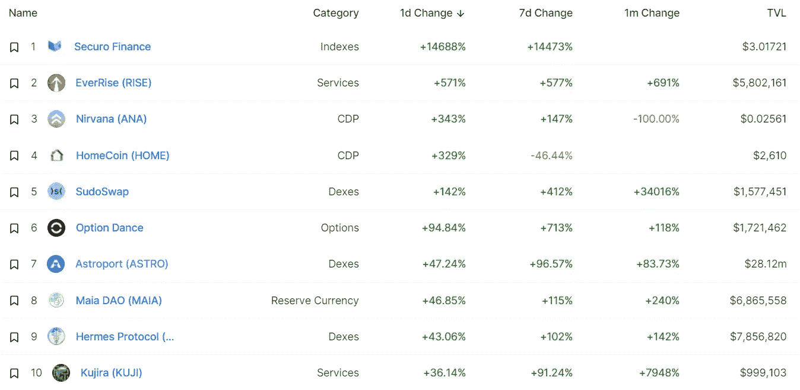
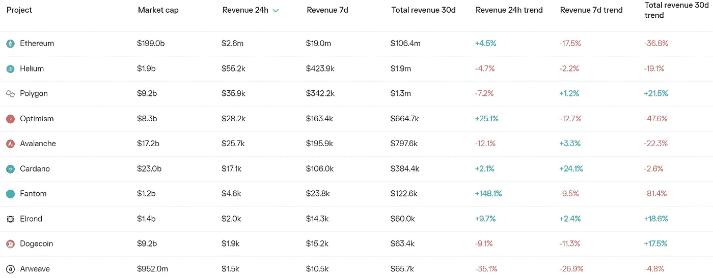
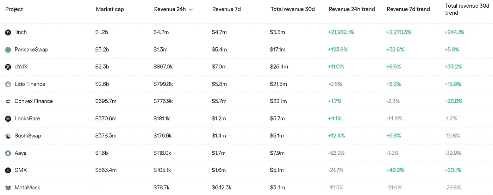
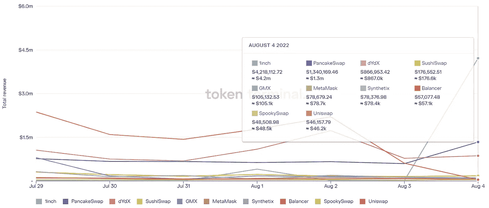
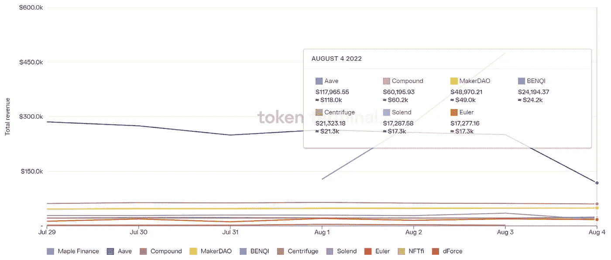

# DeFi Insight |匿名大师:密码开发者如何伪造 DeFi 生态系统

> 原文：<https://medium.com/coinmonks/defi-insight-master-of-anons-how-a-crypto-developer-faked-a-defi-ecosystem-6195804b41bf?source=collection_archive---------8----------------------->

2022 年 8 月 5 日

*今日 DeFi 数据&由 DeFi Insight 为您带来的新闻*

> *"* 马卡里诺兄弟利用一系列虚假身份创造了一个 dev 社区的假象，为 Saber 协议和索拉纳·区块链增加了价值。现在他们正转移到 Aptos。*“@*[*来源*](https://www.coindesk.com/layer2/2022/08/04/master-of-anons-how-a-crypto-developer-faked-a-defi-ecosystem/)

# 最新消息

## 贷款

**[航海家数码](https://www.wsj.com/articles/voyager-digital-to-return-270-million-to-customers-11659648633?mod=latest_headlines)被批准向客户返还 2.7 亿美元**

## **指标**

**新的 Uniswap 提案可能有助于缓解协议的治理困境**

## **产量**

****/**[optimism find 流动性挖掘项目](https://twitter.com/AaveAave/status/1555230478394966018)在 Aave V3 上上线**

## **衍生产品**

****[Nimbus](https://cryptodaily.co.uk/2022/08/nimbus-platform-launched-the-first-ever-financial-derivative-product-on-the-blockchain-in-its-defi-platform)平台在其 DeFi 平台上推出了首款区块链金融衍生产品****

## ****市场****

******[卡达诺($ADA)](https://www.cryptoglobe.com/latest/2022/08/cardano-ada-network-surpasses-3-5-million-wallet-milestone/) 网络钱包里程碑突破 350 万******

********,**[VeChain(VET)](https://thecryptobasic.com/2022/08/04/vechain-vet-ranks-among-coinmarketcaps-top-10-crypto-projects-by-engagement-growth/)位列 CoinMarketCap 参与度增长排名前十的加密项目******

## ****空投****

****NFT: [领取你的硬币](http://www.10kfrens.org/ape)****

## ****商业****

****Blockchain.Com 加密公司[在意大利注册为虚拟资产提供商](https://cryptodaily.co.uk/2022/08/crypto-firm-blockchaincom-registers-as-a-virtual-asset-provider-in-italy)****

******[区块击败 Q2 估计](https://www.coindesk.com/business/2022/08/04/block-beats-q2-estimates-posts-179b-in-bitcoin-transactions/)但比特币收入下降******

## ******第二层******

********准备好你的引擎，[硝基](/offchainlabs/prepare-your-engines-nitro-is-imminent-a46af99b9e60)迫在眉睫********

## ******|令牌******

********,**Cardalonia 与 Readyplayerme 合作 [LONIA Token 预售](https://coinquora.com/cardalonia-partners-with-readyplayerme-amid-lonia-token-presale/)******

## ****钱包****

******[Wallet.NEAR.org](https://twitter.com/NEARProtocol/status/1555271136254066690)不再允许用户使用电子邮件或短信创建帐户来恢复帐户******

## ******罪犯******

********介绍 [vePERP](https://perpprotocol.mirror.xyz/4ASvu8WSG7OfNQuFarOAbejhp6kOYV2mcyhoRGt9rLI)********

## ******政策与法规******

******专家称:索拉纳破解的密码可能被视为税收损失******

## ******基金******

******Brevan Howard 获得有史以来最大的加密对冲基金******

******格子资本为第二只加密基金募集 6000 万美元******

********[现在玩，以后付钱](https://techcrunch.com/2022/08/04/buy-now-play-later-nfts-metaverse-halliday-bags-6m-in-seed-round-led-by-a16z/):韩礼德获得 600 万美元的种子轮，由 a16z 牵头********

## ******观点******

******埃隆·马斯克预测美国将会有 18 个月的“温和衰退”******

# ******数据和分析******

## ******锁定的总价值(TVL)******

******目前全网 DeFi 总锁定量为 892 亿美元，24 小时增长 1.4%。******

************

## ******TVL 评出的十大连锁酒店******

************

## ******|最新 TVL 十大项目******

************

## ******|过去 24 小时内 TVL 增长的前 10 个项目******

************

## ******协议收入******

## ******|累计总收入最高的项目(24H)_ 区块链(L1)******

************

## ******|累计总收入最高的项目(24H) _Dapps (L2)******

************

## ******|前 10 大交易所的每日收入******

************

## ******|十大贷款协议的日收入******

************

# ******深潜******

********[**密码和竞选财务规则**](https://www.trmlabs.com/post/crypto-and-campaign-finance) **:这个选举季你需要知道的一切**********

**** [## 加密和竞选财务规则:选举季你需要知道的一切

### 2022 年 8 月 4 日随着美国中期选举季的升温，上周加州结束了对使用…

www.trmlabs.com](https://www.trmlabs.com/post/crypto-and-campaign-finance) 

**本案为** [**下一轮牛市**](https://newsletter.banklesshq.com/p/the-case-for-the-next-bull-run)

 [## 下一轮牛市的理由

### 亲爱的无银行国家，我们之前已经说过很多次了:熊市是积累财富的最好机会…

newsletter.banklesshq.com](https://newsletter.banklesshq.com/p/the-case-for-the-next-bull-run) 

**[**美联储的**](https://members.delphidigital.io/reports/the-feds-invisible-moving-target) **隐形移动目标****

** [## 美联储的隐形移动目标——德尔福数码

### 披露:本报告的作者在 BTC 和瑞士联邦理工学院任职。作者没有购买或出售任何代币…

members.delphidigital.io](https://members.delphidigital.io/reports/the-feds-invisible-moving-target) 

**[**最高竞价**](https://cryptohayes.medium.com/max-bidding-7a1c56c1cd07)**

** [## 最高出价

### (下面表达的任何观点都是作者的个人观点，不应构成制定……

cryptohayes.medium.com](https://cryptohayes.medium.com/max-bidding-7a1c56c1cd07)** 

# **报告**

****[**alpha drops 案例分析**](https://research.thetie.io/alphadrops-case-study-crv-velo-op/) **: CRV、维洛、OP** _thetie****

> ****在过去的几周里，投票托管(ve)代币在讨论和价格上都有了巨大的变化。通过 SigDev 上的硬币资料，我能够快速查明并评估导致峰值的事件。硬币档案是我们刚刚推出的新产品，它为用户提供了每个令牌的全面概述，并提供了识别相对机会的基准。****
> 
> ****通过使用新页面，我能够通过我们的新闻/情绪数据和研究图表补充链上分析，发现行动在很大程度上是由两个主要催化剂驱动的——曲线和 velo drome/乐观主义。虽然有一个峰值是出乎意料的，但通过 SigDev 跟踪结果信息，我们可以清楚地看到 VELO 和 OP 积极因素在令牌价格上涨前几天的飙升。****

******[**使用密码构建**](https://messari.io/report/using-crypto-to-build-real-world-infrastructure) **现实世界的基础设施** _messari******

******[**8 月调研**](https://www.theblockresearch.com/august-research-and-analysis-report-161406) **及分析报告** _theblockresearch******

******[**FTX**](https://coinshares.com/research/ftx-asset-highlight)资产亮点 _coinshares******

******关于:******

****DeFi Insight 是顶级 DeFi 和加密新闻和更新的来源。****

******https://twitter.com/AlphaPro_io 推特:******

********❤RSS:**[**https://medium.com/feed/@alphapro.project**](https://medium.com/feed/@alphapro.project)******

****提供的信息应被视为发展新闻，而不是投资建议。****

> ****加入 Coinmonks [电报频道](https://t.me/coincodecap)和 [Youtube 频道](https://www.youtube.com/c/coinmonks/videos)了解加密交易和投资****

# ****另外，阅读****

*   ****[加拿大最佳加密交易机器人](https://coincodecap.com/5-best-crypto-trading-bots-in-canada) | [库币评论](https://coincodecap.com/kucoin-review)****
*   ****[用于 Huobi 的加密交易信号](https://coincodecap.com/huobi-crypto-trading-signals) | [HitBTC 审查](/coinmonks/hitbtc-review-c5143c5d53c2)****
*   ****[TraderWagon 回顾](https://coincodecap.com/traderwagon-review) | [北海巨妖 vs 双子星 vs BitYard](https://coincodecap.com/kraken-vs-gemini-vs-bityard)****
*   ****[如何在 FTX 交易所交易期货](https://coincodecap.com/ftx-futures-trading)****
*   ****[OKEx vs KuCoin](https://coincodecap.com/okex-kucoin) | [摄氏替代度](https://coincodecap.com/celsius-alternatives) | [如何购买 VeChain](https://coincodecap.com/buy-vechain)**********