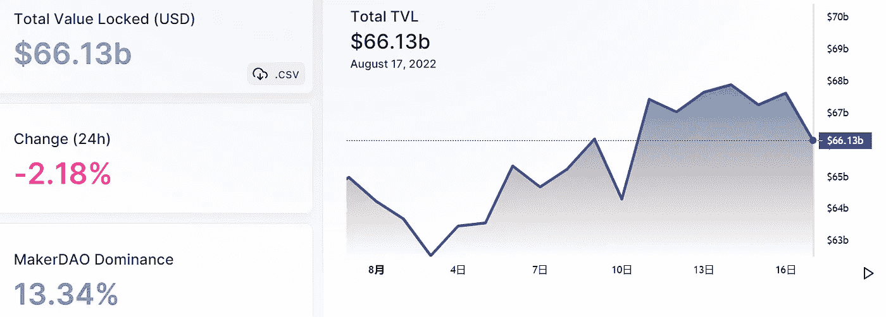
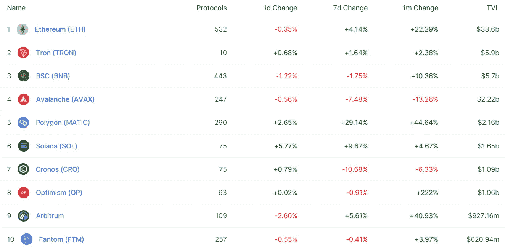
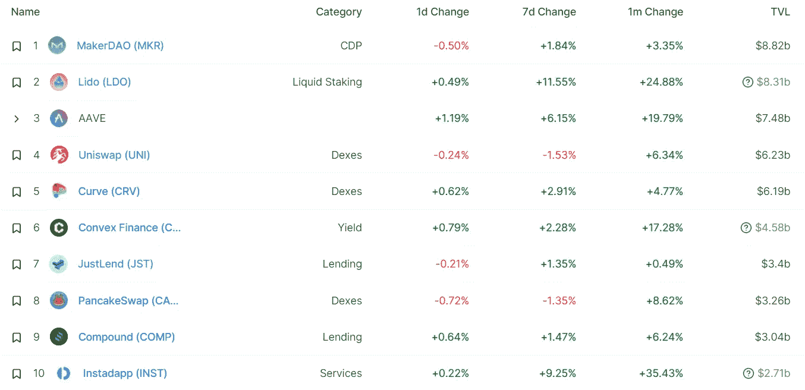
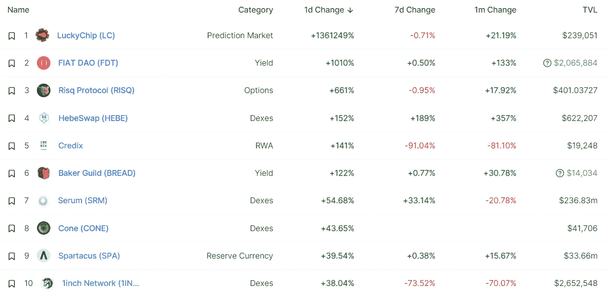
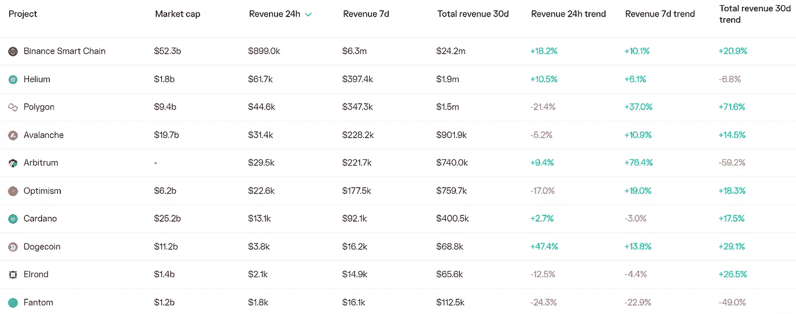
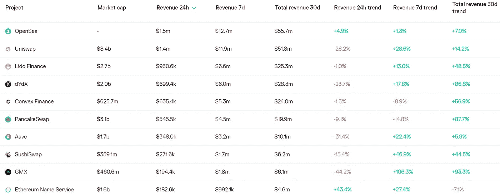
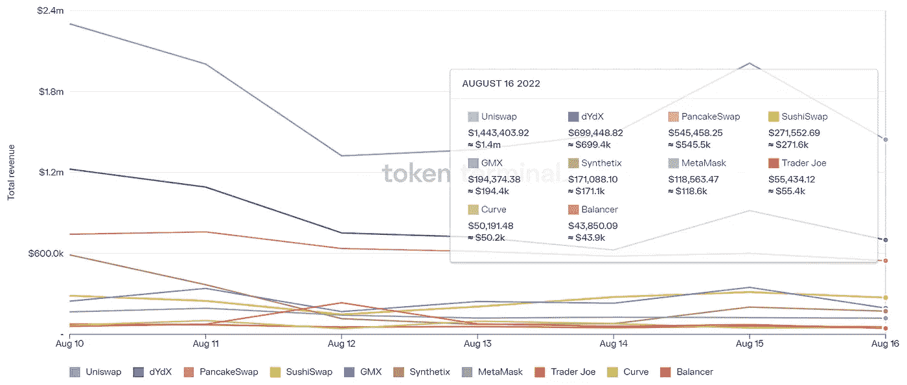
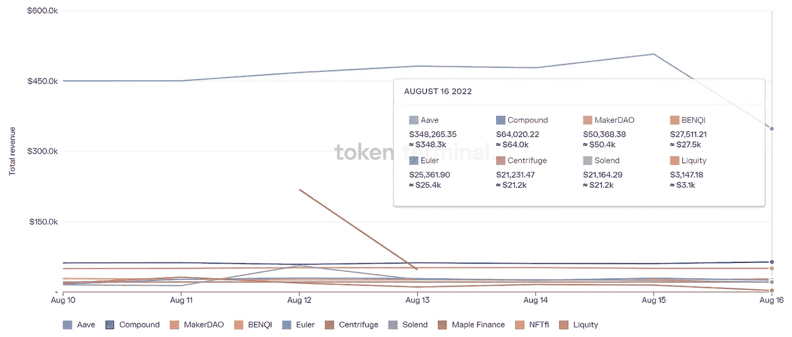

# DeFi 洞察|随隋而动

> 原文：<https://medium.com/coinmonks/defi-insight-move-with-sui-f37d38e9f928?source=collection_archive---------27----------------------->

2022 年 8 月 17 日

*今日 DeFi 数据&由 DeFi Insight 为您带来的新闻*

> *"* 随着上周 Solana 和 Nomad 黑客事件的发生，对安全且可扩展的区块链的需求变得越来越明显。我们之前的报告讨论了 Aptos，这是一个由 Meta(前脸书)员工创建的区块链，运行在 Move 编程语言上。也就是说，Aptos 不是这个街区唯一的新成员(双关语)。在本文中，我们将讨论 Mysten 实验室的区块链项目 Sui，其目标是成为第一个互联网规模的可编程区块链平台。
> 
> Sui 成立的前提是，由于构成区块链三难困境的问题，当前区块链网络的效率不足以适应大规模采用带来的需求。值得注意的是，隋本身并不是吴庭艳的派生物。Sui 是从零开始构建的，考虑了基本的可扩展性，以实现即时结算，同时还提供为数十亿用户提供应用所需的高吞吐量、低延迟和低成本。*“@*[*来源*](https://research.thetie.io/sui-blockchain/)

# 最新消息

## 链条

**/**[什么是 Dogechain](https://decrypt.co/107590/what-is-dogechain-dogecoin-layer-2-defi-nfts-games) ？所谓的 Dogecoin“第二层”用于 DeFi、NFT 和游戏

## 第二层

**mainnet 上的[zkSync 2.0](https://twitter.com/zksync/status/1559582553643749376)73 天**

****[plonky 2](https://blog.polygon.technology/plonky2-is-now-open-source/)现已开源****

## ****市场****

******/**比特币和以太坊继续斗争， [EOS 汹涌](https://cryptonews.com/news/bitcoin-ethereum-continue-struggle-eos-surges.htm)****

## ****交叉链****

******[路由器协议](https://twitter.com/routerprotocol/status/1559769791371522048)与卡瓦网络集成******

********、**、[数据链](/@datachain/datachain-successfully-completes-building-an-ibc-bridge-between-cosmos-and-harmony-on-the-local-5910e094e6c6)在本地试验网上成功搭建了宇宙与和谐之间的 IBC 桥梁******

## ****支付****

******[【涟漪】](https://cryptopotato.com/ripple-sbi-remit-join-hands-to-enable-real-time-payments-between-japan-and-thailand/)【SBI】汇携手实现日泰之间的实时支付******

******索尼娃的豪华度假村现在接受加密支付******

## ******钱包******

******Pontem Wallet 现在可以作为谷歌 Chrome 商店的扩展使用******

## ******鲸鱼******

********/**[Whales Activity pick Up](https://thecryptobasic.com/2022/08/17/whale-activity-picking-up-as-dogecoin-records-100k-valued-transactions-happening-daily/)As doge coin 记录每天发生的价值超过 10 万美元的交易******

## ****提议****

******、**关于[快速公投](https://acala.discourse.group/t/proposal-for-expedited-referenda/1228)的提案****

## ****监护****

******$ SOL 正在直播 [BitGo](https://twitter.com/BitGo/status/1559577320591020032?s=20&t=fzhoPhHV9beV6vwDriKdkg)******

## ******叉子******

********[ETHW 核心](https://twitter.com/EthereumPoW/status/1559680141344665601?s=20&t=PYi9qZUS6zihWuY67eimcg)引入流动性池冻结技术保护用户资产********

## ******采矿******

******比特币矿商[据点数字](https://www.coindesk.com/business/2022/08/16/bitcoin-miner-stronghold-digital-in-restructuring-negotiations-with-lenders/)大幅重组债务******

## ******政策与法规******

********[哥伦比亚](https://decrypt.co/107557/colombia-to-introduce-central-bank-digital-currency-tax-agency-chief)引入央行数字货币:税务局长********

## ******NFT******

********介绍[新的势不可挡的手机应用](https://unstoppabledomains.com/blog/mobile-app)********

# ******数据和分析******

## ******锁定的总价值(TVL)******

******目前全网 DeFi 总锁定量为 661.3 亿美元，24 小时下降 2.18%。******

************

## ******TVL 评出的十大连锁酒店******

************

## ******|最新 TVL 十大项目******

************

## ******|过去 24 小时内 TVL 增长的前 10 个项目******

************

## ******协议收入******

## ******|累计总收入最高的项目(24H)_ 区块链(L1)******

************

## ******|累计总收入最高的项目(24H) _Dapps (L2)******

************

## ******|前 10 大交易所的每日收入******

************

## ******|十大贷款协议的日收入******

************

# ******深潜******

********[**年中秘密犯罪更新**](https://blog.chainalysis.com/reports/crypto-crime-midyear-update-2022/) **:非法活动随着市场的其余部分下降，但有一些明显的例外**********

**** [## 年中加密犯罪更新:非法活动随着市场的其余部分下降，一些值得注意的…

### Chainalysis 不保证或担保数据的准确性、完整性、及时性、适用性或有效性

blog.chainalysis.com](https://blog.chainalysis.com/reports/crypto-crime-midyear-update-2022/) 

**[**GMX 指南**](https://newsletter.banklesshq.com/p/perpetuals-arbitrum-gmx-defi-ethereum-layer2?utm_source=%2Finbox&utm_medium=reader2)**

** [## GMX 基本指南

### 使用代码“无银行”获得特价！亲爱的无银行国家，GMX 最近成了焦点。有好处…

newsletter.banklesshq.com](https://newsletter.banklesshq.com/p/perpetuals-arbitrum-gmx-defi-ethereum-layer2?utm_source=%2Finbox&utm_medium=reader2) 

**[**ETH-flexive**](https://cryptohayes.medium.com/eth-flexive-7e1921123f64)**

** [## 弹性以太网

### (下面表达的任何观点都是作者的个人观点，不应构成制定……

cryptohayes.medium.com](https://cryptohayes.medium.com/eth-flexive-7e1921123f64) 

**[**NFT**](/@ItsCuzzo/general-architecture-of-an-nft-project-on-ethereum-b54b047800cc)**以太坊**的总体架构**

** [## 以太坊 NFT 项目的总体架构

### 序

medium.com](/@ItsCuzzo/general-architecture-of-an-nft-project-on-ethereum-b54b047800cc) 

**[**合并**](https://ethereum.org/en/upgrades/merge/#preparing-for-the-merge)**

** [## 合并| ethereum.org

### 这次合并是以太坊历史上最重大的升级。广泛的测试和 bug 奖励…

ethereum.org](https://ethereum.org/en/upgrades/merge/#preparing-for-the-merge)** 

# **报告**

****Ankr 和 Pocket 解决** [**Web3 的节点中心化问题**](https://messari.io/report/do-ankr-and-pocket-solve-web3-s-node-centralization-problems) **？**_ 梅萨里**

> **远程过程调用(RPC)层是审查的主要候选层。因此，集中式节点基础设施提供商的分散替代方案对于维持无许可的 Web3 生态系统至关重要。
> Ankr 和 Pocket 是节点基础设施协议，旨在以更低的成本和接近零的停机时间提供分散的替代方案。然而，他们的离链中继分配器机制是集中操作的，产生了单点故障。**

****分析**[**Galaxy Digita**](https://www.theblockresearch.com/analysis-of-galaxy-digitals-1-2bn-acquisition-of-bitgo-163605)**l 12 亿美元收购 BitGo** _theblockresearch**

****总计** [**ETH**](https://members.delphidigital.io/reports/total-eth-staked-on-a-steady-uptrend-as-the-merge-approaches) **随着合并的临近，呈现稳步上升的趋势** _delphidigital**

****[**土豆网**](https://dappradar.com/blog/new-dapps-report-the-potatoz-the-bridge-between-memes-and-web3) **—模因与网络之间的桥梁 3** _dappradar****

******关于:******

****DeFi Insight 是顶级 DeFi 和加密新闻和更新的来源。****

******https://twitter.com/AlphaPro_io 推特:******

********❤RSS:**[**https://medium.com/feed/@alphapro.project**](https://medium.com/feed/@alphapro.project)******

****提供的信息应被视为发展新闻，而不是投资建议。****

> ****交易新手？试试[加密交易机器人](/coinmonks/crypto-trading-bot-c2ffce8acb2a)或[复制交易](/coinmonks/top-10-crypto-copy-trading-platforms-for-beginners-d0c37c7d698c)**************