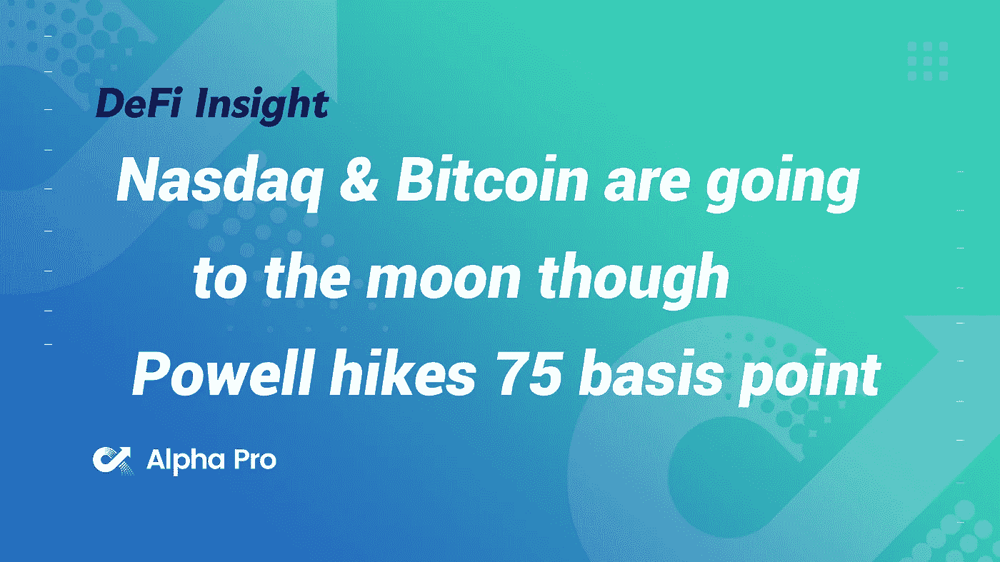
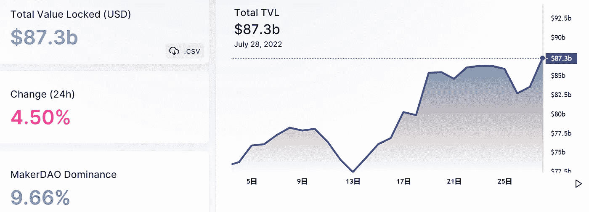
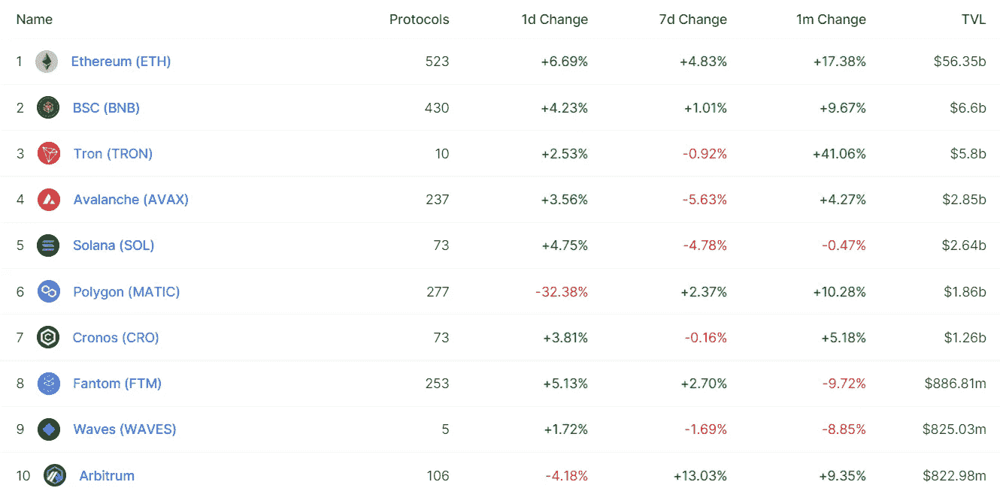
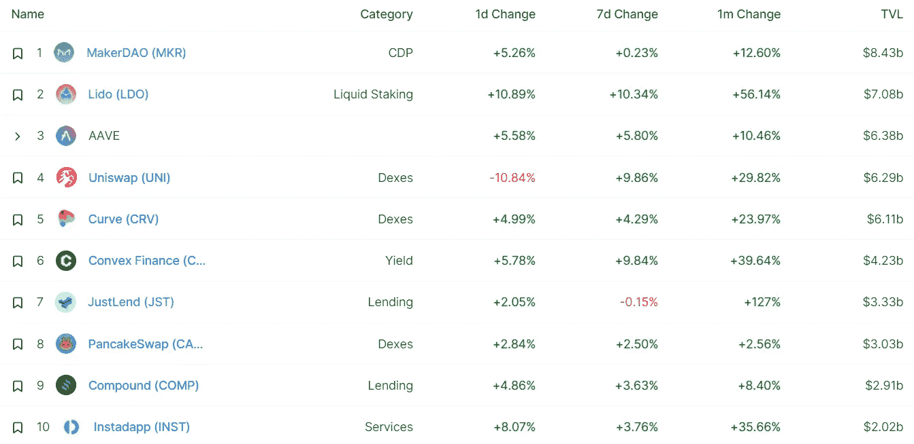
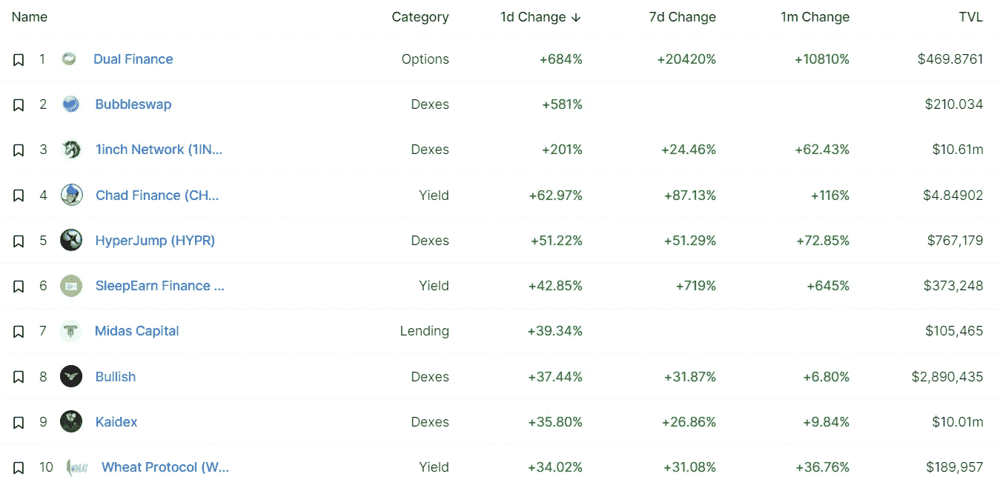
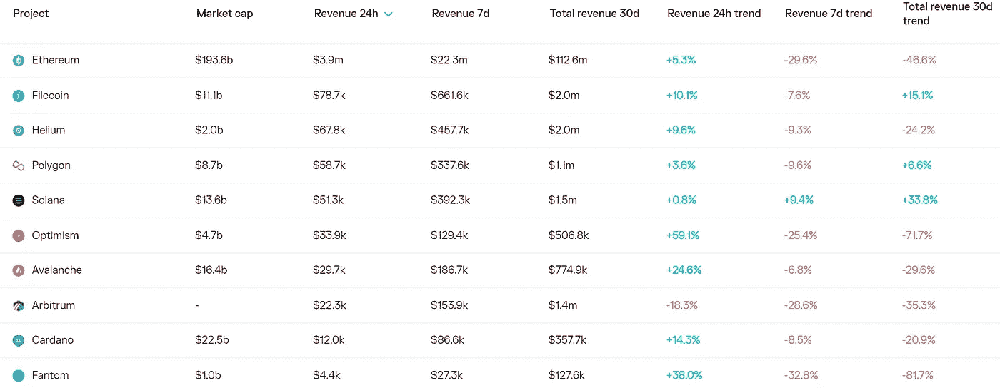
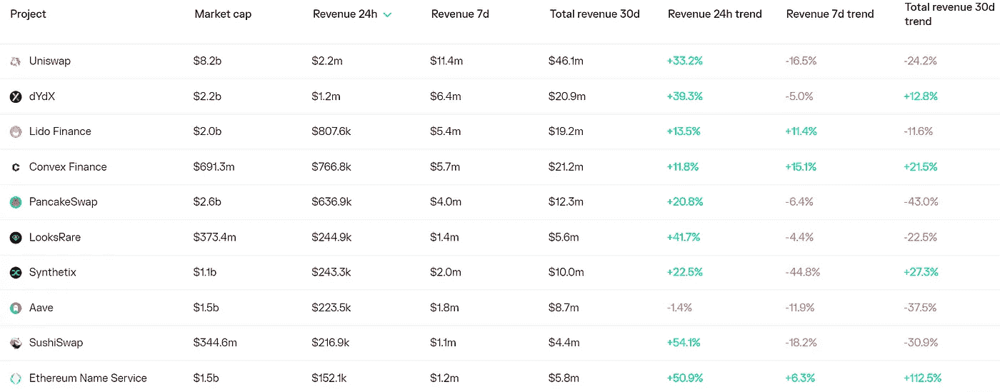
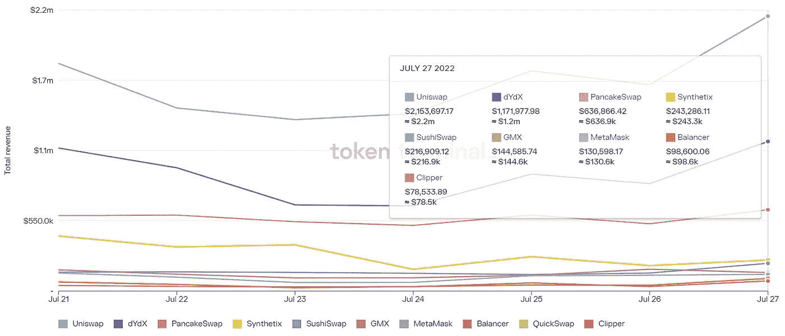
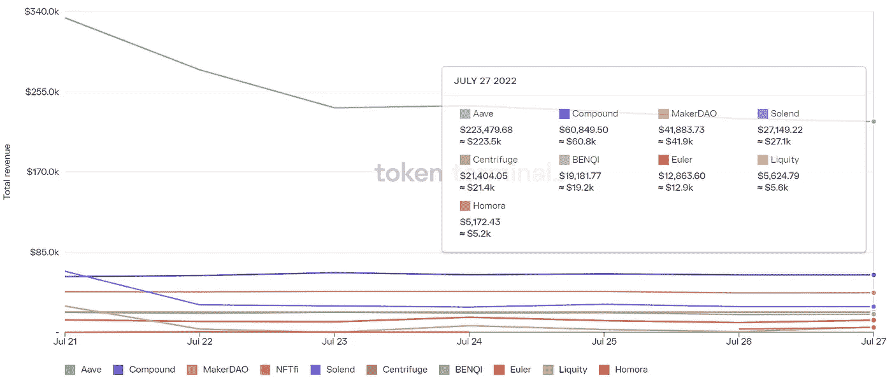

# 尽管鲍威尔将利率提高了 75 个基点，纳斯达克和比特币正在走向月球

> 原文：<https://medium.com/coinmonks/defi-insight-nasdaq-bitcoin-are-going-to-the-moon-though-powell-hikes-75-basis-point-91b452120c9d?source=collection_archive---------28----------------------->

2022 年 7 月 28 日

*今日 DeFi 数据&由 DeFi Insight 为您带来的新闻*

> *什么鬼东西？*
> 
> *虽然我不同意正在展开的市场叙事，但让我试着解释一下为什么我们会看到这样的反弹。*“@*[*来源*](https://twitter.com/MacroAlf/status/1552395679586295812)*

# *最新消息*

## *贷款*

***[Aave V3](https://twitter.com/synthetix_io/status/1552299464320098305)支持$sUSD 作为乐观主义的抵押品***

## ***打桩***

***我们的下一轮赌注将于 7 月 31 日开始！***

## ***桥梁***

*****,**bnb chain 整合到轨道器金融！***

## ***测试网***

*****[戈利/普拉特](https://blog.ethereum.org/2022/07/27/goerli-prater-merge-announcement/)合并公告*****

## *****市场*****

*****土耳其财政部长在与赵昌鹏讨论加密技术*****

*******[FTX 股票](https://twitter.com/Brett_FTX/status/1552329303353950208?s=20&t=SU630j5WxKgwsTM1OFsehw)现在为美国用户直播！*******

## *******EVM*******

*********EVM 编程语言[哈夫](https://mobile.twitter.com/huff_language/status/1552368251186716673)正式发布*********

## *******钱包*******

*********[元掩码](https://twitter.com/wallet_guard/status/1552329047836966915) 10.18.0 已发布*********

## *******政策与法规*******

*******俄国准备通过立法修正案来规范非金融服务业*******

*******英国法律委员会将密码视为一种新型财产*******

## *******NFT*******

*******GameStop NFT 正在 L2 进行现场直播*******

*********项目[星系](https://blog.galaxy.eco/project-galaxy-integrates-with-moonbeam-network-828ea04444e5)与月光网络整合*********

*********化为乌有:艺术家达明安·赫斯特于[在 NFT 项目](https://cointelegraph.com/news/up-in-smoke-artist-damien-hirst-to-burn-4-851-paintings-in-nft-project)焚烧 4851 幅画作*********

## *******基金*******

*********[FTX 和比特币基地](https://www.finextra.com/newsarticle/40721/ftx-and-coinbase-invest-in-bloomberg-for-crypto-coinfeeds)投资“彭博加密”联合供稿*********

## *******观点*******

*******斯科特·米纳德说加密将会“进一步紧缩”*******

# *******数据和分析*******

## *******锁定的总价值(TVL)*******

*******目前全网 DeFi 总锁定量为 873 亿美元，24 小时增长 4.5%。*******

**************

## *******TVL 评出的十大连锁酒店*******

**************

## *******|最新 TVL 十大项目*******

**************

## *******|过去 24 小时内 TVL 增长的前 10 个项目*******

**************

## *******协议收入*******

## *******|累计总收入最高的项目(24H)_ 区块链(L1)*******

**************

## *******|累计总收入最高的项目(24H) _Dapps (L2)*******

**************

## *******|前 10 大交易所的每日收入*******

**************

## *******|十大贷款协议的日收入*******

**************

# *******深潜*******

*********[**十大最疯狂时刻**](https://newsletter.banklesshq.com/p/crazy-crypto-memes-elon-musk) **来自牛市***********

***** [## 牛市中十大最疯狂的时刻🤪

### 解锁神秘空投🔮亲爱的无银行国家，阿刀出价 4000 万美元购买美国宪法。Twitter 创始人…

newsletter.banklesshq.com](https://newsletter.banklesshq.com/p/crazy-crypto-memes-elon-musk) 

**[**特定应用链论文**](https://rainandcoffee.substack.com/p/the-application-specific-chain-thesis)**

** [## 特定应用链论题

### 更广泛的宇宙生态系统在过去几周内经历了一次复兴，因为应用程序和构建者都已经…

rainandcoffee.substack.com](https://rainandcoffee.substack.com/p/the-application-specific-chain-thesis) 

**[**维塔利克的愿景**](https://tokeninsight.com/en/research/miscellaneous/vitalik-s-vision-ethcc-paris-recap) **— EthCC 巴黎回顾****

** [## 维塔利科的愿景- EthCC 巴黎摘要

### Vitalik Buterin 最近在 EthParis 2022 上发表了讲话，概述了他对以太坊的长期和短期目标。我们检查…

tokeninsight.com](https://tokeninsight.com/en/research/miscellaneous/vitalik-s-vision-ethcc-paris-recap) 

**[**多边形(MATIC)价格一个月暴涨 233%**](https://cryptoslate.com/polygon-matic-price-soared-233-in-one-month-what-brought-it-out-of-the-bear-market/)**，是什么把它带出熊市？****

** [## 多边形(MATIC)价格一个月暴涨 233%，是什么把它带出熊市？

### 多边形 TVL 和市值也随着货币价格的趋势逐渐恢复。这次上涨是出于…

cryptoslate.com](https://cryptoslate.com/polygon-matic-price-soared-233-in-one-month-what-brought-it-out-of-the-bear-market/)** 

# **报告**

****[**的状态制造者**](https://messari.io/article/state-of-maker-q2-2022)**Q2 2022**_ 梅萨里****

> ****Q2 1922 年的市场去杠杆化损害了制造商的贷款业务。利息收入从 Q1 的 2200 万美元下降到 1300 万美元，下降了 45%,以美元计算的收益率抵押品下降了 31%。
> G-UNI 流动性提供商(LP)代币是最大的收益率抵押资产，价值 12 亿美元。
> 非稳定支持的收益率抵押品处于 2020 年以来的最低水平(戴/USDC LP 代币被视为稳定支持)。
> DAI 未偿贷款下降 32%，至 640 万英镑，主要受 UST 崩盘以及随后 Curve 3pool 流动性崩盘的影响。
> RWA 支持的 DAI 增加到超过 4000 万美元，成为仅次于 ETH 和 wBTC 的第三大非稳定支持抵押品类型。由于需求减弱和风险上升，Maker 于 6 月 15 日取消了 Aave 直接存款 Dai 模块(D3M)的融资。****

******[**探索 DeFi 产出服务**](https://www.theblockresearch.com/exploring-defi-yields-services-offered-by-centralized-entities-159051) **由集中实体提供** _theblockresearch******

******[**稳定点的速度**](https://members.delphidigital.io/reports/27jul-daily) **，多边形上的利多** _delphidigital******

******[**GMX**](https://www.treehouse.finance/insights/gmx-the-decentralized-flywheel)**:分散式飞轮**_ 树屋******

******[**索拉纳项目收益周报**](https://mirror.xyz/0x9b7e7c5B53081d0C6d09b91F13783D58B772b011/czii5CAGsks5_DY3lrtKu2butI772W50bDBII8pmRE4)**7/28/2022**_ Alpha Pro******

******关于:******

****DeFi Insight 是顶级 DeFi 和加密新闻和更新的来源。****

******https://twitter.com/AlphaPro_io 推特:******

********https://medium.com/feed/@alphapro.project**RSS:******

******提供的信息应被视为发展新闻，而不是投资建议。******

> ******交易新手？尝试[加密交易机器人](/coinmonks/crypto-trading-bot-c2ffce8acb2a)或[复制交易](/coinmonks/top-10-crypto-copy-trading-platforms-for-beginners-d0c37c7d698c)***************