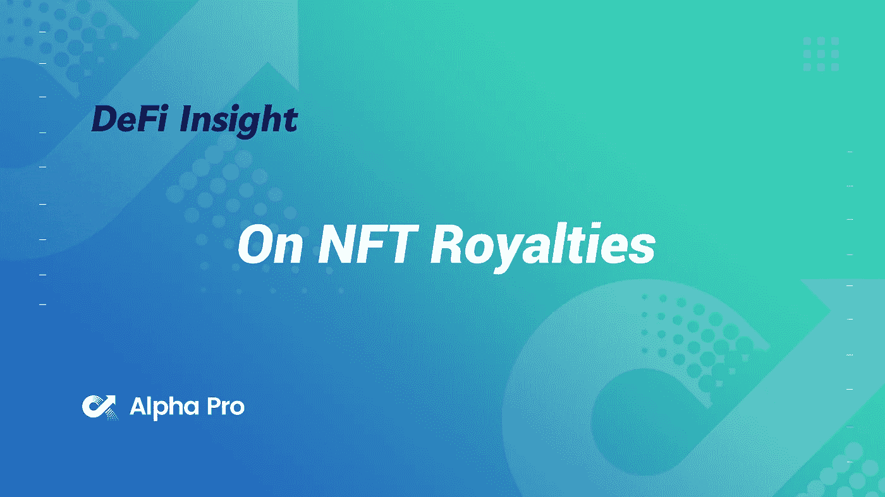
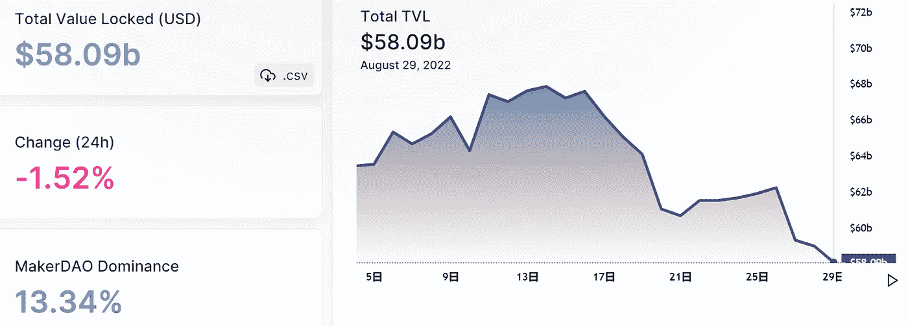
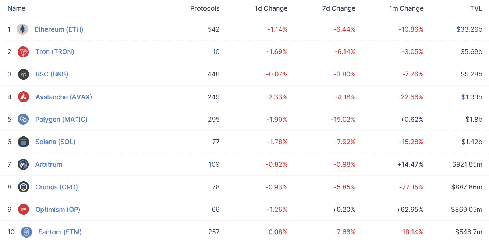
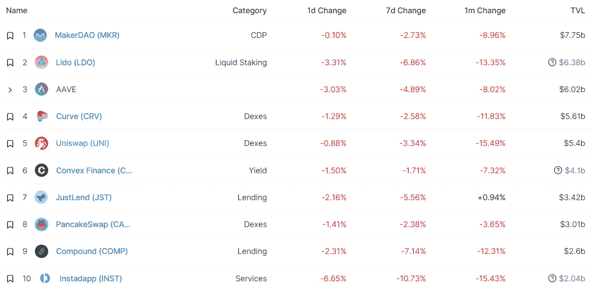
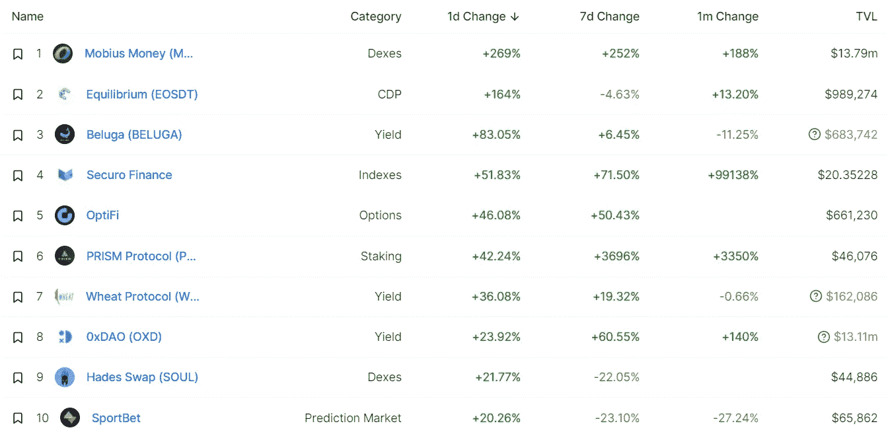
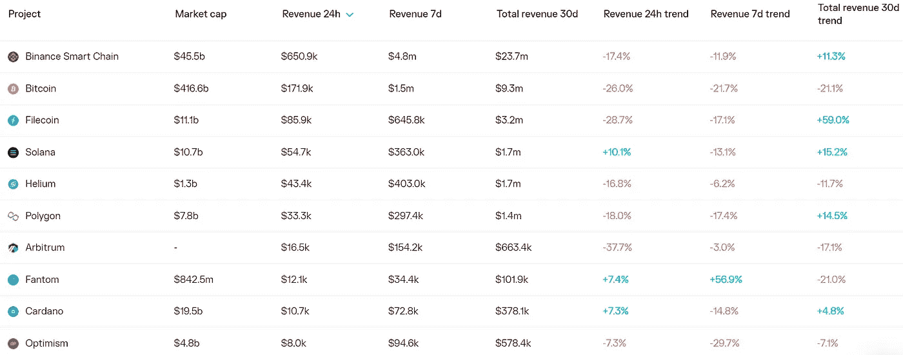
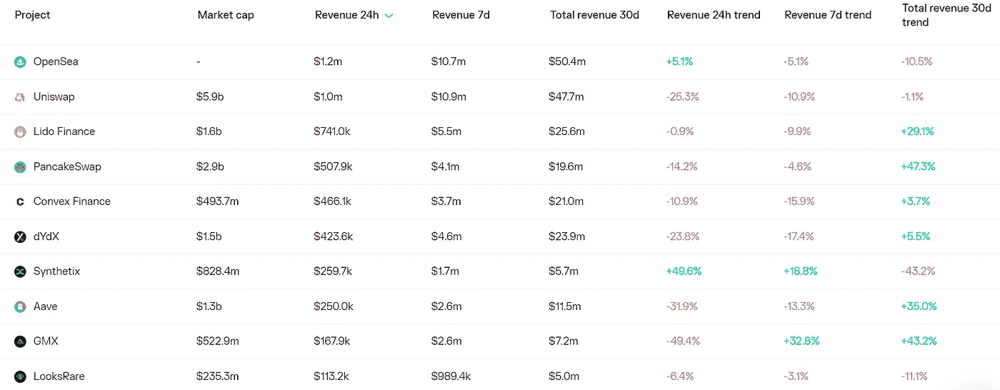
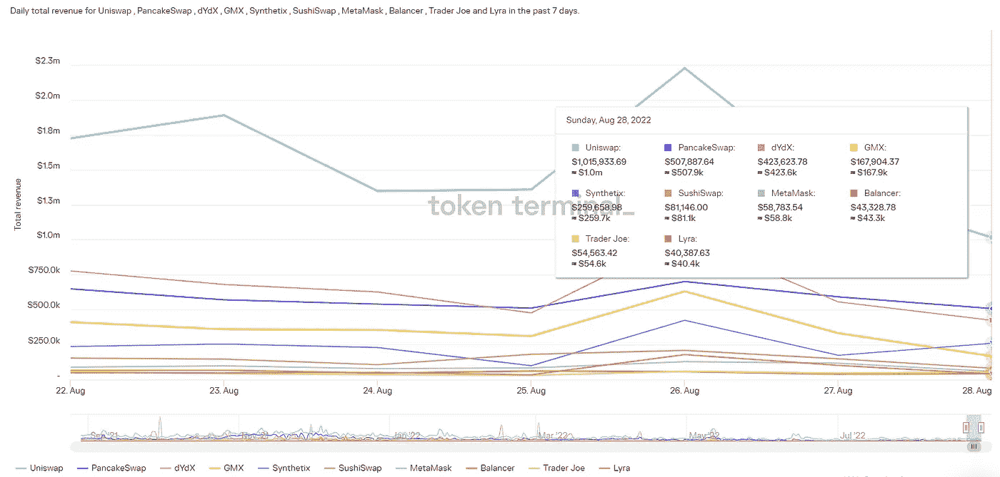
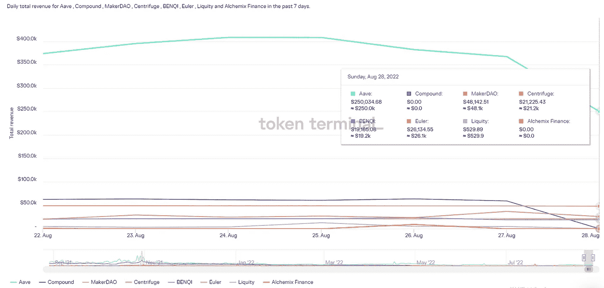

# DeFi Insight |关于 NFT 版税

> 原文：<https://medium.com/coinmonks/defi-insight-on-nft-royalties-812ac0846b0d?source=collection_archive---------20----------------------->

2022 年 8 月 29 日

*今日 DeFi 数据&由 DeFi Insight 为您带来的新闻*

> *版税为艺术家和创作者提供了丰厚的收入。如果你从他们身上赚钱，那太好了！但是它们不可执行，因此不适合区块链。在这里，我将解释为什么版税依赖是不可持续的，以及艺术家如何考虑更可靠的货币化机制。*“@*[*来源*](https://0xfoobar.substack.com/p/on-royalties)*

# *最新消息*

## *打桩*

***[Terra Classic【LUNC】staking](https://ambcrypto.com/terra-classic-lunc-staking-goes-live-but-will-it-be-hindered-by-the-ghost-of-its-past/)上线，但会不会被过去的幽灵所阻碍？***

*****,**以太坊流动性赌注协议[火箭池](https://mobile.twitter.com/Rocket_Pool/status/1564055132316516352)完成红石升级***

## ***稳定币***

***Acala 在 30.2 亿澳元的造币厂中找到剩余的[5200 万澳元](https://twitter.com/AcalaNetwork/status/1564061182776033284)***

## ***市场***

***融资利率创下 14 个月来的新低***

***5，000 枚 7 到 10 岁的比特币在移动——以下是可能的影响***

***随着传统市场滑入新的一周，比特币、以太坊下跌***

## ***商业***

*****[艾娃实验室(雪崩)攻击索拉纳& cons SEC](https://cryptoleaks.info/case-no-3) 与被收买的律师事务所罗氏弗里德曼进行邪恶的合谋*****

*****艾娃实验室首席执行官否认 CryptoLeaks 的说法是“阴谋论胡说八道”*****

## *****测试网*****

*****乐观主义者戈利现在正在直播以太扫描*****

## *****发射台*****

*******Aptos 生态系统发射台[质子](https://twitter.com/protonsale_apt/status/1563919699334684672)测试网现已上线*******

## *******基础设施*******

*********[雪崩后共识](https://mobile.twitter.com/eCashOfficial/status/1563834161823203329)将于 9 月 14 日在 eCash Mainnet 上线*********

## *******空投*******

*********、**ARBITRUM ALPHA for[$ ARBI](https://twitter.com/OlimpioCrypto/status/1563561465344192512)*******

## *****政策与法规*****

*******[灰度](https://www.coindesk.com/policy/2022/08/27/sec-questions-grayscales-legal-stance-on-stellar-zcash-and-horizen-crypto-trusts/)，披露 SEC 质询，称 Cryptos XLM、ZEC、ZEN 可能是证券*******

*********[新加坡](https://www.bloomberg.com/news/articles/2022-08-29/singapore-mulls-crypto-consumer-suitability-leverage-rules?srnd=cryptocurrencies-v2#xj4y7vzkg)考虑加密消费者的适宜性，利用规则*********

*********[迪拜](https://news.bitcoin.com/dubai-regulator-announces-virtual-assets-marketing-and-advertising-guidelines/)监管机构公布虚拟资产营销和广告指导方针*********

## *******NFT*******

*******2022 年的[NFT 顶级摄影师](https://nftplazas.com/the-top-nft-photographers/)*******

# *******数据和分析*******

## *******锁定的总价值(TVL)*******

*******目前全网 DeFi 总锁定量为 580.9 亿美元，24 小时下降 1.52%。*******

**************

## *******TVL 评出的十大连锁酒店*******

**************

## *******|最新 TVL 十大项目*******

**************

## *******|过去 24 小时内 TVL 增长的前 10 个项目*******

**************

## *******协议收入*******

## *******|累计总收入最高的项目(24H)_ 区块链(L1)*******

**************

## *******|累计总收入最高的项目(24H) _Dapps (L2)*******

**************

## *******|前 10 大交易所的每日收入*******

**************

## *******|十大贷款协议的日收入*******

**************

# *******深潜*******

*********[**为什么**](https://crypto.nateliason.com/p/merge?utm_source=%2Finbox&utm_medium=reader2) **以太坊合并是件大事***********

***** [## 为什么以太坊合并是一件大事

### Vanta 帮助公司扩展安全实践，并自动符合最受欢迎的标准:SOC 2、ISO…

crypto.nateliason.com](https://crypto.nateliason.com/p/merge?utm_source=%2Finbox&utm_medium=reader2) 

**[**合规之路与分权之路**](https://forum.makerdao.com/t/the-path-of-compliance-and-the-path-of-decentralization-why-maker-has-no-choice-but-to-prepare-to-free-float-dai/17466) **:创客为何别无选择准备自由浮动戴****

** [## 合规之路与分权之路:为什么制造商别无选择，只能准备…

### TL；博士:金融监管趋向于“要么你支持我们，要么你反对我们”的后 9/11 范式

forum.makerdao.com](https://forum.makerdao.com/t/the-path-of-compliance-and-the-path-of-decentralization-why-maker-has-no-choice-but-to-prepare-to-free-float-dai/17466) 

**[**AMMs**](https://bennyattar.substack.com/p/the-evolution-of-amms?utm_source=twitter&sd=pf)的进化**

** [## AMMs 的发展

### 自从金融历史出现以来，市场就必须被创造出来。追溯到 17 世纪香料贸易…

bennyattar.substack.com](https://bennyattar.substack.com/p/the-evolution-of-amms?utm_source=twitter&sd=pf)** 

# **报告**

****[**Danksharding**](https://research.thetie.io/danksharding-ethereums-scalability-killer-post-merge/)**:以太坊的可扩展性黑仔** _thetie****

> ****继续我的上一篇文章(我在那里讨论了分片在解决去中心化扩展中的作用)，是时候讨论一个可能成为以太坊救世主的新模型了:danksharding。****
> 
> ****Danksharding 得名于它的创造者和以太坊研究者:Dankrad Feist。名称的变化旨在表明从传统分片系统到这种范式转变的过渡，这种范式转变被通俗地称为“可伸缩性黑仔”。****

******[**比特币前景**](https://www.galaxy.com/research/insights/bitcoin-outlook-key-levels-breached/) **为关键关卡攻破**_ 银河******

******[**评委对航海家数码**](https://www.theblockresearch.com/analysis-of-judges-approval-for-voyager-digitals-key-employee-retention-awards-166157) **关键员工留任奖** _theblockresearch 的认可分析******

******[**季节性**](https://www.coinbase.com/institutional/research-insights/research/weekly-market-commentary/weekly-market-commentary-august-26-2022) **九月** _coinbase******

******关于:******

****DeFi Insight 是顶级 DeFi 和加密新闻和更新的来源。****

******https://twitter.com/AlphaPro_io 推特:******

********https://medium.com/feed/@alphapro.project**RSS:******

******提供的信息应被视为发展新闻，而不是投资建议。******

> ******交易新手？尝试[加密交易机器人](/coinmonks/crypto-trading-bot-c2ffce8acb2a)或[复制交易](/coinmonks/top-10-crypto-copy-trading-platforms-for-beginners-d0c37c7d698c)*************