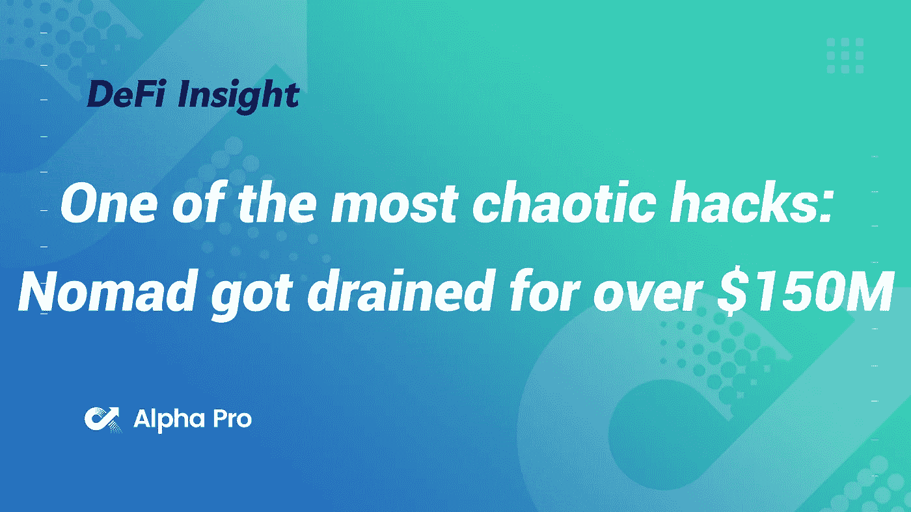
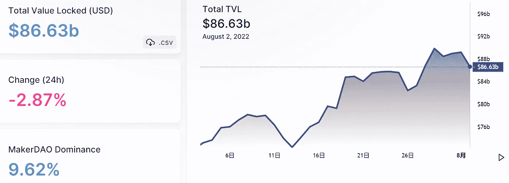
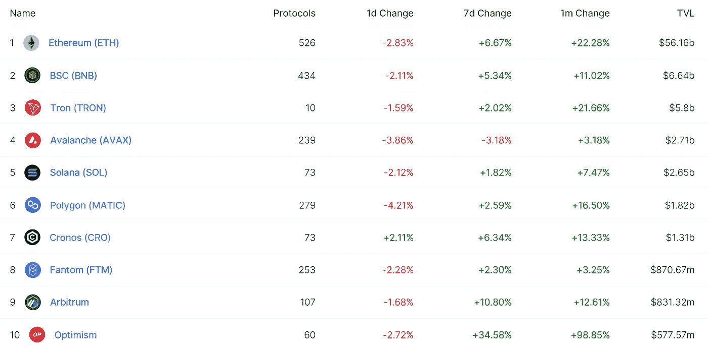
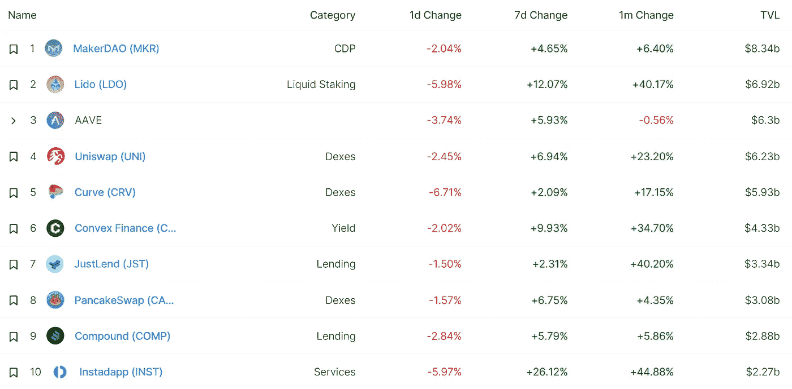
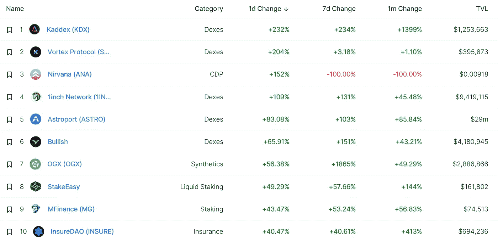
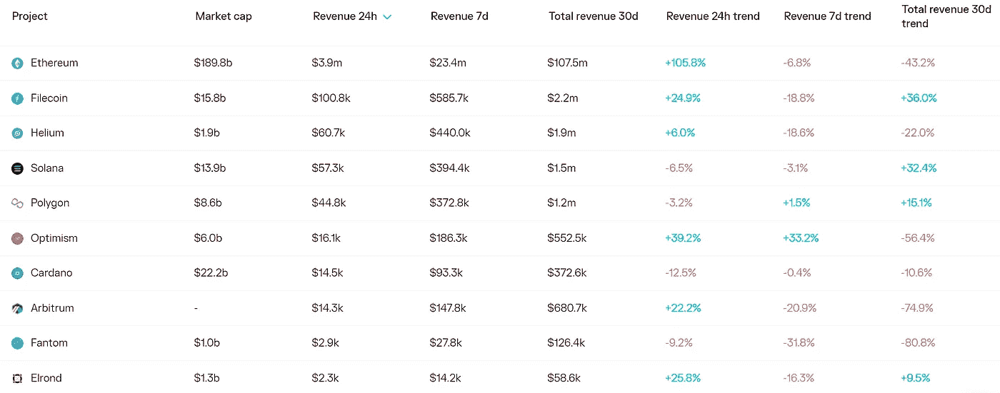
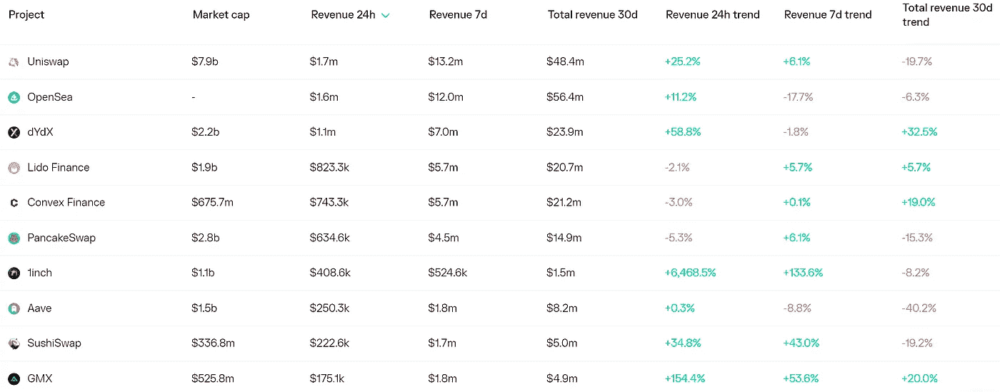
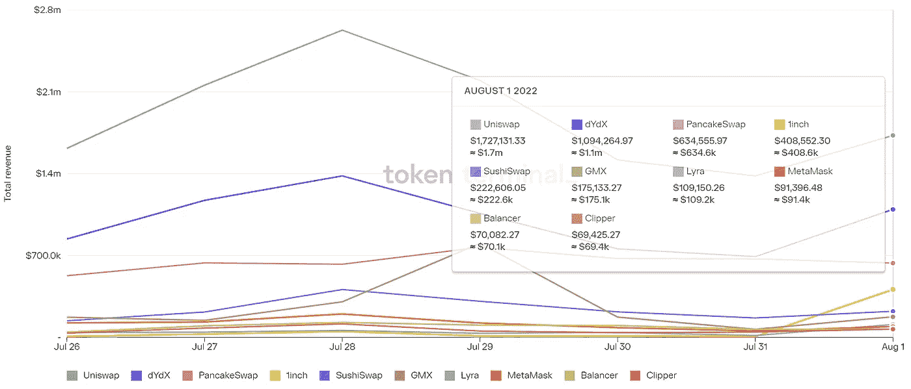
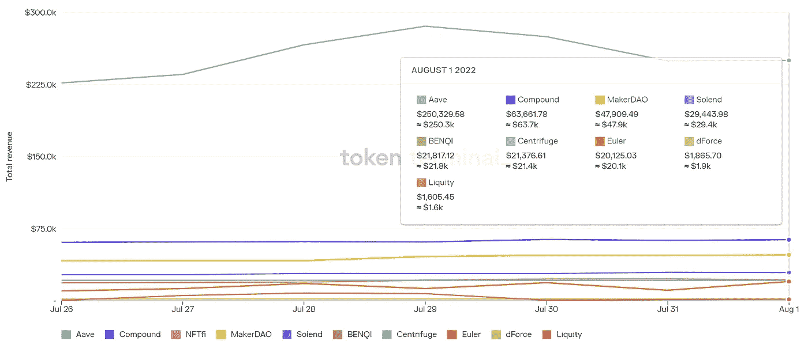

# DeFi Insight |最混乱的黑客之一:Nomad 被榨干了超过 1 . 5 亿美元

> 原文：<https://medium.com/coinmonks/defi-insight-one-of-the-most-chaotic-hacks-nomad-got-drained-for-over-150m-9975458480da?source=collection_archive---------20----------------------->

2022 年 8 月 2 日

*今日 DeFi 数据&由 DeFi Insight 为您带来的新闻*

> “这一切都是从 [@officer_cia](http://twitter.com/officer_cia) 在 ETHSecurity Telegram 频道分享 [@spreekaway](http://twitter.com/spreekaway) 的推文开始的。虽然我当时不知道发生了什么，但仅仅是离开大桥的资产数量就明显是一个不好的迹象。 *@* [*来源*](https://twitter.com/samczsun/status/1554252024723546112?s=20&t=kmH3oSFvEMjrh2VzSgbwtg)

# 最新消息

## 外汇

**[币安](https://cryptoslate.com/binance-uses-soulbound-tokens-to-offer-decentralized-kyc-of-wallets/)使用灵魂绑定代币提供钱包的分散 KYC**

****[宝珠集体](https://twitter.com/BalancerLabs/status/1554096280585920512)已经进入平衡器生态系统****

******[芝加哥期权交易所](https://www.theblock.co/post/160602/cboe-reports-460-million-write-down-on-erisx-acquisition)报告在 ErisX 收购案中减记 4.6 亿美元******

## ******打桩******

********比特币基地总理与瑞士联邦储蓄银行[联合发行股票](https://blog.coinbase.com/coinbase-prime-grows-its-staking-offering-with-eth-23c90eab5118)********

## ******稳定币******

******自 2020 年以来，与欧元挂钩的稳定货币数量已经膨胀了 1683%******

## ******测试网******

********[Aptos 激励测试网 2](/aptoslabs/aptos-incentivized-testnet-2-highlights-and-updates-ee478eace33c) |亮点和更新********

## ******支付******

********总部位于伦敦的支付公司增加[对 Ripple (XRP)的支持](https://thecryptobasic.com/2022/08/01/london-based-payment-company-adds-support-for-ripple-xrp/)********

## ******|骗局******

********[美国证券交易委员会如何揭露一个价值 3 亿美元的秘密金字塔计划](https://bitcoinist.com/how-the-sec-uncovered-a-300-million-crypto-pyramid-scheme/)********

## ******|令牌******

******1 美元的梦想价格遭到了市场观察人士的质疑******

********莱杰增加了对 100 多枚[卡尔达诺($ADA)](https://www.cryptoglobe.com/latest/2022/08/ledger-adds-support-for-100-more-cardano-ada-native-tokens/) 原生令牌的支持********

## ******空投******

********/**[熊](https://twitter.com/okaybears/status/1554326651823353856)清醒到第一个熊掉落！******

## ****|警报****

******[投资者警示](https://ag.ny.gov/press-release/2022/investor-alert-attorney-general-james-urges-new-yorkers-deceived-crypto-platforms):司法部长詹姆斯敦促被加密平台欺骗的纽约人向 OAG 报告问题******

## ******鲸鱼******

********,**[比特币巨鲸](https://beincrypto.com/bitcoin-whale-new-player-buys-three-billion-dollars-worth-of-btc/):新玩家购买价值 30 亿美元的 BTC******

## ****甲骨文****

******甲骨文解决方案[python](https://twitter.com/PythNetwork/status/1554115555325624321)推出基于 Solana 代码库的网络，名为 Pythnet******

## ******采矿******

********[Bitfarms](https://www.globenewswire.com/news-release/2022/08/01/2489272/0/en/Bitfarms-Provides-July-2022-Production-and-Mining-Operations-Update.html)提供 2022 年 7 月生产和采矿作业更新********

## ******NFT******

******总部位于 StarkNet 的 NFT 市场方面推出了它的 Mainnet******

******由于内部冲突，NFT 价格在 OpenSea 下跌******

******蒂芙尼发布后，NFT 以太坊的销售额猛增了 248%******

## ******基金******

********[马拉松](https://www.coindesk.com/business/2022/08/01/marathon-doubles-loan-borrowing-capacity-to-200m-as-mining-rigs-sit-idle/)由于采矿设备闲置，借贷能力翻倍至 2 亿美元********

# ******数据和分析******

## ******锁定的总价值(TVL)******

******目前全网 DeFi 总锁定量为 866.3 亿美元，24 小时下降 2.87%。******

************

## ******TVL 评出的十大连锁酒店******

************

## ******|最新 TVL 十大项目******

************

## ******|过去 24 小时内 TVL 增长的前 10 个项目******

************

## ******协议收入******

## ******|累计总收入最高的项目(24H)_ 区块链(L1)******

************

## ******|累计总收入最高的项目(24H) _Dapps (L2)******

************

## ******|前 10 大交易所的每日收入******

************

## ******|十大贷款协议的日收入******

************

# ******深潜******

********[**熊市反弹**](https://insights.glassnode.com/the-week-onchain-week-31-2022/) **的开端？**********

**** [## 熊市反弹的开始？

### BTC 和瑞士联邦理工学院都出现了反弹，摆脱了极度超卖的状况，并受到以下风险投资情绪的刺激…

insights.glassnode.com](https://insights.glassnode.com/the-week-onchain-week-31-2022/) 

**什么是** [**对冲基金的最后一着**](https://hackernoon.com/what-is-hedge-funds-endgame-for-shorting-tether) **做空系绳**

 [## 对冲基金做空系绳的最终目的是什么

### 拉面鉴赏家/ Web 3 德根上个月，对冲基金一直在做空系绳，押注于一个潜在的…

hackernoon.com](https://hackernoon.com/what-is-hedge-funds-endgame-for-shorting-tether) 

**如何以简单的步骤**购买莱特币

** [## 如何轻松购买莱特币| Cryptopolitan

### 投资者将莱特币视为一项不错的投资，因为它有可能变得比比特币更有价值。莱特币…

www.cryptopolitan.com](https://www.cryptopolitan.com/how-to-buy-litecoin/) 

**如何在 CeDefi 交流上** [**获得被动加密**](https://bitcoinist.com/how-to-earn-passive-crypto-on-cedefi-exchanges/)

** [## 如何在 CeDefi 交易所赚取被动加密| Bitcoinist.com

### 现在在加密空间的趋势是一个简单的方法来摆脱熊市，利润在手。一些加密货币…

bitcoinist.com](https://bitcoinist.com/how-to-earn-passive-crypto-on-cedefi-exchanges/)** 

# **报告**

****[**比特币**](https://www.coinbase.com/institutional/research-insights/research/market-intelligence/bitcoin-fedimints)**fediments**_ coin base****

> ****在这份报告中，我们研究了一种新的比特币托管方法，在采用、可扩展性和隐私方面有几个有趣的影响。****

******A**[**看**](https://www.theblockresearch.com/july-by-the-numbers-2-160420) **加密交易量、未平仓利息和矿工收入** _theblockresearch****

******[**重温**](https://messari.io/article/analyst-note-revisiting-ethereum-classic) **以太坊经典** _messari******

******关于:******

****DeFi Insight 是顶级 DeFi 和加密新闻和更新的来源。****

******https://twitter.com/AlphaPro_io 推特:******

********❤RSS:**[**https://medium.com/feed/@alphapro.project**](https://medium.com/feed/@alphapro.project)******

****提供的信息应被视为发展新闻，而不是投资建议。****

> ****交易新手？尝试[加密交易机器人](/coinmonks/crypto-trading-bot-c2ffce8acb2a)或[复制交易](/coinmonks/top-10-crypto-copy-trading-platforms-for-beginners-d0c37c7d698c)**********