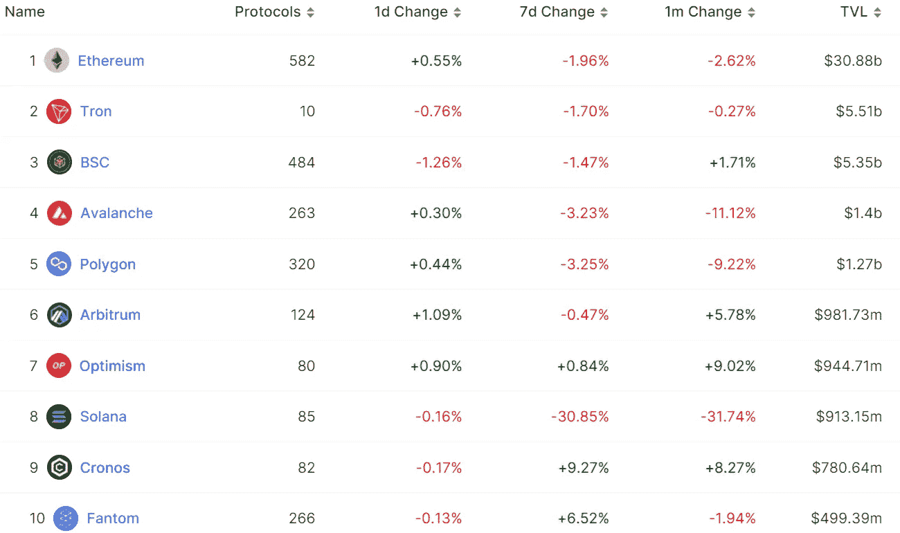

# DeFi Insight |多边形资产高亮显示

> 原文：<https://medium.com/coinmonks/defi-insight-polygon-asset-highlight-597a37517ccc?source=collection_archive---------12----------------------->

2022 年 10 月 17 日

*今日 DeFi 数据&由 DeFi Insight 为您带来的新闻*

> *"* 本报告简化并阐明了 MATIC 是什么，MATIC 试图解决的问题及其自推出以来的发展。还包括优势和劣势、机会和威胁、核心组件和网络架构。
> 
> Polygon 是一家拥有越来越多产品的公司，这些产品为开发人员提供了访问第 2 层解决方案及其主链 Polygon POS 的机会，以扩展以太坊。第 2 层消除了事务负担，并且只与第 1 层通信，以使用小的安全消息来结算事务。基层拥塞的减少增加了吞吐量并降低了成本。根据大多数指标，Polygon 的安全性、去中心化和采用程度介于第 1 层(如 Solana 和 Avalanche)和第 2 层(如 Arbitrum 和乐观主义)之间。然而，一些风险仍然值得注意。Polygon 对以太坊的依赖和对零知识技术(在不泄露信息的情况下验证块的能力)的关注是创新的，但未经证实和早期的。*“@*[*来源*](https://coinshares.com/research/polygon-asset-highlight)

# 最新消息

## 稳定币

**[Aave 的 Stablecoin](https://twitter.com/AaveAave/status/1580934907010113537) $GHO 已经完成第一次审计，测试网部署将在数周内完成**

****,**标示为 Justin sun 的地址已经从 Aave Protocol 提取了~[5000 万美元的资金](https://twitter.com/PeckShieldAlert/status/1581916472187580418)并将这笔资金转移到一个由 Poloniex 出资的地址**

## **贷款**

**温特穆特按时偿还 9200 万美元的特鲁菲贷款**

## **MEV**

****[**flash bots**](https://www.coindesk.com/tech/2022/10/14/flashbots-reveals-new-version-of-its-key-ethereum-software/)**披露其关键以太坊软件的新版本******

## ******|令牌******

******StarkWare 总裁: [StarkWare](https://decrypt.co/111857/ethereum-merge-sets-precedent-further-change-starkware-president-ben-sasson) 原生令牌将于 10 月上线******

## ******|警报******

********[芒果](https://twitter.com/mangomarkets/status/1581351554040201217?s=20):黑客已经归还了 6700 万美元，下周将对分配过程进行投票********

********芒果市场[剥削者](https://www.theblock.co/post/177424/mango-markets-exploiter-comes-clean-claims-all-actions-were-legal)全盘招供，声称所有行为都是合法的********

## ******名称服务******

********,**Aptos 重启 [Aptos 实验室](https://twitter.com/AptosLabs/status/1581075945577803777?s=20)官方名称服务 Aptos 名称服务******

## ****NFT****

******/**[**OpenSea**](https://twitter.com/opensea/status/1581474813050179586)**:暂时取消 Solana 系列在首页的置顶和趋势资格******

********[魔法伊甸园](https://twitter.com/MagicEden/status/1581773064378863617)推出 NFT 升级服务，允许创作者创造新的收入来源********

## ******基金******

******前 NEA 合伙人 Amit Mukherjee 创立 Chainforest DAO 投资早期 web3 创业公司******

## ******政策与法规******

********金融稳定委员会(FSB)发布[加密资产的国际监管框架](https://www.fsb.org/wp-content/uploads/P111022-2.pdf)********

## ******观点******

********、** SBF:支持中介机构披露衍生品交易信息，为投资者进行知识测试******

# ****数据和分析****

## ****锁定的总价值(TVL)****

****目前全网 DeFi 总锁定量为 535.3 亿美元，24 小时增长 0.45%。****

********

## ****TVL 评出的十大连锁酒店****

********

## ****|最新 TVL 十大项目****

********

## ****|过去 24 小时内 TVL 增长的前 10 个项目****

********

## ****协议收入****

## ****|累计总收入最高的项目(24H)_ 区块链(L1)****

********

## ****|累计总收入最高的项目(24H) _Dapps (L2)****

********

# ****深潜****

******[**宇宙之道**](https://www.readthegeneralist.com/briefing/cosmos)******

**** [## 宇宙之道|通才

### 有时候，你如何建造和你建造什么一样重要。不管你的野心有多大胆，你都不能造一艘船…

www.readthegeneralist.com](https://www.readthegeneralist.com/briefing/cosmos) 

**2022 Q3 印象深刻** [**协议**](https://eigenphi.substack.com/p/2022-q3-impressive-protocols-you?utm_source=%2Finbox&utm_medium=reader2) **你需要知道的**

 [## 2022 年第 3 季度您需要了解的令人印象深刻的协议

### 加密货币市场自第二季度以来一直在反弹，9 月 15 日，以太坊终于完成了…

eigenphi.substack.com](https://eigenphi.substack.com/p/2022-q3-impressive-protocols-you?utm_source=%2Finbox&utm_medium=reader2) 

**[**BNB 链条的**](https://www.nansen.ai/research/bnb-chains-cross-chain-bridge-exploit-explained) **跨链桥漏洞利用讲解****

** [## BNB 链的跨链桥利用解释

### 2022 年 10 月 7 日，为币安硬币(BNB)生态系统供电的跨链桥被黑客攻击。BNB 链停顿了一下…

www.nansen.ai](https://www.nansen.ai/research/bnb-chains-cross-chain-bridge-exploit-explained)** 

# **报告**

****跨链[搭桥](https://research.thetie.io/cross-chain-bridging-current-risks-and-future-development/) —当前风险&未来发展_thetie****

> ****从根本上说，区块链是另一种类型的数据库。每个区块链都是一个独立的数据库，具有不同的相对优势。这些优势基于一组核心信念，以及一种基于这些原则的技术方法，用于解决被确定为最关键的问题。随着第 1 层、第 2 层或次区块链变得越来越专业化，有可能大规模采用各种新的公用事业。但就像传统货币一样，跨链的经济活动需要一个高效可靠的交换系统。****

******[**社会表征**](https://messari.io/report/the-social-token-thesis) **论文** _messari******

******[**xNFTs**](https://www.theblockresearch.com/xnfts-the-dark-horse-of-mass-adoption-177286)**:大众采用的黑马** _theblockresearch******

******关于:******

****DeFi Insight 是顶级 DeFi 和加密新闻和更新的来源。****

******https://twitter.com/AlphaPro_io**[**❤**](https://twitter.com/AlphaPro_io)****

******❤RSS:**[**https://medium.com/feed/@alphapro.project**](https://medium.com/feed/@alphapro.project)****

****提供的信息应被视为发展新闻，而不是投资建议。****

> ****交易新手？尝试[加密交易机器人](/coinmonks/crypto-trading-bot-c2ffce8acb2a)或[复制交易](/coinmonks/top-10-crypto-copy-trading-platforms-for-beginners-d0c37c7d698c)********