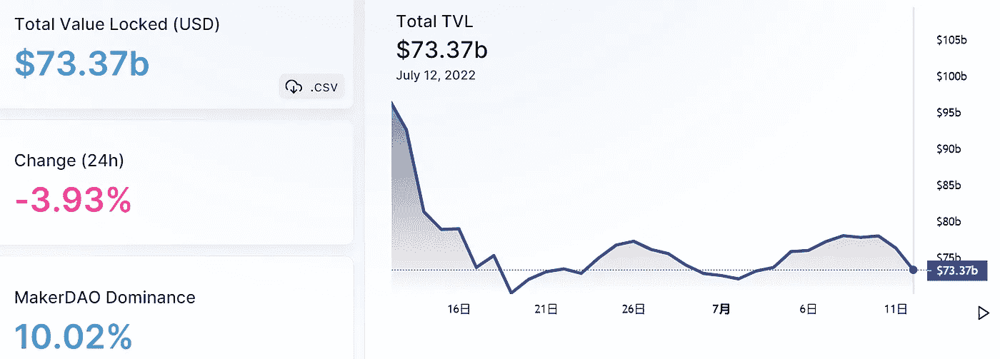

# DeFi Insight |压力建立在钻石手上

> 原文：<https://medium.com/coinmonks/defi-insight-pressure-builds-on-diamond-hands-76ae954b3dd4?source=collection_archive---------33----------------------->

2022 年 7 月 12 日

*今日 DeFi 数据&由 DeFi Insight 为您带来的新闻*

> *随着许多信号表明大范围的投降已经发生，注意力转向比特币底部是否正在形成。在这里，我们分析了之前熊市周期的特征和持续时间，以评估前方的道路可能会怎样。*“@*[*来源*](https://insights.glassnode.com/the-week-onchain-week-28-2022/)*

# *最新消息*

## *贷款*

***[边缘金融](https://coinquora.com/fringe-finance-hosts-yacht-party-after-platform-launch-in-decentraland/)在分散地举办平台发布后的游艇派对***

***Vauld 向其债权人发出信函，披露了 7000 万美元的资金缺口***

## ***外汇***

*****/**[uni swap LP 攻击了](https://blockworks.co/uniswap-lp-hit-with-phishing-attack-totaling-3-5m-in-ether/)的网络钓鱼攻击，总计 350 万美元***

*****[BMEX](https://blog.bitmex.com/bmex-launch-rescheduled/)的现货交易将重新安排，等待市场状况的改善*****

## *****市场*****

*****随着传统信用卡被抛弃，加密信用卡兴起*****

*******/**[以太坊测试 1170 美元](https://www.newsbtc.com/news/ethereum-tests-1170-is-1000-the-next-target/)，1000 美元是下一个目标吗？*****

## *****第二层*****

*******、**地面项目开始[迁移到多边形](https://dailycoin.com/terra-based-projects-start-migrating-to-polygon/)*****

*******[介绍 Nova](https://offchain.medium.com/introducing-nova-arbitrum-anytrust-mainnet-is-open-for-developers-9a54692f345e):Arbitrum any trust Mainnet 面向开发者开放*******

*********文[$下一个](https://blog.connext.network/wen-next-token-launch-update-db937c67b34a) —令牌推出更新*********

## *******测试网*******

*********黄昏网络的日间测试网升级了 Staking Contract*********

## *******| PAYMENT*******

*********号召巴西金融科技公司 PicPay 推出稳定币和加密货币交易所*********

## *****| MINING*****

*****德克萨斯州的比特币挖矿商在热浪中停产*****

## *****| POLICY&REGULATION*****

*******G20 监管机构宣布“稳健”的全球加密货币监管将于 10 月出台*******

## *****| NFT*****

*******等轴**等轴 [Axie Infinity](https://decrypt.co/104888/axie-infinity-nft-sales-rising-play-and-earn-transition) NFT 销售在“量入为出”转型中崛起*****

*******继**之后，GameStop 在 NFT 销售枯竭之际启动 NFT 市场*****

*******花花公子[在沙盒里推出首款“metahead”](https://cointelegraph.com/news/playboy-to-launch-first-metamansion-in-the-sandbox)*******

## *****|意见*****

*****欧洲央行在一份措辞激烈的网络报告中写道:“加密货币不仅是一种金融风险，稳定的货币也会产生‘蔓延效应’。”*****

# *****数据与分析*****

## *****总值锁定(TVL)*****

*****目前 DeFi 在整个网络上的总锁定量为 733.7 亿美元，24 小时内下降 3.93%。*****

**********

## *****| TOP 排名前 10 的连锁店*****

**********

## *****|最新 TVL 十大项目*****

**********

## *****|过去 24 小时 TVL 经济增长排名前 10 名的项目*****

**********

## *****协议收入*****

## *****|按累计总收入列出的最重要项目(24H)_ 区块链(L1)*****

**********

## *****|按累计总收入列出的顶级项目(24H)_ dapp(L2)*****

**********

## *****|十大交易所的每日收入*****

**********

## *****|十大贷款协议的每日收入*****

**********

# *****DEEP DIVE*****

*******[**最佳加密货币**](/@ren-heinrich/the-best-cryptocurrencies-for-long-term-investment-30616de65253) **适合长期投资*********

***** [## 长期投资的最佳加密货币

### 分析过去 4 个牛市中排名前 50 的加密货币，并从以下方面解读其表现趋势…

ren-heinrich.medium.com](https://ren-heinrich.medium.com/the-best-cryptocurrencies-for-long-term-investment-30616de65253) 

**[**比特币**](https://bitcoinmagazine.com/markets/bitcoin-purchasing-power-preserver) **，购买力保护者****

** [## 比特币，购买力保护者

### 第 1 部分:菲亚特管道介绍破裂的管道储备货币的复杂性坎蒂隆难题第 2 部分:的…

bitcoinmagazine.com](https://bitcoinmagazine.com/markets/bitcoin-purchasing-power-preserver) 

**易 DeFi 收益率的时代是** [**超过**](https://www.coindesk.com/layer2/2022/07/05/the-era-of-easy-defi-yields-is-over/)

 [## 轻松定义产量的时代已经结束

### Jesus Rodriguez 是区块链数据平台 IntoTheBlock 的首席技术官和联合创始人，也是 AI 公司的首席科学家

www.coindesk.com](https://www.coindesk.com/layer2/2022/07/05/the-era-of-easy-defi-yields-is-over/) 

**市场低迷是否导致了** [**秘密诈骗**](https://www.bsc.news/post/has-the-market-downturn-caused-an-uptick-in-crypto-scams) **的上升？**

 [## 市场低迷是否导致了加密诈骗的上升？

### 加密货币诈骗也在与 DeFi TVL 的损失同步上升，为…创造了一个独特的压力局面

www.bsc.news](https://www.bsc.news/post/has-the-market-downturn-caused-an-uptick-in-crypto-scams) 

# 报告

**[**DeFi spot light**](https://coinshares.com/research/defi-spotlight-quarterly)**Quarterly**_ coin shares**

> **这份季刊将关注以太坊 DeFi 生态系统的主要趋势、指标和整体健康状况。本季度报告的亮点如下:**
> 
> **以太坊锁定的总价值(TVL)下降了 16%，至 1250 亿美元，主要是由于代币价格下跌，而不是提款。
> 新增用户约 40 万(Q1 2021 年新增 50 万)。以太坊产生了 25 亿美元的费用(比 Q1 2021 的 17 亿美元增长了 45%)。未偿还债务总额为 95 亿美元(比 Q1 2021 的 71 亿美元增长 34%)。
> 桥梁正在成为区块链生态系统的重要组成部分。**

****[**波尔卡多特**](https://messari.io/article/state-of-polkadot-q2-2022)**Q2 2022**_ 梅萨里****

******全面看** [**跨现货交易所交易费用**](https://www.theblockresearch.com/a-comprehensive-look-at-trading-fees-across-spot-exchanges-156694)**_ the block research******

********[**冬去春来**](https://crypto.com/research/june-2022-monthly-chartbook-winter-comes-early-for-crypto/)**【2022 年 6 月海图】** _crypto********

> ****交易新手？尝试[加密交易机器人](/coinmonks/crypto-trading-bot-c2ffce8acb2a)或[复制交易](/coinmonks/top-10-crypto-copy-trading-platforms-for-beginners-d0c37c7d698c)****

******关于:******

****DeFi Insight 是顶级 DeFi 和加密新闻和更新的来源。****

******https://twitter.com/AlphaPro_io**❤[t27】](https://twitter.com/AlphaPro_io)****

******❤RSS:**[**https://medium.com/feed/@alphapro.project**](https://medium.com/feed/@alphapro.project)****

****提供的信息应被视为发展新闻，而不是投资建议。***********