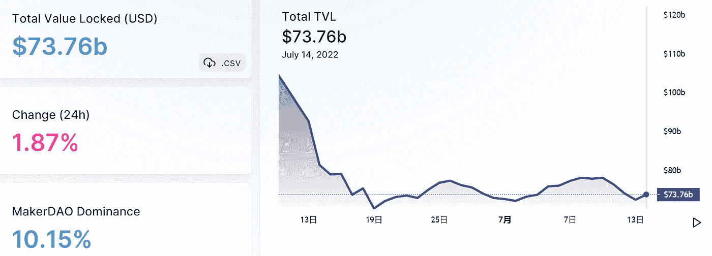
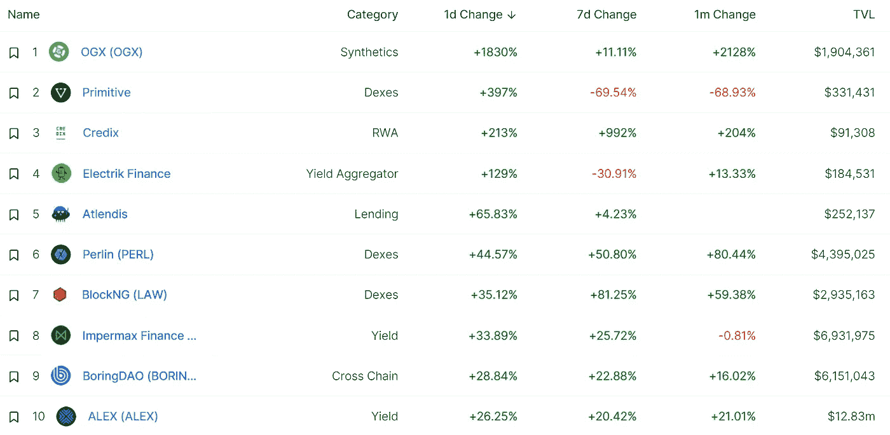

# DeFi Insight | StarkWare 宣布 StarkNet 令牌和基金会，目标分散化

> 原文：<https://medium.com/coinmonks/defi-insight-starkware-announces-starknet-token-and-foundation-targets-decentralization-7f2683d1e7bd?source=collection_archive---------31----------------------->

2022 年 7 月 14 日

*今日 DeFi 数据&DeFi Insight*为您带来的新闻

> *StarkNet Alpha 于 2021 年 11 月在以太坊 Mainnet 上线。
> 现在是时候按照以太坊上 L2 的要求推进权力下放了。
> 以下是我们的分权方案，介绍 StarkNet Token 和 StarkNet 基金会*”@*[*Source*](https://twitter.com/StarkWareLtd/status/1547223754832478209?ref_src=twsrc%5Etfw%7Ctwcamp%5Etweetembed%7Ctwterm%5E1547223754832478209%7Ctwgr%5E%7Ctwcon%5Es1_&ref_url=https%3A%2F%2Fbeincrypto.com%2Fstarkware-announces-starknet-token-foundation-targets-decentralization%2F)*

# *最新消息*

## *| LENDING*

***[摄氏度网络](https://www.theguardian.com/technology/2022/jul/14/celsius-networks-cryptocurrency-lender-files-for-bankruptcy):加密货币贷款人申请破产***

## ***| EXCHANGE***

*****召集**至 [Velodrome](https://twitter.com/VelodromeFi/status/1547307870974271488) 向价值 5 万美元的 veVELO 持有人派发 75 万美元的 OP 奖励***

*****pilot**pilot[Shell](https://shellprotocol.io/posts/shell-chooses-arbitrum-for-v2-launch/)选择 Arbitrum 进行 v2 发射***

*****Cross chain**跨链 DEX 聚合器[与 Cosmos 集成的 THORSwap](https://twitter.com/THORSwap/status/1547435142536257536)***

*****财富 500 强**瑞富夏季升温: [Uniswap v3](/celoorg/refi-summer-heats-up-uniswap-v3-and-green-asset-pools-launch-on-celo-9322308ddcab) 和 Celo 推出绿色资产池***

## ***| LAYER2***

*****在迪士尼加速器计划选定的 Web3 项目中包含**多边形[多边形](https://thewaltdisneycompany.com/2022-disney-accelerator-participants-announced/)***

## ***| TESTNET***

*****[bundler](/bundlr-network/bundlr-launches-its-first-testnet-4bedd76e7c)推出首个 testnet*****

## *****| PAYMENT*****

*******协同**孝成美国为即将上市的 App Store 增加卓越的现金到加密货币提供商 DigitalMint*****

*******[web 3 服务商](https://blockworks.co/web3-service-providers-focus-on-improving-the-user-experience/)专注于提升用户体验*******

## *******|令牌*******

*********[子查询](https://subquery.medium.com/subquery-public-sale-to-proceed-as-private-round-kepler-network-to-launch-in-august-4db050c22861)公开发售以私人轮次进行，开普勒网络将于 8 月推出*********

## *******鲸鱼*******

*******在新一轮的积累狂潮中，最富有的比特币巨鲸在 BTC 的持有量激增至超过 25.6 亿美元*******

## *******政策与法规*******

*******巴西国会将加密法案的投票推迟到十月总统选举之后*******

*********、** OKX 将在[迪拜监管机构批准后在阿联酋扩张](https://blockworks.co/okx-to-expand-in-uae-after-dubai-regulatory-approval/)*******

## *****NFT*****

*******英国法院允许通过 NFTs 送达[法律文件](https://www.coindesk.com/policy/2022/07/13/uk-court-allows-serving-of-suits-via-nfts/)*******

## *******基金*******

*********秘密托管人[铜](https://www.coindesk.com/business/2022/07/13/crypto-custodian-copper-soon-to-close-delayed-funding-round-sources/)即将结束延迟融资轮:消息来源*********

*******DaoLens 从 CoinDCX 联合创始人和其他 35 人那里筹集了一笔数目不详的资金*******

*********/**[三箭资本](https://fortune.com/2022/07/13/three-arrows-capital-crypto-su-zhu-kyle-davies-location-dubai/)创始人在世界的哪里？*******

## *****观点*****

*****比特币进一步下跌，投资者认为它将达到 10，000 美元*****

> *****交易新手？试试[加密交易机器人](/coinmonks/crypto-trading-bot-c2ffce8acb2a)或者[复制交易](/coinmonks/top-10-crypto-copy-trading-platforms-for-beginners-d0c37c7d698c)*****

# *****数据和分析*****

## *****锁定的总价值(TVL)*****

*****目前全网 DeFi 总锁定量为 737.6 亿美元，24 小时增长 1.87%。*****

**********

## *****TVL 评出的十大连锁酒店*****

**********

## *****|最新 TVL 十大项目*****

**********

## *****|过去 24 小时内 TVL 增长的前 10 个项目*****

**********

## *****协议收入*****

## *****|累计总收入最高的项目(24H)_ 区块链(L1)*****

**********

## *****|累计总收入最高的项目(24H) _Dapps (L2)*****

**********

## *****|前 10 大交易所的每日收入*****

**********

## *****|十大贷款协议的日收入*****

**********

# *****深潜*****

*******[**以太坊 vs 宇宙**](https://newsletter.banklesshq.com/p/ethereum-cosmos-monolithic-modular-blockchain)*******

***** [## 以太坊大战宇宙

### 亲爱的无银行国家，统一的区块链在他们存在的时候是美好的。但是因为他们试图做所有的事情(…

newsletter.banklesshq.com](https://newsletter.banklesshq.com/p/ethereum-cosmos-monolithic-modular-blockchain) 

**DeFi 中的资金管理:** [**固定收益的魔力**](/element-finance/treasury-management-in-defi-magic-of-fixed-income-85c5d2188953)

 [## DeFi 中的资金管理:固定收益的魔力

### DeFi 在 2020/21 牛市期间见证了协议国债价值的飙升。随着超级周期的炒作，建立…

medium.com](/element-finance/treasury-management-in-defi-magic-of-fixed-income-85c5d2188953) 

**了解区块链** [**延迟和吞吐量**](https://www.paradigm.xyz/2022/07/consensus-throughput)

 [## 了解区块链延迟和吞吐量-范例

### 如何正确测量一个(区块链)系统是其设计中最少讨论但最重要的步骤之一…

www.paradigm.xyz](https://www.paradigm.xyz/2022/07/consensus-throughput) 

**2014 年**[**OP _ Return Wars**](https://blog.bitmex.com/dapps-or-only-bitcoin-transactions-the-2014-debate/)**—Dapps Vs 比特币交易**

 [## 2014 年的 OP_Return 大战——Dapps Vs 比特币交易

### 摘要:在这篇文章中，我们探索为什么 Dapps 通常建立在以太坊而不是比特币上，这让我们所有人…

blog.bitmex.com](https://blog.bitmex.com/dapps-or-only-bitcoin-transactions-the-2014-debate/) 

# 报告

**[**分散金融的效率与风险**](https://crypto.com/research/efficiency-and-risks-of-decentralised-finance/)**【2022 年 7 月学者】** _crypto**

> **DeFi 在过去两年中取得了惊人的增长，有可能提供更高的效率和投资机会。DeFi 的效率很大程度上是因为运营通过智能合同实现了自动化，不需要集中的中介或托管服务。
> DeFi 也适用于任何资本规模的用户，提高了金融包容性。
> 与新兴和发达市场经济体中的传统金融机构(银行和非银行)相比，DeFi 的边际成本较低。这是由于 DeFi 的自动化操作，这有助于 DeFi 协议避免传统金融机构的高劳动力和运营成本。
> 监管应支持加密生态系统中支持 DeFi 的元素，如稳定的硬币发行者和集中交易。
> DeFi 风险包括市场风险，如易受市场波动影响。例如，不稳定的加密资产价格经常导致 DeFi 贷款的清算。DeFi 的其他显著风险包括流动性和网络风险。**

****[**平衡器的状态**](https://messari.io/article/state-of-balancer-q2-2022)**Q2 2022**_ 梅萨里****

******[**两处说明**](https://tokeninsight.com/en/research/market-analysis/nft-weekly-recap-two-caveats-with-the-design-of-erc-721) **同 ERC-721** _tokeninsight 的设计******

******你的指南** [**担保稳定币**](https://members.delphidigital.io/reports/your-guide-to-the-collateralized-stablecoin-landscape) **风景** _delphidigital****

******[**索拉纳项目收益**](https://mirror.xyz/0x9b7e7c5B53081d0C6d09b91F13783D58B772b011/8i2MFoh8kFAZps0WpI4mjx-uvBiEJ1C5_JValMM2iAw) **周报 7/14/2022** _AlphaPro******

******关于:******

****DeFi Insight 是顶级 DeFi 和加密新闻和更新的来源。****

******https://twitter.com/AlphaPro_io**❤****

********❤RSS:**[**https://medium.com/feed/@alphapro.project**](https://medium.com/feed/@alphapro.project)******

****提供的信息应被视为发展新闻，而不是投资建议。****

> ****加入 Coinmonks [电报频道](https://t.me/coincodecap)和 [Youtube 频道](https://www.youtube.com/c/coinmonks/videos)了解加密交易和投资****

# ****另外，阅读****

*   ****[OKEx vs KuCoin](https://coincodecap.com/okex-kucoin) | [摄氏替代品](https://coincodecap.com/celsius-alternatives) | [如何购买 VeChain](https://coincodecap.com/buy-vechain)****
*   ****[ProfitFarmers 回顾](https://coincodecap.com/profitfarmers-review) | [如何使用 Cornix Trading Bot](https://coincodecap.com/cornix-trading-bot)****
*   ****[如何匿名购买比特币](https://coincodecap.com/buy-bitcoin-anonymously) | [比特币现金钱包](https://coincodecap.com/bitcoin-cash-wallets)****
*   ****[瓦济里克斯 NFT 评论](https://coincodecap.com/wazirx-nft-review) | [比茨盖普 vs 皮奥克斯](https://coincodecap.com/bitsgap-vs-pionex) | [坦吉姆评论](https://coincodecap.com/tangem-wallet-review)****
*   ****[如何使用 Solidity 在以太坊上创建 DApp？](https://coincodecap.com/create-a-dapp-on-ethereum-using-solidity)*********