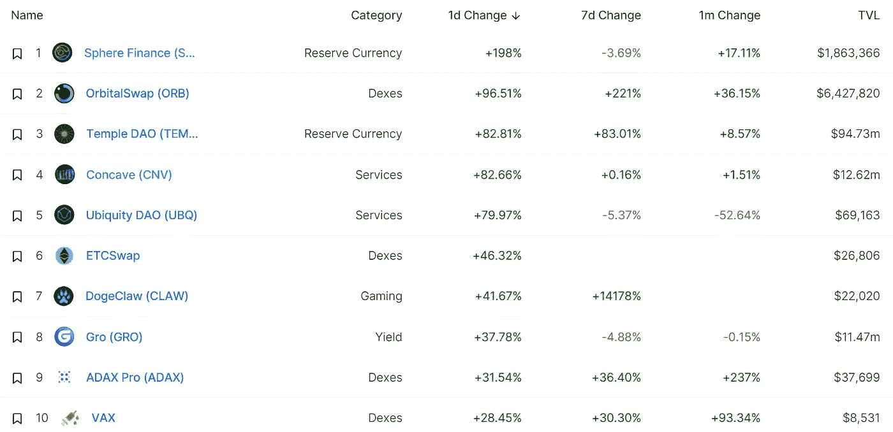

# DeFi Insight |连锁酒店 Q2 2022

> 原文：<https://medium.com/coinmonks/defi-insight-state-of-bnb-chain-q2-2022-ad4246c4adec?source=collection_archive---------15----------------------->

2022 年 8 月 1 日

*今日 DeFi 数据&由 DeFi Insight 为您带来的新闻*

> 2022 年第二季度带来了整个市场的动荡，整个行业的第 1 层网络活动急剧下降。紧缩的货币政策和 Terra 生态系统的灾难性崩溃等宏观因素导致市场大幅下跌。BNB 连锁店的情况如何？本季度的主要发展是什么？*@*[来源](https://messari.io/article/state-of-bnb-chain-q2-2022)

# 最新消息

## 指标

基于乐观主义的 DEX [赛车场](https://mobile.twitter.com/VelodromeFi/status/1553623332393820160)与利多合作

## 稳定币

**,**Thala 实验室开发 Aptos 的原生 Stablecoin [$AST](https://twitter.com/ThalaLabs/status/1553571509657952256)

## |选项

**分散期权平台 [Opyn](/opyn/automated-squeeth-strategies-crab-v2-is-now-live-8444246610c8) 推出自动化金库策略 Crab v2**

## **市场**

****Web3 基金会在 [Polkadot](https://cryptoslate.com/web3-foundation-passes-400-project-grants-on-polkadot/) 上通过 400 个项目资助****

****投资加密货币的兴奋中带着对大滑坡的恐惧****

******[密码迷们等待着以太价值超过比特币的‘翻转’](https://fortune.com/2022/07/31/flippening-ether-pass-bitcoin-price-value-merge-proof-of-stake/)。“这一事件日益临近”******

## ******商业******

********[印度储备银行](https://coingeek.com/reserve-bank-of-india-approves-firm-to-deploy-blockchain-solution-for-cross-border-payments/)批准公司部署区块链跨境支付解决方案********

## ******衍生产品******

********[dYdX 于 8 月 3 日迁移服务器](https://twitter.com/dYdX/status/1553765598827626496)，预计停机时间约 2 小时********

## ******测试网******

********[Alpha Testnet](https://mirror.xyz/sithswap.eth/XiVoUbLkKClQBbVTujlQHXtm4fBWf7m5k644rxQiuqU):前沿的建筑********

## ******|令牌******

********[OP](https://ambcrypto.com/optimism-op-leads-the-crypto-gang-with-a-90-growth-in-price-in-the-past-seven-days/)带领加密团伙在过去的七天里价格上涨了 90%********

********‘现在就卖’—[狗咬现实](https://www.forbes.com/sites/martinrivers/2022/07/31/sell-now-reality-bites-for-dogecoin-as-expert-panel-says-joke-cryptocurrency-is-heading-to-zero-cuts-price-forecast-for-bnb-solano--cardano/?sh=67099f5b221f)专家小组说笑话加密货币走向零，下调 BNB、索拉纳&卡尔达诺的价格预测********

## ******政策与法规******

********[美英](https://www.cryptopolitan.com/crypto-regulation-us-and-uk-regulators-join/)监管机构携手********

## ******NFT******

********,**[蒂芙尼&公司](https://cointelegraph.com/news/tiffany-co-turning-cryptopunk-nfts-into-50k-custom-pendants)将 CryptoPunk NFTs 变成价值 5 万美元的定制吊坠******

******NFT 集合 [Meebits](https://twitter.com/MeebitsNFTs/status/1553837379785482243) 于 8 月 15 日发布 IP 协议******

## ******基金******

********[VCs 游戏 crypto](https://techcrunch.com/2022/07/30/can-vcs-game-crypto-out-of-this-downturn/) 能否走出低迷？********

********[OrBit](https://us.acrofan.com/detail.php?number=701181)从 Matrixport、Brevan Howard Digital 筹集 460 万美元，用于开发数字资产中的奇异期权和结构化产品********

## ******观点******

******以太坊创造者称[脸书的元宇宙尝试将会失败](https://bitcoinist.com/ethereum-creator-says-fb-metaverse-will-fail/)******

********[我在加密什么](https://amirbolous.com/posts/crypto-frustrations/)********

# ******数据和分析******

## ******锁定的总价值(TVL)******

******目前全网 DeFi 总锁定量为 896.5 亿美元，24 小时增长 0.37%。******

************

## ******TVL 评出的十大连锁酒店******

************

## ******|最新 TVL 十大项目******

************

## ******|过去 24 小时内 TVL 增长的前 10 个项目******

************

## ******协议收入******

## ******|累计总收入最高的项目(24H)_ 区块链(L1)******

************

## ******|累计总收入最高的项目(24H) _Dapps (L2)******

************

## ******|前 10 大交易所的每日收入******

************

## ******|十大贷款协议的日收入******

************

# ******深潜******

********比特币挖矿** [**不是浪费**](https://bitcoinmagazine.com/business/bitcoin-mining-is-not-wasteful)**——它创造了富足********

**** [## 比特币挖矿不是浪费，而是创造财富

### 主流媒体错误地将比特币挖矿描绘成浪费。没有什么比这更偏离事实了。比特币…

bitcoinmagazine.com](https://bitcoinmagazine.com/business/bitcoin-mining-is-not-wasteful) 

**[**的未来最大可提取价值(MEV)**](https://fbifemboy.substack.com/p/the-future-of-maximal-extractable)**

** [## 最大可提取价值的未来

### 在过去的一年中，最大可提取值(MEV 以前称为矿工可提取价值)有…

fbifemboy.substack.com](https://fbifemboy.substack.com/p/the-future-of-maximal-extractable) 

**揭秘**[**Zk 汇总上的账户抽象&以太坊**](/@0xexomonk/blockchains-demystifying-account-abstraction-on-zk-rollups-ethereum-smart-contracts-c7ae864bc542) **:技术人员视点**

 [## 揭秘 Zk 汇总和以太坊上的帐户抽象:技术人员视点

### 虽然今天我们的加密钱包(只)用于访问和管理我们的加密货币，NFTs，集成了一些赌注…

medium.com](/@0xexomonk/blockchains-demystifying-account-abstraction-on-zk-rollups-ethereum-smart-contracts-c7ae864bc542) 

**200 万美元，还在继续:数十个亲俄团体如何使用** [**加密货币捐款资助乌克兰战争**](https://blog.chainalysis.com/reports/pro-russian-crypto-donations-war-in-ukraine/)

 [## 亲俄团体如何利用秘密捐款资助乌克兰战争

### 随着俄罗斯在乌克兰的战争进入第六个月，许多活跃的战斗已经集中在顿巴斯…

blog.chainalysis.com](https://blog.chainalysis.com/reports/pro-russian-crypto-donations-war-in-ukraine/) 

# 报告

******区块链用户对加密传染病和最新宏事件的反应** _dappradar****

> ****随着 Terra——当时第二大 DeFi 生态系统在 5 月份崩溃，它抹去了约 400 亿美元的风险投资和零售资金。这一打击给整个加密市场带来了沉重的压力，首先是比特币和以太坊，这对该行业的其他部分产生了溢出效应，也被称为加密传染病。结果不同的当事人受到影响，3AC、BlockFi、Celsius 都在范围之内。
> DeFi 景观无疑是受影响最大的区块链垂直景观；因此，从这个角度观察用户行为是否发生了变化是很有趣的。与此同时，自 5 月份以来，NFT 市场的交易量和交易数量分别下降了 67%和 21%。****

******[**数字资产宏观环境**](https://www.theblockresearch.com/digital-asset-macro-environment-q222-update-160259)**| Q2’22 更新** _theblockresearch******

******[**被解放的神**](https://crypto.com/research/gods-unchained/) **:交易卡牌游戏宇宙中更光明的未来** _crypto******

******关于:******

****DeFi Insight 是顶级 DeFi 和加密新闻和更新的来源。****

******https://twitter.com/AlphaPro_io 推特:******

********❤RSS:**[**https://medium.com/feed/@alphapro.project**](https://medium.com/feed/@alphapro.project)******

****提供的信息应被视为发展新闻，而不是投资建议。****

> ****交易新手？尝试[加密交易机器人](/coinmonks/crypto-trading-bot-c2ffce8acb2a)或[复制交易](/coinmonks/top-10-crypto-copy-trading-platforms-for-beginners-d0c37c7d698c)**********