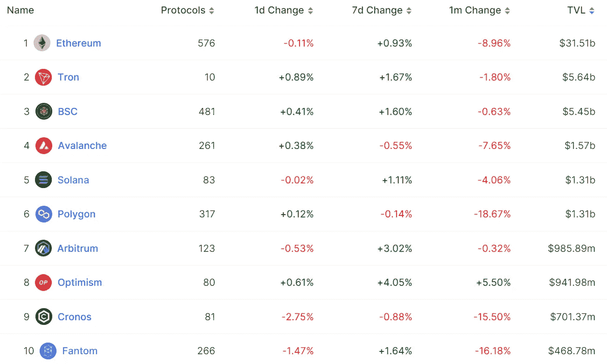

# DeFi Insight |以太坊现状报告—2022 年第三季度

> 原文：<https://medium.com/coinmonks/defi-insight-state-of-ethereum-report-q3-2022-fc73eb386e6b?source=collection_archive---------19----------------------->

2022 年 10 月 10 日

*今日 DeFi 数据&由 DeFi Insight 为您带来的新闻*

> *"* 该报告着眼于以太坊协议和生态系统在 2022 年第三季度的 topline 指标，分为四个类别:协议、DeFi、NFT 和第 2 层。然后，我转到生态系统亮点和前瞻性展望。*“@*[*来源*](https://newsletter.banklesshq.com/p/state-of-ethereum-report-q3-2022?utm_source=%2Finbox&utm_medium=reader2)

# 最新消息

## 第二层

**[ZK sync 2.0 测试网](https://twitter.com/zksync/status/1577313134326386689)将于今日重置，要求开发者重新部署智能合约**

## **指数/交易所/AMM**

****在 zkSync 上部署 [Uniswap V3](https://decrypt.co/111493/why-synthetixs-kain-warwick-thinks-defi-governance-has-gotten-worse)****

****基于订单簿的 DEX MES 协议将于 11 月 7 日在 [zkSync 2.0](https://twitter.com/MESprotocol/status/1578204592965570560) Mainnet 上发布****

## ****贷款****

******,**PeckShieldAlert:约 12 万 CELs 转出原[CELs CEO](https://twitter.com/PeckShieldAlert/status/1579257545444974592?s=20&t=1fndGtCbdLN5R6A134Of3Q)地址，5,000 CELs 兑换成 USDC****

## ****稳定币****

******稳定币协议 [Thala Labs](https://thalalabs.medium.com/meet-thala-labs-a1591eb124da) 推出超额抵押稳定币$MOD******

## ******打桩******

******利多现在支持乐观主义和武断******

## ******|令牌******

******A16Z 支持的加密独角兽氦 T37 与币安在退市问题上争论不休******

## ******空投******

********,**[让步协议](https://mobile.twitter.com/WombexFinance/status/1578307000458305536) Wombex 向包括袋熊交换和 PancakeSwap 在内的 DeFi 协议的活跃用户宣布空投******

## ****道****

****随着 CFTC 的秘密治理成为焦点， [SushiSwap](https://www.coindesk.com/business/2022/10/04/with-crypto-governance-in-cftc-crosshairs-sushiswap-exchange-mulls-legal-shakeup/) 考虑法律重组****

******ConsenSys 和 Bankless 宣布有史以来第一次[道关系](https://consensys.net/blog/press-release/consensys-and-bankless-announce-the-first-ever-daolationship/)******

## ******|警报******

********黑客在 [BNB 连环攻击](https://twitter.com/buchmanster/status/1578879188542849025?s=20&t=7jyUHSDN41EbJZyGs7ERMA)中通过 RangeProof 伪造了 Merkle 证明********

## ******NFT******

********、**索拉纳生态系统 NFT 项目 [DeGods](https://twitter.com/DeGodsNFT/status/1579018796244692993?s=20&t=CSxQkDdEAHQ9tD2BgaDf9Q) 更新为 0%版税******

******[分散地](https://twitter.com/decentraland/status/1578454101817724928?s=20&t=mlv8k2ylyPMqBz82Oy2YjQ)回应日活跃用户低的问题:9 月实际月活跃用户超过 5.6 万******

## ******基金******

********Sovryn 担保资金由[通用催化剂](https://www.einnews.com/pr_news/595049614/sovryn-secured-funds-led-by-general-catalyst)牵头********

********DeFi startup Arch 融资500 万美元成为“web3 的黑石”********

## ******观点******

******为什么 Synthetix 的 Kain Warwick 认为 DeFi 治理已经变得更糟******

# ******数据和分析******

## ******锁定的总价值(TVL)******

******目前全网 DeFi 总锁定量为 549.3 亿美元，24 小时增长 0.20%。******

************

## ******TVL 评出的十大连锁酒店******

************

## ******|最新 TVL 十大项目******

************

## ******|过去 24 小时内 TVL 增长的前 10 个项目******

************

## ******协议收入******

## ******|累计总收入最高的项目(24H)_ 区块链(L1)******

************

## ******|累计总收入最高的项目(24H) _Dapps (L2)******

************

# ******深潜******

********[**NFT 价格**](https://www.nansen.ai/research/nft-price-estimates-machine-learning-model) **估计机器学习模型**********

**** [## NFT 价格估计机器学习模型

### 南森已将其价格估计的覆盖范围从 15 个集合扩大到 800 多个集合，新的…

www.nansen.ai](https://www.nansen.ai/research/nft-price-estimates-machine-learning-model)**** 

# ****报告****

******[波尔卡多特](https://messari.io/report/state-of-polkadot-q3-2022)Q3 2022**_ 梅萨里状态********

> ****Parachain 老虎机拍卖继续进行，产生了八个新的赢家。通过 28 次拍卖，1.32 亿点(总供应量的 10.7%；价值 8.5 亿美元)已保税。
> 跨共识报文格式(XCM)的采用持续增加。奇偶技术公司宣布了下一个版本，XCM V3。围绕波尔卡多特统治 V2 的更多细节被公布。这将增加有资格立即表决的提案的数量，并进一步分散网络。
> 验证者数量、提名者数量和总供应量百分比等基本指标保持一致。****

******层层发行 48:** [**宇宙 2.0**](https://www.theblockresearch.com/layer-by-layer-issue-48-cosmos-2-0-175718)**_ the block research******

********[**ConsenSys**](https://www.theblockresearch.com/consensys-company-intelligence-2-174847)**公司情报** _theblockresearch********

******■web 3 游戏:** [**令牌**](https://www.theblockresearch.com/web3-games-does-token-model-matter-174354) **模型重要吗？**_ 区块研究****

******状态**[**live peer**](https://messari.io/report/state-of-livepeer-q3-2022)**Q3 2022**_ messari****

******分析** [**领先协议**](https://messari.io/report/analyzing-leading-protocol-fundamentals) **基础** _messari****

******关于:******

****DeFi Insight 是顶级 DeFi 和加密新闻和更新的来源。****

******https://twitter.com/AlphaPro_io**❤[t56】](https://twitter.com/AlphaPro_io)****

******❤RSS:**[**https://medium.com/feed/@alphapro.project**](https://medium.com/feed/@alphapro.project)****

****提供的信息应被视为发展新闻，而不是投资建议。****

> ****交易新手？试试[加密交易机器人](/coinmonks/crypto-trading-bot-c2ffce8acb2a)或者[复制交易](/coinmonks/top-10-crypto-copy-trading-platforms-for-beginners-d0c37c7d698c)****