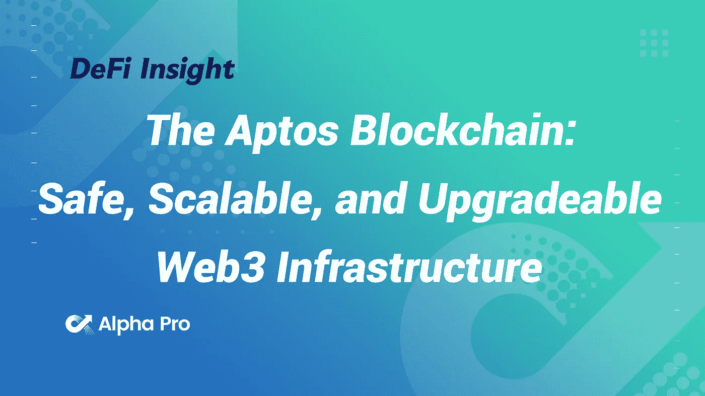
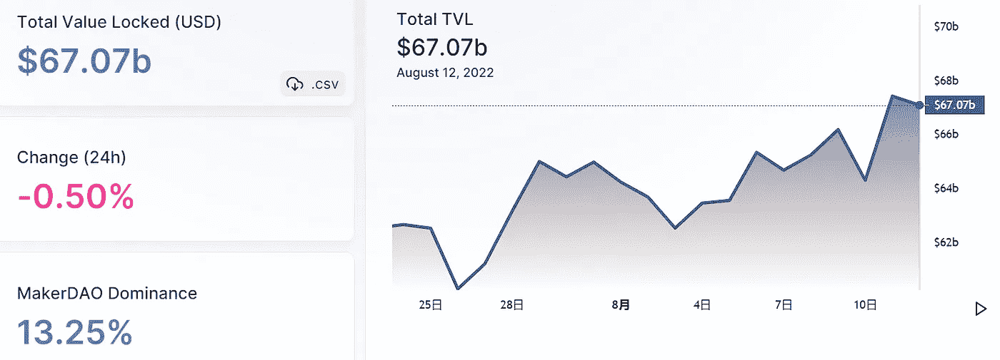
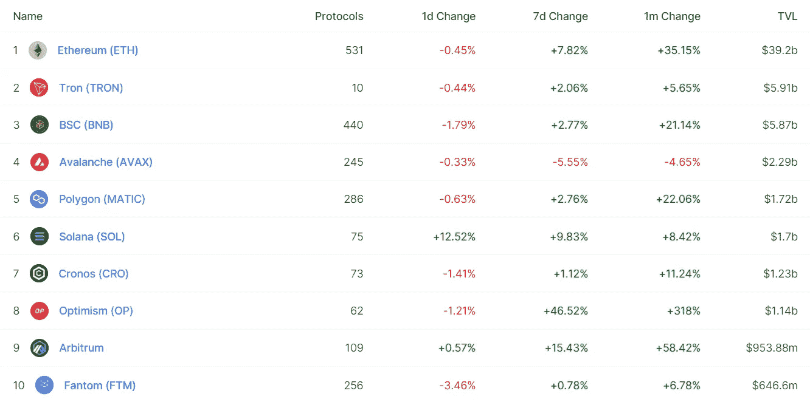
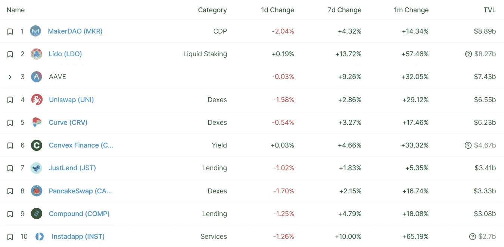
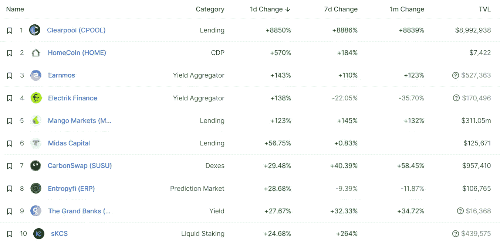
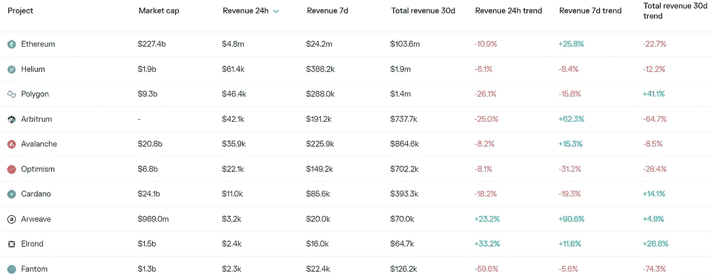
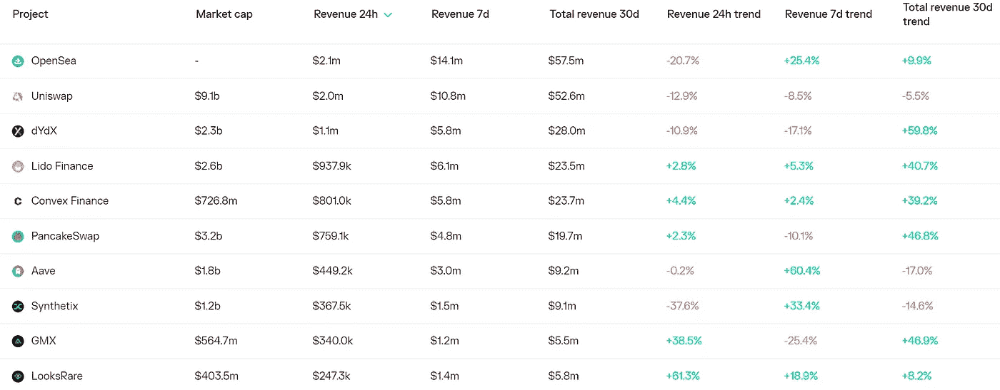
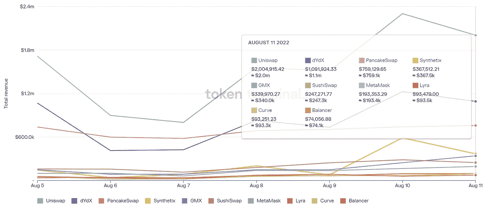
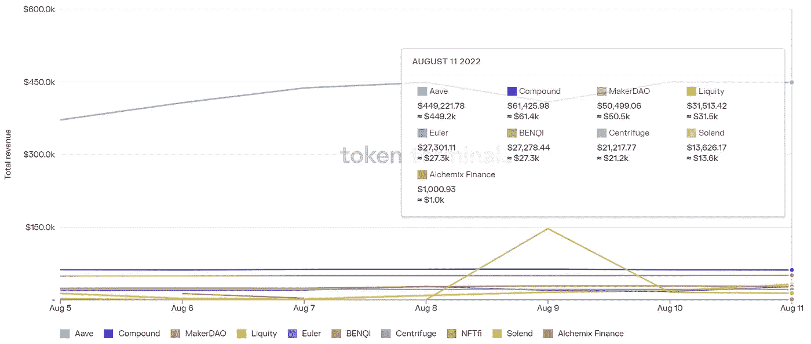

# DeFi Insight | Aptos 区块链:安全、可扩展和可升级的 Web3 基础设施

> 原文：<https://medium.com/coinmonks/defi-insight-the-aptos-blockchain-safe-scalable-and-upgradeable-web3-infrastructure-2cc11176e156?source=collection_archive---------15----------------------->

2022 年 8 月 12 日

*今日 DeFi 数据&由 DeFi Insight 为您带来的新闻*

> *"* 区块链作为一种新的互联网基础设施的兴起，导致开发者以快速增长的速度部署了成千上万的分散式应用。不幸的是，由于频繁的停机、高成本、低吞吐量限制和许多安全问题，区块链的使用还没有普及。为了在 web3 时代实现大规模采用，区块链基础设施需要遵循云基础设施的道路，作为一个可信、可扩展、经济高效且不断改进的平台来构建广泛使用的应用。*“@*[*来源*](https://github.com/aptos-labs/aptos-core/blob/main/developer-docs-site/static/papers/whitepaper.pdf)

# 最新消息

## 外汇

FTX 首席执行官对加密公司未能互相帮助感到不满

**[密码交易所 Hotbit](https://news.bitcoin.com/crypto-exchange-hotbit-suspends-service-after-law-enforcement-seizes-its-funds-subpoenas-senior-managers/) 在执法部门冻结其资金、传唤高级管理人员后暂停服务**

## **稳定币**

**马克道基金称戴放弃盯住美元“几乎是必然的”**

## **市场**

**随着合并的临近，以太坊经典[创 4 个月新高](https://decrypt.co/107306/ethereum-classic-hits-4-month-high-as-merge-approaches)**

## **衍生产品**

****[引入菌丝体](https://tracerdao.medium.com/introducing-mycelium-perpetual-swaps-launching-august-2022-85a460f0afb6):2022 年 8 月推出永久掉期****

## ****支付****

******[罢工卡](https://twitter.com/Strike/status/1557828743925727234?s=20&t=Dt7aH9O6HcUyU_ITuzqAXg)来了！******

## ******资产管理******

******随着贝莱德向机构投资者提供直接的比特币敞口，BTC 将迎来数万亿美元的增长******

********[史蒂夫·科恩](https://blockworks.co/steve-cohen-building-out-crypto-investment-firm/)悄悄设立纯加密资产管理公司********

## ******叉子******

******随着 Vasil 测试进入最后阶段，开发人员达到了重要的里程碑******

## ******采矿******

******与中国钻井平台巨头[有关联的加密贷款公司给矿工们一条救命稻草](https://www.bloomberg.com/news/articles/2022-08-11/crypto-lender-tied-to-chinese-rig-giant-throws-miners-a-lifeline?srnd=cryptocurrencies-v2#xj4y7vzkg)******

********加密矿工[核心科学](https://www.coindesk.com/business/2022/08/11/bitcoin-miner-core-scientific-sticks-with-its-year-end-hashrate-projection/)裁员 10%，保持哈希特预测********

## ******政策与法规******

********[布宜诺斯艾利斯](https://www.coindesk.com/policy/2022/08/11/buenos-aires-city-to-deploy-ethereum-validator-nodes-in-2023/)2023 年部署以太坊验证器节点********

## ******基金******

******Datawisp 在由 CoinFund 牵头的一轮融资中筹集了 360 万美元，以建立其无代码数据平台******

******开拓性的多链游戏[monstera](https://www.globenewswire.com/news-release/2022/08/12/2497313/0/en/Pioneering-Multi-chain-Game-Monsterra-Ready-for-IDO-Mainnet-Launch-this-August.html)准备在今年八月推出 IDO & Mainnet******

# ******数据和分析******

## ******锁定的总价值(TVL)******

******目前全网 DeFi 总锁定量为 670.7 亿美元，24 小时下降 0.50%。******

************

## ******TVL 评出的十大连锁酒店******

************

## ******|最新 TVL 十大项目******

************

## ******|过去 24 小时内 TVL 增长的前 10 个项目******

************

## ******协议收入******

## ******|累计总收入最高的项目(24H)_ 区块链(L1)******

************

## ******|累计总收入最高的项目(24H) _Dapps (L2)******

************

## ******|前 10 大交易所的每日收入******

************

## ******|十大**借贷协议日收入********

************

# ******深潜******

********/**[**$ UNI**](https://tokeninsight.com/en/research/analysts-pick/uni-the-valueless-token-of-the-most-valuable-protocol)**—最有价值协议的无价值令牌********

 ****[## $ UNI——最有价值协议的无价值令牌

### Uniswap 是最赚钱的协议，其 7 天平均费用收入最近甚至超过了以太坊。Uniswap 是…

tokeninsight.com](https://tokeninsight.com/en/research/analysts-pick/uni-the-valueless-token-of-the-most-valuable-protocol)**** 

******[**NFTs**](https://metaversal.banklesshq.com/p/nfts-are-going-green-?utm_source=%2Finbox&utm_medium=reader2)**变绿********

 ****[## NFT 正在走向绿色🌳

### 亲爱的无银行国家，以太坊的 Goerli 测试网刚刚演变成了一个风险证明链。这是最后的…

metaversal.banklesshq.com](https://metaversal.banklesshq.com/p/nfts-are-going-green-?utm_source=%2Finbox&utm_medium=reader2)**** 

******[**衡量 SNARK 性能**](https://a16zcrypto.com/measuring-snark-performance-frontends-backends-and-the-future/) **:前端、后端和未来********

 ****[## 测量 SNARK 性能

### SNARK(简洁的非交互式知识论证)是一种重要的密码学原语

a16zcrypto.com](https://a16zcrypto.com/measuring-snark-performance-frontends-backends-and-the-future/)**** 

******[**如何赢得合并**](https://newsletter.banklesshq.com/p/ethereum-merge-investing-strategy-eth?utm_source=%2Finbox&utm_medium=reader2)******

 ****[## 如何赢得合并

### 加入福塔网络🔒亲爱的无银行国家，如果你一直住在你的传统洞穴里，第三个也是最后一个…

newsletter.banklesshq.com](https://newsletter.banklesshq.com/p/ethereum-merge-investing-strategy-eth?utm_source=%2Finbox&utm_medium=reader2)**** 

# ****报告****

******[**汇评**](https://data.cryptocompare.com/reports/exchange-review-july-2022)**—2022 年 7 月** _cryptocompare******

> ****所有中央加密交易所的现货交易量下降 1.34%，至 1.39 万亿美元，为 2020 年 12 月以来的最低月度交易量。自今年年初以来，币安、FTX、东京和比特币基地的现货交易量都有所下降。
> 衍生品交易量自 3 月以来首次上升，增长 13.4%，至 3.12 万亿美元****

******[**通货膨胀**](https://members.delphidigital.io/reports/has-inflation-peaked) **是否已经见顶？**_ 德尔福数码******

******[**米娜**](https://research.thetie.io/mina-the-succinct-blockchain/) **:简洁的区块链** _thetie******

******[**龙卷风现金活动**](https://www.theblockresearch.com/tornado-cash-activities-after-sanctions-162960) **制裁后** _theblockresearch******

******[**的状态 Aave**](https://messari.io/report/the-state-of-aave-q2-2022)**Q2 2022**_ 梅萨里******

******关于:******

****DeFi Insight 是顶级 DeFi 和加密新闻和更新的来源。****

******https://twitter.com/AlphaPro_io 推特:******

********❤RSS:**[**https://medium.com/feed/@alphapro.project**](https://medium.com/feed/@alphapro.project)******

****提供的信息应被视为发展新闻，而不是投资建议。****

> ****加入 Coinmonks [电报频道](https://t.me/coincodecap)和 [Youtube 频道](https://www.youtube.com/c/coinmonks/videos)了解加密交易和投资****

# ****另外，阅读****

*   ****[Botsfolio vs nap bots vs Mudrex](/coinmonks/botsfolio-vs-napbots-vs-mudrex-c81344970c02)|[gate . io 交流回顾](/coinmonks/gate-io-exchange-review-61bf87b7078f)****
*   ****[CoinFLEX 评论](https://coincodecap.com/coinflex-review) | [AEX 交易所评论](https://coincodecap.com/aex-exchange-review) | [UPbit 评论](https://coincodecap.com/upbit-review)****
*   ****[AscendEx 保证金交易](https://coincodecap.com/ascendex-margin-trading) | [Bitfinex 赌注](https://coincodecap.com/bitfinex-staking) | [bitFlyer 审核](https://coincodecap.com/bitflyer-review)****
*   ****[Bitget 评论](https://coincodecap.com/bitget-review)|[Gemini vs block fi](https://coincodecap.com/gemini-vs-blockfi)cmd |[OKEx 期货交易](https://coincodecap.com/okex-futures-trading)****
*   ****[AscendEx Staking](https://coincodecap.com/ascendex-staking)|[Bot Ocean Review](https://coincodecap.com/bot-ocean-review)|[最佳比特币钱包](https://coincodecap.com/bitcoin-wallets-india)****