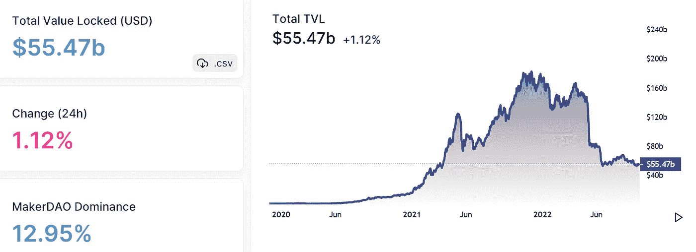
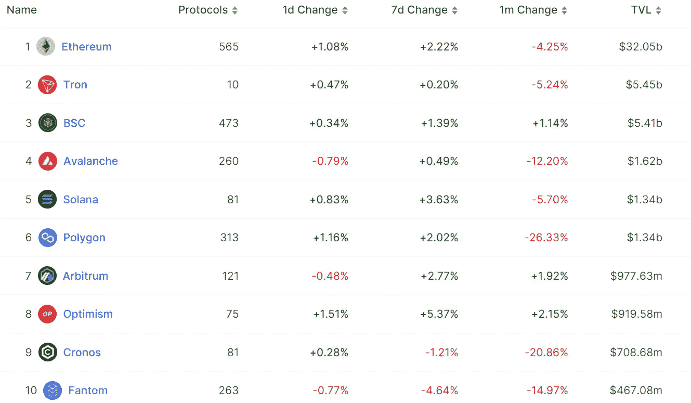
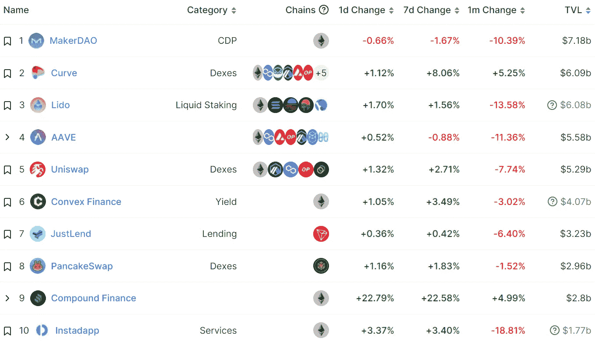
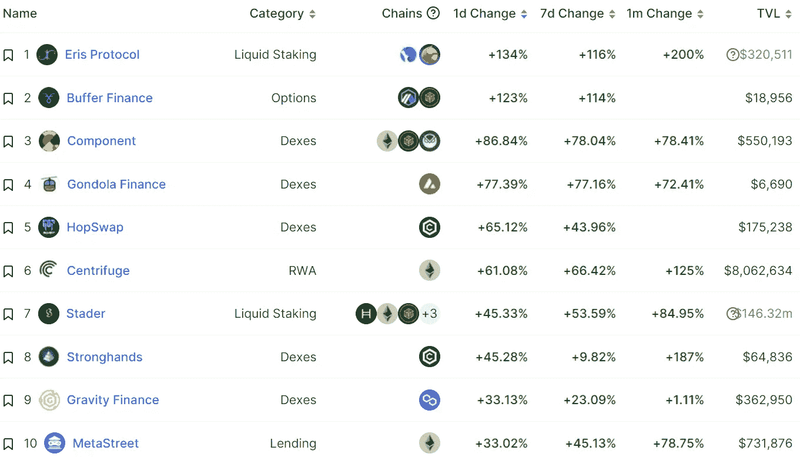
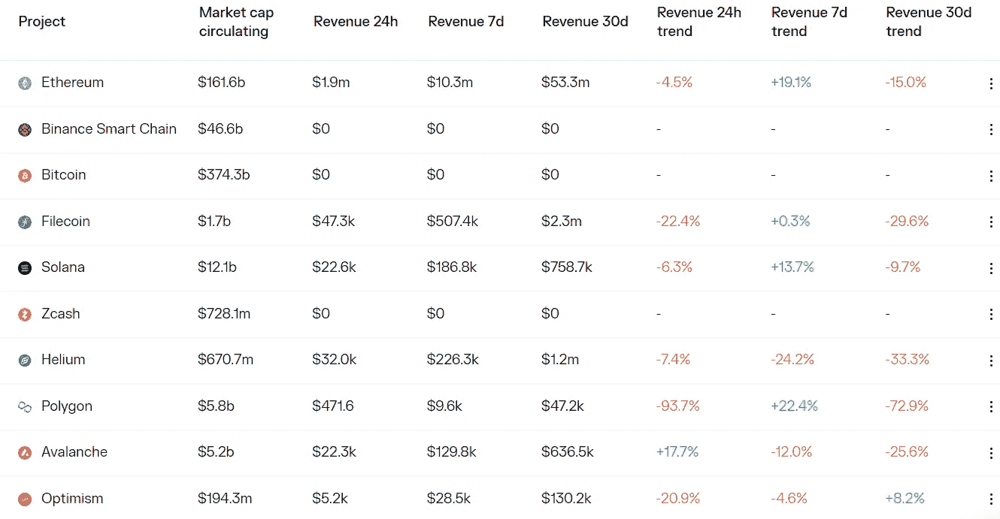
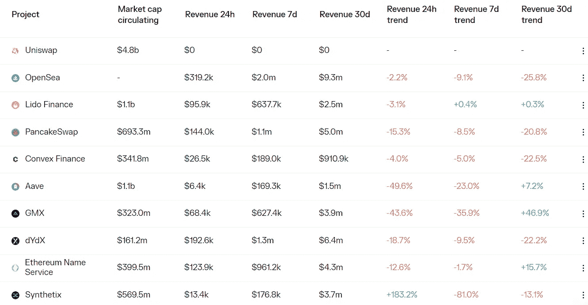

# DeFi Insight |最好的 DeFi 商业模式

> 原文：<https://medium.com/coinmonks/defi-insight-the-best-defi-business-models-23bf6b2e92b?source=collection_archive---------18----------------------->

2022 年 9 月 30 日

*今日 DeFi 数据&由 DeFi Insight 为您带来的新闻*

> *"* 在牛市的流动性热潮中，TVL 是投资者衡量协议成功与否及其使用情况的首选指标。
> 
> 现在，流动性正在枯竭，焦点已经转移到基本的收入和盈利能力指标。
> 
> 基本面一直很重要。
> 
> 牛市只是模糊了他们，但没有排除他们。
> 
> 重要的是要记住 DeFi 协议是初创公司。即使是最老的也只有几岁，而许多还不到几个月。
> 
> 现在要求立即盈利是不现实的。
> 
> 然而，区块链的可审计性和透明性使我们有独特的能力更好地理解这些协议，并评估盈利的途径。*“@*[*来源*](https://newsletter.banklesshq.com/p/the-best-defi-business-models?utm_source=%2Finbox&utm_medium=reader2)

# 最新消息

## 指数/交易所/AMM

**[**hash flow**](https://blog.hashflow.com/introducing-the-hashverse-95ace8a372a7)**宣布将于 11 月 7 日推出 Token HFT****

******加密交易平台提供商 [WonderFi](https://www.coindesk.com/business/2022/09/29/wonderfis-crypto-trading-unit-bitbuy-to-offer-equities-next-year/) 明年将通过 Bitbuy 部门提供股票******

## ******贷款******

********[航海家](https://www.theblock.co/post/173813/voyager-files-proposed-order-to-facilitate-ftx-sales-process)文件提出订单以方便 FTX 销售过程********

******债权人首先传唤贷款公司股票，要求偿还 4 . 39 亿美元抵押贷款******

## ******第二层******

******StarkNet 计划在 Cairo 1.0 发布后进行 mainnet 重置，预计在 2022 年底发布******

## ******桥梁******

********[和谐桥](/harmony-one/harmony-bridge-recovery-plan-update-september-29-2022-632dbac20505)恢复计划更新********

## ******打桩******

********[德国电信](https://fundscene.com/deutsche-telekom-unterstuetzt-ethereum-blockchain/) unterstützt 以太坊区块链********

********[明争暗斗](https://www.theblockbeats.info/flash/106798) V3 公告********

## ******甲骨文******

********[链家](https://blog.chain.link/smartcon-2022-recap/)启动打造计划，旨在加速链家的生态化发展********

## ******空投******

********[ACS](/access-protocol/acs-airdrop-announcement-5a00ea854a1e)空投公告********

## ******支付******

********[Circle](https://www.circle.com/en/pressroom/circle-announces-acquisition-of-elements-to-accelerate-crypto-payments)宣布收购元素以加速加密支付********

## ******市场******

********BTC 长期持有人的盈利能力已经下降到 2018 年 12 月熊市最严重时期的水平********

## ******政策与法规******

******欧盟决策者批评亚马逊在欧洲央行数字欧元开发中的角色******

********、**欧洲反洗钱规则可能涉及 [DeFi、Dao 和 NFT](https://www.theblock.co/post/173652/europe-aml-rules-could-implicate-defi-daos-and-nfts)******

## ****NFT****

******[元素](https://dune.com/sixdegree/element-nft-marketplace)NFT 多链聚合交易市场交易额超过 1 亿美元******

********[**OpenSea**](https://www.theblock.co/post/173729/opensea-partners-with-warner-music-group-on-music-nft-drops?utm_source=twitter&utm_medium=social)**与华纳音乐集团合作音乐 NFT 滴滴**********

********、**在 Instagram 上展示数码收藏品******

# ****数据和分析****

## ****锁定的总价值(TVL)****

****目前全网 DeFi 总锁定量为 554.7 亿美元，24 小时增长 1.12%。****

********

## ****TVL 评出的十大连锁酒店****

********

## ****|最新 TVL 十大项目****

********

## ****|过去 24 小时内 TVL 增长的前 10 个项目****

********

## ****协议收入****

## ****|累计总收入最高的项目(24H)_ 区块链(L1)****

********

## ****|累计总收入最高的项目(24H) _Dapps (L2)****

********

# ****深潜****

******[**合并**](https://tokeninsight.com/en/research/market-analysis/the-merge-is-done-and-eth-price-dropped-what-can-we-expect-next) **完成，美元 ETH 价格下跌，接下来我们能期待什么？********

**** [## 合并完成，价格下跌，下一步我们能期待什么？

### 美国 CPI 没有显示出减速的迹象，美国 1 年期国债收益率现在超过 4.1%，几乎与…

tokeninsight.com](https://tokeninsight.com/en/research/market-analysis/the-merge-is-done-and-eth-price-dropped-what-can-we-expect-next) 

**如何备份您的** [**NFTs**](https://metaversal.banklesshq.com/p/how-to-backup-your-nfts?utm_source=%2Finbox&utm_medium=reader2)

 [## 如何备份您的 NFTs💾

### 亲爱的无银行国家，NFT 是像以太坊一样生活在区块链的独特的数字事物。然而只有一小部分…

metaversal.banklesshq.com](https://metaversal.banklesshq.com/p/how-to-backup-your-nfts?utm_source=%2Finbox&utm_medium=reader2) 

# 报告

**测量以太坊合并对第二层的影响** _dappradar

> 在合并之前，第 2 层上的活动更大；然而，合并后交易数量下降了 36%，唯一活跃钱包数量下降了 27%。

**[**Sei 网络**](https://members.delphidigital.io/reports/sei-network-an-l1-for-defi) **: DeFi 优化宇宙链** _delphidigital**

****层层发行 47:** [**波尔卡多特、阿尔格兰德、雪崩**](https://www.theblockresearch.com/layer-by-layer-issue-47-polkadot-algorand-and-avalanche-173677) _theblockresearch**

****重新审视一个**[**δ-中性稳定的概念**](https://www.theblockresearch.com/revisiting-the-idea-of-a-delta-neutral-stablecoin-172171) _theblockresearch**

****[**ETHPoW**](https://www.theblockresearch.com/analyzing-activity-on-ethpow-173363)**_ the block research 上的分析活动******

********分析师注:** [**加密上下文**](https://messari.io/report/analyst-note-currency-crisises-in-a-crypto-context) _messari 中的货币危机******

******关于:******

****DeFi Insight 是顶级 DeFi 和加密新闻和更新的来源。****

******https://twitter.com/AlphaPro_io 推特:******

********https://medium.com/feed/@alphapro.project**RSS:******

******提供的信息应被视为发展新闻，而不是投资建议。******

> ******交易新手？尝试[加密交易机器人](/coinmonks/crypto-trading-bot-c2ffce8acb2a)或[复制交易](/coinmonks/top-10-crypto-copy-trading-platforms-for-beginners-d0c37c7d698c)**********