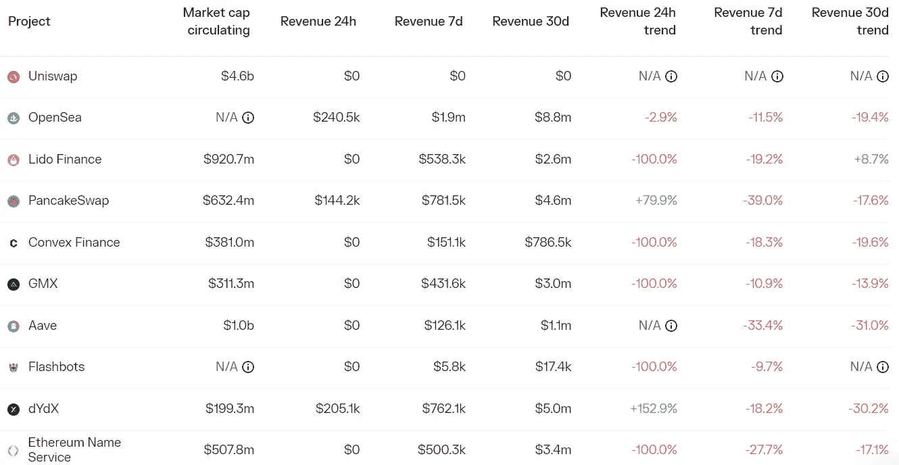

# DeFi Insight |宇宙终结游戏

> 原文：<https://medium.com/coinmonks/defi-insight-the-cosmos-endgame-239abf651e72?source=collection_archive---------14----------------------->

2022 年 10 月 14 日

*今日 DeFi 数据&由 DeFi Insight 为您带来的新闻*

> *"*Cosmos 的 appchain 论文与以太坊的 rollup 策略相比如何？
> 
> 为什么 DeFi 建造者更喜欢宇宙而不是以太坊？
> 
> 这两个链在处理 MEV 问题时有何不同？
> 
> 跨链桥不是证明宇宙 IBC 不安全吗？
> 
> 最重要的是……宇宙和以太坊的结局有多大不同？*“@*[*来源*](https://newsletter.banklesshq.com/p/the-cosmos-endgame?utm_source=%2Finbox&utm_medium=reader2)

# 最新消息

## 第二层

zkSync 将计划于明年推出的第三层测试网 Pathfinder 更名为 Opportunity

## 指数/交易所/AMM

**/**在 zkSync 上部署 [Uniswap](https://app.uniswap.org/#/vote/2/25) V3

**[liquid swap](https://twitter.com/PontemNetwork/status/1580592226803290112)，Aptos 生态 AMM 交易平台，已推出 LayerZero 跨链桥 UI，并开放测试网络**

## **稳定币**

****[**系绳**](https://twitter.com/Tether_to/status/1580600942323720192)**已经完全消除了商业票据储备，上个季度增加了超过 100 亿美元的美国国债******

## ******贷款******

******航海家号债权人委员会希望在出售计划中增加第三个投票选项******

******一个无需许可的部分抵押贷款协议将于下周在 Arbitrum 上线******

## ******产量******

******似乎有 3 亿美元从 Arrakis finance 的 TVL 撤出******

## ******打桩******

********[**Fantom**](https://fantom.foundation/blog/governance-vote-passes-to-adjust-staking-rewards/)**:治理投票通过调整赌注奖励**********

********[EDF](https://en.thebigwhale.io/article/exclusif-edf-gere-plus-de-150-noeuds-ethereum)管理着 150 多个以太坊节点********

## ******钱包******

********企业加密[钱包](https://www.coindesk.com/business/2022/10/13/enterprise-crypto-wallet-startup-pine-street-labs-raises-6m-in-polychain-led-round/)初创公司 Pine Street Labs 在 Polychain 领投的一轮融资中融资 600 万美元********

## ******EVM******

********[ConsenSys](https://consensys.net/blog/research-development/consensys-rd-launches-an-updated-and-expanded-zk-evm-version/)R&D 推出升级和扩展的 zk-EVM 版本********

## ******鲸鱼******

********,**孙正义钱包地址从 Aave 提取[2000 万 TUSD](https://twitter.com/PeckShieldAlert/status/1580746012729090048) 转到币安******

## ****NFT****

******[coin shares](https://www.theblock.co/post/177052/coinshares-wants-to-harness-twitter-bots-for-good)想利用 Twitter 机器人做好事******

********蜻蜓和 OpenSea 回来了为 NFT 融资公司 MetaStreet 募集 1000 万美元********

## ******基金******

******Uniswap 的 1 . 65 亿美元资金为 DeFi 在加密的冬天带来了一个亮点******

## ******观点******

******山姆·班克曼(Sam Bankman)-弗里德说他是密码行业的“缩小版”摩根大通******

## ******|警报******

********[宇宙](https://forum.cosmos.network/t/ibc-security-advisory-dragonberry/7702) : IBC 安全顾问龙莓********

********、**连锁分析:2022 年被盗的加密资产总值[30 亿美元](https://twitter.com/chainalysis/status/1580312145451180032)******

# ****数据和分析****

## ****锁定的总价值(TVL)****

****目前全网 DeFi 总锁定量为 537.3 亿美元，24 小时增长 0.07%。****

********

## ****TVL 评出的十大连锁酒店****

********

## ****|最新 TVL 十大项目****

********

## ****|过去 24 小时内 TVL 增长的前 10 个项目****

********

## ****协议收入****

## ****|累计总收入最高的项目(24H)_ 区块链(L1)****

********

## ****|累计总收入最高的项目(24H) _Dapps (L2)****

********

# ****深潜****

******[**芒果**](https://www.theblockresearch.com/what-we-know-about-the-100m-mango-markets-exploit-176711) **市场开拓**我们所知道的 1 亿多美元******

**** [## 我们对价值超过 1 亿美元的芒果市场的了解

### 2022 年 10 月 12 日，美国东部时间下午 1:28 快速采取分散交易协议芒果市场受到了 9 位数的攻击…

www.theblockresearch.com](https://www.theblockresearch.com/what-we-know-about-the-100m-mango-markets-exploit-176711) 

**超越** [**IBC**](https://rainandcoffee.substack.com/p/beyond-ibc)

 [## 超越 IBC

### 通过回顾我们以前的一些研究，可以清楚地看到，我们是模块化区块链的信徒…

rainandcoffee.substack.com](https://rainandcoffee.substack.com/p/beyond-ibc) 

**为什么**[**ATOM**](https://newsletter.banklesshq.com/p/why-atom-20-is-a-gamechanger?utm_source=%2Finbox&utm_medium=reader2)**2.0 是一个游戏改变者**

 [## 为什么 ATOM 2.0 是游戏规则的改变者

### 我们已经为无银行高级会员更新了空投指南！探索数十个机会，赢取下一个大…

newsletter.banklesshq.com](https://newsletter.banklesshq.com/p/why-atom-20-is-a-gamechanger?utm_source=%2Finbox&utm_medium=reader2) 

# 报告

**缩放状态问题 8:**[**ZK 状态-上滚**](https://www.theblockresearch.com/state-of-scaling-issue-8-state-of-zk-rollups-176859)**_ the block research**

> **在这个两周一次的系列中，我们来看看第二层区块链景观中一些最有趣的数据和发展，从 DeFi 和网桥到网络活动和资金。
> Zk-rollups 通常被视为以太坊最具性能和最安全的扩展解决方案，但仍有一些细微差别和挑战困扰着开发和采用。zkSync 的 2.0 mainnet 将于 10 月底推出，很可能会迎来一波雇佣军资本的浪潮，他们打算在 zkSync 上申请未来可能的空投。
> StarkNet 的 Regenesis 旨在改善用户的费用市场，但有反馈称 Regenesis 将使一些现有的开发工作过时。
> 还有新的 zkEVM 努力，与非 zkEVM 努力相比，其估值似乎有显著溢价。**

****[**ATOM 2.0**](https://members.delphidigital.io/reports/atom-2-0-building-the-hubs-economy)**:打造枢纽经济** _delphidigital****

******[**ape coin**](https://messari.io/report/apecoin-a-dao-beyond-the-otherside)**:彼岸之刀** _messari******

******[**枫叶财经**](https://messari.io/report/maple-finance-sweet-and-steady) **:甜美稳重**_ 梅萨里******

******DappRadar x BGA**[**游戏报道**](https://dappradar.com/blog/dappradar-x-bga-games-report-q3-2022)**—Q3 2022 _ DappRadar******

********关于:********

****DeFi Insight 是顶级 DeFi 和加密新闻和更新的来源。****

******https://twitter.com/AlphaPro_io 推特:******

********❤RSS:**[**https://medium.com/feed/@alphapro.project**](https://medium.com/feed/@alphapro.project)******

****提供的信息应被视为发展新闻，而不是投资建议。****

> ****交易新手？尝试[加密交易机器人](/coinmonks/crypto-trading-bot-c2ffce8acb2a)或[复制交易](/coinmonks/top-10-crypto-copy-trading-platforms-for-beginners-d0c37c7d698c)********