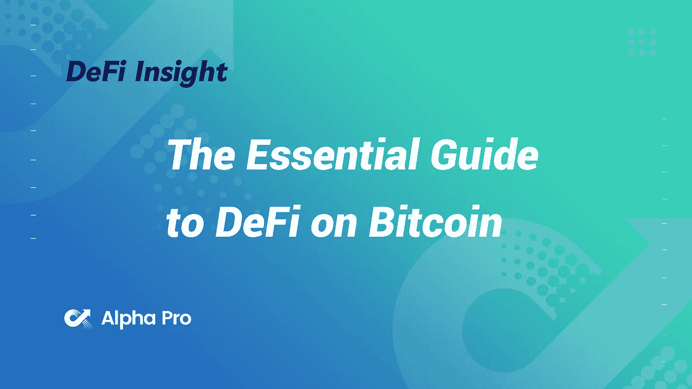
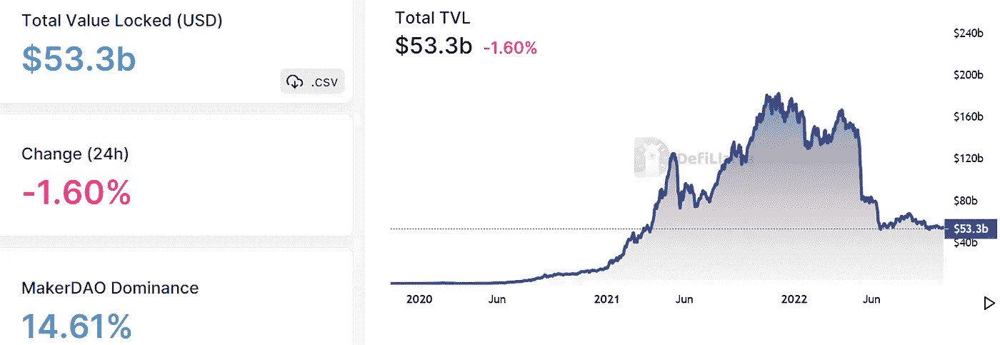
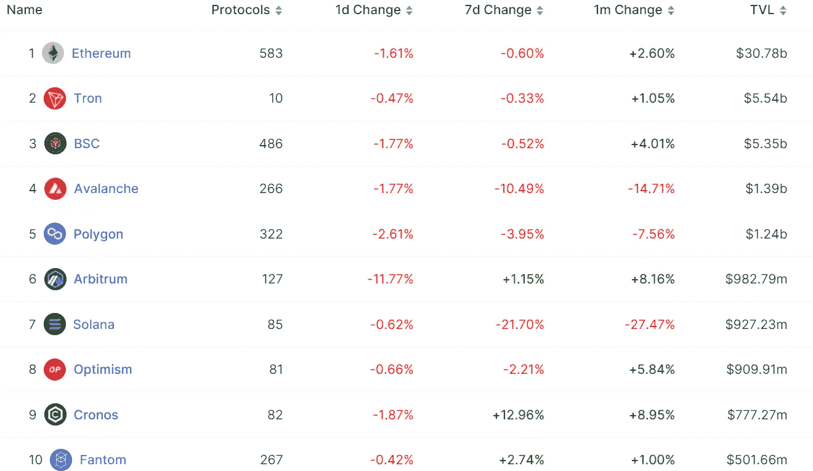
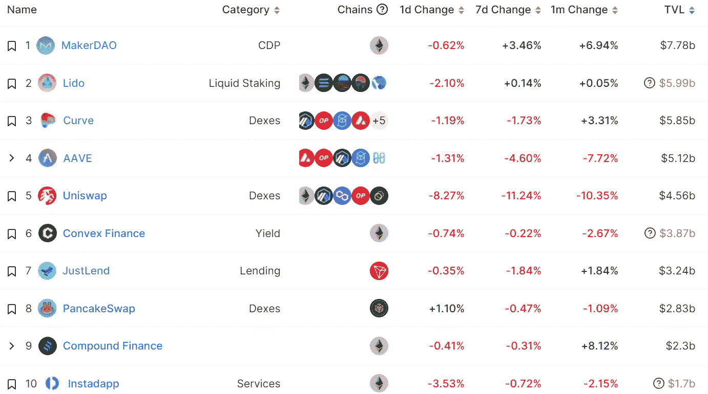
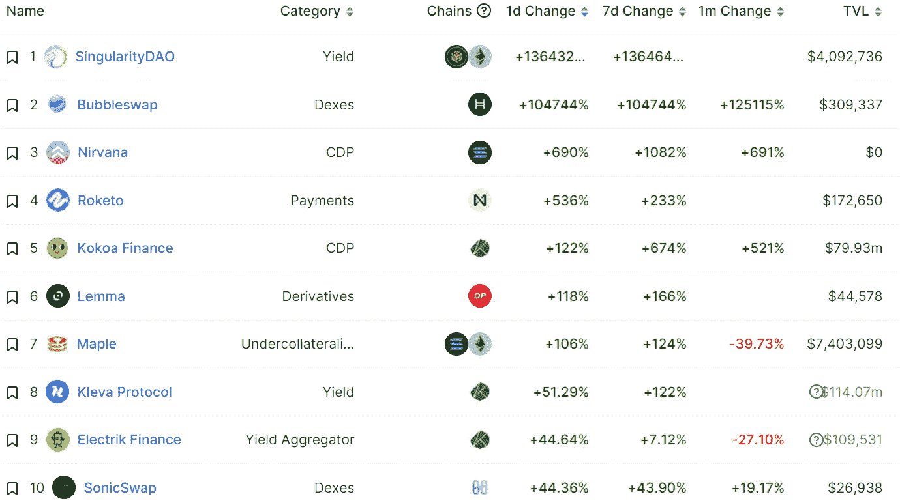
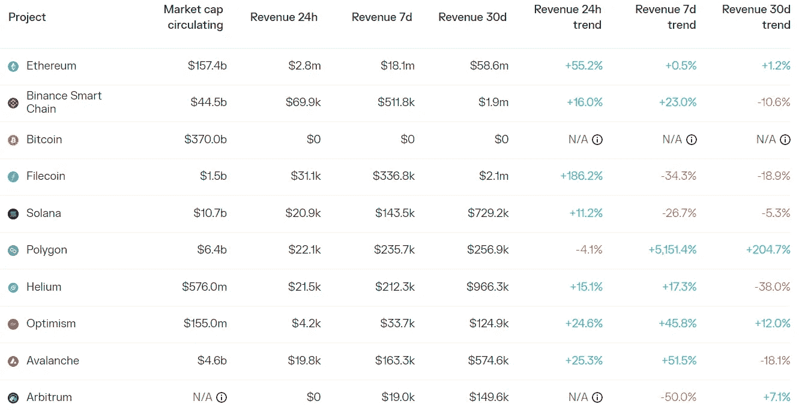
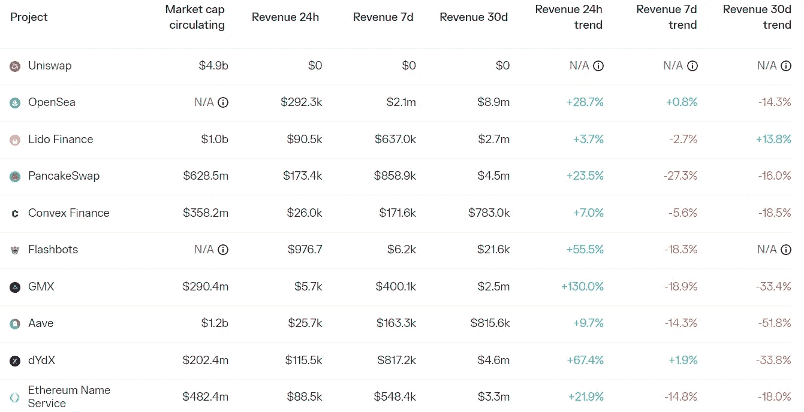

# DeFi Insight |比特币 DeFi 基本指南

> 原文：<https://medium.com/coinmonks/defi-insight-the-essential-guide-to-defi-on-bitcoin-9b9787f8a70b?source=collection_archive---------9----------------------->

2022 年 10 月 19 日

*今日 DeFi 数据&由 DeFi Insight 为您带来的新闻*

> *"* 每个人都知道以太坊和其他智能合约平台如 Cosmos 和 Solana 上的 DeFi。
> 
> 但你知道比特币上存在 DeFi 吗？
> 
> 尽管比特币只支持基础层的基本交易，但开发者可以在网络之上建立一个 DeFi 生态系统，同时继承它的一些高安全性保证。
> 
> 这已经酝酿了一段时间。
> 
> 现在它开始开花结果了。
> 
> 今天，我们将探索如何在比特币上使用 DeFi 的基础知识。*“@*[*来源*](https://newsletter.banklesshq.com/p/the-essential-guide-to-defi-on-bitcoin?utm_source=%2Finbox&utm_medium=reader2)

# 最新消息

## APTOS

**、**Aptos:F[基金会和实验室](https://twitter.com/AptosFoundation/status/1582491674608947200?s=20&t=tX6PPw2X-pjKT8JO_2ggzA)将履行各自的职责，促进协议生态系统的发展

**、** Aptos [记号组学](https://aptosfoundation.org/currents/aptos-tokenomics-overview)概述

**以太扫描推出 Aptos 区块链浏览器测试版 [AptoScan](https://twitter.com/etherscan/status/1582406149181087749?s=20)**

****、**apto:超过 2007.6 万份[apt](https://twitter.com/AptosFoundation/status/1582504536354136065?s=20&t=tX6PPw2X-pjKT8JO_2ggzA)将在 testnet 空投中分发给超过 11 万名社区参与者**

****OKX block dream Ventures 启动[1000 万美元基金](https://okxblockdreamventures.medium.com/okx-blockdream-ventures-launches-10-million-fund-to-support-aptos-ecosystem-aee7abd6aea2)支持 Aptos 生态系统****

******[Oracle python 网络](https://mobile.twitter.com/PythNetwork/status/1582548904146456576)增加了对 Aptos 的支持******

********、**液体[打桩协议同上](https://mobile.twitter.com/Ditto_Finance/status/1582554392883929091)Aptos Mainnet 上的 Finance Live******

******,**Aptos 生态系统 NFT 市场 [Topaz](https://twitter.com/TopazMarket/status/1582542741481099264) 在 Aptos Mainnet 上直播****

******BloctoApp 钱包[适配器](https://twitter.com/BloctoApp/status/1582356342479593472)现已在 Aptos 上上线******

## ******第一层******

********Banff 升级在 [Avalanche Mainnet](https://twitter.com/avalancheavax/status/1582428030961864704) 上运行，允许子网设置自己的锁定参数********

## ******贷款******

********,**Celo 生态系统贷款协议 [Moola 市场](https://twitter.com/Moola_Market/status/1582432297835368449?s=20)被开发价值 840 万美元******

## ****|令牌****

******NFT 市场[模糊](https://twitter.com/blur_io/status/1582114513725186048)发布代币代码符号，或暗示将推出代币******

******摩根大通即将将欧元存款证券化******

## ******打桩******

********基于宇宙的液体赌注协议于 10 月 29 日大步推出********

## ******基金******

******基于 Solana 的隐私基础设施 [Light Protocol](https://twitter.com/LightProtocol/status/1582041546651598856) 融资 420 万美元，由 Polychain Capital 领投******

********layer 1 区块链 [Shardeum](https://www.theblock.co/post/177582/wazirx-founders-blockchain-project-shardeum-raises-18-million?utm_source=twitter&utm_medium=social) 在 Spartan Group 参与的种子轮融资中筹集了 1820 万美元********

# ******数据和分析******

## ******锁定的总价值(TVL)******

******目前全网 DeFi 总锁定量为 533 亿美元，24 小时下降 1.60%。******

************

## ******TVL 评出的十大连锁酒店******

************

## ******|最新 TVL 十大项目******

************

## ******|过去 24 小时内 TVL 增长的前 10 个项目******

************

## ******协议收入******

## ******|累计总收入最高的项目(24H)_ 区块链(L1)******

************

## ******|累计总收入最高的项目(24H) _Dapps (L2)******

************

# ******深潜******

********快速洞察:分解** [**Aptos 的令牌经济学**](https://www.theblockresearch.com/rapid-insights-breaking-down-aptos-token-economics-178079)******

**** [## 快速洞察:打破 Aptos 的令牌经济学

### 快速了解快速洞察于 2010 年 10 月及时提供对当前加密形势的深入分析…

www.theblockresearch.com](https://www.theblockresearch.com/rapid-insights-breaking-down-aptos-token-economics-178079) 

**[**一个螺旋弹簧**](https://insights.glassnode.com/the-week-onchain-week-42-2022/) **— Glassnode 洞见****

** [## 螺旋弹簧

### 比特币市场已经为波动性做好了准备，已实现和期权隐含波动性都降至历史水平…

insights.glassnode.com](https://insights.glassnode.com/the-week-onchain-week-42-2022/) 

**当** [**令牌**](https://nystrom.substack.com/p/when-tokens-shape-behavior?utm_source=%2Finbox&utm_medium=reader2) **形状行为**

 [## 当代币塑造行为时

### 消费者行为会在一夜之间或几十年后发生变化。几乎在一夜之间，疫情改变了全球对…

nystrom.substack.com](https://nystrom.substack.com/p/when-tokens-shape-behavior?utm_source=%2Finbox&utm_medium=reader2) 

**先睹为快的** [**模糊的**](https://metaversal.banklesshq.com/p/a-sneak-peek-of-blur?utm_source=%2Finbox&utm_medium=reader2)

 [## 侠影的一瞥🚅

### 亲爱的无银行国家，你过去只能一次购买和出售一种 NFT。这就是为什么 NFT 的到来…

metaversal.banklesshq.com](https://metaversal.banklesshq.com/p/a-sneak-peek-of-blur?utm_source=%2Finbox&utm_medium=reader2) 

# 报告

**快速洞察:** [**Frax 的**](https://www.theblockresearch.com/rapid-insights-fraxs-liquid-staking-strategy-177955) **液态跑马圈地策略** _theblockresearch

> 算法 stablecoin 协议 Frax Finance 最近宣布推出其流动赌注风险投资。
> 
> 这发生在以太坊合并之后，大大降低了运行以太坊验证器节点的成本。
> 
> 在一项禁止“内生抵押稳定债券”的潜在法案出台后，Frax Finance 的支点可能是其当前业务的关键多元化。

**Q3 ' 22**_ the block research 最活跃区块链 [**投资人**](https://www.theblockresearch.com/an-overview-of-the-most-active-blockchain-investors-in-q322-177255) **概述**

**[**1 英寸**](https://messari.io/report/state-of-1inch-q3-2022)**Q3 2022**_ 梅萨里的状态**

****[**泰佐斯**](https://messari.io/report/state-of-tezos-q3-2022)**Q3 2022**_ 梅萨里的状态****

******分析** [**NFT 市场**](https://messari.io/report/analyzing-nft-marketplace-trends) **趋势** _messari****

******数字** [**资产**](https://coinshares.com/research/bi-weekly-digest) **双周刊摘要** _coinshares****

******关于:******

****DeFi Insight 是顶级 DeFi 和加密新闻和更新的来源。****

******https://twitter.com/AlphaPro_io 推特:******

********❤RSS:**[**https://medium.com/feed/@alphapro.project**](https://medium.com/feed/@alphapro.project)******

****提供的信息应被视为发展新闻，而不是投资建议。****

> ****交易新手？尝试[加密交易机器人](/coinmonks/crypto-trading-bot-c2ffce8acb2a)或[复制交易](/coinmonks/top-10-crypto-copy-trading-platforms-for-beginners-d0c37c7d698c)**********