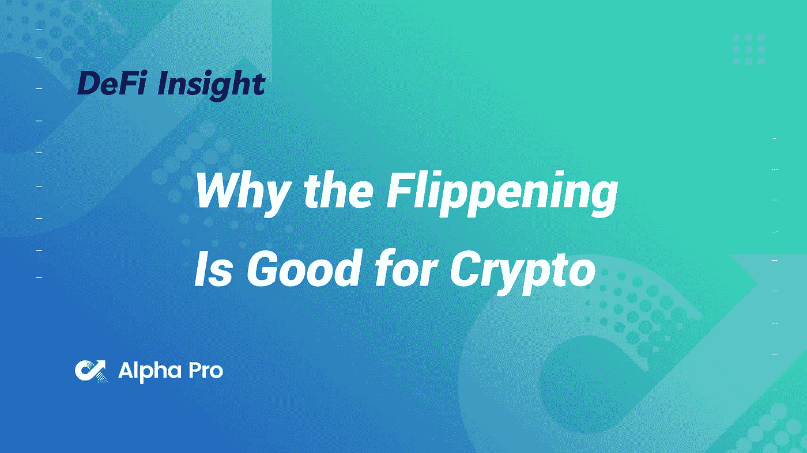
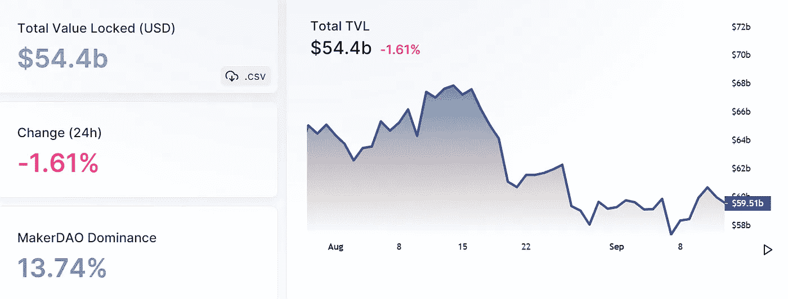
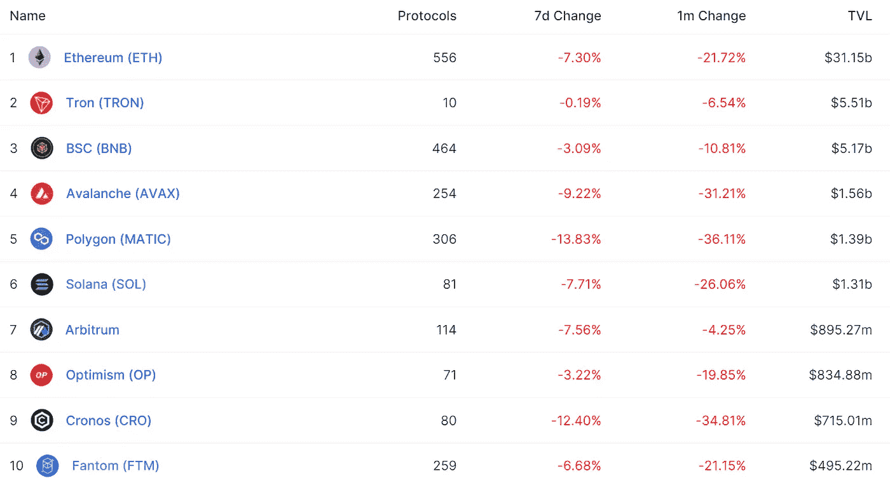
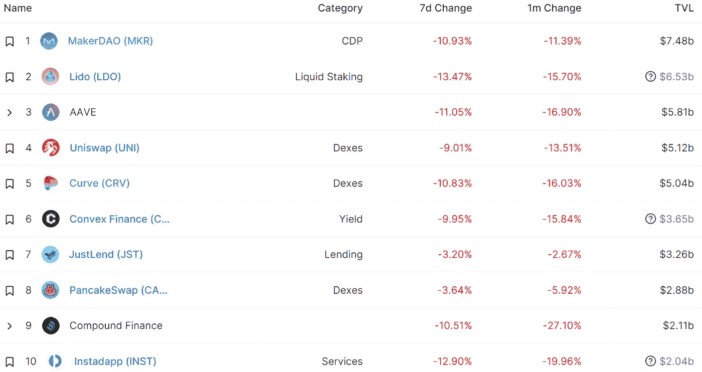
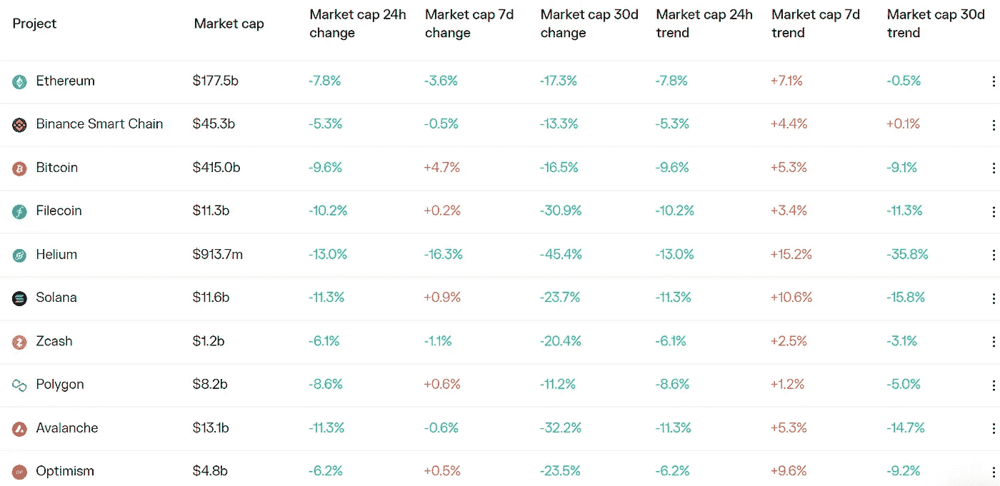
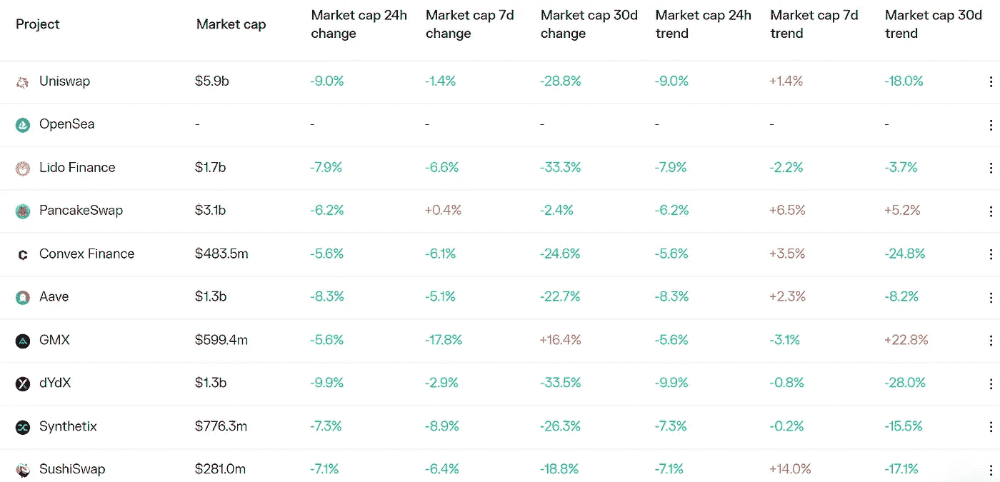

# DeFi Insight |合并已经发生。ETH 现在有望击败 BTC 吗？

> 原文：<https://medium.com/coinmonks/defi-insight-the-merge-has-happened-is-eth-on-track-to-flip-btc-now-19cfbe6d2128?source=collection_archive---------32----------------------->

2022 年 9 月 16 日

*今日 DeFi 数据&由 DeFi Insight 为您带来的新闻*

> *合并成功。*
> 
> *有了它，以太坊的令牌组学的动态发生了巨大的变化。*
> 
> *以太坊现在很少发布 ETH 来阻止验证器。*
> 
> *ETH 供应增长的下降有着巨大的影响。*
> 
> *以太坊正在产生更多的收入，并能够盈利，这大大提高了其相对于该集团庞大资产比特币的竞争地位。*
> 
> *这是否意味着翻转即将到来？*
> 
> *这对 crypto 有好处吗？*“@*[*来源*](https://newsletter.banklesshq.com/p/why-the-flippening-is-good-for-crypto?utm_source=%2Finbox&utm_medium=reader2)*

# *最新消息*

## *外汇/指数*

*FTX 率先收购了加密贷款公司 Voyager Digital 的破产资产*

***[**sudos WAP**](https://www.theblockbeats.info/flash/104380)**推出新的绑定曲线，允许设置价格区间集中度*****

## *****稳定币*****

*******[系绳](https://twitter.com/whale_alert/status/1570398598424330247)在 TRON 网络上额外发放 10 亿 USDT*******

*********[圈](https://twitter.com/circlepay/status/1570251663507849216?s=20&t=aTYcOlPsmPAKzFAG753Sgw):平台维护期现已结束，系统已恢复运行*********

## *******产量*******

*********[阿兹特克网络](https://twitter.com/iearnfinance/status/1570141134357233664?s=20&t=5ukrywKBf3qIxMuQoy4QYQ)与 earn 集成，允许从阿兹特克的 DAI 和 ETH 金库存放资产*********

*******收益协议永恒的金融现在生活在乐观中，多边形*******

## *******打桩*******

*********、**液态锁定协议[p 计划](https://blog.pstake.finance/2022/09/15/a-letter-to-the-cosmos-community-from-pstake/)在数周内在持久性核心-1 链上启动$stkATOM*******

## *****|令牌*****

*****令牌管理平台[麦格纳](https://www.coindesk.com/business/2022/09/15/token-management-platform-magna-raises-15m-seed-round-at-70m-valuation/)以 7000 万美元的估值筹集了 1500 万美元的种子资金*****

## *****政策与法规*****

*******他们的新“跑马圈地”模式可能会引起 [SEC 的关注](https://www.wsj.com/articles/ethers-new-staking-model-could-draw-sec-attention-11663266224)*******

## *******NFT*******

*********,**欢迎来到古风 8 道场:第一个聚焦索拉纳的 [GameFi Launchpad](https://blog.ancient8.gg/ancient8-dojo-introduction/)*******

*******/**堡垒之夜创造者的史诗游戏商店推出[首款 NFT 游戏](https://decrypt.co/109742/fortnite-epic-games-store-nft-game-blankos-block-party)*****

*****宇迦实验室的联合创始人否认了关于推出新的 NFT 系列“机甲猿”的报道*****

## *****基金*****

*******投资者向专注于加密的瓦尔基里信托公司追加 7400 万美元*******

*******一个新的比特币期货标志着美国监管可能向前迈进了一步*******

*********币安实验室加大对 [Aptos 实验室](https://www.binance.com/en/blog/ecosystem/binance-labs-boosts-strategic-investment-in-aptos-labs-to-expand-commitment-to-infrastructure-building-2732278535201777034)的战略投资，以扩大对基础设施建设的承诺*********

## *******观点*******

*********[以太坊粉](https://www.coindesk.com/layer2/2022/09/15/ethereum-pow-is-not-an-ethereum-competitor/)不是以太坊的竞争对手*********

# *******数据和分析*******

## *******锁定的总价值(TVL)*******

*******目前全网 DeFi 总锁定量为 544.0 亿美元，24 小时下降 1.61%。*******

**************

## *******TVL 评出的十大连锁酒店*******

**************

## *******|最新 TVL 十大项目*******

**************

## *******协议收入*******

## *******|累计总收入最高的项目(24H)_ 区块链(L1)*******

**************

## *******|累计总收入最高的项目(24H) _Dapps (L2)*******

**************

# *******深潜*******

*********15 坏担当** [**以太坊**](https://newsletter.banklesshq.com/p/15-bad-takes-on-ethereum?utm_source=%2Finbox&utm_medium=reader2)*******

***** [## 以太坊的 15 个坏点子

### 这是一生一次的机会。与康赛斯公司的 NFT 特别铸币厂进行合并。🥳🎊庆祝合并。造币厂…

newsletter.banklesshq.com](https://newsletter.banklesshq.com/p/15-bad-takes-on-ethereum?utm_source=%2Finbox&utm_medium=reader2) 

**写作** [**NFTs**](https://metaversal.banklesshq.com/p/writing-nfts?utm_source=%2Finbox&utm_medium=reader2)

 [## 编写 NFTs ✍️

### 亲爱的无银行国家，NFTs 可以是任何东西——艺术，数字土地，音乐，视频，你能想到的。那么写 NFT 怎么样…

metaversal.banklesshq.com](https://metaversal.banklesshq.com/p/writing-nfts?utm_source=%2Finbox&utm_medium=reader2) 

# 报告

**、**以太坊的状态[液体堆积](https://www.theblockresearch.com/the-state-of-ethereum-liquid-staking-169484)_ 堵塞研究

> 最近几个月，随着以太坊网络向股权证明共识过渡，对 ETH 的流动性赌注衍生品的兴趣有所增加。
> liquid staking 市场的最大玩家是丽都、比特币基地和 Rocketpool，其中丽都以大部分市场份额领先。
> 在成功执行合并升级后，很可能会出现更多流动性更高的产品，以争夺这一增长空间的市场份额。

**分析密码交换模式推出 _ 区块研究**

****DeFi 三位一体: [Frax Finance 的](https://www.theblockresearch.com/analyzing-patterns-of-crypto-exchange-launches-167083)寻求 DeFi 主导权 _ block research****

****2022 年全球密码采用指数 _ chain analysis****

******关于:******

****DeFi Insight 是顶级 DeFi 和加密新闻和更新的来源。****

******https://twitter.com/AlphaPro_io******

********https://medium.com/feed/@alphapro.project**[**RSS:**](https://medium.com/feed/@alphapro.project)******

****提供的信息应被视为发展新闻，而不是投资建议。****

> ****交易新手？试试[加密交易机器人](/coinmonks/crypto-trading-bot-c2ffce8acb2a)或者[复制交易](/coinmonks/top-10-crypto-copy-trading-platforms-for-beginners-d0c37c7d698c)*********