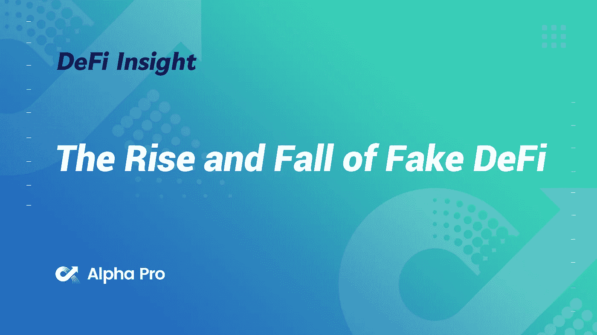
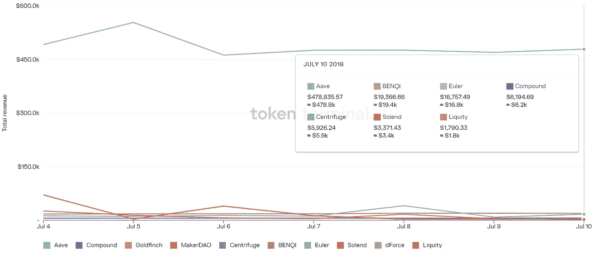

# DeFi Insight |假 DeFi 的兴衰

> 原文：<https://medium.com/coinmonks/defi-insight-the-rise-and-fall-of-fake-defi-9b6e843523a6?source=collection_archive---------24----------------------->

2022 年 7 月 11 日

*今日 DeFi 数据&由 DeFi Insight 为您带来的新闻*

> *"* 随着 Voyager、Celsius 和其他公司的失败，我们决定为这些使用分散资产但完全集中(且管理不善)的公司取一个新名词！)自己。这些公司在他们的营销中使用 DeFi，但它是一个 fugazi。这些假的 DeFi 或“FeFi”公司由于其巨大的规模而给整个行业带来负面影响。
> 
> 真正的 DeFi 没有失败。
> 
> 为什么成熟和完善的 DeFi 在最近的波动中零损失？
> 
> 让我们开始吃吧。*“@*[*来源*](https://defieducation.substack.com/p/the-rise-and-fall-of-fefi-fake-defi?utm_source=%2Finbox&utm_medium=reader2)

# 最新消息

## 外汇

币安从西班牙获得提供密码交换、保管服务的许可

**,**[open leverage](https://www.bsc.news/post/openleverage-teams-up-with-pancakeswap-for-ole-giveaway)与 PancakeSwap 合作，获得$OLE 赠品

OKX 支付 2000 多万美元赞助曼城本赛季的训练装备

**2022 年十大[密码交易和交换移动应用](https://dailycoin.com/top-10-mobile-applications-for-crypto-trading-and-exchange-in-2022/)**

## **市场**

**24H 价格下跌后，瑞士联邦交易所交易费处于两年低点**

****[美国通胀](https://cointelegraph.com/news/us-inflation-data-will-be-messy-5-things-to-know-in-bitcoin-this-week)数据将会“混乱”——本周关于比特币要知道的 5 件事****

## ****采矿****

******用区块链技术和加密货币重新定义[基于 Gig 的经济](https://cryptodaily.co.uk/2022/07/redefining-the-gig-based-economy-with-blockchain-technology-and-cryptocurrencies)******

******随着矿工们面临加密冬天，比特币开采[价格](https://beincrypto.com/bitcoin-mining-hashrate-drops-new-low-miners-face-crypto-winter/)跌至新低******

## ******政策与法规******

********香港通过[反洗钱法](https://news.bitcoin.com/hong-kong-to-introduce-licensing-for-crypto-platforms-through-aml-law/)引入加密平台许可********

********[三支箭](https://www.coindesk.com/business/2022/07/11/court-grants-three-arrows-creditors-emergency-hearing-as-founders-accused-of-not-cooperating-with-liquidation-proceeding/)由于创始人未能“合作”，债权人获得紧急听证********

******欧盟就加密资产监管市场达成一致******

## ******NFT******

********NFT 协议 [OMNI](https://beincrypto.com/nft-protocol-omni-reentrancy-attack-loses-1300-eth-testing-funds/?utm_source=blockworks-research) 遭受重入攻击，损失 1,300 ETH 测试经费********

******随着机器人声称免费造币，骗子攻击不和，沙特人在 OpenSea 上排名第一******

## ******基金******

********投资基金[通才资本](https://twitter.com/mariogabriele/status/1546151479857250306?s=20&t=UUthfqwCQuCpmHDiSplYTw)在 Polygon 和其他公司的参与下完成了 1225 万美元的融资********

********[老虎环球](https://techcrunch.com/2022/07/10/tiger-global-to-slow-down-startup-investments-for-two-quarters-aims-to-raise-new-fund-later-this-year/)放缓两个季度的创业投资，今年晚些时候着眼新基金********

******答:我们的[对 SEC 的](https://grayscale.com/gbtc-sec-lawsuit-q-and-a/?utm_source=TWITTER&utm_medium=social&utm_term=legal&utm_content=7236073736&utm_campaign=gbtc+denied&linkId=172674990)诉讼******

## ******观点******

********Crypto 正在尝试传统金融的超高速失败，但[会好起来的](https://www.coindesk.com/markets/2022/07/10/crypto-is-trying-out-traditional-finances-failures-in-hyperspeed-but-its-going-to-be-fine/)********

******洛克菲勒国际主席说**比特币将从危机中变得更加强大********

******Kevin O'Leary 警告说重大的加密恐慌事件即将到来——“我不相信我们已经见底了”******

> ******交易新手？尝试[加密交易机器人](/coinmonks/crypto-trading-bot-c2ffce8acb2a)或[复制交易](/coinmonks/top-10-crypto-copy-trading-platforms-for-beginners-d0c37c7d698c)******

# ******数据和分析******

## ******锁定的总价值(TVL)******

******目前全网 DeFi 总锁定量为 754.8 亿美元，24 小时下降 3.29%。******

************

## ******TVL 评出的十大连锁酒店******

************

## ******|最新 TVL 十大项目******

************

## ******|过去 24 小时内 TVL 增长的前 10 个项目******

************

## ******协议收入******

## ******|累计总收入最高的项目(24H)_ 区块链(L1)******

************

## ******|累计总收入最高的项目(24H) _Dapps (L2)******

************

## ******|前 10 大交易所的每日收入******

************

## ******|十大贷款协议的每日收入******

************

# ******深潜******

********[**区块链**](https://research.thetie.io/database-vs-blockchain/) **vs 传统数据库**********

**** [## 区块链 vs 传统数据库 TIE 研究

### 2008 年，中本聪设想了第一个分布式公共分类账(数据库)。这个系统是建立在…

研究. thetie.io](https://research.thetie.io/database-vs-blockchain/) 

**[**$戴**](https://tokeninsight.com/en/research/analysts-pick/understanding-dai-let-it-not-be-wrapped-usdc-anymore) **—让它不再被包裹$ USDC****

** [## 理解$戴——让它不要再被包装了$USDC

### 我们都知道马克道& $戴。人们过度抵押他们的加密资产，并在…

tokeninsight.com](https://tokeninsight.com/en/research/analysts-pick/understanding-dai-let-it-not-be-wrapped-usdc-anymore) 

**[**我拿着什么**](https://crypto.nateliason.com/p/what-im-holding-through-the-bear) **度过熊市****

** [## 我在熊市中持有的股票

### 欢迎来到“嘘，乐趣暂时结束了”系列的第三部分。第一部分是“我犯的错误”，第二部分是“…

crypto.nateliason.com](https://crypto.nateliason.com/p/what-im-holding-through-the-bear)** 

# **报告**

****[**数字资产管理**](https://data.cryptocompare.com/reports/digital-asset-management-review-june-2022) **t 回顾—2022 年 6 月** _cryptocompare****

> ****6 月，比特币和以太坊的价格分别下跌了 34.8%和 38.6%(数据截至 27 日)，这一大幅下跌是由围绕加密贷款公司可能破产的不确定性推动的，其中包括加密原生基金三箭资本(Three Arrows Capital)。****

******[**NFTs 如何改变新闻摄影的未来** _messari](https://messari.io/article/how-nfts-could-change-the-future-of-photojournalism)******

******[**航海家数码**](https://www.theblockresearch.com/voyager-digital-a-breakdown-of-their-chapter-11-filing-156594) **:细分他们第十一章备案** _theblockresearch******

******[**比特币**](https://coinshares.com/research/bitcoin-is-decentralised) **是去中心化的** _coinshares******

******关于:******

****DeFi Insight 是顶级 DeFi 和加密新闻和更新的来源。****

******https://twitter.com/AlphaPro_io 推特:******

********❤RSS:**[**https://medium.com/feed/@alphapro.project**](https://medium.com/feed/@alphapro.project)******

****提供的信息应被视为发展新闻，而不是投资建议。**********