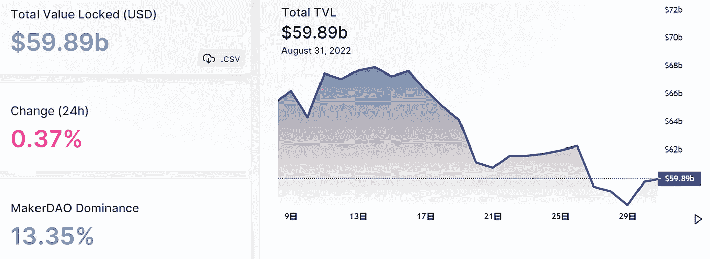
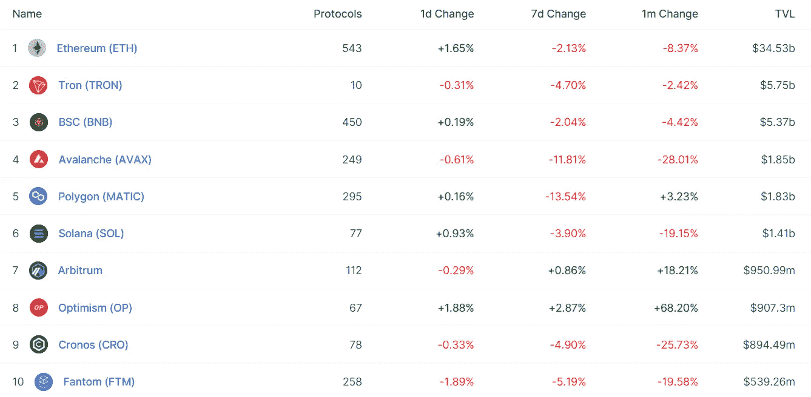
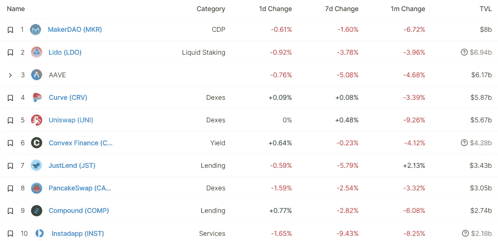
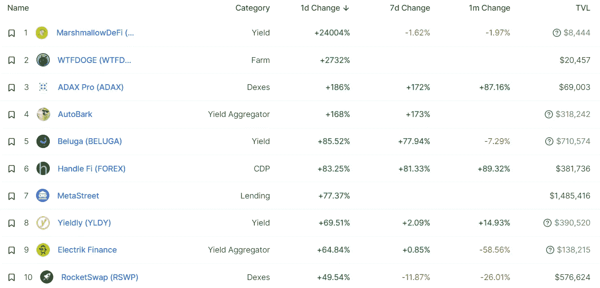

# DeFi Insight |获得乐观的五大方法

> 原文：<https://medium.com/coinmonks/defi-insight-top-5-ways-to-earn-op-on-optimism-e50e33c4420e?source=collection_archive---------28----------------------->

2022 年 8 月 31 日

*今日 DeFi 数据&由 DeFi Insight 为您带来的新闻*

> *乐观是以太坊上占主导地位的 2s 层之一。*
> 
> *自 8 月初以来，乐观情绪锁定的总价值(TVL)已经上涨了约 26%。*
> 
> *这是因为有大量的市场机会，允许用户通过使用一系列不同的应用程序来获得 OP-该网络最近推出的治理令牌。*
> 
> **想加入行动吗？**
> 
> *这里有一个指南，列出了 5 个值得关注的最佳机会。*“@*[*来源*](https://newsletter.banklesshq.com/p/optimism-token-collective-bridge-airdrop)*

# *最新消息*

## *空投*

*9 月 2 日星期五，[数码学院](https://twitter.com/DigiDaigaku/status/1564827175135498240)的持有者将获得一次免费空投！*

## *第二层*

***[多边形有助于](https://blog.polygon.technology/polygon-avails-ability-to-scale-where-we-stand-today/?utm_medium=Tweet)的缩放能力:我们今天所处的位置***

*****[ZK sync 2.0 更新](https://blog.matter-labs.io/zksync-2-0-update-dynamic-fees-milestone-completed-c6620a3d2618):动态费用里程碑完成*****

## *****市场*****

*****加密崩溃使得劳力士和百达翡丽充斥市场*****

## *****空投*****

*******[OP 令牌](https://pikaprotocol.medium.com/op-token-distribution-for-pika-bb8a0fb6075e)分配给鼠兔*******

## *******提议*******

*********/**[HIP 70](https://github.com/helium/HIP/blob/main/0070-scaling-helium.md):缩放氦网络*******

## *****采矿*****

*******最大的以太矿池[以太矿](https://cointelegraph.com/news/largest-ether-mining-pool-ethermine-opens-new-eth-staking-service)开通新的以太打桩服务*******

## *******政策与法规*******

*******巴拉圭总统否决了加密行业监管提案*******

## *******NFT*******

*********[RTFKT](https://twitter.com/RTFKT/status/1564333647016206347):Minting 将于本周三上线*********

*********[微型乳房](/@chelsea.boylan/microbuddies-integrates-chainlink-vrf-to-help-randomly-assign-traits-to-nfts-3f2738dc1b58)整合了 VRF 链，帮助随机分配非功能性乳房的特征*********

*********海港[上的](https://opensea.io/blog/announcements/polygon-on-seaport/)**多边形*******

## *****基金*****

*******[PROOF](https://docs.proof.xyz/future/press)宣布获得 5000 万美元的首轮融资，公布了其首款产品的新细节，并分享了扩展 PROOF 生态系统和社区的宏伟计划*******

*********[Luabase](https://www.theblock.co/post/166528/luabase-raises-4-5-million-to-make-blockchain-data-easier-cheaper)筹集了 450 万美元用于大规模获取可靠的 web3 数据*********

*********炼金术支持的区块链公司[贡献实验室](https://www.coindesk.com/business/2022/08/30/alchemy-backed-blockchain-company-contribution-labs-raising-3m-in-equity-sale/)通过出售股权筹集 300 万美元*********

*******由主要做市商支持的前高盛银行家的加密创业公司*******

# *******数据和分析*******

## *******锁定的总价值(TVL)*******

*******目前全网 DeFi 总锁定量为 598.9 亿美元，24 小时增长 0.37%。*******

**************

## *******TVL 评出的十大连锁酒店*******

**************

## *******|最新 TVL 十大项目*******

**************

## *******|过去 24 小时内 TVL 增长的前 10 个项目*******

**************

## *******协议收入*******

## *******|累计总收入最高的项目(24H)_ 区块链(L1)*******

## *******|累计总收入最高的项目(24H) _Dapps (L2)*******

# *******深潜*******

*********[**DApp 建筑**](https://mirror.xyz/msfew.eth/nA0_f-ef_dN1tE0DACDi6TLN9EM4hJn27H7SHYKX0qU)*********

***** [## 加密的原生 DApp 架构

### 当我们开发一个面向现代消费者的应用程序时，无论是 Web 应用程序、移动应用程序还是桌面应用程序，我们都需要……

镜像. xyz](https://mirror.xyz/msfew.eth/nA0_f-ef_dN1tE0DACDi6TLN9EM4hJn27H7SHYKX0qU) 

**[**数码学院**](https://www.theblockresearch.com/the-meteoric-rise-of-digidaigaku-166499) 的异军突起**

** [## 数码学院的迅速崛起

### 2022 年 8 月 30 日，美国东部时间下午 2 点 08 分，数码百科突然出现，引起了 NFT 交易员的注意…

www.theblockresearch.com](https://www.theblockresearch.com/the-meteoric-rise-of-digidaigaku-166499) 

**了解**[**Tornado Cash**](https://blog.chainalysis.com/reports/tornado-cash-sanctions-challenges/)**、其制裁影响以及关键合规问题**

 [## 了解 Tornado Cash、其制裁影响和主要合规问题-chain analysis

### 8 月 8 日，广受欢迎的以太坊智能合约混合器 Tornado Cash 受到美国财政部…

blog.chainalysis.com](https://blog.chainalysis.com/reports/tornado-cash-sanctions-challenges/) 

**如何看待** [**代币价格、排放量和流动性**](https://defieducation.substack.com/p/how-to-think-about-token-prices-emissions?utm_source=%2Finbox&utm_medium=reader2)

 [## 如何看待代币价格、排放和流动性

### 欢迎头像！今天，我们揭开一些你可能在加密中听过的常见术语的神秘面纱，并给出一些简单的提示…

defieducation.substack.com](https://defieducation.substack.com/p/how-to-think-about-token-prices-emissions?utm_source=%2Finbox&utm_medium=reader2) 

# 报告

**从龙卷风现金制裁到以太坊—** [**“说不”到区块链层面的审查**](https://tokeninsight.com/en/research/market-analysis/from-tornado-cash-sanction-to-ethereum-say-no-to-censorship-at-the-blockchain-level)**_ token insight**

> **8 月初，美国财政部 OFAC(外国资产控制办公室)将 Tornado Cash 列入制裁名单，指控 DApp 帮助洗钱数十亿美元。作为一项有争议的服务，龙卷风现金成为政府的目标并不奇怪。但是如何制裁 DApp(即在区块链上自动运行的代码)？哪些个人或实体将受到制裁的影响？未来会有更多的 DApps 受到制裁吗？让我们一起来了解一下。**

****[**MEV**](https://research.thetie.io/mev-maximal-extractable-value/)**:取值简介** _thetie****

******可以肯定的说**[**Gnosis**](https://members.delphidigital.io/reports/its-safe-to-say-gnosis-is-a-monopoly)**是垄断** _delphidigital****

******[**web 3 基础设施协议**](https://messari.io/report/how-are-web3-infrastructure-protocols-trying-to-capture-value) **如何捕捉价值？**_ 梅萨里******

******关于:******

****DeFi Insight 是顶级 DeFi 和加密新闻和更新的来源。****

******https://twitter.com/AlphaPro_io 推特:******

********❤RSS:**[**https://medium.com/feed/@alphapro.project**](https://medium.com/feed/@alphapro.project)******

****提供的信息应被视为发展新闻，而不是投资建议。****

> ****交易新手？尝试[加密交易机器人](/coinmonks/crypto-trading-bot-c2ffce8acb2a)或[复制交易](/coinmonks/top-10-crypto-copy-trading-platforms-for-beginners-d0c37c7d698c)***********