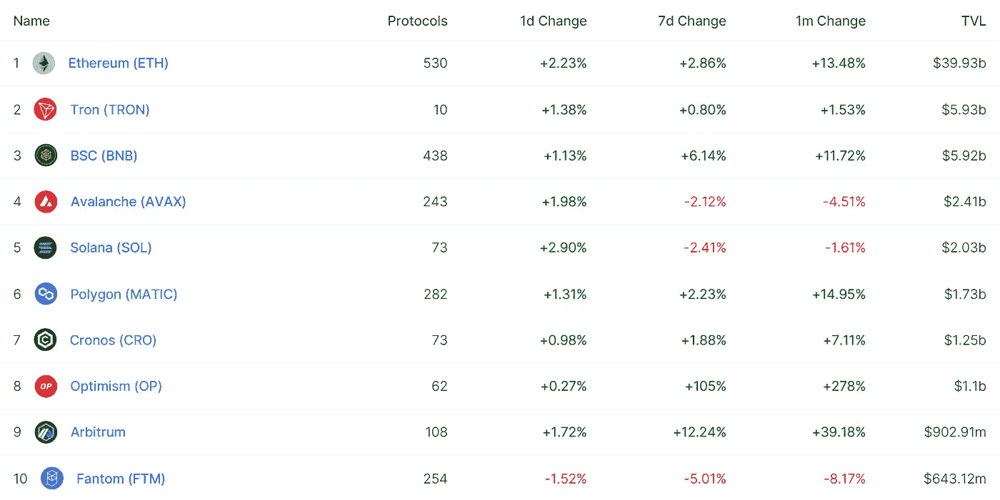
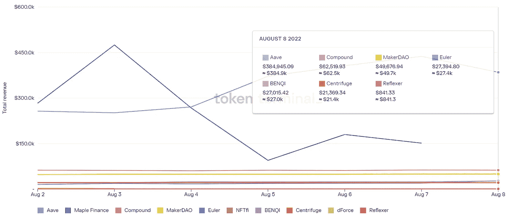

# DeFi Insight |TORNADO CASH 被添加到 OFAC 的 SDN 列表中

> 原文：<https://medium.com/coinmonks/defi-insight-tornado-cash-has-been-added-to-ofacs-sdn-list-de2aa059146c?source=collection_archive---------39----------------------->

2022 年 8 月 9 日

*今日 DeFi 数据&由 DeFi Insight 为您带来的新闻*

> *"* 美国愿意使用通常只对外国势力和极度危险的人使用的最高级别的经济制裁来对付 crypto 中的隐私产品。如果你是美国人，与 [Tornado Cash](https://twitter.com/BowTiedIguana/status/1556683120002314241) 的任何互动都可能是非法的——包括 Gitcoin 捐款、为该项目工作、运行或下载其软件、访问其网站以及存入/退出智能合同。*“@*[*来源*](https://home.treasury.gov/policy-issues/financial-sanctions/recent-actions/20220808)

# 最新消息

## 指标

**[托管能力](/econialabs/custodian-capabilities-and-standalone-swaps-4e42a5dd43dd)和独立互换**

## **打桩**

****p take 的 BNB 液体[铆接解决方案(stkBNB)](https://www.cryptoninjas.net/2022/08/08/pstakes-bnb-liquid-staking-solution-stkbnb-is-now-live/) 现已上线****

## ****稳定币****

******[久吉拉$USK 稳定币投放](/team-kujira/kujira-usk-stablecoin-launch-kickstarting-grown-up-defi-26b4372d7aef) — KICKSTARTING 成人 DEFI******

## ******商业******

******琥珀集团为巴西带来零售交易平台******

## ******空投******

******第三届 [RainbowBoost 忠诚度计划](https://twitter.com/bifrost_finance/status/1556430756716560384)已经开始，提供 5 次免费雨滴空投！******

## ******|警报******

********[斜坡钱包事件](https://solana.com/news/8-2-2022-application-wallet-incident)更新********

## ******采矿******

********[艾瑞斯能源](https://www.coindesk.com/business/2022/08/08/iris-energy-turns-on-41mw-of-bitcoin-mining-machines-ahead-of-schedule/?utm_medium=referral&utm_source=rss&utm_campaign=headlines)提前开启 41 兆瓦比特币矿机********

********[马拉松数字控股](https://ir.marathondh.com/news-events/press-releases/detail/1292/marathon-digital-holdings-reports-second-quarter-2022)报告 2022 年第二季度业绩以及 2022 年 7 月比特币生产和开采运营更新********

## ******政策与法规******

********美国财政部公告: [ECC 参与经济自由政策](https://electriccoin.co/blog/us-treasury-announcement-eccs-engagement-on-policy-for-economic-freedom/)********

********[澳大利亚](https://www.bloomberg.com/news/articles/2022-08-08/australia-to-explore-case-for-central-bank-digital-currency#xj4y7vzkg)探索央行数字货币案例********

********美国财政部[制裁](https://home.treasury.gov/news/press-releases/jy0916)臭名昭著的虚拟货币混合器龙卷风现金********

## ******NFT******

********消费者团体要求史努比·道格、帕丽斯·希尔顿等名人披露 [NFT 关系](https://decrypt.co/107019/consumer-watch-dog-demands-snoop-dogg-tom-brady-paris-hilton-and-other-celebrities-disclose-nft-connections)********

********客串 CEO [在苹果 ID 骗局中失去无聊猿 NFT](https://nftevening.com/cameo-ceo-loses-bored-ape-nft-in-apple-id-scam/)********

## ******基金******

******Airswift 筹集了 200 万美元的种子前期资金******

******MetaverseGo 筹集了 420 万美元，以方便区块链游戏公司的加入******

********[羊绒](https://www.coindesk.com/business/2022/08/08/cashmere-raises-3m-seed-at-30m-valuation-to-build-solana-enterprise-wallet/)以 3000 万美元的估值融资 300 万美元，打造索拉纳企业钱包********

## ******观点******

********摩根大通表示，随着以太坊合并在 2022 年变得可行的预期越来越强烈，加密市场已经“找到了底部”********

# ******数据和分析******

## ******锁定的总价值(TVL)******

******目前全网 DeFi 总锁定量为 691.8 亿美元，24 小时增长 1.59%。******

************

## ******TVL 评出的十大连锁酒店******

************

## ******|最新 TVL 十大项目******

************

## ******|过去 24 小时内 TVL 增长的前 10 个项目******

************

## ******协议收入******

## ******|累计总收入最高的项目(24H)_ 区块链(L1)******

************

## ******|累计总收入最高的项目(24H) _Dapps (L2)******

************

## ******|前 10 大交易所的每日收入******

************

## ******|十大贷款协议的日收入******

************

# ******深潜******

********·大叔·创客:(时间)** [**冲压出比赛**](/@aviv.yaish/uncle-maker-time-stamping-out-the-competition-in-ethereum-d27c1cb62fef) **以太坊********

**** [## 制造者叔叔:(时间)消灭以太坊的竞争

### 主要加密货币遭到攻击的第一个证据

medium.com](/@aviv.yaish/uncle-maker-time-stamping-out-the-competition-in-ethereum-d27c1cb62fef) 

**[**不同类型的 ZK-EVMs**](https://vitalik.eth.limo/general/2022/08/04/zkevm.html)**

** [## 不同类型的 ZK-EVM

### 所有这些项目的核心目标都是一样的:使用 ZK-斯纳克技术来证明…

vitalik.eth.limo](https://vitalik.eth.limo/general/2022/08/04/zkevm.html) 

BGD。技术分析 Aave < > [**以太坊的 PoS 合并**](https://governance.aave.com/t/bgd-technical-analysis-aave-ethereums-pos-merge/9226)

 [## BGD。以太坊 PoS 合并的技术分析

### TL；针对 Aave 社区的灾难恢复技术分析，解释为什么以太坊即将过渡到风险证明(The…

governance.aave.com](https://governance.aave.com/t/bgd-technical-analysis-aave-ethereums-pos-merge/9226) 

**[**押宝**](https://insights.glassnode.com/the-week-onchain-week-32-2022/) **上合并****

** [## 押注于合并

### 随着比特币和以太坊衍生品市场的成熟，可以使用这两种选择建立复杂的交易头寸…

insights.glassnode.com](https://insights.glassnode.com/the-week-onchain-week-32-2022/)** 

# **报告**

****[**L2s**](https://www.coinbase.com/institutional/research-insights/research/monthly-outlook/could-l2s-eat-ethereums-lunch-august-2022)**能吃以太坊的午餐吗？**_ 区块研究****

> ****随着以太坊虚拟机零知识(zkEVM)汇总最早可能在 2H22 投入生产，第 2 层前景正在发生变化。当以太坊专门用于存储交易数据时，L2s 成为承载大部分经济活动的应用层是可行的。尽管如此，如果没有 L2s，以太坊可能无法与 L1 竞争，从长远来看，随着整体用户活动的增加，以太坊的收入也可能增加。****

******[**链上**](https://messari.io/report/on-chain-privacy) **隐私** _messari******

******一看** [**抵押不足**](https://www.theblockresearch.com/a-look-at-under-collateralized-lending-protocols-160217) **借贷协议** _theblockresearch****

******关于:******

****DeFi Insight 是顶级 DeFi 和加密新闻和更新的来源。****

******https://twitter.com/AlphaPro_io 推特:******

********❤RSS:**[**https://medium.com/feed/@alphapro.project**](https://medium.com/feed/@alphapro.project)******

****提供的信息应被视为发展新闻，而不是投资建议。****

> ****加入 Coinmonks [电报频道](https://t.me/coincodecap)和 [Youtube 频道](https://www.youtube.com/c/coinmonks/videos)了解加密交易和投资****

# ****另外，阅读****

*   ****[分散交易所](https://coincodecap.com/what-are-decentralized-exchanges) | [比特 FIP](https://coincodecap.com/bitbns-fip)****
*   ****[用信用卡购买密码的 10 个最佳地点](https://coincodecap.com/buy-crypto-with-credit-card)****
*   ****[加拿大最佳加密交易机器人](https://coincodecap.com/5-best-crypto-trading-bots-in-canada) | [Bybit vs 币安](https://coincodecap.com/bybit-binance-moonxbt)****
*   ****[阿联酋 5 大最佳加密交易所](https://coincodecap.com/best-crypto-exchanges-in-uae) | [SimpleSwap 评论](https://coincodecap.com/simpleswap-review)****
*   ****购买 Dogecoin 的 7 种最佳方式 | [ZebPay 评论](https://coincodecap.com/zebpay-review)**********