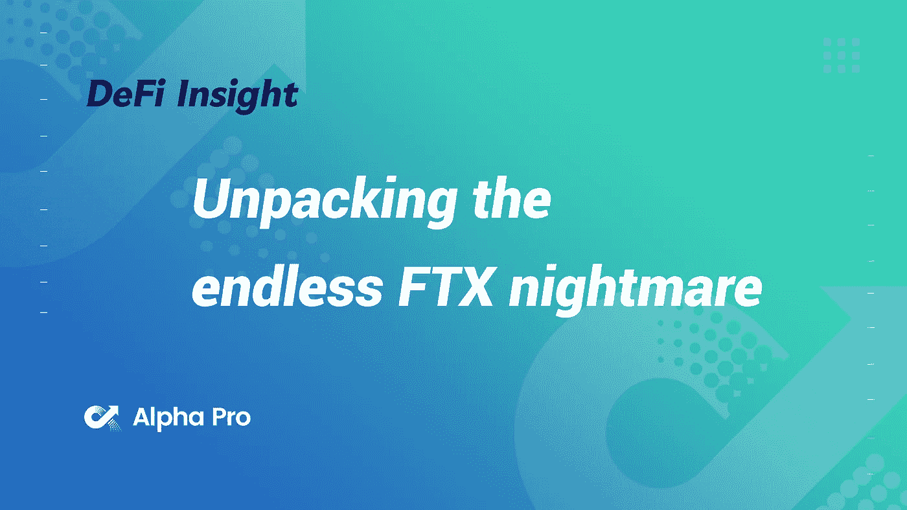
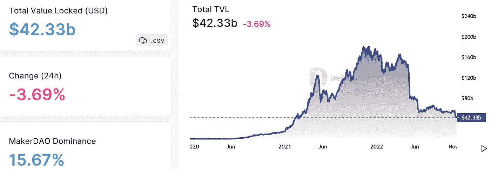
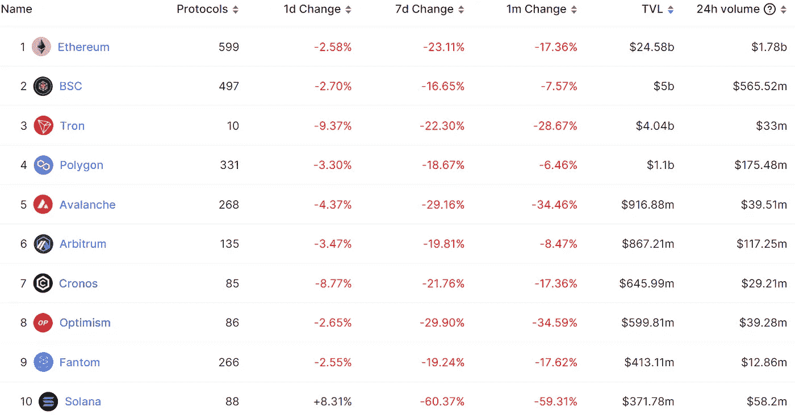
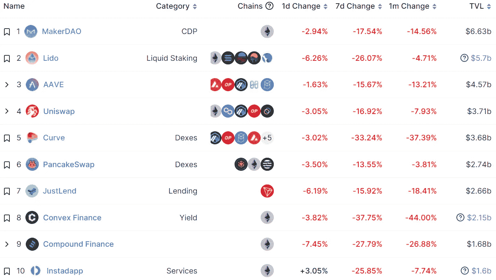
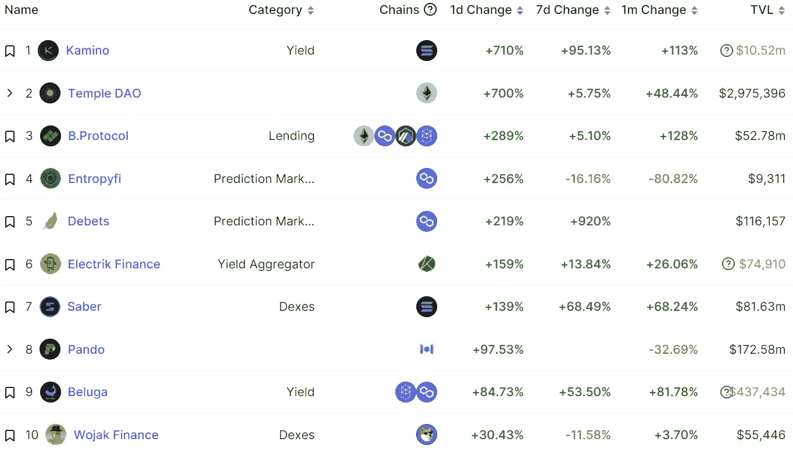
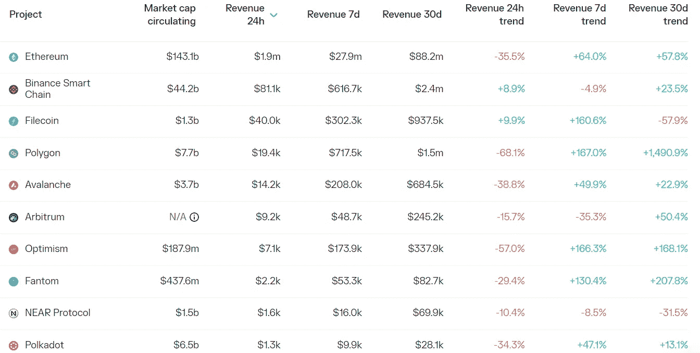
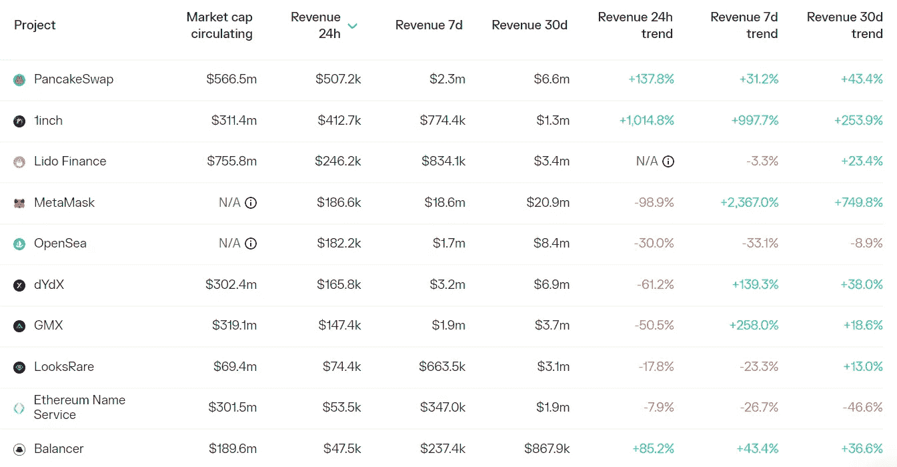

# DeFi Insight |解开无尽的 FTX 噩梦

> 原文：<https://medium.com/coinmonks/defi-insight-unpacking-the-endless-ftx-nightmare-a10e4ffede0a?source=collection_archive---------26----------------------->

2022 年 11 月 14 日

*今日 DeFi 数据&由 DeFi Insight 为您带来的新闻*

> *"* 如果你根本没有关注 FTX 周围的事件，我在[回顾了上周三 FTX 帝国令人震惊的崩溃](https://newsletter.banklesshq.com/p/the-shocking-collapse-of-the-ftx)中关于混乱是如何发生的详细报道。但是加密以音速前进，本周已经达到了星球大战级别的光速，所以自那以后有了大量的更新。*“@*[*来源*](https://newsletter.banklesshq.com/p/unpacking-the-endless-ftx-nightmare?utm_source=%2Finbox&utm_medium=reader2)

# 最新消息

## 德克斯/CEX/AMM

CZ 表示，**币安正在形成一个产业[回收基金](https://twitter.com/cz_binance/status/1592044496174612482)**

****,**CZ:币安将尝试禁用 Skyrex 使用的所有 [API 密钥](https://twitter.com/cz_binance/status/1591995893158494209)**

****[FTX 的资产负债表](https://www.bloomberg.com/news/articles/2022-11-13/ftx-s-balance-sheet-hack-paint-dim-picture-for-user-recovery#xj4y7vzkg)，黑客为用户恢复描绘暗淡画面****

******[**FTX 的**](https://www.bloomberg.com/news/articles/2022-11-13/ftx-falls-into-bankruptcy-so-fast-court-papers-get-left-behind#xj4y7vzkg)**自由落体式破产案说明为什么卷宗是空的********

******Crypto.com 首席执行官:对 FTX 的风险敞口低于 1000 万美元******

********Chiliz 创始人:[3800 万 CHZ](https://twitter.com/alex_dreyfus/status/1591717392228532229?s=20&t=I2u71sxygKY3054SdT3ZDQ) 已分配给 FTX 个人用户进行补偿********

******FTX 的新任首席执行官称其资产被“未经授权访问”,并正在配合执法部门的工作******

********FTX 崩溃被[巴哈马](https://www.reuters.com/technology/ftx-collapse-being-scrutinized-by-bahamas-investigators-2022-11-13/)当局严查********

********索拉纳流动性枢纽[血清](https://www.theblock.co/post/186499/solana-liquidity-hub-serum-to-be-forked-after-possible-compromise-in-ftx-hack?utm_source=twitter&utm_medium=social)在 FTX 黑客可能妥协后分叉********

******大投资者放弃了成为主流的加密市场******

********[范式](https://www.theblock.co/post/186449/paradigm-marks-down-ftx-investment-to-zero-sources)将 FTX 投资降为零来源********

## ******第二层******

********[zkSync](https://twitter.com/zksync/status/1591076827547590657?s=20&t=F1baJGFqP9knMsw0urCTZg)宣布 ETH Lisbon Hackathon 获奖项目********

## ******稳定币******

********数据: [USDT](https://coinmarketcap.com/currencies/tether/) 发行量在过去 4 天下降了约 30 亿美元********

## ******ENS******

******独立地址总数超过 60 万个******

## ******NFT******

******FTX 的内爆正在摧毁索拉纳·NFT 的生态系统******

# ******数据和分析******

## ******锁定的总价值(TVL)******

******目前全网 DeFi 总锁定量为 423.3 亿美元，24 小时下降 3.69%。******

************

## ******TVL 评出的十大连锁酒店******

************

## ******|最新 TVL 十大项目******

************

## ******|过去 24 小时内 TVL 增长的前 10 个项目******

************

## ******协议收入******

## ******|累计总收入最高的项目(24H)_ 区块链(L1)******

************

## ******|累计总收入最高的项目(24H) _Dapps (L2)******

************

# ******深潜******

********[FTX 倒台的余波](https://members.delphidigital.io/reports/the-aftermath-of-ftxs-downfall)********

****** [## FTX 垮台的后果-德尔福数码

### 在……期间，作者没有购买或出售作者拥有重要非公开信息的任何代币

members.delphidigital.io](https://members.delphidigital.io/reports/the-aftermath-of-ftxs-downfall) 

**分析 FTX 的** [**资产负债表**](https://www.theblockresearch.com/analysis-of-ftxs-balance-sheet-186404)

 [## FTX 资产负债表分析

### 综上所述，流动资产仅占 FTX 90 亿美元负债的 10%，这意味着前首席执行官山姆…

www.theblockresearch.com](https://www.theblockresearch.com/analysis-of-ftxs-balance-sheet-186404) 

**[**阿拉米达与 FTX**](https://www.theblockresearch.com/analysis-of-alameda-ftx-chapter-11-bankruptcy-filing-185945) **第十一章申请破产****

** [## 阿拉米达和 FTX 第 11 章破产申请分析

### 美国东部时间 2022 年 11 月 11 日上午 11:39 快速获取 2022 年 11 月 11 日阿拉米达申请第 11 章破产保护阿拉米达…

www.theblockresearch.com](https://www.theblockresearch.com/analysis-of-alameda-ftx-chapter-11-bankruptcy-filing-185945) 

**绘制阿拉米达研究&** [**FTX 风险投资组合**](https://www.theblockresearch.com/mapping-out-alameda-research-ftx-ventures-portfolio-185597)

 [## 规划阿拉米达研究和 FTX 风险投资公司的投资组合

### Alameda Research 成立于 2017 年，是最大的专注于加密的做市和交易公司之一，声称…

www.theblockresearch.com](https://www.theblockresearch.com/mapping-out-alameda-research-ftx-ventures-portfolio-185597) 

**信任危机——一元化的** [**交易所**](https://tokeninsight.com/en/research/market-analysis/trust-crisis-how-far-will-the-centralized-exchanges-transparency-go) **透明度会走多远？**

**[**赌场**](https://www.generalist.com/briefing/the-casino-and-the-genie) **和妖怪****

** [## 赌场和妖怪|多面手

### 对归来的隐士来说，这个从昏迷中醒来的人，这个新来的人，在所有的时间里，现在决定去了解…

www.generalist.com](https://www.generalist.com/briefing/the-casino-and-the-genie)** 

# **报告**

****一层一层:** [**坎托**](https://www.theblockresearch.com/layer-by-layer-canto-sees-growth-but-also-centralization-186068) **看到增长也看到集中化** _theblockresearch**

*   **在这个每周一期的系列中，我们将深入探讨第 1 层区块链景观中一些最有趣的数据和发展，从 DeFi 和网桥到网络活动和资金。**
*   **宇宙 IBC 生态系统中的新区块链一直在 2022 年出现，部分原因是宇宙 SDK 和 IBC 功能的持续更新。**
*   **发展最快的 IBC 连锁店之一是以 DeFi 为重点的 Canto 连锁店，最近几个月有大量资本流入。**
*   **与此同时，Canto 的突然增长暴露了引导新生态系统的一些关键挑战，如果不加以解决，基本上集中的管理机构将对网络安全构成长期风险。**

****[**沙盒**](https://dappradar.com/blog/the-sandbox-special-report-understanding-lands-potential) **专题报道:了解土地潜力** _dappradar****

******关于:******

****DeFi Insight 是顶级 DeFi 和加密新闻和更新的来源。****

******https://twitter.com/AlphaPro_io 推特:******

********❤RSS:**[**https://medium.com/feed/@alphapro.project**](https://medium.com/feed/@alphapro.project)******

****提供的信息应被视为发展新闻，而不是投资建议。****

> ****交易新手？尝试[加密交易机器人](/coinmonks/crypto-trading-bot-c2ffce8acb2a)或[复制交易](/coinmonks/top-10-crypto-copy-trading-platforms-for-beginners-d0c37c7d698c)************