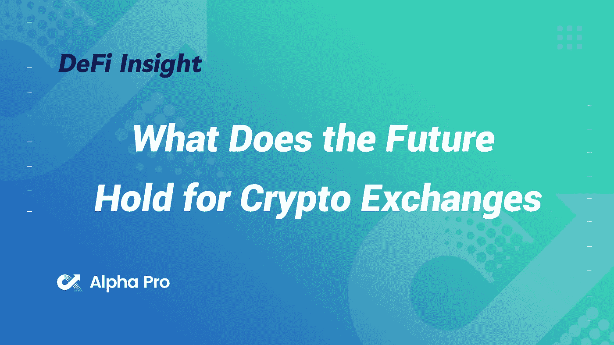
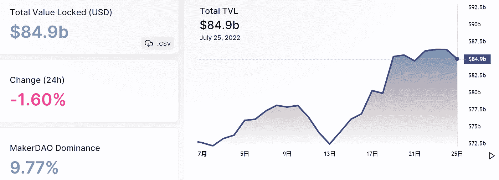
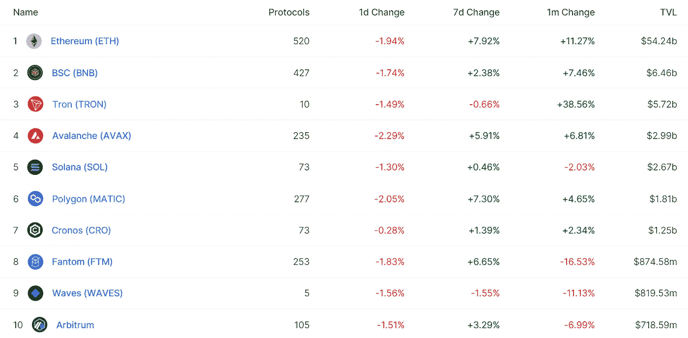
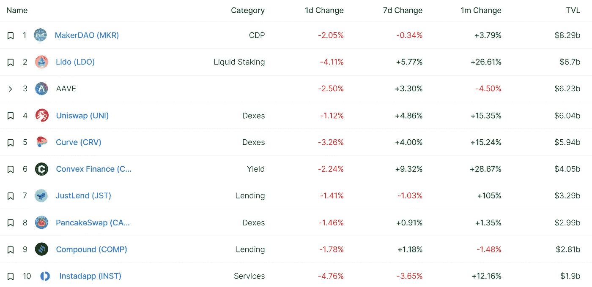
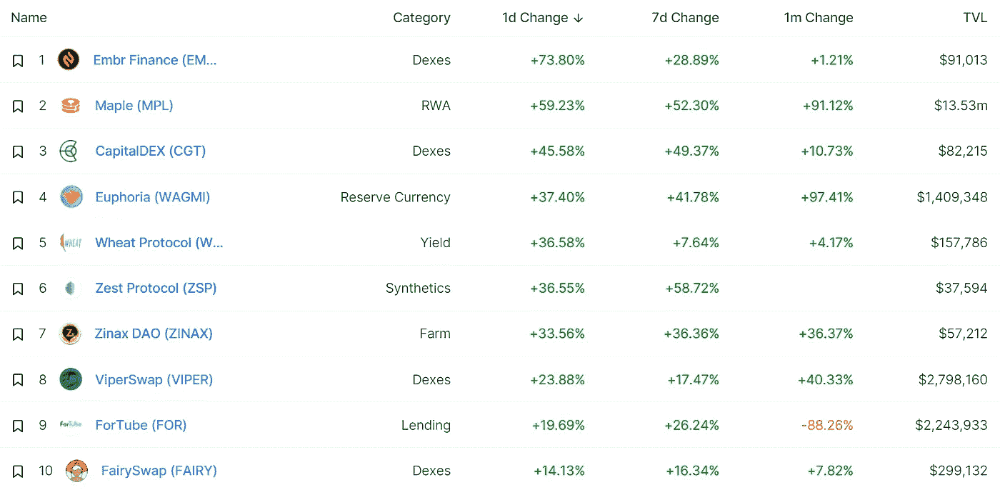
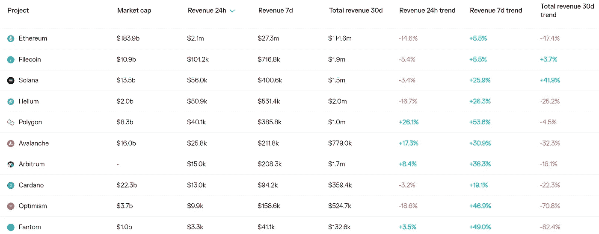
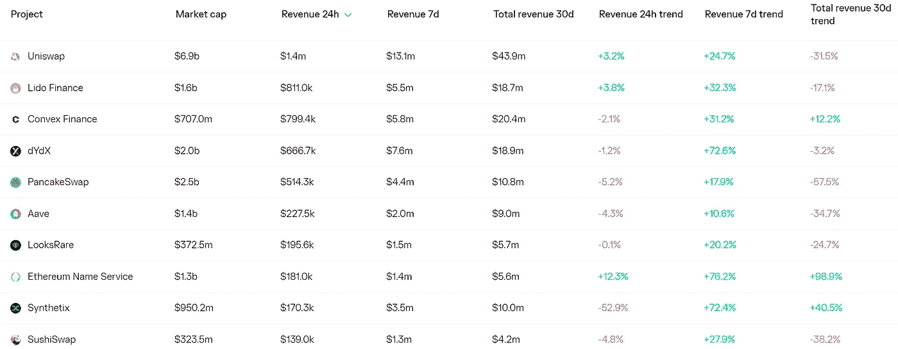
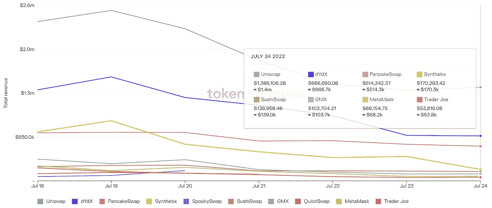
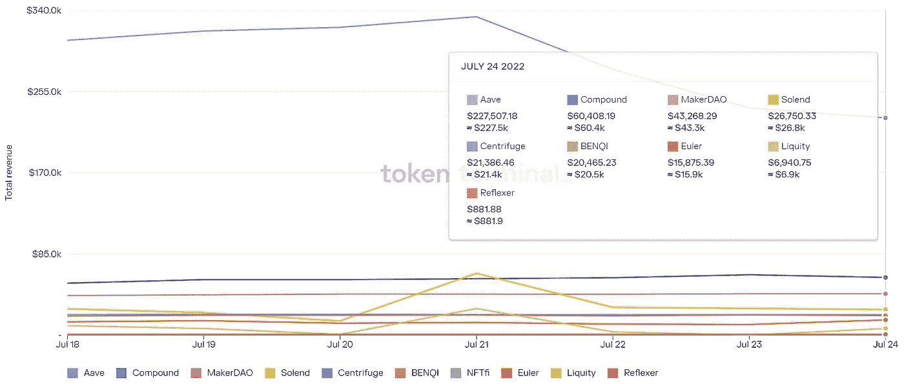

# DeFi Insight |密码交换的未来会怎样

> 原文：<https://medium.com/coinmonks/defi-insight-what-does-the-future-hold-for-crypto-exchanges-79f6063094ef?source=collection_archive---------26----------------------->

2022 年 7 月 25 日

*今日 DeFi 数据&由 DeFi Insight 为您带来的新闻*

> *“*Crypto 在短时间内取得了长足的进步。短短几年间，用例数量激增，一个更深入、更成熟的生态系统出现了。通过这一过程，这项技术已经从一个概念发展成为一个关键的基础设施，支持金融、商业、游戏和社交媒体领域的应用。尽管最近加密市场中断，监管逆风，我们认为区块链技术和加密仍处于早期阶段。BCG、Bitget 和 Foresight Ventures 的这份联合报告提供了一个相对全面的加密市场前景，重点关注加密交易所的未来，因为它们是 Web3 用户的第一门户。*“@*[*来源*](https://github.com/Foresight-Ventures/Research/blob/main/What%20Does%20the%20Future%20Hold%20for%20Crypto%20Exchanges_Eng_Jul%202022.pdf?utm_source=PR&utm_medium=Media+release&utm_campaign=BCG+report)

# 最新消息

## 指标

**[Evmos](https://autofarm-network.medium.com/evmos-is-now-integrated-on-autofarm-8491746a55b6)现在集成在 Autofarm 上！**

## **稳定币**

****,**stable coin 项目需要合作，而不是竞争: [Frax 创始人](https://cointelegraph.com/news/stablecoin-projects-need-collaboration-not-competition-frax-founder)**

## **交叉链**

****、**多链产量聚合器 [KillSwitch.finance](https://twitter.com/MultichainOrg/status/1551492052814544896) 集成了多链交叉链桥**

## **市场**

**推动迷因热潮的散户投资者推动了秘密股票的发展**

****/**[比特币](https://dailycoin.com/is-bitcoin-heading-towards-25000/)是否正在走向 25000 美元？**

## **提议**

****[乐观社区](https://gov.optimism.io/t/draft-gf-phase-1-proposal-curve/3089)发起提案，向 Curve 的 sUSD、sETH 和 sBTC 池分配 100 万美元 OP****

## ****空投****

******庆祝 [cBridge](https://blog.celer.network/2022/07/21/celebrate-cbridges-1-year-anniversary-with-23000-in-rewards/) 成立一周年，奖励 23，000 美元！******

## ******政策与法规******

********非洲[地区央行行长](https://news.bitcoin.com/head-of-african-regional-central-bank-calls-for-creation-of-digital-currency/)呼吁创造数字货币********

******加州推翻了对政治秘密捐款的禁令******

## ******NFT******

********[宇迦实验室](https://decrypt.co/105871/yuga-labs-threatened-with-possible-class-action-lawsuit)受到可能的集体诉讼威胁********

********拉脱维亚 [NFT 艺人](https://beincrypto.com/latvian-nft-artist-8-7-million-earnings-seized-allegations-money-laundering/)€870 万收入因涉嫌洗钱被查封********

## ******基金******

******巴克莱银行购买价值 20 亿美元的加密公司 Copper 的股份******

********[TNG 数码](https://fintechnews.my/32236/e-wallets-malaysia/tng-digital-raises-rm750-million-from-lazada-and-touch-n-go/)从 Lazada 和 Touch 'n Go 融资 7.5 亿令吉********

## ******观点******

********/**Crypto 还在乎[埃隆马斯克](https://www.coindesk.com/layer2/2022/07/22/does-crypto-still-care-about-elon-musk/)吗？******

******加密市场的痛苦将持续，但仍看好比特币借贷: [Silvergate](https://forkast.news/headlines/market-pain-go-on-bullish-bitcoin-lending/?utm_source=blockworks-research)******

********FTX 的提议是一个“伪装成白衣骑士营救的低价竞标”——[航海家号](https://cryptonews.com/news/ftx-proposal-is-a-low-ball-bid-dressed-up-as-a-white-knight-rescue-voyager.htm)********

# ******数据和分析******

## ******锁定的总价值(TVL)******

******目前全网 DeFi 总锁定量为 849 亿美元，24 小时下降 1.60%。******

************

## ******TVL 评出的十大连锁酒店******

************

## ******|最新 TVL 十大项目******

************

## ******|过去 24 小时内 TVL 增长的前 10 个项目******

************

## ******协议收入******

## ******|累计总收入最高的项目(24H)_ 区块链(L1)******

************

## ******|累计总收入最高的项目(24H) _Dapps (L2)******

************

## ******|前 10 大交易所的每日收入******

************

## ******|十大贷款协议的日收入******

************

# ******深潜******

********[**真实网络值**](https://research.thetie.io/true-network-value/) **:小说吞吐量指标**********

**** [## 真实网络价值:一种新的吞吐量指标 TIE 研究

### 在本质上，区块链是信任机器。评估信任，更不用说一个连锁店的表现了，不是一个常规…

研究. thetie.io](https://research.thetie.io/true-network-value/) 

**[**DeFi 治理综述**](https://www.theblockresearch.com/defi-governance-roundup-navigating-through-the-current-market-157952) **:导航当前市场****

** [## DeFi 治理综述:在当前市场中导航

### 2022 年 7 月 22 日，美国东部时间中午 12:06 快速获取此 DeFi 治理综述涵盖了平衡器、曲线和框架的最新提案…

www.theblockresearch.com](https://www.theblockresearch.com/defi-governance-roundup-navigating-through-the-current-market-157952) 

**[**三大 zkEVM 公告**](https://messari.io/article/the-big-three-zkevm-announcements-what-you-need-to-know-and-potential-implications) **:您需要知道的内容和潜在影响****

** [## 三大 zkEVM 公告:你需要知道的和潜在的影响

### Polygon、Scroll 和 zkSync 都宣布了它们的 zkEVMs 的构建更新。三种解决方案中的每一种都代表…

梅萨里·io](https://messari.io/article/the-big-three-zkevm-announcements-what-you-need-to-know-and-potential-implications) 

**[**为什么**](https://polynya.mirror.xyz/sA0qPEbQ99HXCEXEi3BW34HXohMpLyDDM1a4AJhCF4E) **以太坊要取消 danksharding****

** [## 4844 完成了

### 在昨天的 EthCC 上，Vitalik 开玩笑说“我们应该取消分片吗？”没有人接受。我举起我的手，然后…

冰间湖](https://polynya.mirror.xyz/sA0qPEbQ99HXCEXEi3BW34HXohMpLyDDM1a4AJhCF4E) 

**终极** [**开发者指南**](https://www.wordcelclub.com/conciselabs.sol/the-ultimate-developer-guide-to-the-solana-web3-stack) **到 Solana Web3 栈**

 [## Solana Web3 堆栈的最终开发人员指南

### 在这篇博客中，我们将谈论索拉纳区块链，以及作为一名开发人员，你如何开始构建你的…

www.wordcelclub.com](https://www.wordcelclub.com/conciselabs.sol/the-ultimate-developer-guide-to-the-solana-web3-stack) 

# 报告

**区块链** [**股权估值**](https://coinshares.com/research/blockchain-equities-valuation) _coinshares

> 全球股市一直受到增长前景黯淡、通胀加剧、贴现率上升和军事冲突的影响。摩根士丹利资本国际世界指数和标准普尔 500 指数今年迄今下跌了约 20%，正如人们所料，科技股和区块链股市跌幅更大。与其他加密相关资产一样，CoinShares 区块链全球股票指数今年迄今也下跌了 43%，而比特币和以太坊分别下跌了 55%和 67%。

**[**稳定币产量**](https://thedefiant.io/intotheblock-stablecoin-yields-reveal-the-inner-workings-of-defi/) **揭示 DeFi**_ defiant 的内部运作**

****[**索拉纳**](https://messari.io/article/state-of-solana-q2-2022)**Q2 2022**_ 梅萨里****

******[**出锅**](https://members.delphidigital.io/reports/out-of-the-frying-pan-not-out-of-the-fire) **，未出锅** _delphidigital******

******关于:******

****DeFi Insight 是顶级 DeFi 和加密新闻和更新的来源。****

******https://twitter.com/AlphaPro_io 推特:******

********❤RSS:**[**https://medium.com/feed/@alphapro.project**](https://medium.com/feed/@alphapro.project)******

****提供的信息应被视为发展新闻，而不是投资建议。****

> ****交易新手？试试[加密交易机器人](/coinmonks/crypto-trading-bot-c2ffce8acb2a)或[复制交易](/coinmonks/top-10-crypto-copy-trading-platforms-for-beginners-d0c37c7d698c)**************