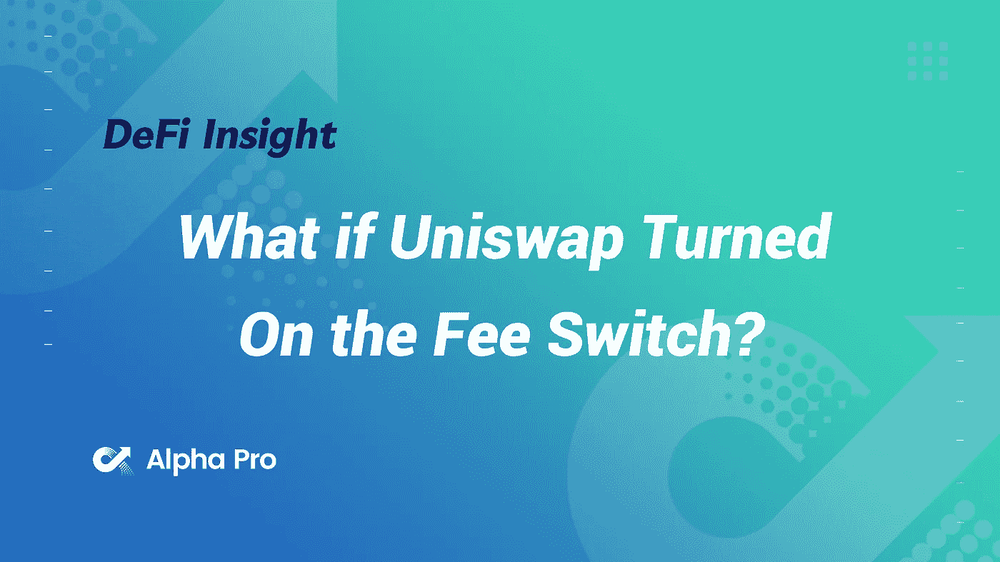
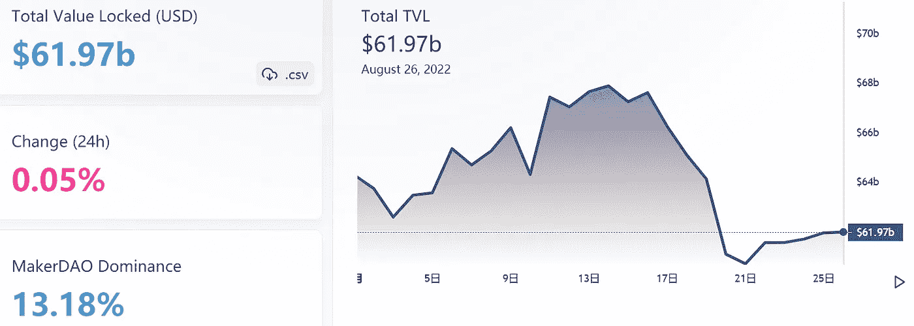
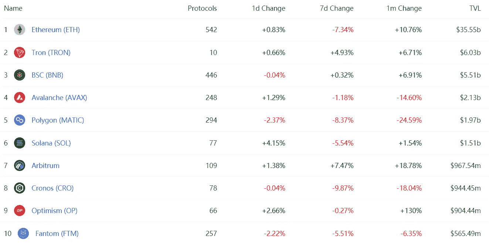
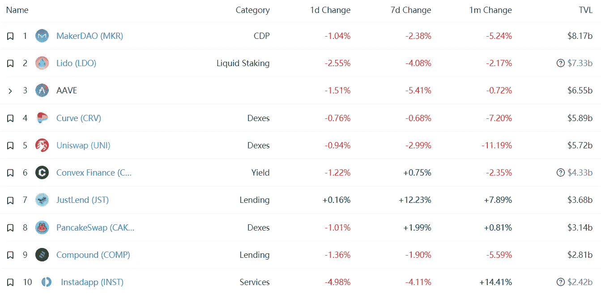
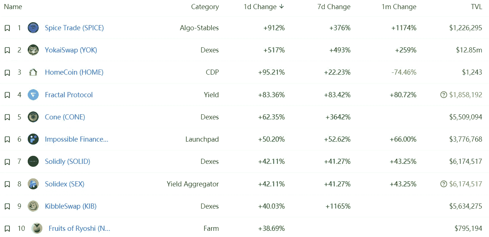
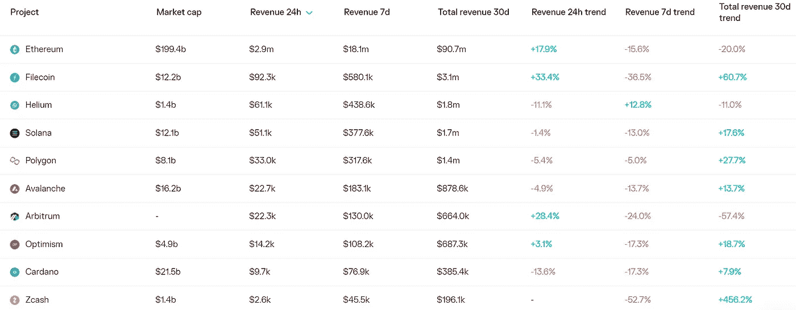
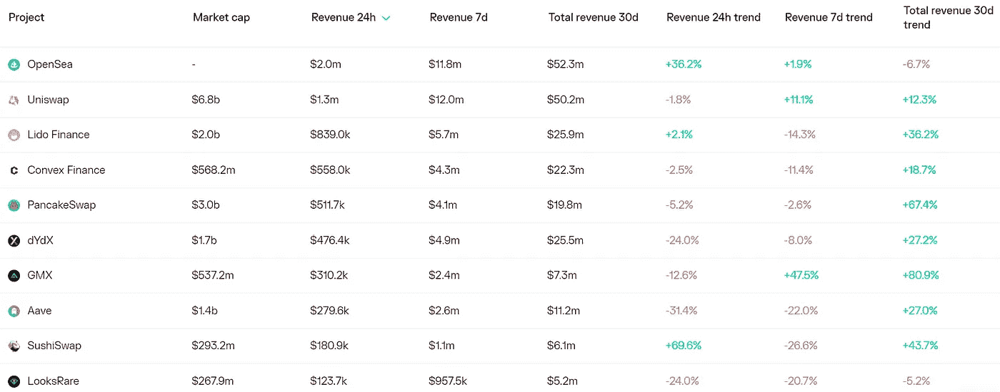
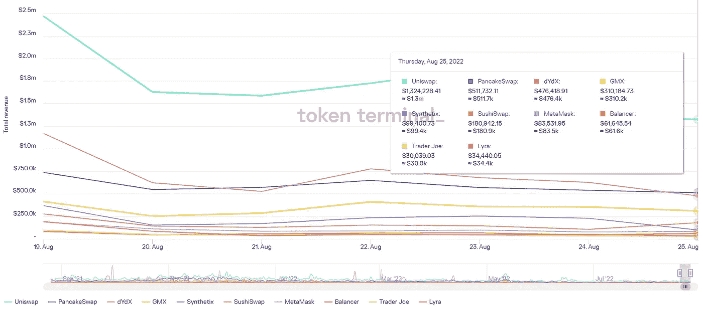
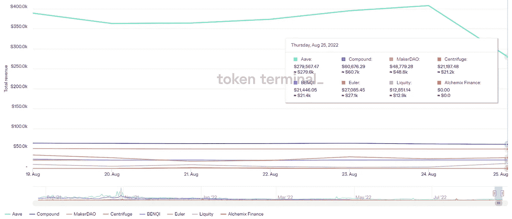

# DeFi Insight |如果 Uniswap 打开了收费开关会怎样？

> 原文：<https://medium.com/coinmonks/defi-insight-what-if-uniswap-turned-on-the-fee-switch-310c8d3bdc98?source=collection_archive---------21----------------------->

2022 年 8 月 26 日

*今日 DeFi 数据&由 DeFi Insight 为您带来的新闻*

> *“*你知道 Uniswap 技术上是不盈利的吗？
> 
> 这怎么可能呢？这是以太坊上收费最高的应用，每天为流动性提供者带来数百万美元的收入。
> 
> 但利润率为 0%，因为 Uniswap 的费用开关尚未打开。*“@*[*来源*](https://newsletter.banklesshq.com/p/what-if-uniswap-turned-on-the-fee)

# 最新消息

## 贷款

**[化合物三](/compound-finance/compound-iii-is-live-a7983dee7e60)带电**

## **外汇**

****[FTX 风险投资](https://www.coindesk.com/business/2022/08/25/ftx-ventures-denies-report-that-its-merging-with-alameda-researchs-crypto-vc-business/)否认与阿拉米达研究公司的加密风险投资业务合并的报道****

****Zipmex 要求与泰国监管机构会面，讨论“恢复计划”****

******[币安](https://thecryptobasic.com/2022/08/26/binance-starts-cardano-node-updates-in-preparation-for-vasil-hard-fork/)随着升级边缘越来越近，开始卡达诺节点更新，为瓦西尔硬分叉做准备******

## ******打桩******

******丽都把赌注押在 L2 身上******

## ******稳定币******

********[随着中微子升级到“稳定协议”上线，USDN](https://cryptoslate.com/usdn-loses-peg-again-as-neutrino-upgrade-to-stabilize-protocol-goes-live/) 再次失去 peg********

## ******链条******

********,**[宣布 MIPs](https://thegraph.com/blog/mips-multi-chain-indexing-incentivized-program) :图的多链激励程序******

## ****支付****

****万事达卡首席执行官表示，信用卡巨头正与币安合作，使顾客能够进行加密支付****

## ****提议****

******[SIP-276](https://sips.synthetix.io/sips/sip-276/):关闭点钞机******

## ******鲸鱼******

********[以太鲸](https://ambcrypto.com/ethereum-whales-reignite-shiba-inu-shib-interest-decoding-details/?utm_source=blockworks-research)重燃柴犬兴趣——解码详情********

## ******采矿******

********受制裁的比特币采矿公司 [BitRiver](https://www.coindesk.com/business/2022/08/25/sanctioned-bitcoin-mining-firm-bitriver-loses-another-client-as-sbi-leaves-sources/) 随着 SBI 的离开又失去了一个客户:来源********

## ******政策与法规******

******新加坡在公司为变革做准备之际，加强了加密质询******

******菲律宾立法者、中央银行、证券交易委员会在参议院听证会上讨论加密法规******

## ******NFT******

********[Snoop Dogg 和 Eminem](https://decrypt.co/108264/snoop-dogg-and-eminem-to-bring-bored-ape-nfts-to-vmas-in-otherside-metaverse-performance) 将无聊的猿 NFTs 带到 VMAs 在“彼岸”元宇宙演出********

## ******基金******

********宣布由 Robot Ventures、Arrington Capital 和 ParaFi 领投的[种子轮](https://mellowprotocol.medium.com/announcement-of-seed-round-led-by-robot-ventures-arrington-capital-and-parafi-latest-updates-17fb47397fed)最新更新********

********、**用 [Gitcoin 赠款](https://a16zcrypto.com/supporting-public-goods-with-gitcoin-grants/)支持公共产品******

******区块链探索者 [SolanaFM](https://www.theblock.co/post/165508/blockchain-explorer-solanafm-raises-4-5-million-plans-to-expand-to-aptos?utm_source=twitter&utm_medium=social) 融资 450 万美元，计划扩展到 Aptos******

********[Animoca Brands](https://www.animocabrands.com/animoca-brands-japan-raises-usd-45-million-from-mufg-and-animoca-brands-to-grow-web3-business)日本从 MUFG 和 animo ca Brands 筹集 4500 万美元发展 Web3 业务********

# ******数据和分析******

## ******锁定的总价值(TVL)******

******目前全网 DeFi 总锁定量为 619.7 亿美元，24 小时增长 0.05%。******

************

## ******TVL 评出的十大连锁酒店******

************

## ******|最新 TVL 十大项目******

************

## ******|过去 24 小时内 TVL 增长的前 10 个项目******

************

## ******协议收入******

## ******|累计总收入最高的项目(24H)_ 区块链(L1)******

************

## ******|累计总收入最高的项目(24H) _Dapps (L2)******

************

## ******|前 10 大交易所的每日收入******

************

## ******|十大贷款协议的日收入******

************

# ******深潜******

********[**资金管理**](https://a16zcrypto.com/treasury-management-guide/) **:低迷时期导航指南**********

**** [## 国库管理:低迷时期导航指南

### 密码市场可能不稳定。在过去的一年里，价格大幅波动，直到最近才从活跃的…

a16zcrypto.com](https://a16zcrypto.com/treasury-management-guide/) 

**战书上的观点** [**合并**](https://coinmarketcap.com/alexandria/article/gauntlet-s-view-on-the-merge)

 [## Gauntlet 对合并的看法

### 备受期待的合并定于 9 月 15 日，将以太坊网络从工作验证(PoW)过渡到…

coinmarketcap.com](https://coinmarketcap.com/alexandria/article/gauntlet-s-view-on-the-merge) 

**[**以太坊**](https://panteracapital.com/blockchain-letter/ethereum-tightening-more-than-fed/) **紧缩有余美联储****

** [## 以太坊收紧超过美联储|潘迪拉

### 美联储还没有收紧太多，美联储还没有真正收紧金融环境。在过去的几年里…

panteracapital.com](https://panteracapital.com/blockchain-letter/ethereum-tightening-more-than-fed/)** 

# **报告**

****[**stable coins**](https://coinshares.com/research/stablecoins-cryptos-killer-app)**—密码杀手 App** _coinshares****

> ****在本报告中，我们探讨了稳定资本的目的、不同类型和风险以及市场的现状。****
> 
> ****稳定币是一种加密货币，与非易失性资产(如美元)挂钩。这些稳定的密码解决了密码领域内在波动风险的问题，并有助于促进更可预测的交易。如下所示，stablecoins 已经变得相当流行。所有稳定资本的总价值从 2021 年 1 月的 280 亿美元增长到 2022 年 8 月的 1540 亿美元，增幅约为 450%。****

******2022 年年中** [**比特币挖矿**](https://www.galaxy.com/research/whitepapers/2022-mid-year-bitcoin-mining-update/) **更新**_ 银河****

******[**的状态密码游戏**](https://www.theblockresearch.com/the-state-of-crypto-gaming-165652) _theblockresearch******

******[**熊的必需品**](https://messari.io/report/the-bear-necessities-7-trends-and-theses-part-1) **: 7 大趋势与论题第一部分** _messari******

******关于:******

****DeFi Insight 是顶级 DeFi 和加密新闻和更新的来源。****

******https://twitter.com/AlphaPro_io 推特:******

********❤RSS:**[**https://medium.com/feed/@alphapro.project**](https://medium.com/feed/@alphapro.project)******

****提供的信息应被视为发展新闻，而不是投资建议。****

> ****交易新手？尝试[加密交易机器人](/coinmonks/crypto-trading-bot-c2ffce8acb2a)或[复制交易](/coinmonks/top-10-crypto-copy-trading-platforms-for-beginners-d0c37c7d698c)********