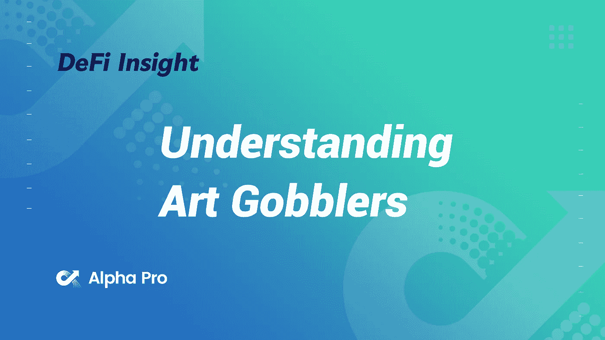
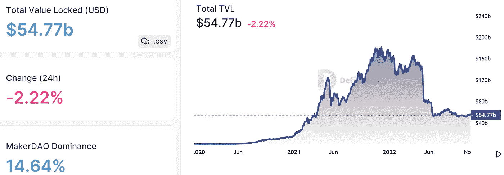
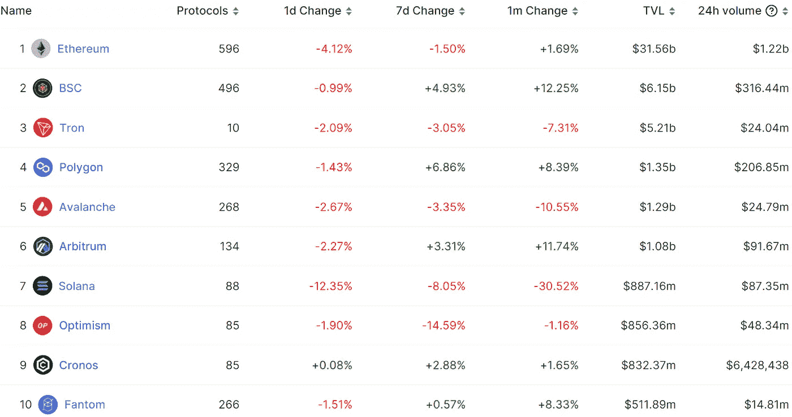
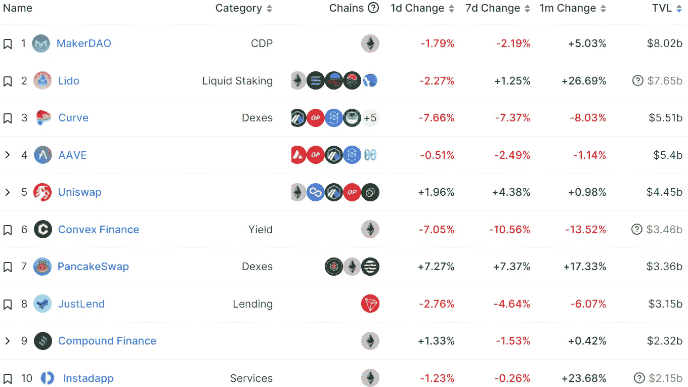
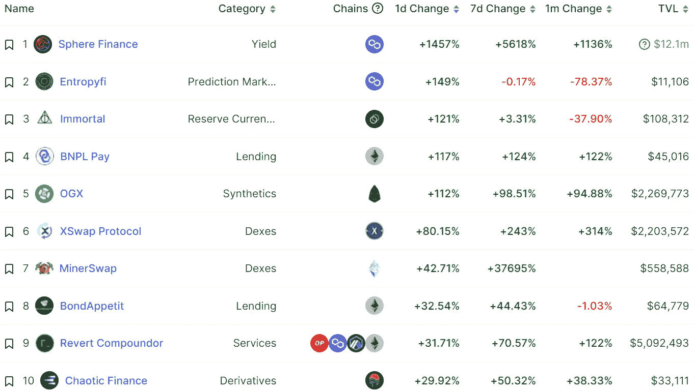
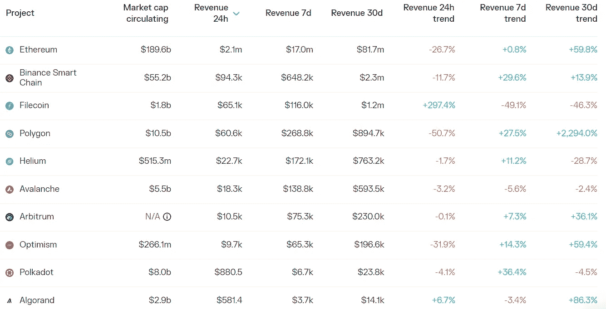

# DeFi Insight |什么是艺术饕餮？什么是$GOO？它能模仿吗？

> 原文：<https://medium.com/coinmonks/defi-insight-what-is-art-gobblers-what-is-goo-is-it-ape-able-999e07c4a1e8?source=collection_archive---------37----------------------->

2022 年 11 月 7 日

*今日 DeFi 数据&由 DeFi Insight 为您带来的新闻*

> *“*艺术饕餮单枪匹马将 NFTs 带出过去几天的熊市。在 10 月 31 日免费造币后不久，Art Gobblers 的底价飙升至接近 15 ETH。铸币厂账上的 2 万美元横财。不用说,“艺术饕餮”到目前为止取得了巨大的成功。但是对于那些旁观者来说，艺术饕餮到底是什么，游戏计划是什么？*“@*[*来源*](https://tokeninsight.com/en/research/analysts-pick/what-is-art-gobblers-what-is-goo-is-it-ape-able)

# 最新消息

## 指数/交易所/AMM

**币安出售剩余的 [FTX Token](https://www.coindesk.com/business/2022/11/06/binance-sells-holdings-of-ftx-token-as-alameda-ceo-defends-firms-financial-condition/) 股份，阿拉米达首席执行官为公司的财务状况辩护**

****南森:7 日交易平台稳定资金大幅流出，币安流入和 FTX 流出均超过 4 亿美元****

****24 小时内价值超过 1 亿美元的密码从 FTX 转移到 Nexo****

****FTX 破产的可能性接近 0%****

******[以太坊网](https://www.binance.com/en/support/announcement/wallet-maintenance-for-ethereum-network-erc-20-2022-11-08-a8c61d9b74ad4385ba27ad54e62d4cca) (ERC-20)钱包维护—2022–11–08******

## ******稳定币******

******2023 年上半年,**,**Circle 将把欧元硬币带给 [Solana](https://www.theblock.co/post/183492/circle-is-bringing-euro-coin-to-solana-in-first-half-of-2023?utm_source=twitter&utm_medium=social)******

## ****贷款/CDP****

******[Aave](https://snapshot.org/#/aave.eth/proposal/bafkreidmj5twyypvk3se7nojlgw44zdcoz3d3szgddx2viug65grf42uce)机构群体支持实施“押记阿托肯”并增加平衡器 BPT 作为抵押品******

## ******NFT******

********OpenSea 推出 [NFT 创造者](https://twitter.com/opensea/status/1589058770646491136)工具强制征收版税********

## ******政策与法规******

********前众议院议长、前司法官员加入[美国政策](https://www.coindesk.com/policy/2022/11/07/ex-house-speaker-former-justice-official-join-us-policy-crew-assembled-by-paradigm/)由 Paradigm 组建的团队********

# ******数据和分析******

## ******锁定的总价值(TVL)******

******目前全网 DeFi 总锁定量为 547.7 亿美元，24 小时下降 2.22%。******

************

## ******TVL 评出的十大连锁酒店******

************

## ******|最新 TVL 十大项目******

************

## ******|过去 24 小时内 TVL 增长的前 10 个项目******

************

## ******协议收入******

## ******|累计总收入最高的项目(24H)_ 区块链(L1)******

************

## ******|累计总收入最高的项目(24H) _Dapps (L2)******

************

# ******深潜******

********无银行** [**代币评级**](https://newsletter.banklesshq.com/p/bankless-token-ratings-november-2022?utm_source=%2Finbox&utm_medium=reader2)**| 2022 年 11 月********

**** [## 无银行代币评级| 2022 年 11 月

### 这是我们推出的一个社区资源，旨在帮助你以极快的速度提升你的开放式金融技能，你可以…

newsletter.banklesshq.com](https://newsletter.banklesshq.com/p/bankless-token-ratings-november-2022?utm_source=%2Finbox&utm_medium=reader2) 

**[**模块化区块链**](https://doseofdefi.substack.com/p/the-market-opportunity-of-modular?utm_source=%2Finbox&utm_medium=reader2) 的市场机会**

** [## 模块化区块链的市场机遇

### 随着合并的完成，以太坊的长期可伸缩性路线图已经确定。有了这个，它就有了…

doseofdefi.substack.com](https://doseofdefi.substack.com/p/the-market-opportunity-of-modular?utm_source=%2Finbox&utm_medium=reader2) 

**insta gram 增加** [**NFT 工具包**](https://metaversal.banklesshq.com/p/instagram-adds-nft-toolkit?utm_source=%2Finbox&utm_medium=reader2) **NFTs +社交媒体=下一件大事？**

 [## Instagram 增加了 NFT 工具包📱

### 亲爱的无银行国家，没多久这种猜测就被证实了，正如本周马克·扎克伯格的元…

metaversal.banklesshq.com](https://metaversal.banklesshq.com/p/instagram-adds-nft-toolkit?utm_source=%2Finbox&utm_medium=reader2) 

**[**利率**](https://www.apricitas.io/p/how-high-will-interest-rates-go?utm_source=%2Finbox&utm_medium=reader2) **会到多高？****

** [## 利率会有多高？

### 通过订阅，你将加入 17，000 多名阅读 Apricitas 周刊的人的行列！否则，喜欢或分享是最好的方式…

www.apricitas.io](https://www.apricitas.io/p/how-high-will-interest-rates-go?utm_source=%2Finbox&utm_medium=reader2)** 

# **报告**

****[**TRON**](https://messari.io/report/state-of-tron-q3-2022?referrer=all-research)**Q3 2022**_ messari 的状态****

> ****TRON 网络活动在 5 月推出 USDD 后达到了一个更新的基础用户群。****
> 
> ****自 5 月份以来，股份和参与股份的总额急剧增加。****
> 
> ****TVL 61%的增长是由三个不同的钱包推动的，它们在各种资产中存放了大约 16 亿美元。****
> 
> ****TRON DAO Reserve 宣布，加密本地做市商 Wintermute 成为其第九个白名单成员，这使其有权维持与 USDD 的挂钩。****
> 
> ****第三季度发布的 GreatVoyage-V4.5.2 升级旨在提高节点同步和事务吞吐量。****
> 
> ****如果目前的活动持续下去，USDD 扩展到整个生态系统，TRON 的资源模型催化通货紧缩可能会通过使用 USDD 得到加强。****

******[**状态**](https://messari.io/report/state-of-near-q3-2022?referrer=all-research)**Q3 2022**_ messari 附近******

******[**比特币基地**](https://www.theblockresearch.com/analysis-of-coinbases-q322-earnings-182935)T22【Q3】22 收益 _theblockresearch******

******快速洞察:** [**Chainlink 的**](https://www.theblockresearch.com/rapid-insights-chainlinks-hybrid-oracle-solution-for-defi-derivatives-182783) **混合 Oracle DeFi 衍生产品解决方案** _theblockresearch****

******[**罗宾汉的**](https://www.theblockresearch.com/analysis-of-robinhoods-q322-earnings-182439)**2012 年第三季度财报分析** _theblockresearch******

******关于:******

****DeFi Insight 是顶级 DeFi 和加密新闻和更新的来源。****

******https://twitter.com/AlphaPro_io**❤****

********❤RSS:**[**https://medium.com/feed/@alphapro.project**](https://medium.com/feed/@alphapro.project)******

****提供的信息应被视为发展新闻，而不是投资建议。****

> ****交易新手？试试[加密交易机器人](/coinmonks/crypto-trading-bot-c2ffce8acb2a)或者[复制交易](/coinmonks/top-10-crypto-copy-trading-platforms-for-beginners-d0c37c7d698c)**********