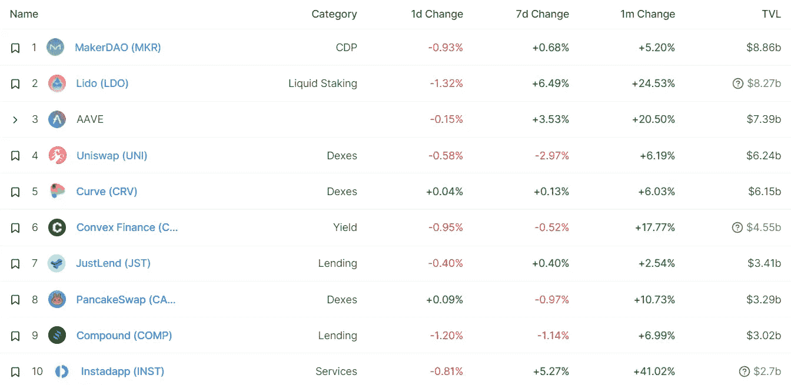
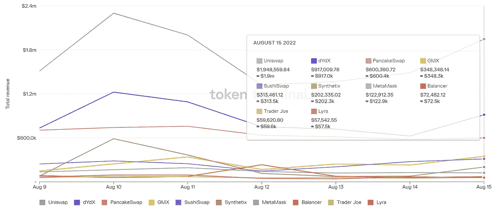

# DeFi Insight |我们在加密市场周期中处于什么位置？利用链上数据将关键市场趋势联系起来

> 原文：<https://medium.com/coinmonks/defi-insight-where-do-we-stand-in-the-crypto-market-cycle-e2cf7cbb259e?source=collection_archive---------19----------------------->

2022 年 8 月 16 日

*今日 DeFi 数据&由 DeFi Insight 为您带来的新闻*

> *"* 在 2022 年第二季度加密市场崩盘后，加密市场在 7 月份出现了部分复苏:在 Q2 下跌 63%后，Bitwise 10 大型股加密指数上涨了 37%。尽管更广泛的市场前景仍然不确定，但我们看到一些抛售压力耗尽的迹象。
> 
> 在本专栏中，我们利用比特币(BTC)和以太坊(ETH)这两种最大的加密资产的链上数据来评估我们在加密市场周期中的位置。具体来说，我们研究三个关键趋势:地理流动，投资者类型定位，市场情绪。
> 
> Crypto 特别适合这种探索，因为所有的交易都用假名记录在公共账本(又名区块链)中。通过将区块链交易数据与额外的数据集相结合，可以推断出关键的市场趋势，而这对于更传统的资产类别来说是不可能的。*“@*[*来源*](https://bitwiseinvestments.com/crypto-market-insights/where-do-we-stand-in-the-crypto-market-cycle)

# 最新消息

## 贷款

加密贷款人在新加坡寻求债权人保护

## 外汇

数字资产金融服务公司关闭其加密交易所

**[1 英寸](https://twitter.com/synthetix_io/status/1559293194017198080)现已与 Synthetix 原子互换完全集成**

## **商业**

**加密托管公司起诉银河数码放弃 12 亿美元的合并协议**

## **稳定币**

**Terra 创始人道权说他“从未”与韩国当局有过联系**

## **第二层**

****[stark ware](https://www.theblock.co/post/163601/starkware-launches-recursive-proofs-in-bid-to-boost-layer-2-scaling?utm_source=rss&utm_medium=rss)推出递归证明，试图提升第二层的伸缩性****

## ****钱包****

******[比特币基地钱包](https://twitter.com/CoinbaseWallet/status/1559254319945621504)集成 Block 浏览器以太扫描******

## ******鲸鱼******

********花费 2.76 亿美元购买以太——参与创世纪 ICO 的[巨型以太巨鲸](https://news.bitcoin.com/spending-276m-in-ether-colossal-ethereum-whale-that-participated-in-the-genesis-ico-transfers-145000-eth/)转让 14.5 万以太********

## ******采矿******

******比特币矿商 Greenidge Generation 宣布暂停德州扩张计划，第二季度净亏损 1.079 亿美元******

## ******政策与法规******

******美联储发布新的密码银行指南******

******T21 密码交易所获得监管机构批准在意大利运营******

********[俄罗斯银行](https://cryptonews.com/news/russian-banks-start-handling-digital-ruble-by-2024.htm)将“在 2024 年前开始处理数字卢布”********

## ******NFT******

********crypto punks[Collection](https://twitter.com/cryptopunksnfts/status/1559284220442320897?s=20&t=IdqPHcHY7d6cD7C8FBPh_g)的知识产权协议现已生效********

## ******基金******

******回归游戏为人工智能游戏和电子竞技筹集了 420 万美元******

# ******数据和分析******

## ******锁定的总价值(TVL)******

******目前全网 DeFi 总锁定量为 851.3 亿美元，24 小时增长 25.44%。******

************

## ******TVL 评出的十大连锁酒店******

************

## ******|最新 TVL 十大项目******

************

## ******|过去 24 小时内 TVL 增长的前 10 个项目******

************

## ******协议收入******

## ******|累计总收入最高的项目(24H)_ 区块链(L1)******

************

## ******|累计总收入最高的项目(24H) _Dapps (L2)******

************

## ******|前 10 大交易所的每日收入******

************

## ******|十大贷款协议的日收入******

************

# ******深潜******

********[**DeFi 平台如何利用 TRM 实验室的数据**](https://www.trmlabs.com/post/how-defi-platforms-are-using-data-from-trm-labs-to-respond-to-tornado-cash-sanctions) **应对龙卷风现金制裁**********

**** [## DeFi 平台如何利用 TRM 实验室的数据应对 Tornado 现金制裁| TRM Insights

### 2022 年 8 月 15 日，美国财政部外国资产控制办公室(OFAC)征收…

www.trmlabs.com](https://www.trmlabs.com/post/how-defi-platforms-are-using-data-from-trm-labs-to-respond-to-tornado-cash-sanctions) 

**[**硬币到期挑战书**](https://insights.glassnode.com/the-week-onchain-week-33-2022/)**

** [## 硬币到期挑战

### 在最近的投降事件中，比特币从较弱的手中转移到那些在低点介入的手中。在这个…

insights.glassnode.com](https://insights.glassnode.com/the-week-onchain-week-33-2022/) 

**龙卷风现金案**中什么是 [**可制裁实体**](https://www.coincenter.org/analysis-what-is-and-what-is-not-a-sanctionable-entity-in-the-tornado-cash-case/)

** [## 分析:在“龙卷风现金案-硬币中心”中，什么是可制裁的实体，什么不是

### 上周一，财政部外国资产控制办公室(OFAC)作出了指定，增加了龙卷风现金…

www.coincenter.org](https://www.coincenter.org/analysis-what-is-and-what-is-not-a-sanctionable-entity-in-the-tornado-cash-case/) 

**[**以太坊**](https://cryptoslate.com/research-ethereum-is-neither-decentralized-nor-deflationary/) **既不分散也不通缩****

** [## 研究:以太坊既不是去中心化的，也不是通缩的

### 以太坊是分散金融生态系统的基础，并自动归类为分散的…

cryptoslate.com](https://cryptoslate.com/research-ethereum-is-neither-decentralized-nor-deflationary/)** 

# **报告**

****[**索拉纳基金会**](https://solana.com/news/validator-health-report-august-2022) **:验证者健康报告
2022 年 8 月**_ 索拉纳****

> ****Solana 是一个公开的、开源的区块链，世界上的任何人都可以在其上进行构建。****
> 
> ****我们在索拉纳基金会的任务是支持权力下放、安全、弹性和采纳索拉纳区块链。我们开展了一系列项目来支持这一使命，从为验证者创建文档到为促进网络分散化的项目发放资助。我们还监控索拉纳网络的健康和弹性。****
> 
> ****到目前为止，我们在评论网络健康状况方面的方法一直专注于让社区轻松监控关键指标的表面数据，如验证器计数或网络中断时间。随着网络不断成熟并扩大其用户群，我们认为向 Solana 生态系统和更广泛的 web3 社区提供更多关于我们如何看待网络健康的背景信息非常重要。****

******展望澳大利亚企业和消费者的加密货币支付** [**未来**](https://crypto.com/research/australia-future-cryptocurrency-transactions/)**_ crypto . com******

********[**7 月区块链资金**](https://www.theblockresearch.com/july-blockchain-funding-recap-162196) **重述** _theblockresearch********

******[**交易者如何定位**](https://messari.io/report/analyst-note-how-traders-are-positioning-for-the-merge) **进行合并**_ 梅萨里******

******[**硝基仲裁油**](https://members.delphidigital.io/reports/arbitrum-nitro-building-on-year-1) **:建立在第 1 年** _delphidigital******

******关于:******

****DeFi Insight 是顶级 DeFi 和加密新闻和更新的来源。****

******https://twitter.com/AlphaPro_io 推特:******

********❤RSS:**[**https://medium.com/feed/@alphapro.project**](https://medium.com/feed/@alphapro.project)******

****提供的信息应被视为发展新闻，而不是投资建议。****

> ****交易新手？尝试[加密交易机器人](/coinmonks/crypto-trading-bot-c2ffce8acb2a)或[复制交易](/coinmonks/top-10-crypto-copy-trading-platforms-for-beginners-d0c37c7d698c)************