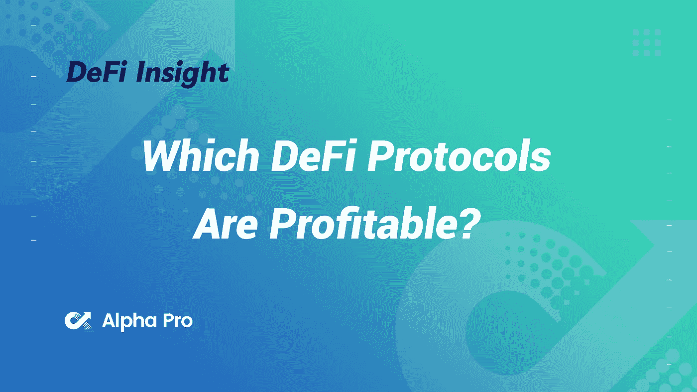
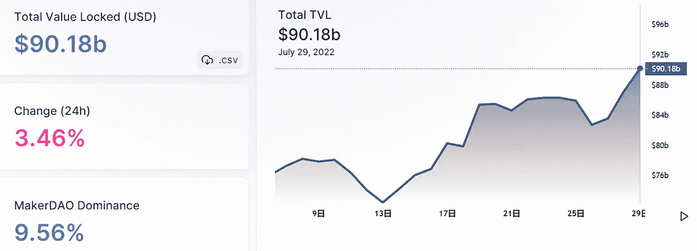
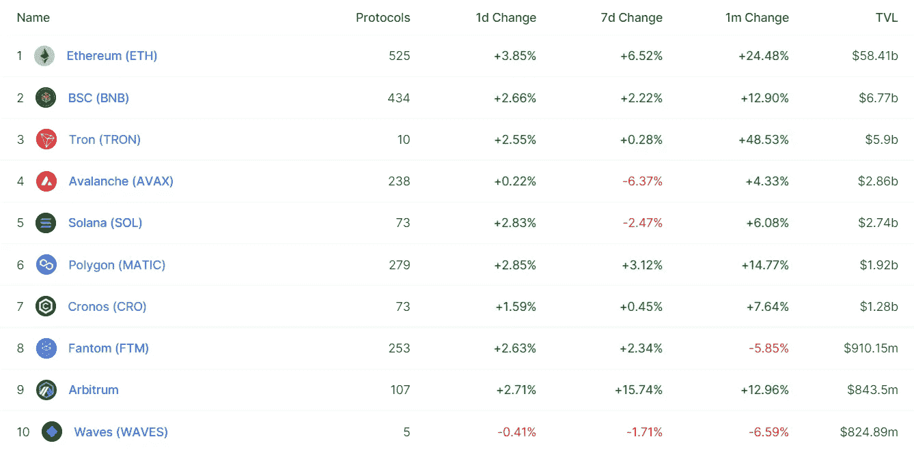
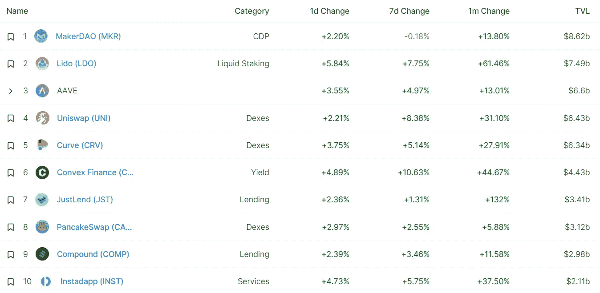
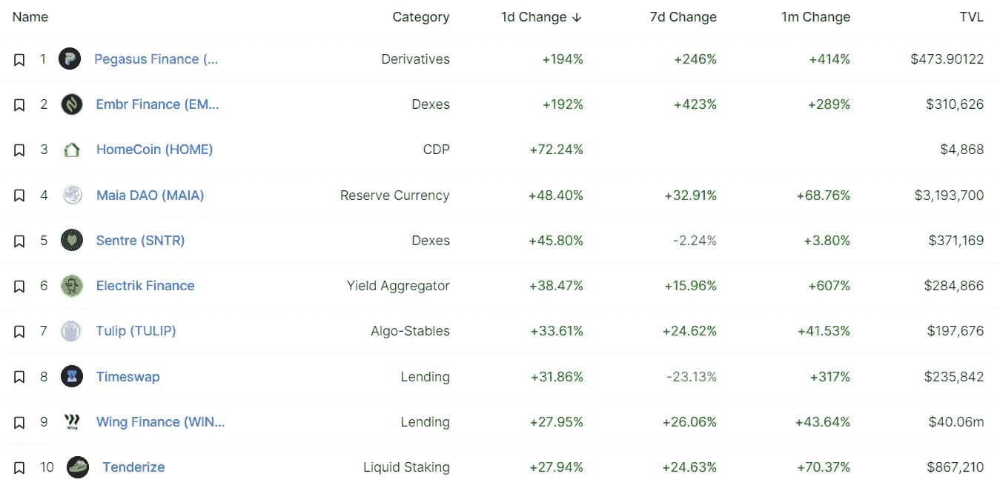
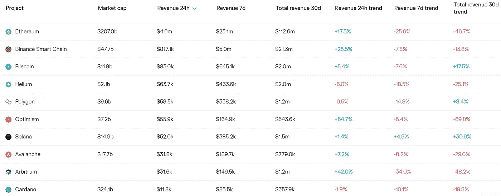
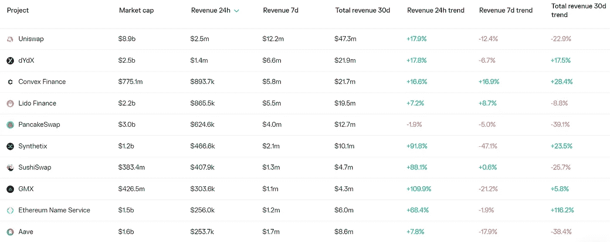
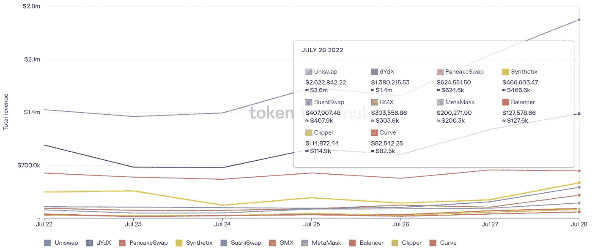
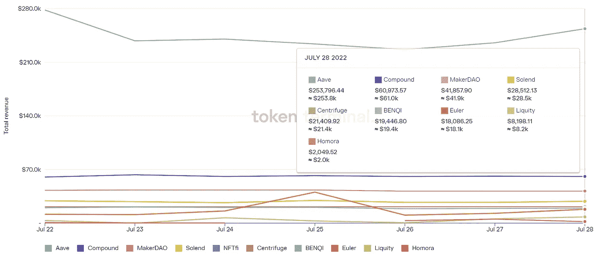

# DeFi Insight |哪些 DeFi 协议有利可图？

> 原文：<https://medium.com/coinmonks/defi-insight-which-defi-protocols-are-profitable-eb01713fa13d?source=collection_archive---------18----------------------->

2022 年 7 月 29 日

*今日 DeFi 数据&由 DeFi Insight 为您带来的新闻*

> *"* 如今，初创公司的标准做法是在最初几年为增长进行优化。
> 
> 他们忘记了盈利能力，而是完全专注于获得强大的产品市场适应性。
> 
> 这是一个经过检验的策略，已经建立了一些世界上最大的 web2 公司。
> 
> 这是阿尔法:DeFi 协议并没有什么不同。
> 
> 今天，协议的重点是获得用户，流动性，以及它需要的任何东西。因为 DeFi 项目控制着他们自己的“钱”，他们可以依靠像令牌排放这样的巧妙手段来产生短期的牵引力。
> 
> 但这是可持续的吗？
> 
> 这种用法只是用象征性的激励来掩盖吗？
> 
> 用户真的愿意为协议提供的服务付费吗？
> 
> 能盈利吗？*“@*[*来源*](https://newsletter.banklesshq.com/p/which-defi-protocols-are-profitable)

# 最新消息

## 交叉链

**介绍[突触链](https://synapse.mirror.xyz/L6dBb7aXIJ1Ll5_sxP2bIJxVEYNd43ZzIV6dRylQJxw)**

## **第二层**

****/**[RSS 3](https://twitter.com/rss3_/status/1552652882272727040)现在支持 zksync 生态系统**

****/**早期访问:[GameStop 钱包上的不可变 X](https://immutablex.medium.com/early-access-immutable-x-on-the-gamestop-wallet-f016648f007a)**

## **测试网**

**测试网奖励将于 2022 年 8 月前发放**

**向硝基的迁移已经成功完成**

## **商业**

**桑坦德银行巴西分行首席执行官表示，该行将在未来几个月推出加密交易功能**

****[索拉纳空间商店](https://cointelegraph.com/news/solana-spaces-store-to-bring-100k-people-to-solana-per-month-ceo-vibhu-norby)每月为索拉纳带来 10 万人——首席执行官维布·诺比****

## ****钱包****

******[德班克](https://twitter.com/DeBankDeFi/status/1552601459870408704?s=20&t=7JAXrBpe4ZuFJrYhVmJldQ)手机 App 今天上线******

## ******空投******

********[ZED 令牌](https://twitter.com/ZEDtoken/status/1552605835150475266)今日首发！********

## ******叉子******

********卡丹诺[瓦西里](https://thecryptobasic.com/2022/07/29/cardano-vasil-hard-fork-delayed-for-weeks/)硬叉再次推迟了几周********

## ******政策与法规******

******前 CFTC 主席将欧洲的云母法案视为对美国密码产业的威胁******

********/**[SEC 的 Gensler](https://www.bloomberg.com/news/articles/2022-07-28/sec-chair-gensler-hardens-line-on-crypto-exchange-registration#xj4y7vzkg) 加紧推送，让加密交易所向监管机构注册******

## ****NFT****

****Sandbox 在市场上推出了一个新的头像专区****

******宣布[宏观黑客马拉松](/macrohacks/announcing-macro-hackathons-the-first-nft-financialization-hackathon-222694fd4edc):首届 NFT 金融化黑客马拉松******

******少沃索斯将他充满活力的艺术带到广告牌上******

## ******基金******

********、**、 [Polychain 和区块链资本](https://www.globenewswire.com/news-release/2022/07/28/2487968/0/en/Polychain-and-Blockchain-Capital-Lead-6-million-raise-for-Fair-Simple-and-Transparent-DeFi-on-Cosmos.html)领投 600 万美元，为 Cosmos 进行公平、简单和透明的定义******

******/**[vee friends](https://blog.veefriends.com/veefriends-closes-seed-round-from-a16z-crypto-afa151561051)关闭 a16z crypto 的种子轮****

****极光协议 [Aurigami](https://www.theblock.co/post/160099/aurora-defi-protocol-aurigami-raises-funding-token) 通过代币轮筹集了 1200 万美元****

# ****数据和分析****

## ****锁定的总价值(TVL)****

****目前全网 DeFi 总锁定量为 901.8 亿美元，24 小时增长 3.46%。****

********

## ****TVL 评出的十大连锁酒店****

********

## ****|最新 TVL 十大项目****

********

## ****|过去 24 小时内 TVL 增长的前 10 个项目****

********

## ****协议收入****

## ****|累计总收入最高的项目(24H)_ 区块链(L1)****

********

## ****|累计总收入最高的项目(24H) _Dapps (L2)****

********

## ****|前 10 大交易所的每日收入****

********

## ****|十大贷款协议的日收入****

********

# ****深潜****

******[**以太坊的 Rollup 种族**](https://www.coindesk.com/tech/2022/07/27/ethereums-rollup-race-what-is-a-true-zkevm/) **:什么是‘真’zkEVM？********

**** [## 以太坊的 Rollup Race:什么是“真正的”zkEVM？

### Sam 是 CoinDesk 的记者，专注于分散技术、DeFi 和 DAOs。他拥有瑞士联邦理工学院、BTC 和马蒂奇。鼠尾草 D…

www.coindesk.com](https://www.coindesk.com/tech/2022/07/27/ethereums-rollup-race-what-is-a-true-zkevm/) 

**[**DOJ 和 SEC**](https://www.trmlabs.com/post/doj-and-sec-regulatory-action-from-coinbase-insider-trading-to-ico-scams) **忙碌的夏天——从一名前比特币基地员工的内幕交易到 ICO 骗局****

** [## DOJ 和美国证券交易委员会忙碌的夏天——从一名前比特币基地雇员的内幕交易到 ICO 骗局

### 2022 年 7 月 28 日过去几周，我们看到美国的执法和监管行动升温…

www.trmlabs.com](https://www.trmlabs.com/post/doj-and-sec-regulatory-action-from-coinbase-insider-trading-to-ico-scams) 

**迈向分权社会的步骤**

** [## 走向去中心化社会的步骤

### 战略顾问|科技作家|年度人工智能作家|有点法国味的非技术人员被广泛鄙视，这是理所当然的…

hackernoon.com](https://hackernoon.com/steps-toward-a-decentralized-society) 

**[**商政契合**](https://mirror.xyz/haunventures.eth/renjKDhQY8gXsPWUlhVzZ4z1yqVYEbTJZgWdE1T9o9U)**

** [## 克里斯·安的《商业治理契合度》

### 初创公司痴迷于如何实现产品市场匹配和商业模式匹配，但他们很少讨论…

镜像. xyz](https://mirror.xyz/haunventures.eth/renjKDhQY8gXsPWUlhVzZ4z1yqVYEbTJZgWdE1T9o9U)** 

# **报告**

****[**zkEVMs 如何与备选 Layer-1s** _messari 保持以太坊竞争力](https://messari.io/article/how-zkevms-can-keep-ethereum-competitive-with-alternative-layer-1s)****

> ******DeFi 地区 80%的 TVL 人生活在 EVM 兼容的区块链上。zkEVMs 可以保持以太坊与 Fuel 和 StarkNet 等新兴执行环境的竞争力。
> 如果构建 zkEVM 的努力成功，以太坊生态系统将保持与替代 L1 的竞争力。
> 一个神圣的 zkEVM 汇总是在核心协议级别上在以太坊上扩展计算的最新努力。******

********[**缩放比特币**](https://www.theblockresearch.com/scaling-bitcoin-stacks-152505)**:Stacks**_ the block research********

******[**不太坏的消息**](https://members.delphidigital.io/reports/not-so-bad-news-is-good-news) **是好消息** _delphidigital******

******[**艾格朗**](https://coinshares.com/research/algorand-asset-highlight-1) **资产亮点**_ 树屋******

******关于:******

****DeFi Insight 是顶级 DeFi 和加密新闻和更新的来源。****

******https://twitter.com/AlphaPro_io 推特:******

********❤RSS:**[**https://medium.com/feed/@alphapro.project**](https://medium.com/feed/@alphapro.project)******

****提供的信息应被视为发展新闻，而不是投资建议。****

> ****交易新手？尝试[加密交易机器人](/coinmonks/crypto-trading-bot-c2ffce8acb2a)或[复制交易](/coinmonks/top-10-crypto-copy-trading-platforms-for-beginners-d0c37c7d698c)************