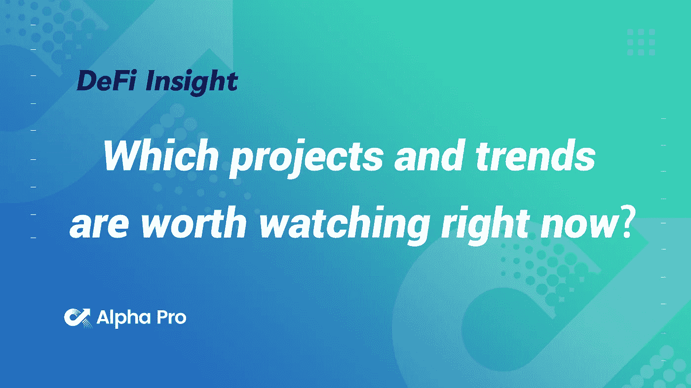
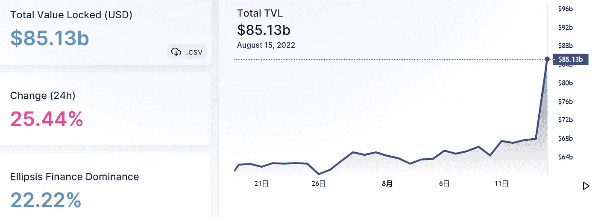
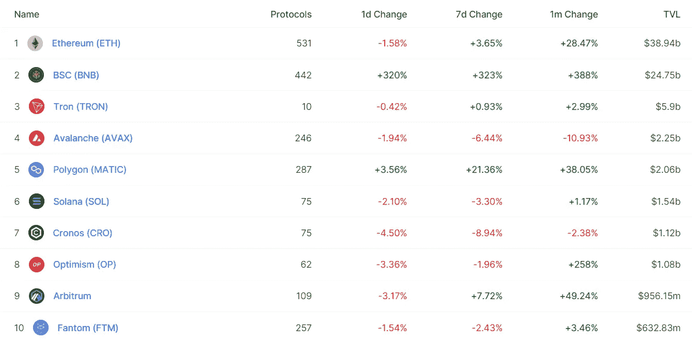
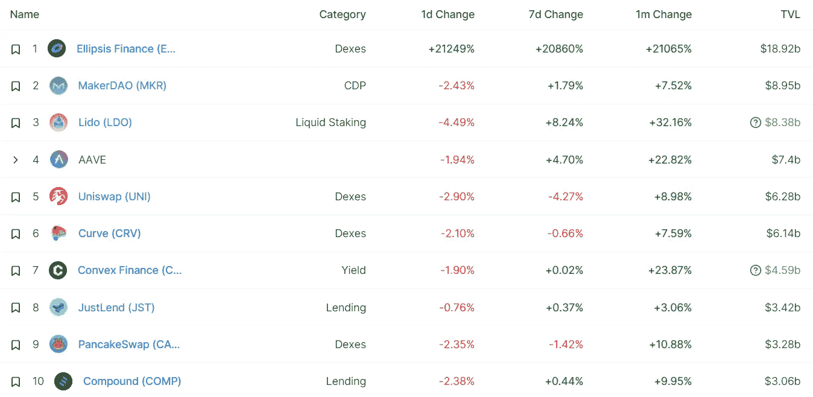
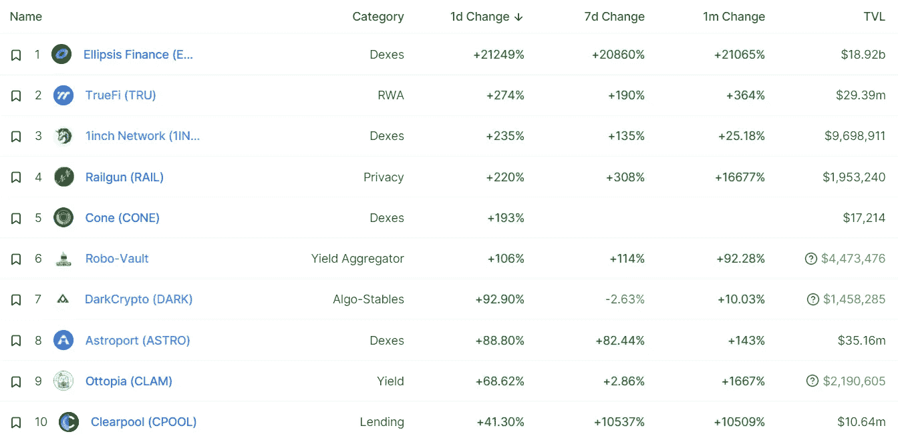
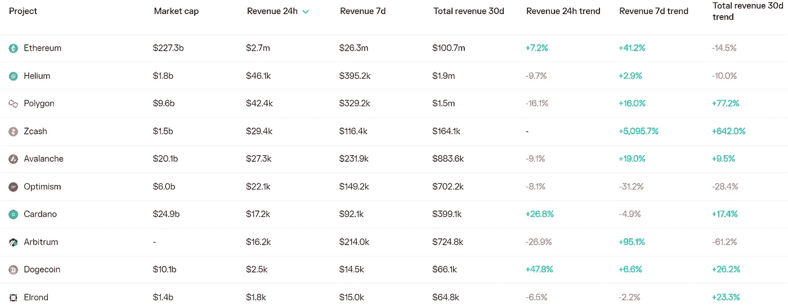
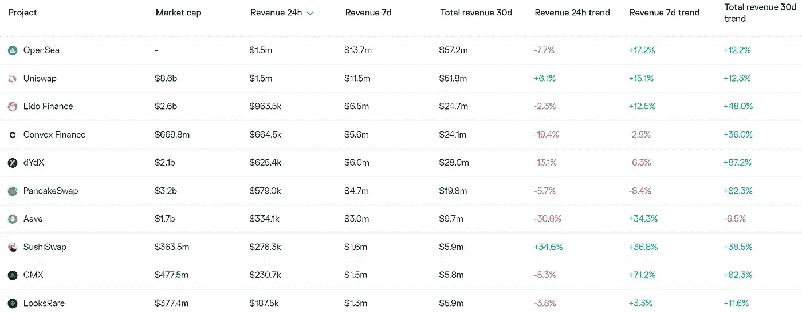
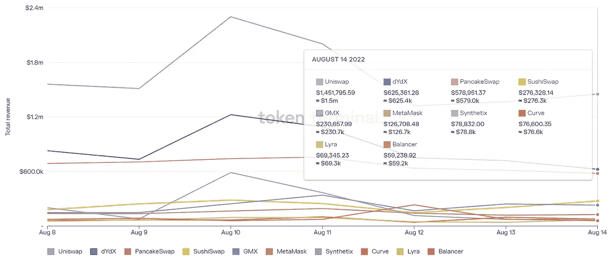
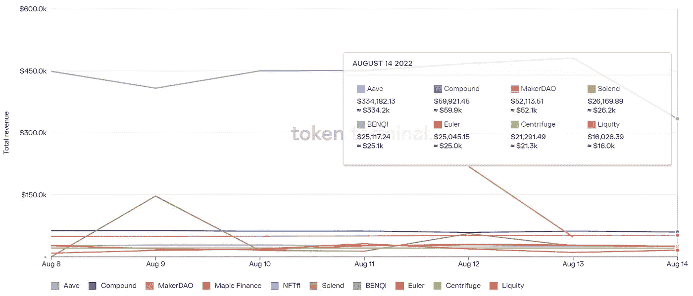

# DeFi Insight |当下哪些项目和趋势值得关注？

> 原文：<https://medium.com/coinmonks/defi-insight-which-projects-and-trends-are-worth-watching-right-now-22fb248813c7?source=collection_archive---------12----------------------->

2022 年 8 月 15 日

*今日 DeFi 数据&由 DeFi Insight 为您带来的新闻*

> *“*我问了 15 位世界上最聪明的加密投资者，现在哪些项目和趋势值得关注。
> 以下是他们所说的… *。”@* [*来源*](https://twitter.com/mariogabriele/status/1558882985260326915)

# 最新消息

## 贷款

**[Frax](https://mobile.twitter.com/DrakeEvansV1/status/1558193677763284992)推出借贷平台 Fraxlend，代码发布在 Github 上**

## **外汇**

****[unis WAP](https://twitter.com/NFTherder/status/1558632996491649029)前端开始拦截从 Tornado Cash 收到的 0.1 ETH 地址****

******[KyberSwap](https://blog.kyber.network/kyberswap-x-polygon-chain-trading-contest-c155c285bfca)x 多边形链交易大赛******

## ******市场******

******公共养老金系统加入了被加密崩溃刺痛的人群******

******随着 SHIB 价格进入突破模式，柴犬指数上涨了 50%******

## ******稳定币******

******在黑客发行了 13 亿枚代币后，阿卡拉的稳定币下跌了 99%******

## ******第二层******

******乐观主义者科万已被弃用，取而代之的是乐观主义者戈利******

## ******交叉链******

********[瓦伦](https://twitter.com/varenfinance/status/1558555356351037447):一个心怀不轨的演员打算清空退休后的统辖金库********

## ******支付******

******美国法官批准瑞波的动议认证七名 SEC 官员公开言论的视频******

## ******空投******

********[空投 MMF (P)](/@MMFinance/the-time-has-come-for-the-7093cf0951a6) 给我们克罗诺斯生态系统的持有者********

## ******叉子******

********[ETHW 核心](https://twitter.com/EthereumPoW/status/1558898214819938304?s=20&t=A9bntVutX55Qib_pUfI06A)刚刚发布了它的初始版本********

## ******政策与法规******

******津巴布韦储备银行行长说:“制定了采用 CBDC 的路线图。”******

******刚果民主共和国向加密和碳公司开放石油拍卖******

## ******NFT******

********开发者平台 [Alchemy 推出 Web3 开发者计划](https://docs.alchemy.com/docs/welcome-to-the-road-to-web3)********

********[光环 Mainnet](https://insight.aura.network/aura-mainnet-to-be-launched-in-october/) 将于 10 月推出********

## ******基金******

********/**[Cudos](https://cryptonewsbtc.org/2022/08/15/cudos-launches-a-foundation-to-champion-blockchain-adoption/)成立基金会支持区块链的采用******

## ****观点****

****Uniswap 实验室首席运营官 MC 雷德谈 DeFi 背后的动机****

******,**[冰哥](https://decrypt.co/107396/brother-bings-guide-to-surviving-the-crypto-bear-market)的秘密熊市生存指南****

****凯文·奥利里说为机构收养牺牲龙卷风现金是值得的****

# ****数据和分析****

## ****锁定的总价值(TVL)****

****目前全网 DeFi 总锁定量为 851.3 亿美元，24 小时增长 25.44%。****

********

## ****TVL 评出的十大连锁酒店****

********

## ****|最新 TVL 十大项目****

********

## ****|过去 24 小时内 TVL 增长的前 10 个项目****

********

## ****协议收入****

## ****|累计总收入最高的项目(24H)_ 区块链(L1)****

********

## ****|累计总收入最高的项目(24H) _Dapps (L2)****

********

## ****|前 10 大交易所的每日收入****

********

## ****|十大贷款协议的日收入****

********

# ****深潜****

******[**对比特币网络**](https://bitcoinmagazine.com/culture/valuing-bitcoin-network-instead-asset) **而非资产**估值******

**** [## 对比特币网络而非资产进行估值

### 《比特币》杂志撰稿人周星驰转录了一段比特币播客插曲《这么早！主持人之间会…

bitcoinmagazine.com](https://bitcoinmagazine.com/culture/valuing-bitcoin-network-instead-asset) 

**[**注意力经济**](https://twitter.com/danii_jpg/status/1557779327181209600) **，它如何影响 NFTs 的价格，以及它如何帮助你决定何时买入和卖出****

****[**零知识**](https://internbreakdowns.substack.com/p/intern-breakdown-4-zero-knowledge) **证明******

**** [## 实习生崩溃#4:零知识证明

### 现在，你可能在想:-我听说过很多，但是 ZK 证明到底是什么呢？或者也许你…

internbreakdowns.substack.com](https://internbreakdowns.substack.com/p/intern-breakdown-4-zero-knowledge) 

**[**2022 年考虑的 12 大加密借记卡**](https://dailycoin.com/top-12-crypto-debit-cards-to-consider/)**

**** [## 2022 年要考虑的 12 大加密借记卡——daily coin

### 加密借记卡正在帮助加密所有者快速评估他们的资产，以便在现实世界中购买，同时也创造了…

dailycoin.com](https://dailycoin.com/top-12-crypto-debit-cards-to-consider/)**** 

# ****报告****

******[**资产配置者对数字资产**](https://www.coinbase.com/institutional/research-insights/resources/education/asset-allocators-growing-interest-in-digital-assets)**_ coin base 的兴趣越来越大********

> ******对于机构投资者来说，投资新兴类别并不是一个新概念。他们现在正在研究加密技术，从长远的角度来看，并认识到机会。******

********[**矿工们又开始分发**](https://cryptoquant.com/quicktake/62f8b9208f844d7712ff98b7-Miners-Are-Distributing-Again-Another-Shakeout-Might-be-Possible)**；另一次震荡也许是可能的**********

******[**以太坊名称服务**](https://www.theblockresearch.com/ethereum-name-service-an-essential-web3-building-block-163310) **:必不可少的 Web3 构建块** _theblockresearch******

******[**的进展数据可用性**](https://messari.io/report/progression-of-the-data-availability-problem) **问题** _messari******

******关于:******

****DeFi Insight 是顶级 DeFi 和加密新闻和更新的来源。****

******https://twitter.com/AlphaPro_io 推特:******

********❤RSS:**[**https://medium.com/feed/@alphapro.project**](https://medium.com/feed/@alphapro.project)******

****提供的信息应被视为发展新闻，而不是投资建议。****

> ****交易新手？尝试[加密交易机器人](/coinmonks/crypto-trading-bot-c2ffce8acb2a)或[复制交易](/coinmonks/top-10-crypto-copy-trading-platforms-for-beginners-d0c37c7d698c)************