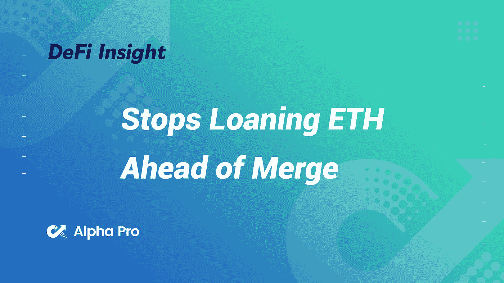
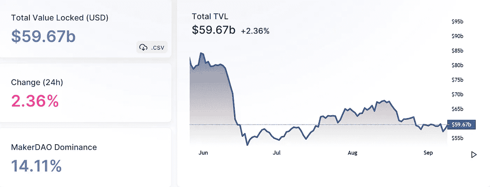
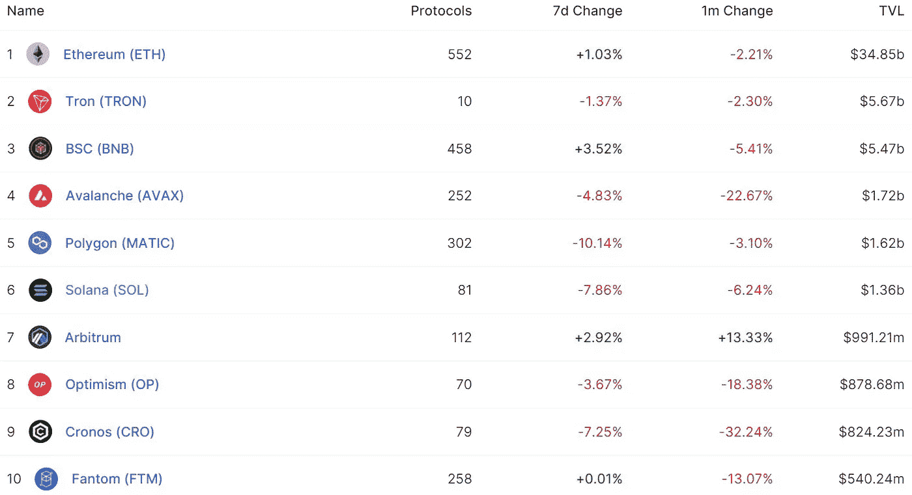
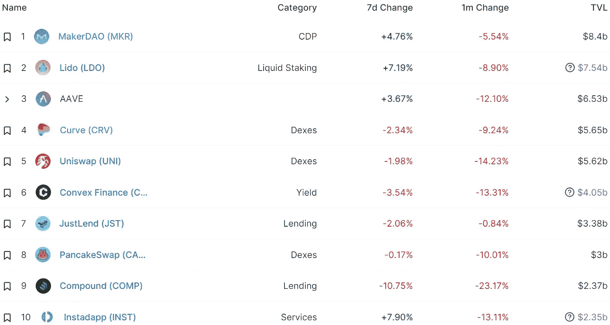
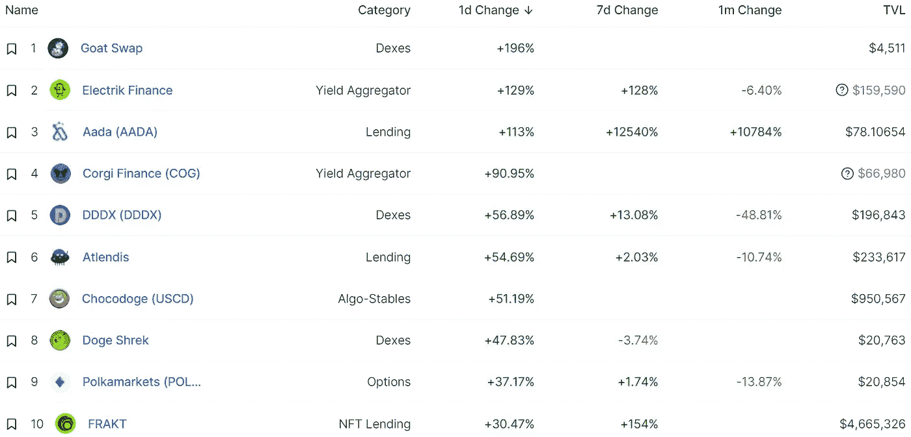
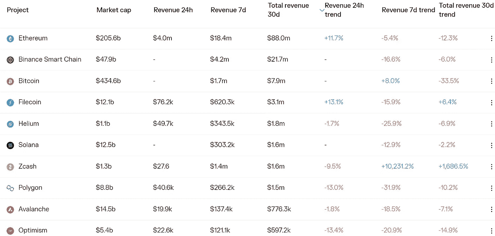
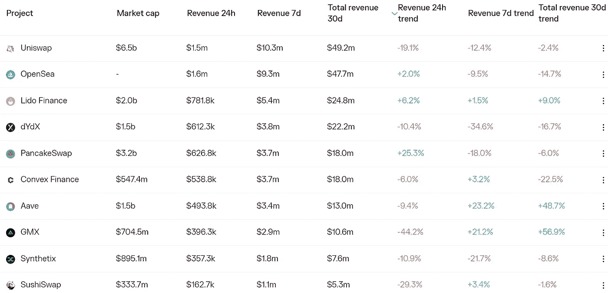

# DeFi Insight |为什么 DeFi 协议在以太坊合并前限制 ETH 借用

> 原文：<https://medium.com/coinmonks/defi-insight-why-defi-protocols-are-limiting-eth-borrowing-ahead-of-ethereums-merge-d3d418db4cbb?source=collection_archive---------26----------------------->

2022 年 9 月 9 日

*今日 DeFi 数据&由 DeFi Insight 为您带来的新闻*

> *“*Aave 和 Compound 投票赞成采取预防措施，防止空投囤积者吸干他们的流动性。*“@*[*来源*](https://www.coindesk.com/layer2/2022/09/08/why-defi-protocols-are-limiting-eth-borrowing-ahead-of-ethereums-merge/)

# 最新消息

## 第二层

**/**[StarkEx 4.5](https://twitter.com/StarkWareLtd/status/1567888940123983874)—发布后不久发现并修复了 bug

**[StarkNet](https://mobile.twitter.com/StarkWareLtd/status/1568141964012589056)合并后仅支持以太坊 PoS 链**

## **第一层**

**欢迎来到第一届[坎托](https://thecoh.build/)在线黑客马拉松**

****[**雪崩**](https://cryptoslam.io/blockchains/avalanche)**连锁 NFT 销售额突破 4 亿美元******

## ******指标******

******SushiSwap 宣布与卡瓦合作******

******AMM 手续费收入超过 20 万美元，总交易额超过 4000 万美元******

********[曲线](https://twitter.com/kava_platform/status/1567852822351183873?s=20)正在卡瓦上直播********

## ******CDP******

******以太坊合并完成后，**[制造商](https://twitter.com/MakerDAO/status/1567953174266249218)将只支持 PoS 链********

## ******稳定币******

********鲜味获得 Circle 批准开设账户，支持企业与 [USDC 一起进入加密领域](https://twitter.com/UmamiFinance/status/1567583539113115651)********

## ******桥梁******

********跨链桥聚合器[李。FI](https://twitter.com/lifiprotocol/status/1567815126761472001) 已经集成了星际之门********

## ******提议******

********[Aave DAO](https://app.aave.com/governance/proposal/?proposalId=98)支付 Aave 1628 万美元追溯资金的提案通过********

## ******|开发******

********[币安实验室](https://twitter.com/BinanceLabs/status/1568107835724300288?s=20&t=zVwUD8V7P2lFTFOQEidycw)计划打造 Web3 开发者社区********

******德尔福实验室将转向研究和开发宇宙生态系统******

## ******政策与法规******

********美国财政部建议发行[数字美元](https://www.coindesk.com/policy/2022/09/08/us-treasury-to-recommend-issuing-digital-dollar-if-in-national-interest-source/)如果符合国家利益:来源********

## ******NFT******

********黑站: [PUMA](https://www.prnewswire.com/news-releases/black-station-puma-reveals-first-ever-metaverse-experience-with-exclusive-nfts-at-new-york-fashion-week-301618803.html) 在纽约时装周上首次展示元宇宙独家 NFT 体验********

********NFT 借贷协议 [JPEG 格式](https://mobile.twitter.com/JPEGd_69/status/1568142903528013826)推出代币互换功能********

## ******基金******

******B+J 工作室筹集 1000 万美元，将 NFT 超级应用程序带入生活******

******Bessemer Venture Partners 完成了 38.5 亿美元的早期投资******

********新加坡黄埔集团通过基金向[数字资产](https://www.usnews.com/news/technology/articles/2022-09-08/singapores-whampoa-group-to-invest-100-million-via-fund-for-digital-assets)投资 1 亿美元********

******风险投资公司 MetaWeb 为早期加密创业公司筹集了 3000 万美元******

# ******数据和分析******

## ******锁定的总价值(TVL)******

******目前全网 DeFi 总锁定量为 596.7 亿美元，24 小时增长 2.36%。******

************

## ******TVL 评出的十大连锁酒店******

************

## ******|最新 TVL 十大项目******

************

## ******|过去 24 小时内 TVL 增长的前 10 个项目******

************

## ******协议收入******

## ******|累计总收入最高的项目(24H)_ 区块链(L1)******

************

## ******|累计总收入最高的项目(24H) _Dapps (L2)******

************

# ******深潜******

********下面是 DeFi** 中最好的 [**【真实收益率】**](https://newsletter.banklesshq.com/p/here-are-the-best-real-yields-in?utm_source=%2Finbox&utm_medium=reader2)******

****** [## 以下是 DeFi 的最佳“实际收益率”

### 这是一生一次的机会。与康赛斯公司的 NFT 特别铸币厂进行合并。🥳🎊庆祝合并。造币厂…

newsletter.banklesshq.com](https://newsletter.banklesshq.com/p/here-are-the-best-real-yields-in?utm_source=%2Finbox&utm_medium=reader2) 

**Canto—内置于**[**Cosmos SDK**](https://research.huobi.com/#/ArticleDetails?id=313)**的 EVM 兼容第 1 层区块链，具有自由定义**

 [## 火币研究

### 编辑描述

research.huobi.com](https://research.huobi.com/#/ArticleDetails?id=313) 

合并后谁来保护你不受[**MEV**](https://twitter.com/IntegralHQ/status/1567104201725018114)**的伤害？******** 

# ****报告****

******绘制出** [**Aptos 的生态系统**](https://www.theblockresearch.com/mapping-out-aptos-ecosystem-162141) _theblockresearch****

> ****Aptos 是一种新的第一层区块链，它利用移动语言来挑战第一层的现状。该公司在 3 月份筹集了 2 亿美元，7 月份筹集了 1.5 亿美元，使公司估值超过 40 亿美元。
> 该部门已经注意到并规划了基于 Aptos 的 9 个垂直领域的 68 个项目。****

******[**STEPN**](https://messari.io/report/stepn-after-the-hype)**:炒作之后** _messari******

******[**【元宇宙】& Web3 游戏**](https://mailchi.mp/8ef161e7afb2/metaverse-nft-web3-gaming-report-august-2022) **报告** _mailchi******

******关于:******

****DeFi Insight 是顶级 DeFi 和加密新闻和更新的来源。****

******https://twitter.com/AlphaPro_io**❤[t55】](https://twitter.com/AlphaPro_io)****

******❤RSS:**[**https://medium.com/feed/@alphapro.project**](https://medium.com/feed/@alphapro.project)****

****提供的信息应被视为发展新闻，而不是投资建议。****

> ****交易新手？试试[加密交易机器人](/coinmonks/crypto-trading-bot-c2ffce8acb2a)或者[复制交易](/coinmonks/top-10-crypto-copy-trading-platforms-for-beginners-d0c37c7d698c)****