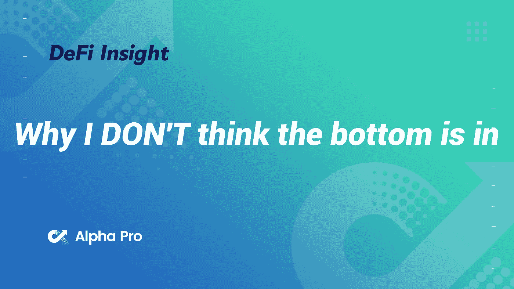
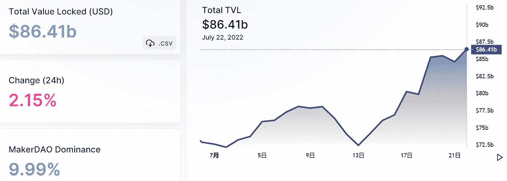
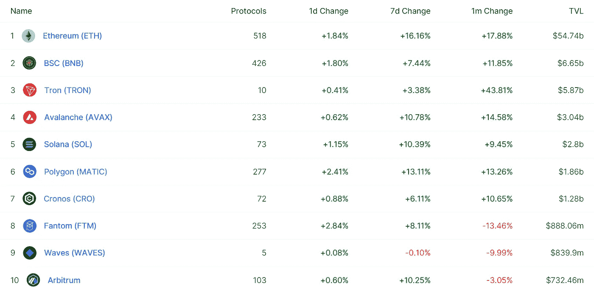
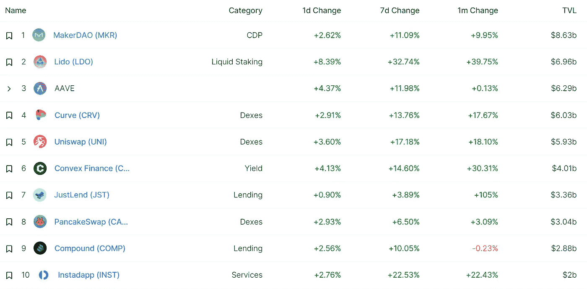
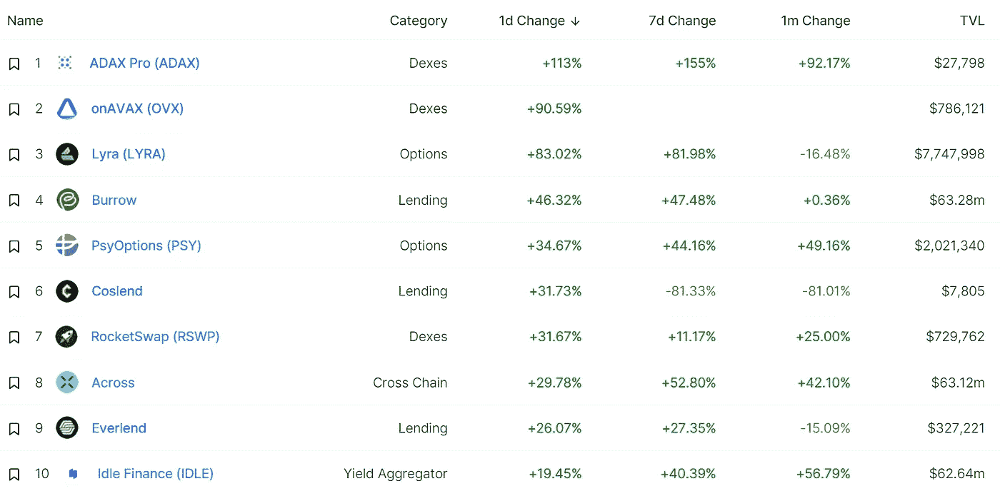
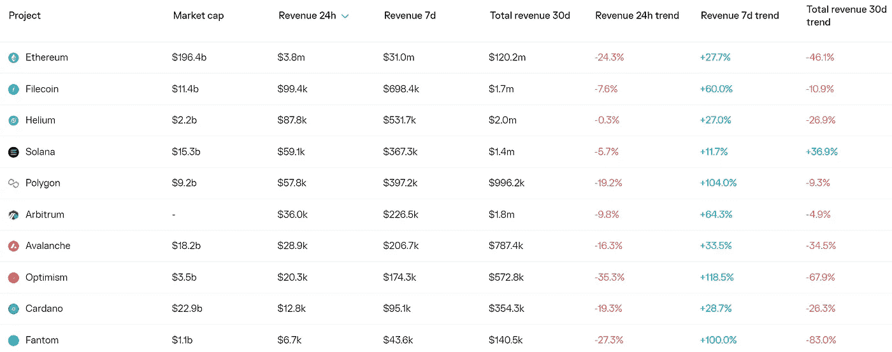
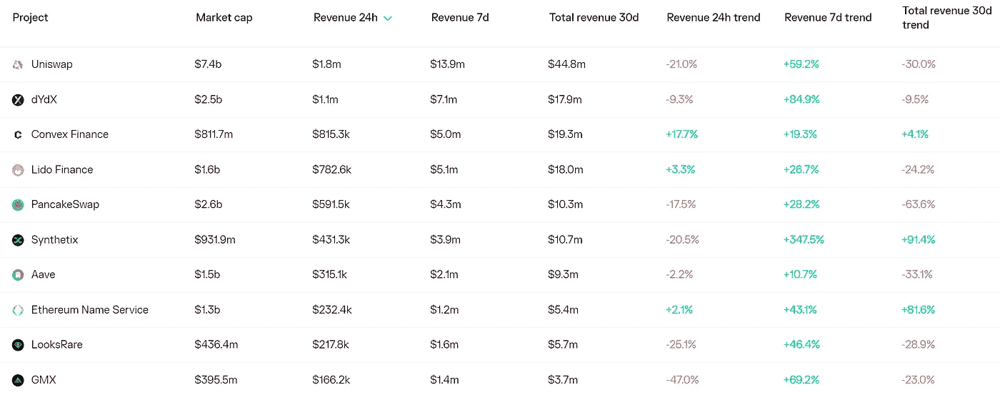
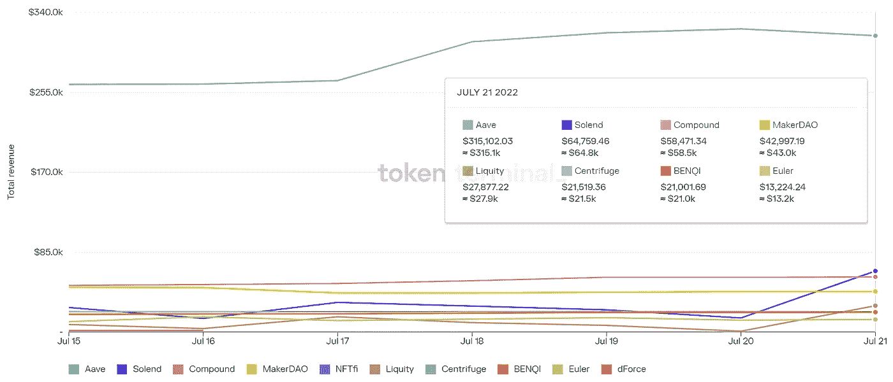

# 为什么我不认为底部已经到来

> 原文：<https://medium.com/coinmonks/defi-insight-why-i-dont-think-the-bottom-is-in-3d01e41f4202?source=collection_archive---------10----------------------->

2022 年 7 月 22 日

*今日 DeFi 数据&由 DeFi Insight 为您带来的新闻*

> *"* 首先，也是最重要的一点，我们还没有看到所有 3AC 戏剧中的野蛮人揭开谜底。虽然很明显 3AC 正在被清算，但他们的头寸还没有被投放到市场上..BTC、瑞士联邦理工学院以及更多的公司最终都将被出售以偿还债权人。*“@*[*来源*](https://twitter.com/bryptobricks/status/1549205355359453184)

# 最新消息

## 贷款

**[Aave V3](https://twitter.com/AaveAave/status/1550136687099011073)已经部署在 Goerli 测试网&新的乐观 Goerli 测试网供开发者继续测试！**

## **外汇**

**西班牙交易所在南美开设了第一家商店**

## **稳定币**

**尽管有监管机构的审查，稳定曲线的设计仍在进行中**

## **衍生产品**

**Synthetix DAO 和 Jump Crypto 激动地宣布重新合作**

## **支付**

**随着大型科技公司继续拥抱加密技术，Crypto.com 将推出 Google Pay 集成**

## **钱包**

****[Brave](https://brave.com/new-wallet-partners/)通过六个额外的领先 DApps 扩展其钱包合作伙伴计划****

## ****鲸鱼****

****这只 NFT 鲸鱼如何因为一个“玩笑”输掉了 15 万美元****

****随着市场的反弹，加密鲸的交易量激增****

## ****采矿****

******[公地基金会](https://www.coindesk.com/business/2022/07/21/commons-foundation-signs-100mw-deal-for-crypto-mining-in-paraguay/)签署一项 100 兆瓦的协议******

## ******政策与法规******

********加密资产平台在[泰国](https://www.bloomberg.com/news/articles/2022-07-21/crypto-asset-platforms-to-face-stricter-regulations-in-thailand#xj4y7vzkg)面临更严格的规定********

********[SEC](https://cryptodaily.co.uk/2022/07/sec-labels-nine-tokens-as-securities)将 9 个代币标注为证券********

## ******NFT******

********[涂鸦 NFT](https://beincrypto.com/doodles-nft-sales-test-2022-low-after-crashing-by-more-than-100-million/) 销量创下 2022 年新低后暴跌超过 1 亿美元********

********LinkedIn 创始人雷德·霍夫曼将 DALL-E AI Art 变成 [Solana NFTs](https://decrypt.co/105714/linkedin-founder-reid-hoffman-turns-dall-e-ai-art-into-solana-nfts)********

********[小代理](https://venturebeat.com/2022/07/21/aglet-passes-3-5m-active-users-in-its-web3-sneakerverse/)在其 Web3 sneakerverse 中超过 350 万活跃用户********

## ******基金******

******一个“异常高”的门槛:投资者将注意力转移到新的加密交易上******

********[a16z](https://a16z.com/2022/07/21/a16z-is-moving-to-the-cloud/)正在向云端移动********

******风险投资公司 NFX 增加了 6260 万美元的后续投资，包括加密公司******

********关闭私人销售[疾驰](https://www.californiatimes.us/closure-of-private-sales-gallops/)********

## ******观点******

******不要坐等复苏，继续建设，[Web3 的执行官说](https://cointelegraph.com/news/don-t-wait-around-for-recovery-keep-on-building-says-web3-exec?utm_source=blockworks-research)******

********[EthCC【5】](https://www.youtube.com/watch?v=kGjFTzRTH3Q&t=475s)的 Vitalik Buterin********

# ******数据和分析******

## ******锁定的总价值(TVL)******

******目前全网 DeFi 总锁定量为 864.1 亿美元，24 小时增长 2.15%。******

************

## ******TVL 评出的十大连锁酒店******

************

## ******|最新 TVL 十大项目******

************

## ******|过去 24 小时内 TVL 增长的前 10 个项目******

************

## ******协议收入******

## ******|累计总收入最高的项目(24H)_ 区块链(L1)******

************

## ******|累计总收入最高的项目(24H) _Dapps (L2)******

************

## ******|前 10 大交易所的每日收入******

************

## ******|十大贷款协议的日收入******

************

# ******深潜******

********雷达下**[**2s 层**](https://newsletter.banklesshq.com/p/under-the-radar-layer-2s)******

**** [## 在雷达层 2s 下面

### 解锁神秘空投🔮亲爱的无银行国家，密码不睡觉。当一项技术创新处于领先地位时…

newsletter.banklesshq.com](https://newsletter.banklesshq.com/p/under-the-radar-layer-2s) 

**[**缩放状态问题 1**](https://www.theblockresearch.com/state-of-scaling-issue-1-dydx-arbitrum-optimism-157754) **: dYdX、Arbitrum、乐观度****

** [## 问题 1: dYdX，Arbitrum，乐观主义

### 2022 年 7 月 21 日，美国东部时间下午 1:19 快速报道在这一新的双周系列中，我们关注一些最有趣的数据和…

www.theblockresearch.com](https://www.theblockresearch.com/state-of-scaling-issue-1-dydx-arbitrum-optimism-157754) 

**[**圈子& USDC**](https://www.notboring.co/p/circle-and-usdc-building-a-stable) **:搭建稳定平台****

** [## 圈子& USDC:搭建稳定平台

### 欢迎来到从周一开始加入我们的 778 新不无聊的人！如果你还没有订阅，加入 140，394…

www.notboring.co](https://www.notboring.co/p/circle-and-usdc-building-a-stable) 

**你的区块链求职完整指南**

** [## 你在区块链| HackerNoon 上找工作的完整指南

### 构建门户网站 Xperience，这是一家元宇宙工作室，致力于为大众创造交互式 3d 游戏、电影和体验…

hackernoon.com](https://hackernoon.com/your-complete-guide-to-getting-a-job-on-blockchain)** 

# **报告**

****[**2022 年展望**](https://data.cryptocompare.com/reports/2022-q3-outlook-winter-is-here) **:冬天来了 Q3** _cryptocompare****

> ****这份报告旨在捕捉、解释和分析这些事件，并将其置于下一季度及以后对加密货币可能意味着什么的背景下。我们涵盖宏观经济学、稳定资本、DeFi、NFTs 等等。****
> 
> ****UST 和 Terra 生态系统的崩溃，可以被解释为黑天鹅事件，以及随后导致三箭资本破产和 Celsius 等多家集中收益率提供商破产的蔓延，无疑将该行业带入了熊市。****

******[**Synthetix**](https://tokeninsight.com/en/research/analysts-pick/synthetix-curve-1-more-inch-to-the-future-of-defi)**—曲线 1 寸多未来的 DeFi** _tokeninsight******

******[**1 英寸**](https://messari.io/article/state-of-1inch-q2-2022)**Q2 2022**_ 梅萨里的状态******

******[**宇宙**](https://members.delphidigital.io/reports/cosmos-the-evolution-of-ibc)**:IBC 的进化** _delphidigital******

******关于:******

****DeFi Insight 是顶级 DeFi 和加密新闻和更新的来源。****

******https://twitter.com/AlphaPro_io 推特:******

********❤RSS:**[**https://medium.com/feed/@alphapro.project**](https://medium.com/feed/@alphapro.project)******

****提供的信息应被视为发展新闻，而不是投资建议。****

> ****交易新手？试试[加密交易机器人](/coinmonks/crypto-trading-bot-c2ffce8acb2a)或[复制交易](/coinmonks/top-10-crypto-copy-trading-platforms-for-beginners-d0c37c7d698c)************