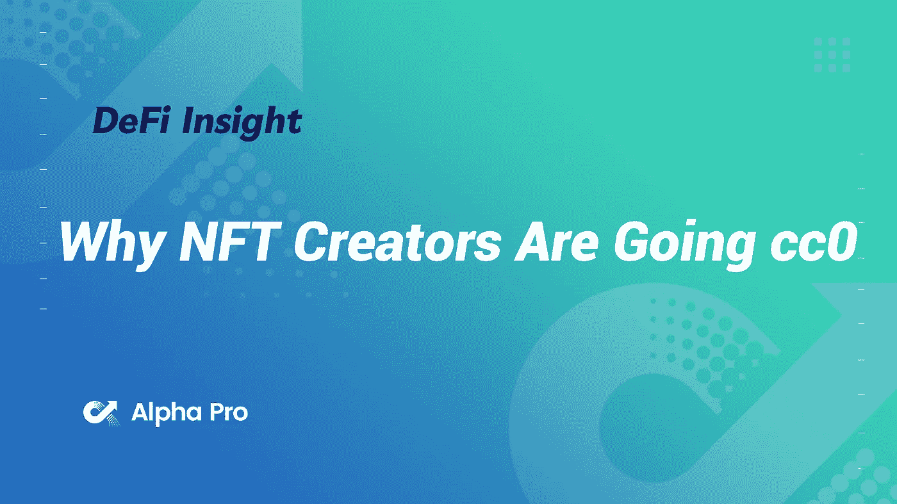
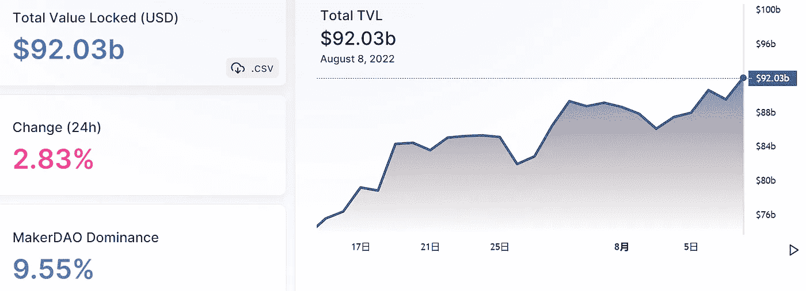
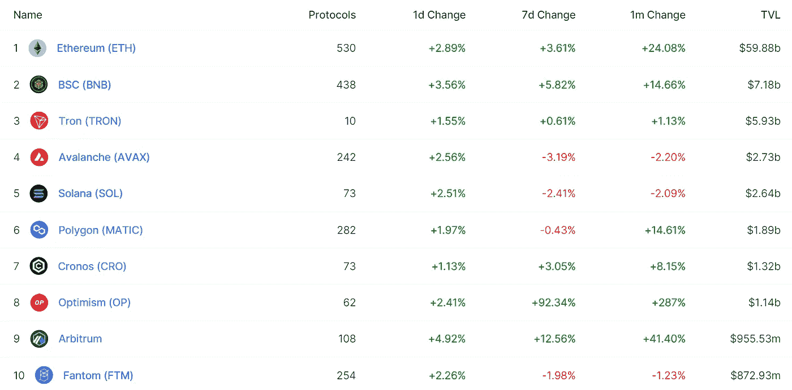
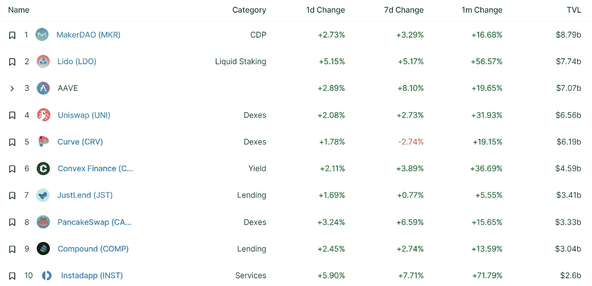
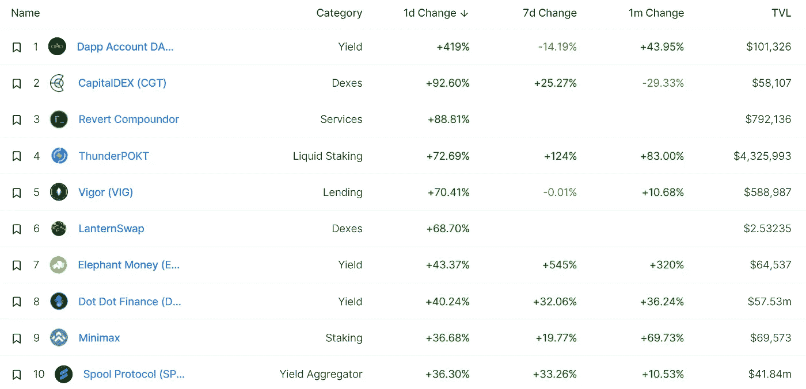
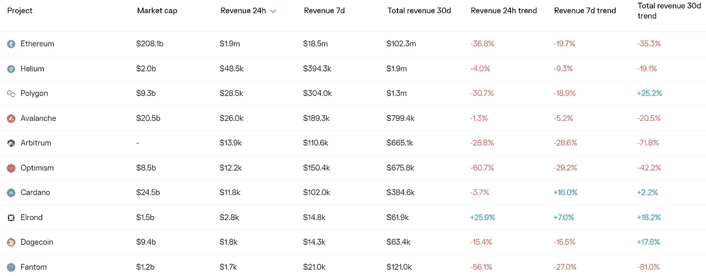
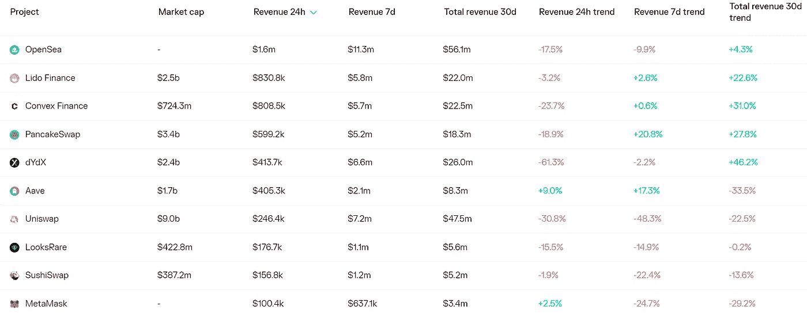
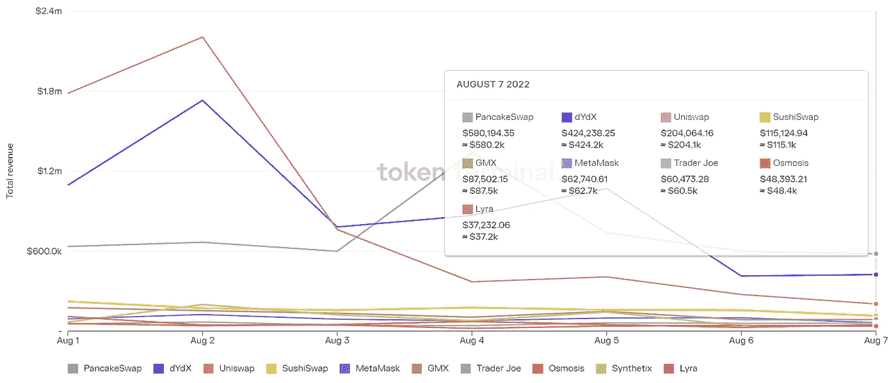
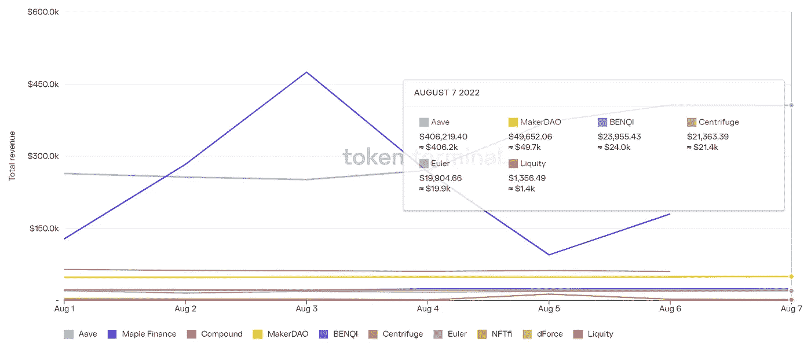

# DeFi Insight | NFT 创作者为何选择 cc0

> 原文：<https://medium.com/coinmonks/defi-insight-why-nft-creators-are-going-cc0-4579894d8992?source=collection_archive---------27----------------------->

2022 年 8 月 8 日

*今日 DeFi 数据&由 DeFi Insight 为您带来的新闻*

> *通过“知识共享零许可协议”(Creative Commons Zero，简称“cc0”)发布数字作品，创作者可以有意选择“不保留任何权利”。“这个选项允许任何人制作衍生作品并从这些作品中获利，而不用担心法律后果。[在适用于 NFTs 的版权方面仍然存在许多困惑，因此这里陈述的任何内容都不应被视为法律、金融、税收或投资建议——但请查看这篇文章，了解 NFTs 版权漏洞的概述，以及创作者如何采取措施来确保所有者的权利。然而，这篇文章的重点仅仅是 cc0。】*“@*[*来源*](https://a16zcrypto.com/cc0-nft-creative-commons-zero-license-rights/)*

# *最新消息*

## *外汇*

*币安与印度的密码交易所 WazirX 保持距离*

*加密交易所推出 2 亿美元基金保护用户资产*

## *产量*

***[羊驼金融](https://blog.pstake.finance/2022/08/06/alpaca-finance-to-enable-leveraged-yield-farming-for-stkbnb-pstake/)为 STK bnb&p take 启用杠杆收益养殖***

*****[defi chain](https://thecryptobasic.com/2022/08/07/defichain-community-brings-attractive-rewards-for-dfi-erc-20-pairs-on-uniswap/)社区为 DFI·ERC 带来诱人的奖励 Uniswap 上的 20 对*****

## *****交叉链*****

*******[Celer Network](https://mobile.twitter.com/CelerNetwork/status/1555848598088142848)集成 MathWallet*******

*********[流浪者](https://twitter.com/nomadxyz_/status/1556312626736422912)资金回收地址收到了价值约 3580 万美元的资金*********

## *******市场*******

*********[摩根士丹利](https://www.theblock.co/post/161958/morgan-stanley-job-posting-points-to-wide-ranging-crypto-plans?utm_source=cryptopanic&utm_medium=rss)招聘启事指向广泛的加密计划*********

## *******商业*******

*******Crypto.com 通过电子金融交易法案和虚拟资产服务提供商注册*******

*******加密公司在体育赞助上花费了 24 亿美元*******

## *******|令牌*******

*********Animoca Brands 发布 [TOWER Token 网上商店](https://playtoearn.net/news/animoca-brands-releases-the-tower-token-web-store)*********

## *******|选项*******

*********分散期权协议 [Premia](https://twitter.com/PremiaFinance/status/1555636388036431873) 乐观启动*********

## *******甲骨文*******

*********[chain link](https://docs.chain.link/docs/ethereum-proof-of-stake-merge/)协议和服务将不支持以太坊的分叉版本*********

## *******政策与法规*******

*******美国提出三项法案，使 CFTC 成为秘密现货市场的主要监管者*******

## *******NFT*******

*********[cryptodickbats](https://decrypt.co/106914/why-cryptodickbutts-ethereum-nft-surging-in-volume)以太坊 NFTs 日销量激增 690%*********

*******可口可乐在多边形上发起 NFT 国际友谊日*******

## *******观点*******

*******顶级分析师称以太坊(ETH)即将撕毁，称一个交换令牌为“真实的坦克”*******

*********[维塔利克](https://cointelegraph.com/news/vitalik-crypto-payments-will-make-sense-as-tx-costs-fall-to-mere-cents-kbw-2022):第二层扩展将使加密支付再次“有意义”——KBW 2022*********

# *******数据和分析*******

## *******锁定的总价值(TVL)*******

*******目前全网 DeFi 总锁定量为 920.3 亿美元，24 小时增长 2.83%。*******

**************

## *******TVL 评出的十大连锁酒店*******

**************

## *******|最新 TVL 十大项目*******

**************

## *******|过去 24 小时内 TVL 增长的前 10 个项目*******

**************

## *******协议收入*******

## *******|累计总收入最高的项目(24H)_ 区块链(L1)*******

**************

## *******|累计总收入最高的项目(24H) _Dapps (L2)*******

**************

## *******|前 10 大交易所的每日收入*******

**************

## *******|十大贷款协议的日收入*******

**************

# *******深潜*******

*********[**流动性**](https://members.delphidigital.io/reports/liquidity-runs-the-world) **执掌天下***********

***** [## 流动性主宰世界-德尔福数码

### 2022 年 8 月 5 日* 23 分钟阅读凯文·凯利，CFA + 2 其他披露:作者和编辑没有购买或出售任何…

members.delphidigital.io](https://members.delphidigital.io/reports/liquidity-runs-the-world) 

**[**市场脉搏**](https://insights.glassnode.com/market-pulse-20220805/) **:比特币长期持有者是否在消费他们的币？****

** [## 市场脉搏:比特币的长期持有者正在消费他们的比特币吗？

### 随着市场从最近的低点反弹，我们检查比特币的长期持有者是否在抓住机会…

insights.glassnode.com](https://insights.glassnode.com/market-pulse-20220805/) 

**框架为** [**Web3 基础设施**](https://mirror.xyz/ericyhu.eth/CGvbcLNZNkZMm-bYMCcyKA8_BAbeXBzfIfbw8RXRV2w)

 [## Web3 基础设施的框架

### 互联网从根本上改变了社会、个人和经济。一个工具，用于解锁前所未有的…

镜像. xyz](https://mirror.xyz/ericyhu.eth/CGvbcLNZNkZMm-bYMCcyKA8_BAbeXBzfIfbw8RXRV2w) 

**[**CC0 夏季**](https://metaversal.banklesshq.com/p/cc0-summer-)**

** [## CC0 夏季🌄

### 亲爱的无银行国家，夏天来了吗？正如 Zeneca 本周早些时候指出的那样，它确实开始感觉到…

metaversal.banklesshq.com](https://metaversal.banklesshq.com/p/cc0-summer-)** 

# **报告**

****层层发行 42:** [**Aptos 和 Sui**](https://www.theblockresearch.com/layer-by-layer-issue-42-aptos-and-sui-161771) _theblockresearch**

> **在这个每周系列中，我们将深入探讨第 1 层区块链领域中一些最有趣的数据和发展，从 DeFi 和网桥到网络活动和融资
> , EVM 仍然是当今具有大量链上活动的 L1 中最常见的执行环境。然而，尽管随着时间的推移，扩展解决方案已经开始趋向于模块化架构，但那些采用单片设计的解决方案继续为具有重新设计的执行系统的 EVM 提供有前途的替代方案
> 本周，我们来看两个最新的 L1 链，它们利用 MoveVM 实现更高的安全性和执行速度:Aptos 和 Sui**

****[**非 EVM 连锁**](https://messari.io/report/non-evm-chains-in-the-bear) **熊市**_ 梅萨里****

******[**BNB 连锁报道**](https://dappradar.com/blog/bnb-chain-report-q2-2022)**Q2 2022**_ dappradar******

******数字资产** [**双月基金经理**](https://coinshares.com/research/digital-asset-survey) **调查** _coinshares****

******关于:******

****DeFi Insight 是顶级 DeFi 和加密新闻和更新的来源。****

******https://twitter.com/AlphaPro_io 推特:******

********❤RSS:**[**https://medium.com/feed/@alphapro.project**](https://medium.com/feed/@alphapro.project)******

****提供的信息应被视为发展新闻，而不是投资建议。****

> ****加入 Coinmonks [电报频道](https://t.me/coincodecap)和 [Youtube 频道](https://www.youtube.com/c/coinmonks/videos)了解加密交易和投资****

# ****另外，阅读****

*   ****[瓦济里克斯 NFT 评论](https://coincodecap.com/wazirx-nft-review)|[Bitsgap vs Pionex](https://coincodecap.com/bitsgap-vs-pionex)|[坦吉姆评论](https://coincodecap.com/tangem-wallet-review)****
*   ****[如何使用 Solidity 在以太坊上创建 DApp？](https://coincodecap.com/create-a-dapp-on-ethereum-using-solidity)****
*   ****[加密交易机器人](/coinmonks/crypto-trading-bot-c2ffce8acb2a) | [OKEx vs 币安](https://coincodecap.com/okex-vs-binance)****
*   ****[币安 vs FTX](https://coincodecap.com/binance-vs-ftx) | [最佳(SOL)索拉纳钱包](https://coincodecap.com/solana-wallets)****
*   ****[如何在 Uniswap 上交换加密？](https://coincodecap.com/swap-crypto-on-uniswap) | [A-Ads 评论](https://coincodecap.com/a-ads-review)***********