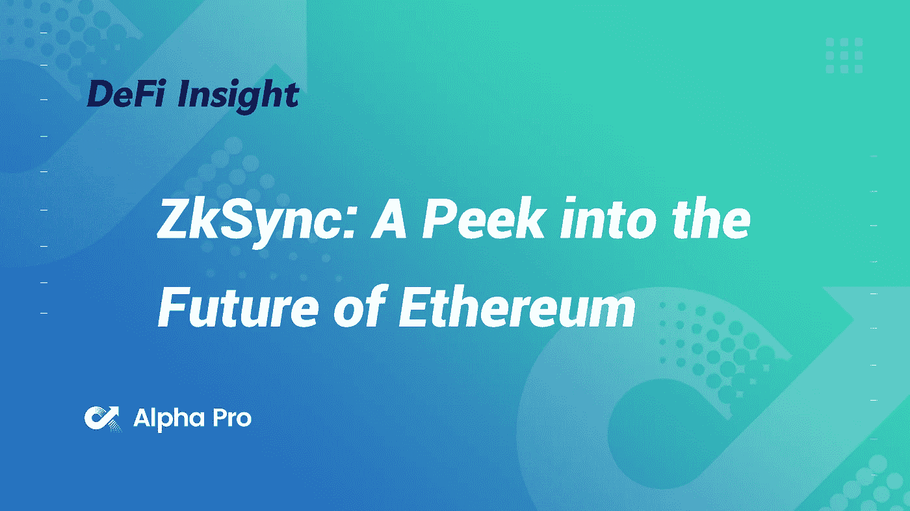
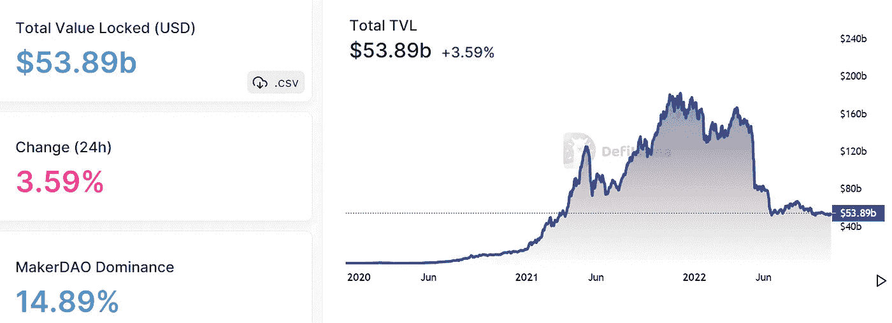
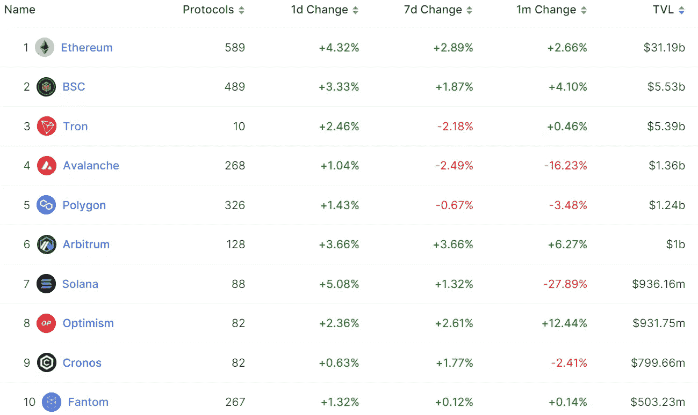
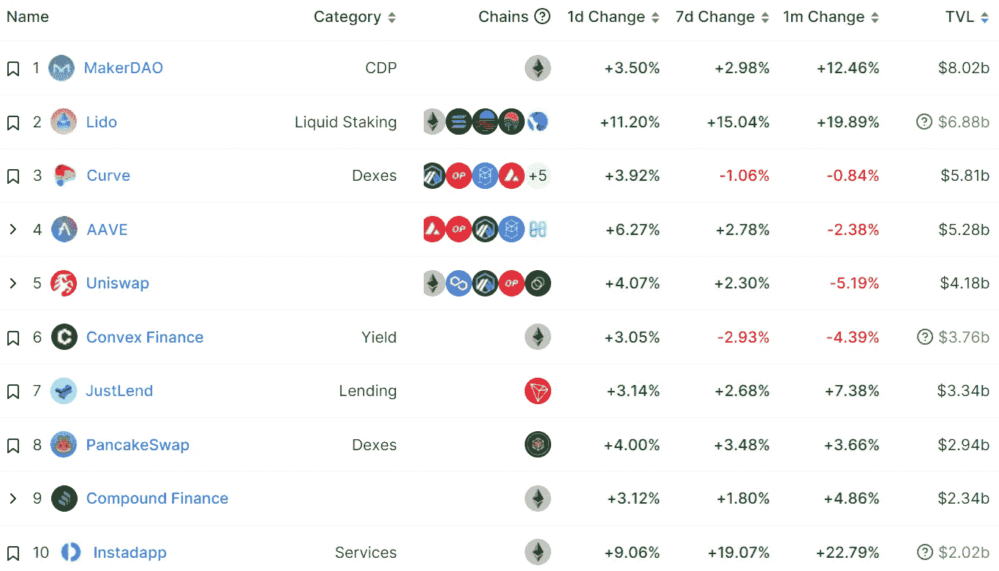
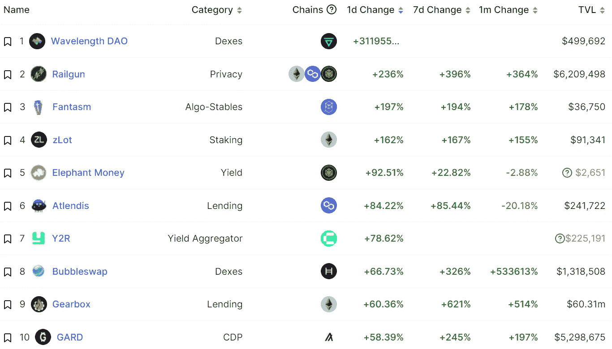
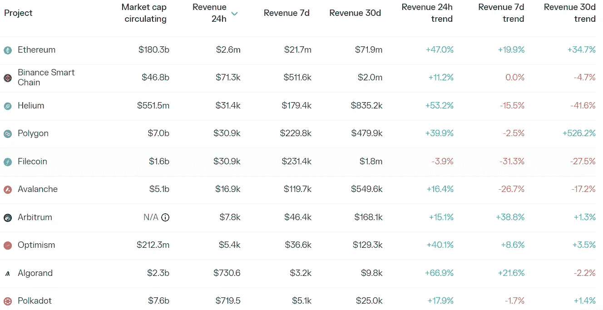
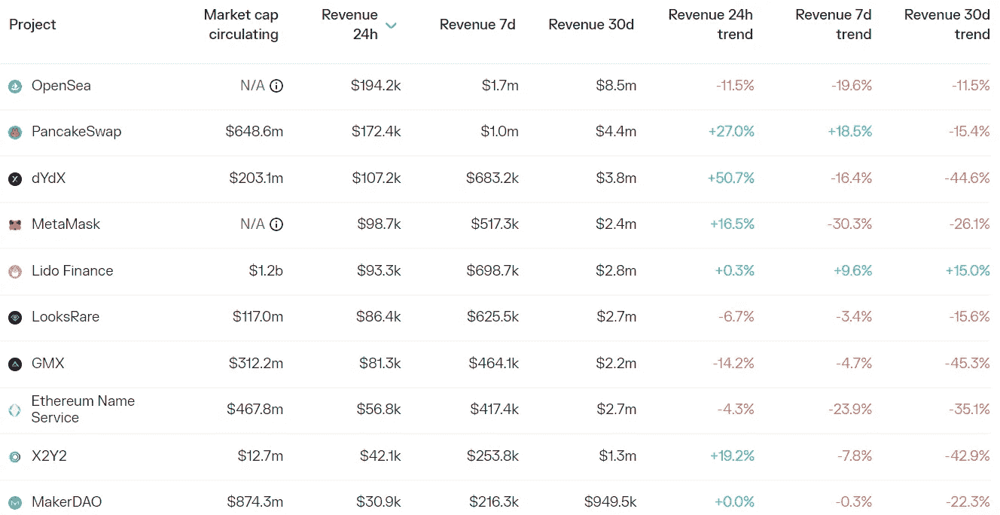

# DeFi Insight | ZkSync:窥视以太坊的未来

> 原文：<https://medium.com/coinmonks/defi-insight-zksync-a-peek-into-the-future-of-ethereum-faafc4898d83?source=collection_archive---------10----------------------->

2022 年 10 月 26 日

*今日 DeFi 数据&由 DeFi Insight 为您带来的新闻*

> *"* 由于缺乏智能合约支持，ZkSync 1.0 与其他通用 L2 相比，采用率较低，因此除了令牌转移和交换之外，其累积效用极小。
> 
> Matter Labs 团队的目标是在 10 月 28 日在 mainnet 上推出他们的 alpha zkEVM，使他们成为第一个推出具有 EVM 兼容性的通用智能合同 ZK 汇总的团队。
> 
> 第一个推出 zkEVM 的团队可以获得显著的先发优势，特别是如果以太坊上的交易费用飙升将用户推离基础层。
> 
> zkSync 团队认为，他们在降低硬件要求方面取得了重大突破，从而成为证明过程的积极参与者。
> 
> zkSync 的最后阶段是一种意志，由他们的证明技术和 L3s 的蓬勃发展的生态系统提供动力，同时保持以扩展以太坊为重点的目标。*“@*[*来源*](https://www.blockworksresearch.com/research/zksync-a-peek-into-the-future-of-ethereum#final-thoughts)

# 最新消息

## 第一层

**/**新测试版本的公有链 [Sui](https://twitter.com/SuiNetwork/status/1585032765975977984) 将用动态字段替换子对象

**[隋基金会](https://suifoundation.org/#grant)启动开发者资助计划**

## **第二层**

**StarkNet Mainnet 成功升级到 0.10.1**

****[zkSync](https://mobile.twitter.com/zksync/status/1584970210791915520)2.0 Testnet 完成重新生成****

## ****稳定币****

****土耳其中央银行计划在 2023 年推出 CBDC****

******[附近](https://near.org/blog/near-launches-usn-protection-programme-aurora/)基金会建议逐步减少$USN，并为$USN 保护计划拨款 4000 万美元******

********[马克尔道](https://vote.makerdao.com/polling/QmbMaQ9A#comments)社区投票通过了将 16 亿美元托管给 USDC 与比特币基地总理的提案********

## ******打桩******

******基于宇宙的液体赌注协议将于 11 月份在 T2 发布******

## ******支付******

********[现金 App](https://twitter.com/MichaelRihani/status/1584729594124697601) 新增支持通过闪电网络接收比特币********

## ******|令牌******

******加密游戏 Axie 的 AXS 代币解锁，接收者将价值 570 万美元的代币送到交易所******

## ******空投******

********[沙箱](https://mobile.twitter.com/TheSandboxGame/status/1584844444230197248)向土地所有者空投 260 万美元的沙子********

## ******政策与法规******

********英国以加密为重点的议会团体呼吁新首相苏纳克[澄清加密政策](https://www.coindesk.com/policy/2022/10/25/uk-crypto-focused-parliament-group-calls-on-new-pm-sunak-to-clarify-crypto-policies/)********

********欧盟专员呼吁业界就 [DeFi 法规](https://www.theblock.co/post/179757/eu-commissioner-calls-for-industry-recommendations-on-defi-regulation)提出建议********

## ******基金******

******Arf 从包括 Circle Ventures、Hard 傅韵如和 SDF 在内的投资者那里筹集了 1300 万美元******

********Aptos 生态系统稳定加入协议 [Thala Labs](https://twitter.com/ThalaLabs/status/1584998223348846592) 完成由 ParaFi Capital 和其他公司领投的 6 亿美元种子轮********

********[柴](https://www.bnbchain.org/en/blog/bnb-chain-launches-10-million-gas-fee-incentive-to-support-growth-of-web3-dapps/) n 推出 1000 万美元的成长激励计划，在第四季度支持 10 个项目********

# ******数据和分析******

## ******锁定的总价值(TVL)******

******目前全网 DeFi 总锁定量为 538.9 亿美元，24 小时增长 3.59%。******

************

## ******TVL 评出的十大连锁酒店******

************

## ******|最新 TVL 十大项目******

************

## ******|过去 24 小时内 TVL 增长的前 10 个项目******

************

## ******协议收入******

## ******|累计总收入最高的项目(24H)_ 区块链(L1)******

************

## ******|累计总收入最高的项目(24H) _Dapps (L2)******

************

# ******深潜******

********比特币案例** [**牛熊**](https://insights.glassnode.com/the-week-onchain-week-43-2022/)******

**** [## 比特币多头和空头的理由

### 随着比特币市场的波动性压缩至历史低点，我们提出了看涨和看跌的理由…

insights.glassnode.com](https://insights.glassnode.com/the-week-onchain-week-43-2022/) 

**维护您的** [**加密隐私**](https://newsletter.banklesshq.com/p/5-tips-to-maintain-your-crypto-privacy?utm_source=%2Finbox&utm_medium=reader2) 的 5 个技巧

 [## 维护加密隐私的 5 个技巧

### 我们已经为无银行高级会员更新了空投指南！探索数十个机会，赢取下一个大…

newsletter.banklesshq.com](https://newsletter.banklesshq.com/p/5-tips-to-maintain-your-crypto-privacy?utm_source=%2Finbox&utm_medium=reader2) 

**[**TradFi**](https://defieducation.substack.com/p/what-rising-tradfi-rates-means-for?utm_source=%2Finbox&utm_medium=reader2)**利率上升对 DeFi 和避免 rug pull**意味着什么**

** [## 上升的贸易利率对定义和避免冲突意味着什么

### 今天，马克尔道批准了比特币基地的提议，以托管高达 16 亿美元的 USDC。如果你想知道为什么马克道看起来…

defieducation.substack.com](https://defieducation.substack.com/p/what-rising-tradfi-rates-means-for?utm_source=%2Finbox&utm_medium=reader2) 

**反对山姆·班克曼-弗里德提出的** [**密码条例**](https://newsletter.banklesshq.com/p/was-sbf-wrong?utm_source=%2Finbox&utm_medium=reader2) 的 3 个论据

 [## SBF 错了吗？

### 就机会交换意见(“您对化合物有什么体验？”)向社区提问(“是创客…

newsletter.banklesshq.com](https://newsletter.banklesshq.com/p/was-sbf-wrong?utm_source=%2Finbox&utm_medium=reader2) 

# 报告

**[**雪崩**](https://coinshares.com/research/avalanche-asset-highlight?sort=desc) **资产高亮** _coinshares**

> **本报告简化并阐明了什么是 AVAX，AVAX 试图解决的问题及其自推出以来的发展。以及协议的优缺点、机会和威胁、核心组件和网络架构。**
> 
> **Avalanche 的目标之一是为主要的第 1 层协议创建一个替代设计。Avalanche 的创造者 Emin Gun Sirer 通过一个名为 Snow* family 的新颖共识机制、一个名为 Subnets 的扩展解决方案以及一个针对不同特定用例的三链主网络(即交换资产、执行智能合同以及创建和管理子网)实现了这一雄心。然而，深入挖掘会发现子网中没有活动，大多数活动都发生在 C 链上。**
> 
> **艾娃实验室面临着一场艰难的战斗，因为活跃用户数量不断下降，相对于以太坊等其他知名第一层平台的交易数量不断下降，以及来自不同生态系统的桥接令牌流入量不断下降。Avalanche 的目标是扩展子网生态系统，以鼓励远离主网络的迁移。因此，更多的链应该会增强互操作性，并在未来为这些应用程序提供更多的灵活性——这对运行自己的链的应用程序来说是一个有吸引力的基础。**

****保本** [的出现**产量**](https://members.delphidigital.io/reports/the-emergence-of-principal-protected-yield-in-defi) **在 DeFi** _delphidigital**

****[**区块链执行环境对比**](https://www.theblockresearch.com/a-comparison-of-blockchain-execution-environments-evm-sealevel-movevm-wasm-cairovm-179516) **: EVM、Sealevel、MoveVM、Wasm、CairoVM** _theblockresearch****

******评书**[**NFTs**](https://www.theblockresearch.com/storytelling-nfts-separating-fact-from-fiction-179045)**:虚实分离** _theblockresearch****

******现实世界资产:** [**金融的桥梁**](https://research.thetie.io/real-world-assets/) **到 Crypto** _thetie****

******关于:******

****DeFi Insight 是顶级 DeFi 和加密新闻和更新的来源。****

******https://twitter.com/AlphaPro_io 推特:******

********❤RSS:**[**https://medium.com/feed/@alphapro.project**](https://medium.com/feed/@alphapro.project)******

****提供的信息应被视为发展新闻，而不是投资建议。****

> ****交易新手？试试[加密交易机器人](/coinmonks/crypto-trading-bot-c2ffce8acb2a)或者[复制交易](/coinmonks/top-10-crypto-copy-trading-platforms-for-beginners-d0c37c7d698c)**********