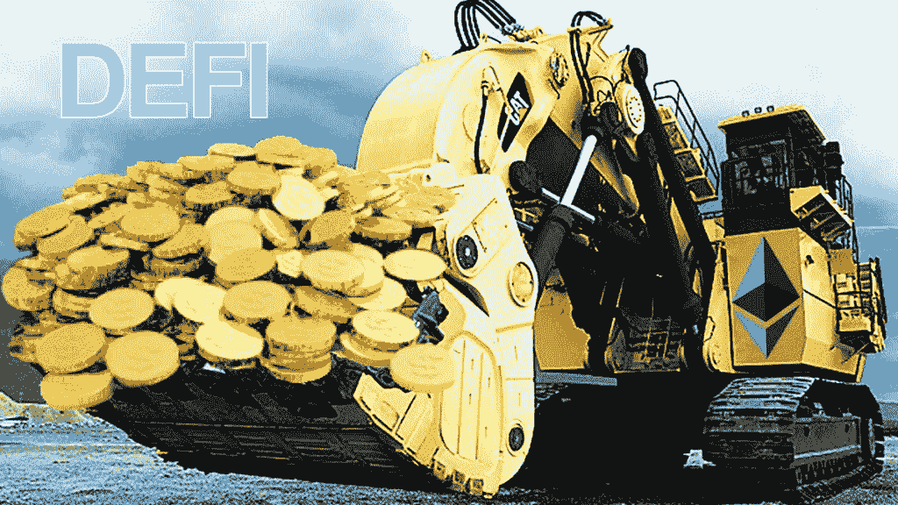
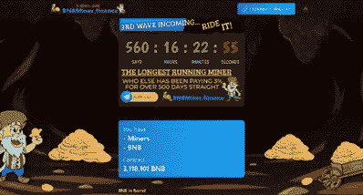
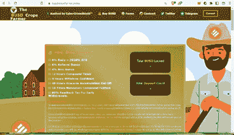
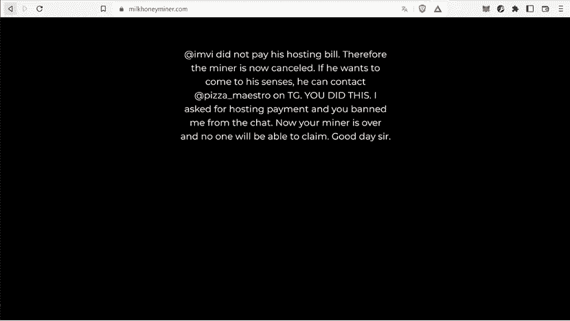
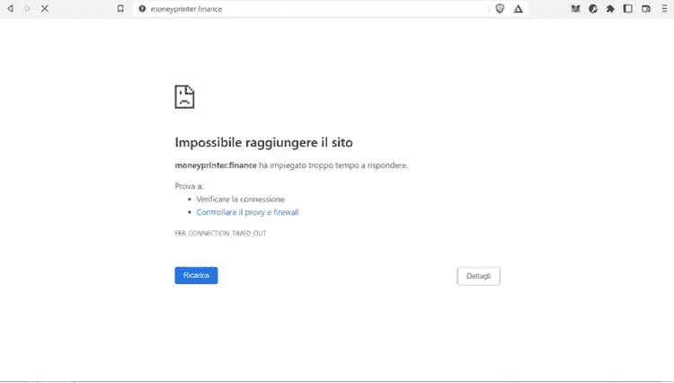
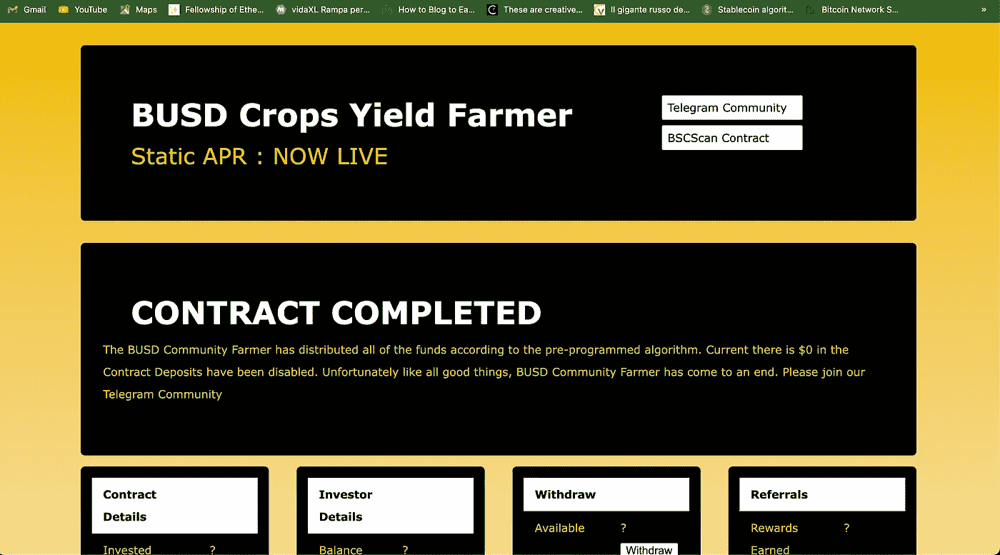

# DeFi 矿工:海市蜃楼背后的现实…

> 原文：<https://medium.com/coinmonks/defi-miners-the-reality-behind-the-mirage-bbd21ab3611e?source=collection_archive---------17----------------------->

Source: [https://coinmod.com/ethereum-miners-are-now-earning-more-than-half-a-million-dollars-per-hour/](https://coinmod.com/ethereum-miners-are-now-earning-more-than-half-a-million-dollars-per-hour/)

DeFi 以其特殊的操作特性和编程中最大的通用性成为一种“时尚”的猎物，虽然在图形层面上很好，但其本身隐藏着不小的陷阱。

我说的是矿工，因为他们在币安区块链特别成功，有些人不恰当地称他们为 BNB 矿工。

这里有一些例子

Source: [https://bnbminer.finance](https://bnbminer.finance/?ref=0x77850f855392E9Cfaa54f0e5e975b2e334268E43)

BNB 矿工，有一个智能合约日计数器

Source: [https://busd.cropsyieldfarmer.online](https://busd.cropsyieldfarmer.online/index.htm?ref=0x9a15eff26a65d1486e99f80105ca1faed016b0be)

庄稼农民，不要与丰收农场混淆，因为这些图画很容易让人想起它。

> 这些例子仅仅是为了说明什么是吸引人的图形。

# 但是这些“矿工”是怎么工作的呢？

T 通过智能合约，你锁定所有参与者的代币并创建 TVL。

这个 TVL 将用于分配奖励。奖励将会被支付，因为开发者已经赋予智能合约能够将它作为交易来管理的能力。

当然，智能合约将依赖于一个大部分时间都在套利的机器人:平均来说，风险低于实际交易。

这个生态系统是完全独立的，由我们熟知的各种组件运行——自动做市商(AMM)和分散式交易所。

通过这种方式，我们可能认为自己不会出现任何问题，但事实并非如此:尽管有审计，智能合同仍可以被修改。

*从这些修改中，我们可能会遇到的第一个问题是经典的地毯拉毛。通过简单的命令，TVL 被转移到一个钱包和…你好，你好基金！*

但是让我们回到谈论这些分散在网络各处的 dApps。

*   天文数字的回报是这种关注爆炸的第一个原因:每天从 1%到 3%
*   第二个原因是，如果你通过你的会员链接让人们参与进来，会有相当高的回报(大约 15%)。

# 这些回报现实吗？

乍看之下，我们可能会说这些奖励真的超出了任何可持续发展参数。

公平地说，我们将在这份智能合约上锁定的资金将不再能够收回: ***因此，你不是开始瞄准利息，而是开始瞄准收回你的钱……what？！？！***

嗯，TVL 暴跌，随之而来的是所有不太可能的回报。

为了弥补不便，其中一些矿工解释了需要做些什么来保持宣传的回报。

用我们锁定智能合同的资金，我们购买(取决于 dApp)矿工、打印机、种子、蜂蜜(有些真的很棒！)这些购买的物品“产生”代币，这些代币被放置在临时钱包中。

在智能合同规定的特定期限后，这些代币可以进行再投资，购买其他创收项目，或要求将其转回个人钱包。

请注意，如果我们决定购买其他创收物品，它们的数量会增加，但投入资本不会增加。(这是相当明显的:这些代币是否是由真实交易生成的？)

如果 TVL 急剧下降，回报也会下降，直到 TVL 枯竭。

我说过，有些人确切地解释了如何使收益率保持不变。这个例子是在 7 天的时间内完成的；6 天的再投资必须完成，7 日你可以撤回。

请注意，计算是在锁定资本上进行的，而不是通过复利获得的假设资本。

这些不严肃的时髦人士的真正资产是关系。通过加盟，你得到的百分比根据聪明的合同作者的决定而变化；无论如何，它们平均在 15%左右。

回报是实实在在的，也就是说，你获得了根据你的锁定资金计算出来的某个每日百分比。

现在做一个简单的计算:

让我们把 100 美元放入智能合同。让我们假设 3%的日收益率，我们一周“可以”提取一次。

每周我们可以提取 3 美元，一年 52 周就是 156 美元

鉴于本金是不可提取的，无论如何我们得到了 56 美元的投资回报率。这相当于 56%的 APY。

> **你认为可持续吗？**

让我们试着记住承诺 19% APY 的锚定协议，它正在经历一个相当黑暗的时期…

除此之外，还必须考虑另一个因素:我们能确定这个 dApp 的寿命如此之长，以至于它能“活”一整年吗？

我们是否还能确定，当 TVL 非常高，一切都完美运行时，我们不会遇到一场漂亮的拉锯战？

比如这个

Source: [www.milkhoneyminer.com](http://www.milkhoneyminer.com)

这个矿工被称为牛奶蜂蜜矿工。

或者这个:

Source: [www.moneyprinter.finance](http://www.moneyprinter.finance)

该网站不再可访问-显然，我最后一次看 TVL，它刚刚超过 1 BNB…

而且我可以保证不是网络负载问题。(我衷心祝愿那些已经投入资金的人，但鉴于 TVL 的暴跌，我认为他们首先是在寻求庇护！)

还有这个:巴斯德农民！
昨天很活跃，今天他们暂停了智能合同，因为 TVL 已经卖光了！

Source: [https://busd.cropsyieldfarmer.online](https://busd.cropsyieldfarmer.online/index.htm?ref=0x9a15eff26a65d1486e99f80105ca1faed016b0be)

好吧，伙计们，这篇文章警告你们这些暴涨的回报不可能持续。

如果社区里有人能证明我是错的，我会很高兴:我只试过其中的 3-4 个，总共花费了大约 200 美元，尽管我自己也没能收回所有的资本。

我想我设法找回了 60-70 美元，仅此而已。

> **有了交易，我就不会失去他们……**

> 交易新手？尝试[加密交易机器人](/coinmonks/crypto-trading-bot-c2ffce8acb2a)或[复制交易](/coinmonks/top-10-crypto-copy-trading-platforms-for-beginners-d0c37c7d698c)