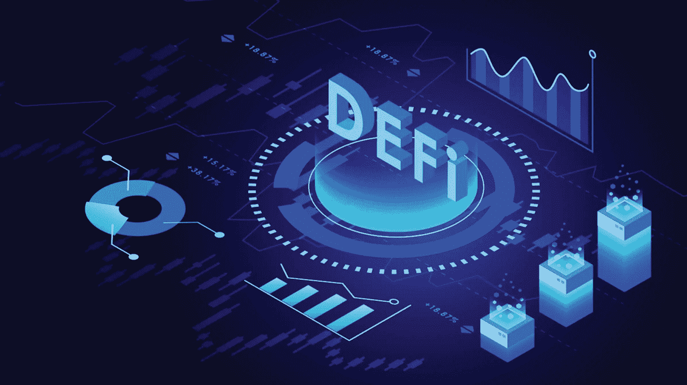

# DeFi 协议和主要 DeFi 解释

> 原文：<https://medium.com/coinmonks/defi-protocols-and-major-defi-explained-a9a0fad84916?source=collection_archive---------26----------------------->

Image Reference : [https://blockchain.news/news/decentralized-finance-defi-the-game-changer-in-creating-a-people-oriented-financial-ecosystem](https://blockchain.news/news/decentralized-finance-defi-the-game-changer-in-creating-a-people-oriented-financial-ecosystem)

分散金融(DeFi)协议是区块链技术中一个新的快速发展的领域。DeFi 协议建立在区块链网络之上，它们使得金融交易和服务能够以分散的、不可信的方式进行。

> 不知道什么时候买卖 cryp，试试[复制交易](http://coincodecap.com/go/bityard)。

DeFi 协议的一些例子包括借贷平台、分散交易所和合成资产平台。这些协议允许用户访问金融服务，例如借贷、交易和投资，而不需要中介，例如银行或其他金融机构。

DeFi 协议的一个主要优势是它们是开放的，任何有互联网连接的人都可以访问，无论他们在哪里或经济状况如何。这使得金融界的包容性和参与度更高。

DeFi 协议还提供了优于传统金融服务的几个好处。因为它们建立在区块链技术之上，所以比传统的金融服务更快、更便宜、更安全。

例如，DeFi 借贷平台允许用户从其加密货币存款中赚取利息，并以其持有的资产为抵押进行借贷，而无需进行信用检查或其他传统的进入壁垒。这可以为用户提供他们可能无法通过传统金融机构获得的流动性和信贷。

新 DeFi 协议的一些例子包括:

*   Aave:一个借贷平台，允许用户借出和借入各种加密货币，赚取存款利息。
*   Uniswap:一个分散的交易所，允许用户直接相互交易各种加密货币，而不需要集中的交易所。
*   Synthetix:一个允许用户交易合成资产的平台，合成资产是与股票、大宗商品和货币等现实世界资产的价值挂钩的数字资产。
*   Balancer:一个允许用户创建和管理定制加密货币投资组合的平台，自动重新平衡他们的持有量，以保持他们想要的配置。
*   复合:一个借贷平台，允许用户从其加密货币存款中赚取利息，并以其持有的资产为抵押进行借贷。

这些只是区块链空间中出现的许多新的 DeFi 协议的几个例子。这些协议正在促成新的和创新的金融服务和交易，它们正在向更广泛的参与者开放金融世界。

总的来说，DeFi 协议是区块链技术中一个充满希望和令人兴奋的领域，它正在推动金融领域的创新和颠覆。它们使金融交易变得更快、更便宜、更安全，并向更广泛的参与者开放了金融世界。

> 加入 Coinmonks [电报频道](https://t.me/coincodecap)和 [Youtube 频道](https://www.youtube.com/c/coinmonks/videos)了解加密交易和投资

# 另外，阅读

*   [CoinLoan 评论](https://coincodecap.com/coinloan-review) | [YouHodler 评论](/coinmonks/youhodler-4-easy-ways-to-make-money-98969b9689f2) | [BlockFi 评论](https://coincodecap.com/blockfi-review)
*   [XT.COM 评论](https://coincodecap.com/profittradingapp-for-binance)币安评论 |
*   [SmithBot 评论](https://coincodecap.com/smithbot-review) | [4 款最佳免费开源交易机器人](https://coincodecap.com/free-open-source-trading-bots)
*   [比特币基地僵尸程序](/coinmonks/coinbase-bots-ac6359e897f3) | [AscendEX 审查](/coinmonks/ascendex-review-53e829cf75fa) | [OKEx 交易僵尸程序](/coinmonks/okex-trading-bots-234920f61e60)
*   [如何在印度购买比特币？](/coinmonks/buy-bitcoin-in-india-feb50ddfef94) | [瓦济克斯审查](/coinmonks/wazirx-review-5c811b074f5b)