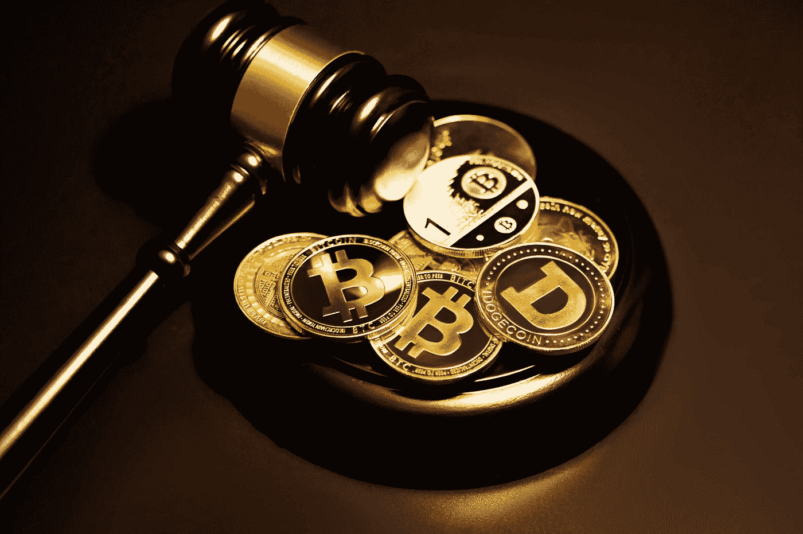

# DeFi:监管还是不监管？

> 原文：<https://medium.com/coinmonks/defi-regulate-or-not-db3622d6b919?source=collection_archive---------32----------------------->

Photo by [Kanchanara](https://unsplash.com/@kanchanara?utm_source=medium&utm_medium=referral) on [Unsplash](https://unsplash.com?utm_source=medium&utm_medium=referral)

Web3 行业巨头 Celsius、Voyager 和其他公司的倒闭，区块链站台和区块链大桥的一系列前所未有的故障——所有这些事件都直接提出了 DeFi 将如何继续存在的问题。市场参与者的意见有分歧——一些人认为该系统能够自我监管，另一些人则认为有必要监管亏损领域。让我们来解决这个问题！
透明度被认为是保证交易和交易的完整性。此外，透明度有助于发现金融体系的早期结构性缺陷和弱点。过去的金融危机(2008 年、1999 年)证实了这一点。

从这个角度来看，DeFi 今年的失败并不是消极的，相反，这是一个积极的趋势，因为错误并没有走得太远。摄氏度和航海家号迅速有效地坍缩。那是什么意思？这些公司的问题根源在于一些做法，这些做法根本无法在一个开放、开放的区块链持续下去。
所有交易背后的区块链技术的开放性意味着投资者可以很快看到并体会到他们的问题投资对这些机构资产负债表的影响。同样显而易见的是，一个投资组合的问题会如何影响另一个投资组合的偿付能力。因此，当一家公司无法履行其债务义务时，数据在整个系统中的传播是快速的，这正是我们所需要的。
现在，想象一下如果问题累积多年会发生什么？这对许多人会有什么灾难性的后果？尽管这些损失伴随着痛苦，但迅速揭露这些缺陷的区块链透明度，已成为整个系统生存的一个因素。

随着透明度和权力下放，很明显。主张加强监管的人提出了什么建议？

Photo by [micheile dot com](https://unsplash.com/@micheile?utm_source=medium&utm_medium=referral) on [Unsplash](https://unsplash.com?utm_source=medium&utm_medium=referral)

例如，earn.finance 的创始人 Andre Cornier 呼吁加强对消费者的保护，特别是在加密交易所和加密投资服务提供商方面，因为 Celsius 破产案导致用户收回资金的机制非常复杂。传统金融机构使用存款保险、审慎监管和消费者救济等可行的解决方案。例如，世界各地的中央银行都采用强制保险来保护消费者。在这种实践中，这通常意味着人们有一个可行的和相对容易的方法来收回他们的资金，不像 Celsius 的情况。

## 下一步是什么？

分散金融的新兴世界不会做出粗心和草率的决定。因此，一切开放和允许的观念以及效仿传统银行业的严格监管原则也是不合适的。要解决加密金融的监管问题，必须考虑以下因素。
1。为了让监管机构确定哪些资产应受分散资产特定规则的管辖，哪些资产应受现行立法的管辖，必须了解特定资产是否分散。
2。加密货币不像其他的那样是一种资产类别，所以不能归属于现有的证券法。加密货币不是一种证券或商品，而是一种数字资产。它具有独特的特点，需要自己独特的法律框架
3。一个重要的细微差别是理解加密生态系统不同部分之间的差异。例如，稳定的硬币由实物资产支持，NFT 由艺术或公用事业支持，比特币由电力支持。理解差异很重要，不要同时监管所有加密货币。
4。监管不应成为创新的障碍。最大化控制的诱惑是巨大的，但是创新的发展和进步需要思想和创造力的自由。如果监管者通过十年前的法律来看待先进技术，他们不仅无法理解它们的潜在好处，还会吓跑数百万年轻企业家。
5。隐私是加密经济的基础，必须得到尊重。这是不言自明的。

## 该不该有监管？

上面我已经概述了国家在监管加密金融和整个网络时应该考虑的基本原则 3。保护普通用户的权利和颠覆性技术之间的合理平衡非常微妙。这肯定需要所有有关方面的智慧和耐心。如果平衡原则在实践中得到尊重，一场新的积极的经济革命将真正等待着我们！

…

如果你喜欢我的文章，请留下评论并鼓掌。谢谢大家！

> 交易新手？尝试[加密交易机器人](/coinmonks/crypto-trading-bot-c2ffce8acb2a)或[复制交易](/coinmonks/top-10-crypto-copy-trading-platforms-for-beginners-d0c37c7d698c)