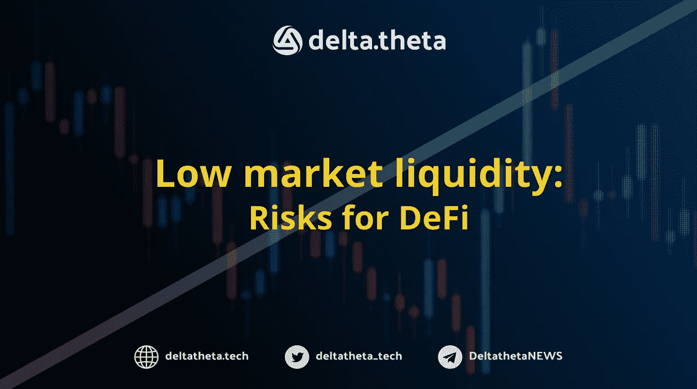

# 低流动性市场的违约风险

> 原文：<https://medium.com/coinmonks/defi-risks-at-the-low-liqudity-market-d976ebec2f48?source=collection_archive---------11----------------------->

2022 年的全球加密市场似乎经受住了所有可能的挑战。也许是时候反思 2020 年夏季 DeFi 市场的一些显著成就了。

分散式交易所、交易所聚合器和支线服务在 DeFi 革命中发挥了核心作用，这已经不是什么秘密了。Uniswap、AAVE、Compound、Maker 和 Curve 是在当前分散融资环境中发挥核心作用的项目，也是许多其他团队的榜样。

然而，最近，它们越来越多地出现在新闻中，成为可能的经济效率低下的例子。上周对 AAVE 服务贷款的恶意利用迫使整个 DeFi 社区对不断变化的市场条件做出迟来的(但最终)反应。

这个计划相当简单，尽管它需要大量的资金。私人交易员 Avraham Eisenberg 于 10 月 19 日在 T2 发表了一篇关于如何在低流动性条件下利用分散贷款服务影响代币价格的文章。艾森伯格因负责利用 DEx 衍生品交易所芒果市场的一个明显漏洞而广为人知。该交易商赔偿了该交易所 1.1 亿美元的保险库损失，换取了 3300 万美元的溢价和放弃任何法律索赔。

对该协议的攻击始于 11 月 13 日，在 USDC 有一笔约 3800 万美元的存款，在 CRV 有一系列代币贷款。然后，该交易员使用 1 英寸路由器卖出 CRV，并用这笔资金在 AAVE 上存款。通过对价格施加压力，他减少了贷款的规模，再加上出售所得的资金和 AAVE 的新存款，总计约 2400 万 USDC，将现货市场的价格从 0.62 美元降至 0.43 美元。

价格压力的另一个来源可能是另一笔 4300 万美元的外部贷款，清算价格为 0.29 美元(约 1.4 亿 CRV 承诺)。鉴于 CRV 币的整体交易量较低，现货市场的这种巨大压力可能会导致价格进一步下跌。

然而，攻击者似乎未能完全实施他的计划。11 月 23 日，在 Curve 项目 stablecoin 推出的细节和[文件](https://github.com/curvefi/curve-stablecoin/blob/master/doc/curve-stablecoin.pdf)发布的背景下，token 价格大幅上涨[导致贷款清算](https://debank.com/profile/0x57e04786e231af3343562c062e0d058f25dace9e/history)。

结果，由于价格的急剧变化，一些贷款仍然不能通过公开市场出售，AAVE 议定书留下了 160 万美元的“坏账”。

很难从财务结果的角度评估攻击的最终成功，因为没有关于攻击者在集中交易所的头寸的公开信息。鉴于攻击目标不仅可能是曲线令牌，也可能是 AAVE，在更多“坏”债务的情况下，它将被迫通过在现货市场上出售 AAVE 令牌来弥补其安全基金清算人的损失——那么很难对数字做出明确的结论。

理论上，如果在现货销售之外使用期权，攻击可能会更有效——积极购买看跌期权可能会迫使做市商通过增加空头头寸来增加其安全头寸。然而，加密货币市场目前还没有那么发达，因此在低流动性市场中，通过贷款和现货销售形成的杠杆空头头寸只能通过集中交易所的期货来补偿。

这一攻击引发了关于准备金会计参数的高度讨论，并导致 AAVE 和复利的低流动性协议限制借款。

站点— [增量技术](https://deltatheta.tech/)

推特——https://twitter.com/deltatheta_tech

场外电报组-【https://t.me/deltatheta_TradingGroup 

> 交易新手？尝试[加密交易机器人](/coinmonks/crypto-trading-bot-c2ffce8acb2a)或[复制交易](/coinmonks/top-10-crypto-copy-trading-platforms-for-beginners-d0c37c7d698c)