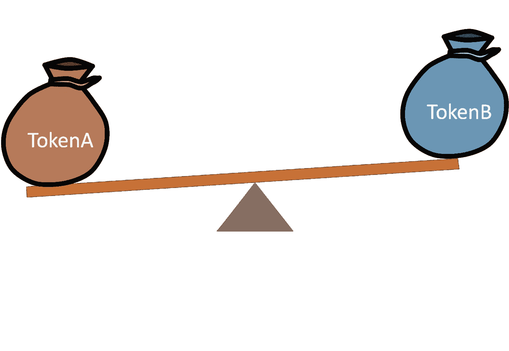
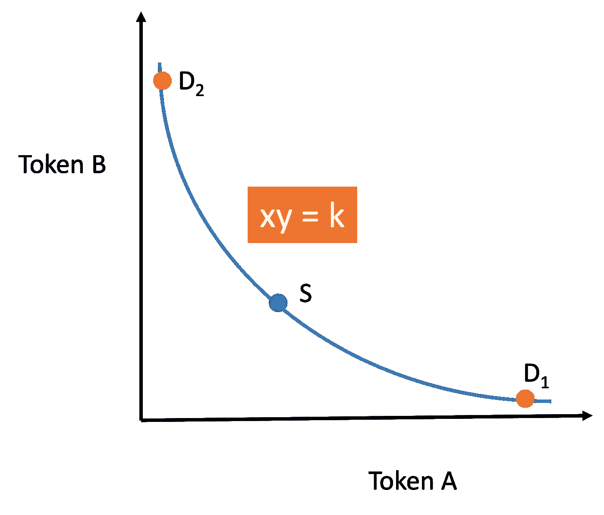

# DeFi 系列| CPAMM 的意义

> 原文：<https://medium.com/coinmonks/defi-series-significance-of-cpamm-b28f7b3f3e00?source=collection_archive---------17----------------------->

CPAMM **实际上是什么**？

欢迎读者！

我最近对 DeFi 项目很感兴趣。我想出了一些对许多 DeFi 爱好者来说可能很有趣的东西。

## 背景

你有没有想过从哪个 AMM 中选择？

有这么多妈妈。其中最受欢迎的是 Uniswap 使用的常量产品自动做市商(CPAMM)。

但是，这还不是全部。

你听说过恒和自动做市商(CSAMM)吗？

如果是，那么为什么不选择它呢？

## 知识

TokenA & TokenB in a pair pool

好吧，首先让我告诉你，没有哪个 DEX 会希望出现令牌储备为零的情况。这将意味着零储备代币的价格将会飙升到一个非常高的值，在 CPAMM 中接近无穷大。这将导致大量的套利交易，这将完全丧失其在市场上存在的全部目的。

>除了作为交易者交换代币和为有限合伙人提供流动性的媒介之外，指数还被用作参考代币价格的手段，如 Chainlink 等神谕。

## 论证

现在，让我们直接进入这篇文章的主要目的。

在此之前，您是否知道存在一个最佳点，在这个点上，DEX 希望始终保持流动性值，即在`xy = k`中，`k`值应该理想地处于该点。

但是，实际情况并不像理论要求的那样。

CPAMM Curve with highlighted points

在这条曲线中，

`S` →稳定点

`D1` →危险点朝向令牌 A

`D2` →危险指向令牌 B

所以，`S`是储备代币流动性应该一直在的点。

如上所述，`D1`、`D2`是令牌对中的任何一个到达零储备的危险点。

暂时就这样了。

我们将在下一篇博客中继续这个系列:“DeFi 系列|为什么是 CPAMM？”

在那之前，敬请关注！当心🙂。

下次博客见。

感谢您为本文付出宝贵的时间。

## 跟我来:

邮箱—[dalvath3700@gmail.com](mailto:dalvath3700@gmail.com)
Github—[https://github.com/abhi3700](https://github.com/abhi3700)
电报—[https://t.me/abhi3700](https://t.me/abhi3700)
Steemit—[https://steemit.com/@abhi3700](https://steemit.com/@abhi3700)
LinkedIn—[https://www.linkedin.com/in/abhi3700/](https://www.linkedin.com/in/abhi3700/)
Twitter—[https://twitter.com/abhi3700](https://twitter.com/abhi3700)
Medium—[https://medium.com/@abhi3700](/@abhi3700)
Fiverr—[https://www.fiverr.com/abhijitroy294](https://www.fiverr.com/abhijitroy294)
Facebook—[https://www . Facebook . com/abhi](https://www.facebook.com/abhi3700)

> 交易新手？尝试[加密交易机器人](/coinmonks/crypto-trading-bot-c2ffce8acb2a)或[复制交易](/coinmonks/top-10-crypto-copy-trading-platforms-for-beginners-d0c37c7d698c)