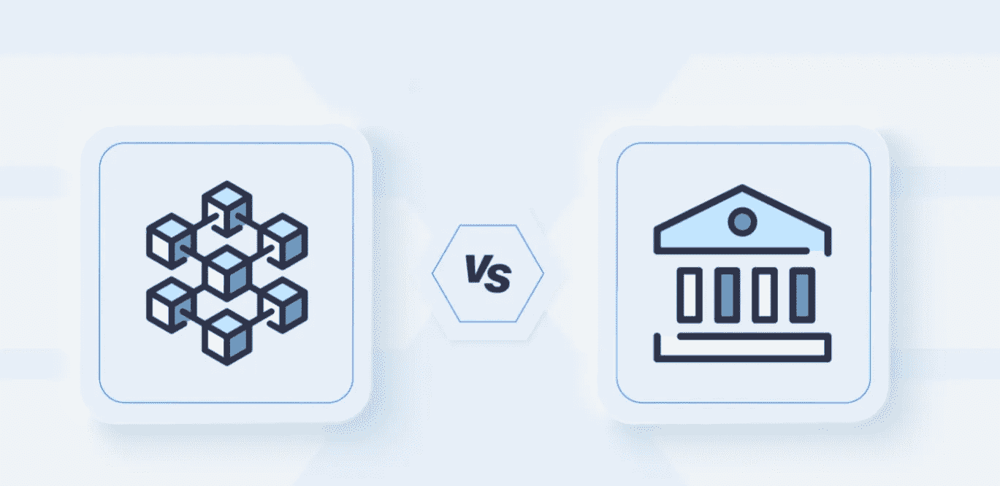

# DEFI:传统金融的伟大替代品

> 原文：<https://medium.com/coinmonks/defi-the-great-alternative-to-traditional-finance-ec1a0a2f08e4?source=collection_archive---------44----------------------->

从技术的角度来看，我们可以将 DeFi 定义为那些开源的金融计划或项目，它们以一种完全去中心化和公开的方式进行管理和执行。

为了理解 DeFi，我们必须简要了解一下完全集中的传统金融系统(TradFi)。简而言之，传统金融系统的特点是**由企业、企业集团、**组织或机构**监管和/或管理的部门，因此，其机制也由企业、企业集团、组织或机构监管和/或管理。**这样做的结果是，用户必须依赖第三方**，第三方存储他们的资金，为他们提供各种服务。**

TradFi 中最明显的例子是银行，作为存款、资金转移和其他金融产品中介的金融机构。

分散金融打破了这种模式，**让用户完全控制他们的资产**，而不需要任何中介来访问不同的金融产品，如:贷款、交易、支付、资产管理等。

与 TradFi 或 CeFi 不同，DeFi 的可能性是巨大的，如果你想向另一个人汇款，你不需要中介来完成这个过程，你可以自己做，对你的资产拥有主权，随时决定如何处理它们，如何以及在哪里保存它们，你只需要一个钱包(我们稍后会谈到)，一台电脑或一部手机和一个互联网连接。

除了银行，现在我们有像 Bizum 这样的平台，允许即时转账，所以此时你可能会想:如果他们允许我即时转账，DeFi 比这些平台有什么优势？

答案很简单，Bizum 和其他支付处理器的运营不依赖于我们，他们依赖于一个中介，而这个中介可能会在某个时候失败。在 DeFi 中不会发生这种情况，**因为除了你之外，没有人控制你的资产**，如果你想将比特币发送给另一个人，你直接这样做，不需要第三方。一切都发生在区块链，它以分散和自治的方式运作。

DeFi 部门的伟大变革不是你可以获得的巨大回报，(尽管我们不要欺骗自己，我们都喜欢赚钱)伟大的变革是**摆脱金融机构的束缚**一旦我们的钱存入他们的实体，他们就会利用我们的钱进行杠杆操作，这甚至可能以破产告终，并且在破产的情况下剥夺你提取自己的钱的能力。

显然，DeFi 部门不是没有风险的，但是正如我们已经提到的，你在任何时候都拥有你的资产，并决定如何处理它们，这难道还不足以激励你至少考虑它吗？

你能想象想要申请贷款而不必经过商业银行通常向其客户提交的费力的研究过程，以便最终根据你的经济能力和信用历史决定你是否有资格获得贷款吗？

有了 DeFi，所有这些以及更多都是可能的。

在结束这一部分之前，应该特别提到“交易所”或集中交易所，CeFi。可能你们中的许多人已经开始在这种类型的平台上购买密码(我们都有)。一开始这是最简单和最方便的，因为这样做不需要特殊的技能或知识。您只需输入您的 visa 卡详细信息，即可轻松快速地购买您想要的加密货币。

但这也带来了一个缺点，**与银行一样，你依赖于第三方**，他们是保护(和管理)你的资产的人，而不是你，承担着随之而来的风险。我们说的是什么风险？嗯，举个例子:

*   **黑客:**一个交易所可以被黑客攻击，导致其用户的资金损失，如果你认为币安或另一个大型交易所不可能发生这种情况，记得 Mt. Gox，它是当时最大的交易所(就像币安现在一样)。2014 年，一次黑客攻击导致其用户损失了约 85 万比特币。
*   **临时取消提款:**一些交易所在网络高度拥堵和市场波动时取消提款是非常常见的，这导致在任何给定时间，如果你想从平台上提取资产，你都无法做到，这听起来是不是很熟悉？类似于银行关门不允许用户提取资金。
*   **破产:**最近，我们的“Celsius”平台破产，该平台最近宣布破产，许多用户的资金被冻结在平台上，怀疑他们是否能够追回这些资金。

简而言之，把你的资产放在一个集中的交易所，CeFi，类似于把它们放在一个“银行”里，当它们在平台里的时候，你并不拥有它们…也许现在你已经意识到作为一个用户，信任一个第三方平台来为你保护你的资产的风险，如果是这样，我邀请你继续阅读，看看你能做些什么。

# 加密货币钱包

如果您已经走了这么远，您可能会想，这是关于 DeFi 的所有好东西，但是我如何将它付诸实践呢？

这就是钱包发挥作用的地方。术语钱包指的是虚拟钱包，我们可以用它来管理我们的加密资产。每种加密货币都有自己的钱包，在大多数情况下，我们需要为每种资产准备一个单独的钱包。例如，存储“以太坊”需要一个特定的钱包，存储“比特币”需要一个不同的钱包，等等。除了这些，还有多资产钱包，即允许我们在同一个钱包中存储来自不同区块链的加密货币的钱包。起初，这似乎更方便(因为我们不需要为每种加密货币准备不同的钱包)，但同时，在我看来，这是一种不太安全的做法，因为如果出于任何原因我们无法访问钱包，我们将失去所有的加密资产。一旦我们的钱包里有了加密货币，我们就可以开始直接与 DeFi 中存在的不同协议进行交互，发送资产，接收资产，等等。

这有一个学习曲线，因为与交易所不同，在那里他们管理我们的资产，我们只是购买，然后忘记其他的，正如我们之前提到的，在 DeFi **我们将不得不学习如何管理钱包**，以及哪些钱包对应于每个区块链。起初，这似乎很难，但值得学习，因为我们谈论的是对我们资产的完全控制，以及由此带来的所有好处(已经提到)。

## 简而言之，钱包是如何工作的？

钱包通过所谓的“私钥”和“公钥”工作。

*   **公钥**类似于银行账号。我们可以把它给任何给我们寄钱的人，而没有他们能够提取我们的资金的风险。通过公钥，生成地址来接收、咨询和查看我们的资金状态。
    **私钥**就像一个 PIN 或密码，我们不应该向任何人透露，因为它赋予我们访问和使用一个地址的加密货币的权利。因此，私钥的所有者将是资金的所有者，并将对资金拥有完全的控制权，因此在您开始使用这些工具时，保存私钥是一个关键点(如果您丢失了私钥，您将无法访问您的资产)。

一旦我们创建并配置了我们的钱包，我们将需要向它发送一定数量的加密货币才能使用它。这里涉及到另一个叫做“气体”的概念。这种“气体”就像是我们必须为我们用钱包进行的每笔交易支付的“佣金”，这种“气体”将以每个区块链的相应加密货币收取。如果我们正在与以太坊区块链进行交互，当使用钱包时，对于我们进行的每一笔交易，我们都将被收取一定量的以太币以进行处理。

有不同类型的钱包，有不同的应用和不同的安全级别，但我们将把这留给另一篇更详细和具体的文章。

> 交易新手？试试[加密交易机器人](/coinmonks/crypto-trading-bot-c2ffce8acb2a)或者[复制交易](/coinmonks/top-10-crypto-copy-trading-platforms-for-beginners-d0c37c7d698c)