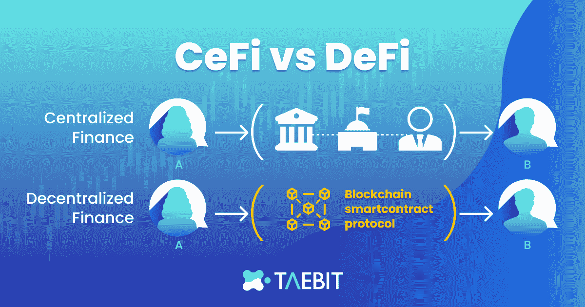

# DeFi vs. CeFi:哪种金融服务更适合你？

> 原文：<https://medium.com/coinmonks/defi-vs-cefi-which-financial-service-is-more-suitable-for-you-ca38af7609d9?source=collection_archive---------33----------------------->

全球外汇市场是世界上交易量最大的市场，每天的交易额超过 4.6 万亿美元。这些市场也是散户、长期投资者和机构市场参与者最青睐的市场。虽然集中式经纪人代表了外汇市场上的大部分每日交易量，但 [Taebit](https://taebit.gitbook.io/taebit-1/) 代表了区块链上分散式外汇生态系统的创建。

# **什么是集中财务？**

在推出兼容加密的外汇市场之前，金融活动和交易的主要枢纽是通过 CeFi 经纪商。在集中金融中，所有外汇交易订单都通过中央交易所执行。资金由这些交易所管理，交易费用由这些集中的实体提取以获取利润。此外，当你在中央交易所交易时，你必须遵守交易所强加给你的规则。使用 CeFi 交易所使市场参与者容易受到公司风险和人为错误的影响，并迫使用户同意交易所的条款。

# **什么是分散金融？**

通过 DeFi 平台进行投资和交易意味着在这个过程中没有中央实体或交易所参与。整个生命周期通过基于区块链平台开发的自动化应用程序运行。DeFi 还创建了一个公平透明的金融系统，允许任何用户参与，同时让没有银行账户的个人获得他们通过 CeFi 无法获得的金融服务。DeFi 旨在建立一个开源、无权限、透明的金融服务生态系统。

# **热门 CeFi 外汇平台**

Source: Investingoal

[面向零售参与者的五大 CeFi 外汇交易所](https://investingoal.com/largest-brokers-world-volume/)分别是 IC Markets、forex、XM、盛宝银行和 HotForex。 [IC markets](https://www.icmarkets.com/global/en/?camp=27372) 日均交易量达 189 亿美元，提供超快速执行，从收到订单到执行平均只需 40 毫秒。Forex.com 允许用户交易 80 种不同的货币对，并提供实时市场分析和交易信号。XM 是欧洲最大的交易所之一，拥有 1000 多种交易工具和 55 种货币对。盛宝银行因其复杂的指标和交易时获得高杠杆的能力而闻名。最后， [HotForex](https://www.hotforex.com/sv/en/account-types/new-live-account.html?refid=10320458) 在美国不可用，但他们确实提供市场领先的高达 500 万欧元的保险，并且他们的平台上有超过 350 万活跃交易者。

# **流行的 DeFi 平台**

五个最大的 DeFi 交易平台是 Uniswap、Curve、PancakeSwap、Osmosis 和 Trader Joe。Uniswap 在区块链**以太坊**运营，是访问量最大的分散式交易所，总交易量超过 1 万亿美元。Uniswap 也是所有去中心化应用中开发者活动最多的平台。 [Curve Finance](https://curve.fi/) 平均每天有 2 亿美元的交易量，是 DeFi 生态系统中产量最高的来源之一。 [PancakeSwap](https://pancakeswap.finance/) 是**币安智能链**上的一个分散式交易所，拥有超过 1350 万每日用户和 4260 个活跃交易的挂牌代币。 [Osmosis](https://osmosis.zone/) 在 **Cosmos** 区块链上运营，是 DeFi 领域增长最快的分散式交易所之一，其 Cosmos/OSMO 资产池超过 3 . 79 亿美元。商人乔在雪崩区块链经营，虽然它的总价值已经下降，但在全盛时期，估计每天有 330 万游客。

# **对于交易者来说，CeFi 和 DeFi 有什么区别？**

Source: [Cointelegraph](https://cointelegraph.com/defi-101/defi-vs-cefi-comparing-decentralized-to-centralized-finance)

对于交易者和长期投资者来说，DeFi 和 CeFi 有几个核心区别。

第一个主要区别是围绕执行的方法和你决定使用的平台收取的费用。CeFi 交易所在费用结构方面有不透明的规定，通常根据交易规模或用户账户总余额的大小而变化。类似地，CeFi 中的执行因经纪商而异，但大多数 CeFi 交易所使用集中的订单簿模型，该模型匹配买卖订单，以保持价格发现过程的稳定性。在 DeFi 中，费用结构通常是统一的，无论用户的账户余额是多少，所有主要交易所都从交易规模中抽取相似的百分比。在不同的 DeFi 平台上，执行会有所不同。Uniswap 使用一个 [AMM](https://moonbeam.network/education/what-is-uniswap/) (自动做市商)系统来发现真实价格，并确保投资者在交易中获得尽可能好的价格。其他 DeFi 平台，如 [Serum](https://www.projectserum.com/) ，反映了集中订单簿模式，但使用分散订单簿，在整个平台上匹配特定资产的买卖订单。

DeFi 和 CeFi 平台都允许用户从事加密货币交易、衍生品交易、借贷和杠杆交易。然而，DeFi 平台允许用户控制其所需交易的具体条件，并且它们是非托管的，这意味着用户可以获得自己的资金，而 CeFi 平台要求用户将资金发送到平台，如果他们想退出头寸或收回本币，则从平台中退出。DeFi 还通过区块链为用户提供完全透明的头寸。可以在特定于链的区块链记录上跟踪头寸，例如分别针对以太坊的 etherscan.io、针对 Solana 的 solscan.io 和针对 Avalanche 的 avascan.info。使用 DeFi 的另一个好处是，用户可以从世界任何地方访问分散的交易所，而不必通过正式的 KYC(了解你的客户)过程。这使得交易能力民主化，因为许多国家禁止某些公民参与传统金融市场。

# **弥补 DeFi 和 CeFi 之间的差距**

DeFi 和 CeFi 都有许多优点和缺点。未来正在走向定义。然而，仍有一些部分需要改进，以便贸易商从 DeFi 中充分受益。下一个 DeFi 的最接近版本将是 Taebit。Taebit 代表了一个去中心化外汇技术的新时代，它将确保世界外汇市场向区块链开放。通过 Taebit 平台，用户将能够从透明的分散订单簿技术中获益，同时仍能以本国法定货币进行交易。

# 关于泰比特

[Taebit DEX](https://taebit.gitbook.io/taebit-1/) 是一个**非托管分散式交易所**(简称“DEX”)，由一个分散式外汇(“forex”)市场通过全球首个单一储备、混合算法**全币种 stablecoin 引擎**、 [Alkemy](https://taebit.gitbook.io/alkemy/) 提供动力。Taebit 是一个基于 Solana 的 DEX 平台，其灵感来自于韩国交易所的集中性质，并与 web3 的核心理念保持一致，将 DEX 的功能与功能完善的外汇(FX)市场的基础设施相结合。

Taebit DEX 将允许全球数百万用户在一个平台上用本国货币进行交易。当前加密生态系统的一个主要陷阱是**财富**集中在美元支持的稳定账户和少数受欢迎的连锁店。Alkemy mint 系统提供了一个公平的选择，并由用户的偏好而不是公司的利益来引导。

Taebit DEX 是专门为解决大多数投资者担心的可用性和集中化问题而设计的。Taebit DEX 将是一个为加密本地人和活跃交易者构建的易于导航且健壮的协议，旨在创建**一个在进入/退出头寸和兑换货币之间的无缝工作流程**。Taebit DEX 还将加入类似于**内部稳定互换**的功能，这将使投资过程对于面临高滑点或提前运行(即，地毯被拉)风险的投资者来说更加安全。

传统的外汇市场是世界上最具流动性的市场，每天 24/7 开放，日交易量超过 6 万亿美元。通过构建一个以加密为中心的外汇市场，并提供**实时数据反馈**，我们可以弥合 Web 2.0 和 Web 3.0 之间的差距，同时让业内最大的金融机构接触加密货币交易世界。由于 Taebit 能够在同一个外汇平台内处理多种货币，我们也可以让全球的散户投资者在加密史上第一次兑换和交易他们的本国货币。

***跟随我们上 Taebit*** *☯️*

> 推特:[https://twitter.com/TaebitDEX](https://twitter.com/TaebitDEX)
> 
> 不和:[https://discord.gg/gBjqjFXmn2](https://discord.gg/gBjqjFXmn2)
> 
> 电报:[https://t.me/+4kkLYgMPtZw3NjJl](https://t.me/+4kkLYgMPtZw3NjJl)
> 
> 网址:【https://taebit.io/ T3

> 交易新手？试试[密码交易机器人](/coinmonks/crypto-trading-bot-c2ffce8acb2a)或[复制交易](/coinmonks/top-10-crypto-copy-trading-platforms-for-beginners-d0c37c7d698c)