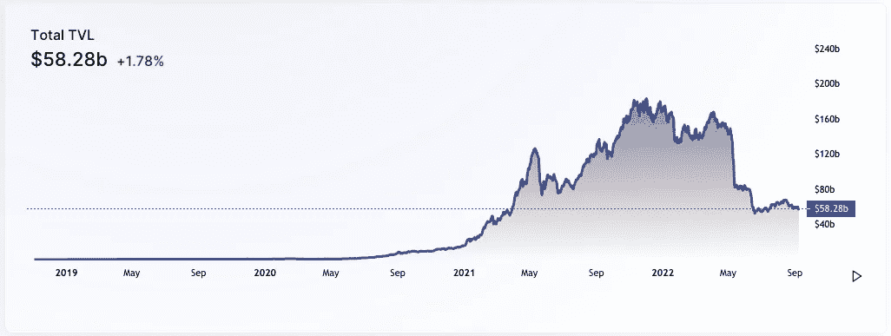
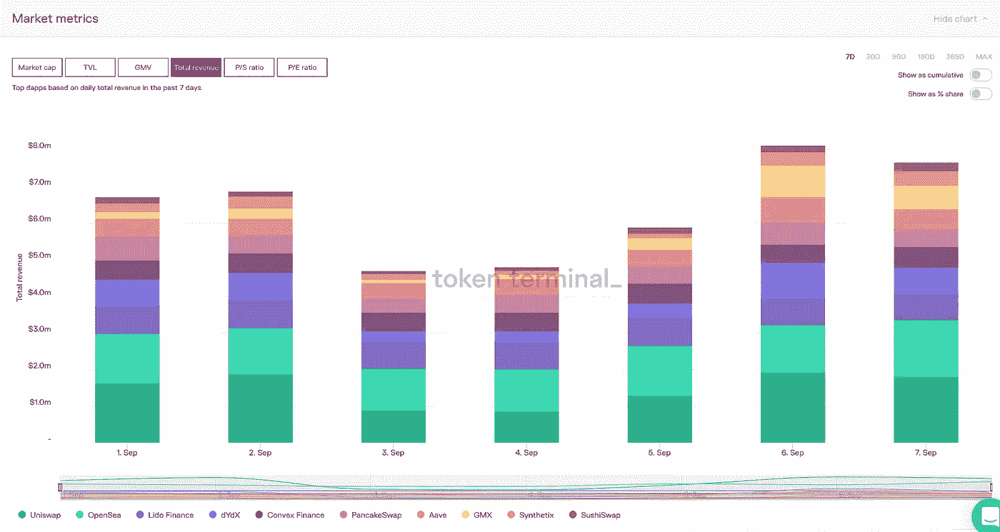
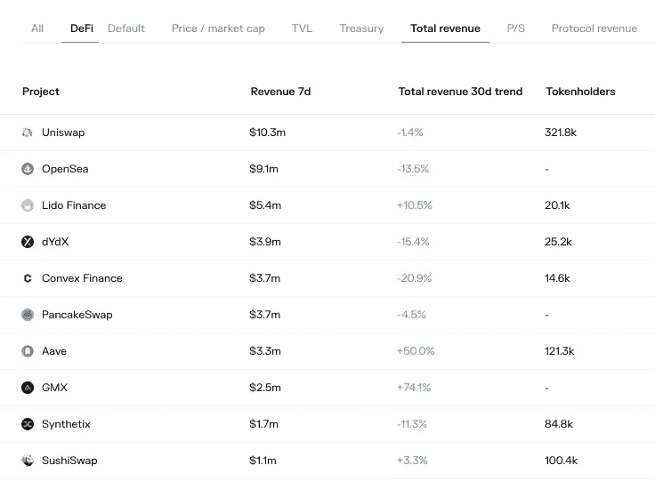
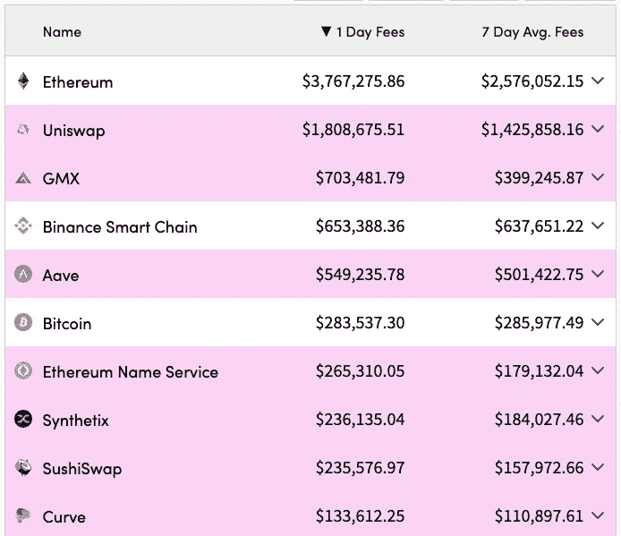
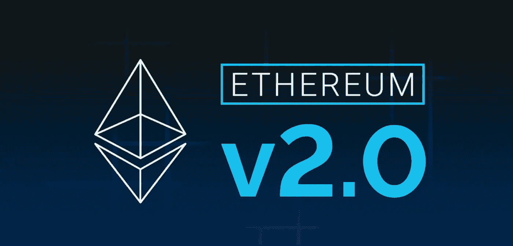
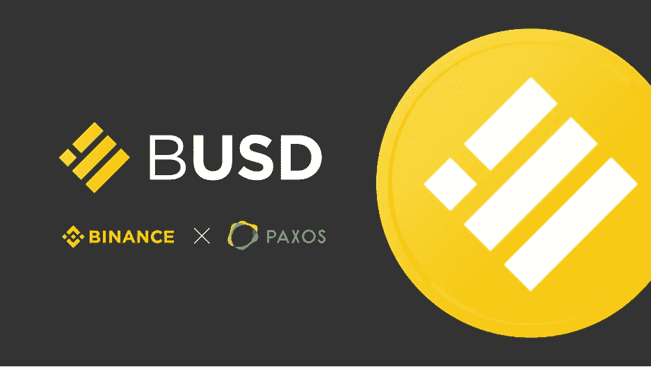
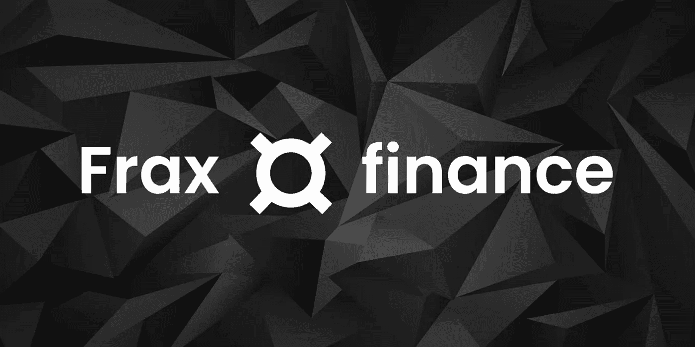
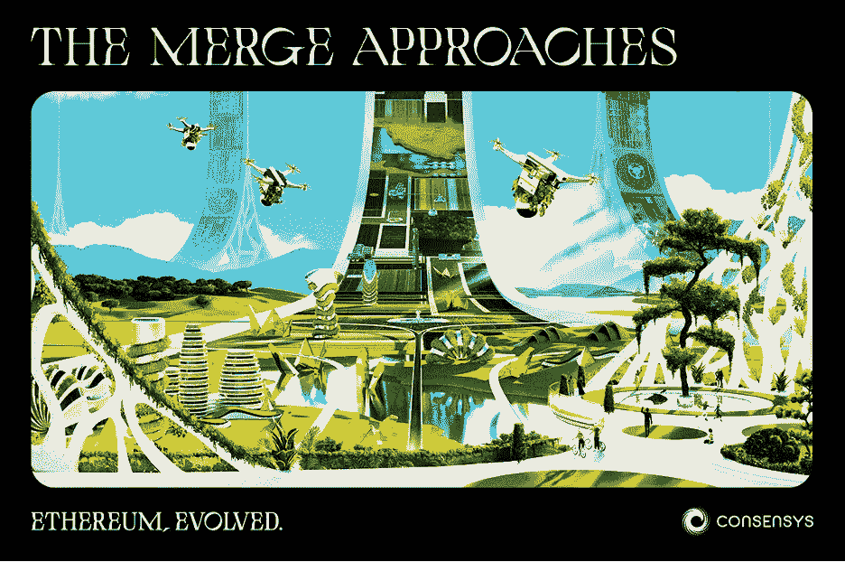

# DeFi 每周汇总(币安汇总 BUSD、法国、自由合并 NFT 的所有稳定积分)

> 原文：<https://medium.com/coinmonks/defi-weekly-roll-up-september-9-2022-87089588923e?source=collection_archive---------48----------------------->

# **市场状况**

*DeFi 分析师吉姆·弗兰科*

所有协议的 DeFi 市场锁定的总价值(美元)目前为 582.8 亿美元，较上周下降 1.6%。虽然加密市场有一个价格回落，许多新的令人兴奋的 DeFi 项目每月出现。

## **DeFi 收入排名**

Uniswap 仍然是过去七天中收入最高的公司，其次是 Opensea marketplace 和 Lido。

永久性掉期交易的新来者 GMX 继续占据主导地位，过去 30 天的收入增长了 74.1%。

由于对即将到来的合并的预期，贷款协议巨头 Aave 在过去 30 天的收入增长了 50%，表现良好。推测是用户借尽可能多的 ETH，预期随着合并的临近价格会上涨。请注意，合并后，ETH 令牌持有者也将获得 ETHPOW 令牌。

## 哪些是人们付费使用的？

以太坊网络占据了最大的每日费用，其次是 Uniswap，也是以太坊本地的，7 天平均费用约为 14 亿美元。Uniswap 是一个分散的交易所，交易者向流动性提供者支付交易费用。

值得注意的是，一些协议与令牌持有者分享其平台收取费用的一部分。GMX，曲线，和 LooksRare，仅举几例。

# 本周新闻！

## **以太坊最后一个硬叉贝拉特里克斯已经完成！**

最后，智能合同巨头准备好了最期待的合并。本周，我们看到信标链在期待已久的以太坊合并之前经历了贝拉特里克斯硬分叉，合并将在 9 月 13 日至 17 日之间进行。

托管去中心化应用的以太坊虚拟机的更新被称为 Bellatrix。根据以太坊基金会的说法，升级将提高网络的可扩展性、速度和安全性，并为实施以太坊 2.0 网络指明道路。

**什么是分叉，它需要什么？**

贝拉特里克斯(Bellatrix)是以太坊有史以来最关键的叉子，是它将 ETH 从工作证明(POW)过渡到利益证明(POS)所必需的。

以太坊在合并前的最后升级终于在周二的 144，896 纪元开始。随着贝拉特里克斯的激活，该团队朝着本月接下来几周备受期待的合并计划又迈进了一步。

合并会进行很多天，当最终总难度(TTD)达到特定值(58750000000000000000000)时，合并将会完成。

这将标志着押上以太坊新时代的开始。八年后，以太坊采取了重大步骤，准备并计划在 2022 年初推出以太坊合并升级版。一旦升级完成，以太坊 2.0 链将在现有 mainnet 以太坊链和 Beacon 链的融合下诞生。

## **币安将所有稳定的外汇储备汇总到 BUSD**

币安表示，USDC、pax dollar (USDP)和 trueUSD (TUSD)的现有余额和新存款将于美国东部时间 9 月 29 日晚上 11 点转换为 BUSD。

这意味着 stablecoin 将整合到该平台的原生 stable coin，BUSD。不过，此举不会影响取款，币安客户仍可以取出以三种稳定货币计价的资金。

BUSD 由第三方 Paxos 管理，该公司处理美元赎回、资产债券和证明。

币安补充说，USDT 不是参与自动转换计划的稳定成员之一，但没有提供原因。当被问及币安的钱包里目前有多少 USDC 时，这位发言人拒绝置评。

这一决定有效地将第二大稳定币 USDC 从 crypto 最突出的地位之一驱逐出去，为超越最大的稳定币泰瑟(USDT)设置了障碍。USDT 680 亿美元的市值领先 USDC 的 520 亿美元，而 BUSD 以 190 亿美元排名第三。USDP 和 TUSD 要小得多。

## **Fraxlend: Frax 金融借贷市场**

Fraxlend 是一个借贷市场，它允许任何人用任何属于 Chainlink 数据馈送的令牌来借出或借出资产。

Fraxlend 将为 Frax Finance 创造更多现金流，可用于回购和烧毁其治理令牌 FXS。

**法克斯兰德与 AAVE 和其他借贷市场有何不同？**

有了 Fraxlend，用户可以用他们选择的任何令牌借入或借出资产，因为它列在 Chainlink 数据馈送上。根据 Frax Finance 的核心开发人员 Drake Evans 的说法，Fraxlend 借贷市场有两种不同的用例。

首先，法克斯伦德将允许通过协议上的贷款程序铸造稳定的 FRAX 币。FRAX，Frax Finance 的原生令牌，是第一个具有双重混合算法的稳定币。它是开源的，无权限的，部署在[以太坊](https://thecoinrise.com/cryptocurrency/ethereum/) (ETH)区块链上。目前固定在每单位 1 美元。

Fraxlend 允许 Frax Finance protocol 向 Frax 放贷，并直接通过现有货币市场赚取利息。

**用例**

DeFi 贷款平台以高水平的创新而闻名，Fraxlend 也不例外。

*“frax lend 是最新一代的借贷协议之一，将展示链上债务发起的创新。其中一些功能以前从未在任何贷款系统中构建过，所以我们很高兴最终将这些用例带到 DeFi。*”——萨姆·卡泽米安说。

## **ConsenSys 推出绿色 NFT 以纪念以太坊合并**

根据 ConsenSys 的说法，即将到来的以太坊合并是 Web3 空间年轻历史上的一个非凡壮举。此外，该协议补充说，这一发展表明了分散软件领域的巨大增长。

“合并是值得庆祝的，”康赛斯周四宣布。作为庆祝活动的开始，区块链公司将发布“以太坊主网上首批可持续 NFT 水滴之一”，名为 Regenesis。

重生将包括 NFTs 的各种版本，这些版本详细描述了体现合并好处的世界。

铸造将开始合并日，并向所有人开放。这一时刻不仅仅属于密码业内人士。ConsenSys 邀请任何对我们的生态系统感兴趣的人尝试像 MetaMask 这样的 Web3 原生工具，以获得以太坊历史的一部分。

这是 NFT 吗，免费的？

这个 NFT 是免费的；任何人都可以通过个人交易赚取尽可能多的钱。唯一产生的成本将是为每一家造币厂支付汽油费。

**什么是气？**

本质上，支付交易费是为了保护以太网。

**我怎样才能得到 NFT？**

连接您的 MetaMask 钱包。在合并当天，申请 NFT 的链接将发布在[合并中心](https://consensys.net/merge)上，该链接将引导您进入申请页面。

我需要多长时间来认领？

索赔窗口将在合并当天美国东部时间上午 9 点左右开始，并保持开放 72 小时。

**效用是什么？**

首先，这个系列是一套艺术作品，庆祝一个重要的技术里程碑，我们相信它将被视为 Web3 发展的分水岭。

# *这就是本周的 DeFi 汇总。如果你喜欢更新，分享并关注订阅免费的时事通讯。*

## 来源:

[https://medium.com/@BlockchainIST](/@BlockchainIST)

[https://tokenterminal.com/terminal/markets/defi](https://tokenterminal.com/terminal/markets/defi)

[https://crypto-economy.com/](https://crypto-economy.com/)

[https://cryptofees.info/](https://cryptofees.info/)

[https://blockonomi.com/](https://blockonomi.com/)

[https://blockworks.co](https://blockworks.co)

[https://thecoinrise.com](https://thecoinrise.com)

 [## 区块链技术解决方案|以太坊解决方案| ConsenSys

### 构建下一代应用程序，推出基于区块链的金融基础设施，并通过以下方式访问分散式网络

consensys.net](https://consensys.net) 

> 交易新手？试试[加密交易机器人](/coinmonks/crypto-trading-bot-c2ffce8acb2a)或者[复制交易](/coinmonks/top-10-crypto-copy-trading-platforms-for-beginners-d0c37c7d698c)