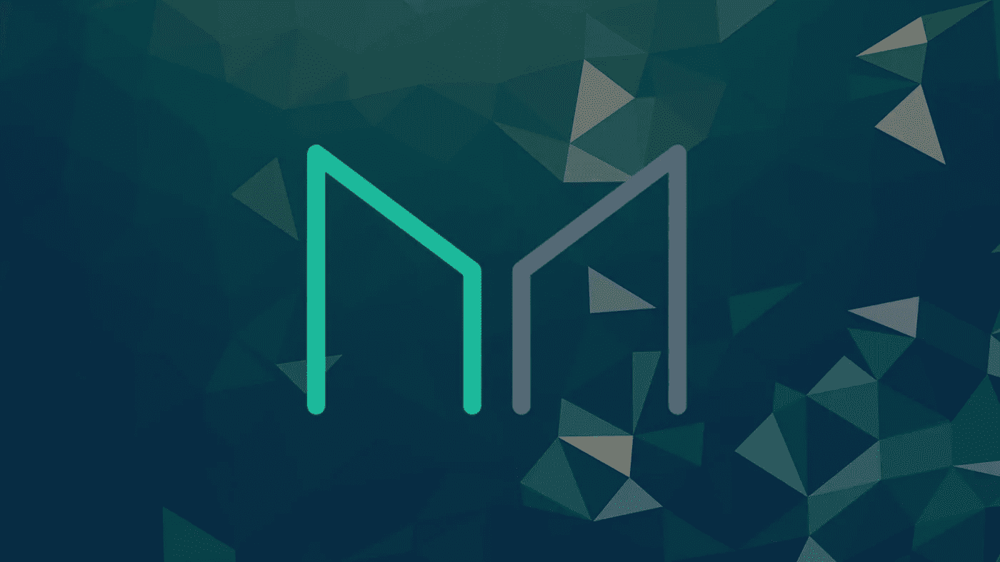

# DeFi 每周汇总(Delta Neutral Yields、Tokemak 的 ETH 打印机、MakerDAO Endgame 和 Olympus V3 的基础)

> 原文：<https://medium.com/coinmonks/defi-weekly-rollup-delta-neutral-yields-tokemaks-eth-printer-makerdao-endgame-and-the-bedrock-fb9c5c9d342d?source=collection_archive---------37----------------------->

# 市场状况

*迪法研究公司分析师吉姆·佛朗哥*

所有协议的 DeFi 市场锁定的**总价值**(美元)目前为 550.8 亿美元，在过去 24 小时内增长了 2.58%。MakerDAO 在所有连锁店中的主导地位为 14.91%，其次是 Lido、Curve Finance 和 AAve。

Marker，stablecoin DAI 背后的刀，截至本文发稿时总价值已锁定 8.21 亿美元(过去一周上涨 6.44%)。在 AMM 以低滑点稳定而闻名的 Curve Finance 在 TVL 的股价也上涨了 2.66%，达到 58.4 亿美元，而在过去七天里，Lido liquid staking 的股价上涨了 22.19%，达到 724 亿美元。

**一段时间内的 DeFi 用户总数**

用户=唯一地址。由于一个用户可以有多个地址，下面的数字被高估了。

# 哪些 DeFi 协议是可靠的业务？

以下是按过去七天最高收入排名的协议。收益等于收入减去象征性激励。如果这个数字是负数，这个项目在代币发行上的花费将会超过它的收入。

7-day leaderboard from [Tokenterminal](https://tokenterminal.com/leaderboards/earnings)

收益是任何企业的生命线。没有它们，企业将无法吸引投资者。这是公司财务报表中最重要、最受关注的数字。它显示了一家公司与其竞争对手和行业同行相比的实际盈利能力。

**现在，哪些代币有价值，有增长空间？**

加密行业中的令牌基于其令牌组学与商业实体的价值不同。收入是重要的衡量指标；然而，这些收入中有多少是直接分配给代币持有者的？

我创建了自定义指标来跟踪哪些令牌具有价值和增长空间，使用 7 天时间。因为这个图表可能每周都有变化，所以我加入了 90d 趋势来显示该协议在更长时间内的收入和每日用户数。

Data taken from tokenterminal.com

我不会深入细节和举例，你可以查看我最近的文章[来复习。](/coinmonks/defi-weekly-rollup-september-29-2022-133fd1a11a93)

**TL:DR**

*   确定哪些项目有令牌，哪些项目没有令牌
*   找到前 3 名最低的完全稀释 mcap (FDV)
*   从最低的 3 个 FDV，检查最低的价格销售比

# 哪些是人们付费使用的？

以太坊网络在过去 7 天中以 370 万美元的平均费用占据了最多的日常费用。基于 EIP-1559，交易费用的很大一部分将被烧掉，使得 ETH 代币成为一种通货紧缩资产。点击阅读更多[。](https://legacy.ethgasstation.info/blog/eip-1559/)

自合并以来，ETH 年发行额已降至 0.008%，能够燃烧 1，173.79ETH 的大规模活动将使该协议处于负发行率，或“超健全货币”

# 令牌解锁日历

Image taken from token.unlocks.app

代币解锁事件通常会造成市场抛售压力，因为代币供应量的增加会影响代币的价值。关注这些指标可能有助于投资者和交易者决定何时买入或卖出代币。

# 本周新闻！

# 提高农业产量的 DeFiLlama 策略搜索工具就在这里！

DeFi 数据平台 DeFiLlama 推出了一款新产品，帮助代币农民寻找高产农业机会。

Delta Neutral Yields 是 DeFiLlama 几个月来一直致力于开发的一款产品，于 10 月 23 日发布。

该系统搜索平台的大量数据库，寻找用户可以借用代币进行耕作的机会。它声称，有了新的系统，BTC、瑞士联邦理工学院和 USDC 有可能获得超过 20%的收益。

在其网站上，DeFiLlama 免费提供策略搜索工具。
需要注意的是，许多建议的代币流动性低，可能存在风险。

**杠杆和套利**

DeFiLlama 用几个例子展示了它的新策略查找器是如何工作的。

一种方法是利用雪崩桩进行杠杆耕作，其中 BTC.b (BTC 桥接到雪崩)被存放在一个 ave 上以借用 AVAX，AVAX 被桩支撑以产生 sAVAX。这又回到了 Aave，以借入更多资金并利用头寸，收益率高达 22%的 APY。

针对收益率生成器的套利是另一种建议策略。
用户可以提供以太坊来借用 DAI，他们可以将 DAI 存入 Reaper Farm，获得大约 16%的回报。

**DeFi 生态系统展望**

随着 2022 年密码市场的下滑，DeFi 生态系统受到了影响。
锁定总价值(TVL)的下降直接源于资产价格的下跌和用户撤回抵押品将其出售。

TVL 已经从 2021 年 12 月下旬超过 2100 亿美元的峰值下跌了 71%。目前价值约 550 亿美元，包括赌注。

该生态系统反映了过去四个月的加密市值，波动性低，横向势头强。一旦市场复苏，DeFi 协议可能会增加抵押品。

# 马克尔道残局计划

Maker Governance 批准了 Endgame Prelaunch MIP 集，以推动创始人 Rune Christensen 的“end game Plan”——旨在使协议更加分散化。

作为最大的 DeFi 协议之一，MakerDAO 不得不应对复杂的内部政治和结构分歧。 *MakerDAO* ***，*** 联合创始人克里斯滕森设计了改善协议治理机制的残局计划。

10 月初，克里斯滕森提交了一套制造商改进提案(MIPs)，为启动残局计划设定了基本规则。

**但是，这到底意味着什么呢？**

根据他们的 twitter 帖子，残局计划是一个 MakerDAO 重组提案。其主要目的是加强去中心化和简化 Maker 的核心，同时保持适当的创新量，允许这些组件增长和扩展。

这种重组呈现元道。它们是连接到主 MakerDAO 的较小 DAO。这些元道者生来就有自我意识的、专门的目的，这些目的通过全功能的分权治理和象征性激励与 MakerDAO 保持一致。

还引入了协议库的概念。它是一个由 MakerDAO 控制的 Maker Vault，主要持有 staked ETH 并使用它来生成 Dai。这个金库将增加由分散资产支持的 Dai 的数量，并为协议产生更多收入。

点击阅读更多[。](https://twitter.com/MakerDAO/status/1584922715756134402?s=20&t=z-2QgzvDYoszoyt1bTnI8w)

# 奥林巴斯 V3 的基石

上周二，OlympusDAO (OHM)在 Twitter 上宣布，这是一种社区拥有的、分散的、抗审查的储备货币，由资产支持，具有很高的流动性，并在 Web3 上广泛使用；

> 今天，我们要向全世界介绍范围稳定(RBS)。一个概念验证的自动化货币政策，将成为 OHM 稳定的支柱，并可能成为整个加密的支柱。

**苏格兰皇家银行是如何运作的？**

苏格兰皇家银行将试图将价格推至 30 天移动平均线 100 美元。当价格背离 30 日均线时，它会碰到一个“缓冲垫”，可能高也可能低。

如果价格达到高位缓冲，该协议将创建一个掉期市场来减缓价格上涨。

苏格兰皇家银行机制建立了一个具有再生供应的拍卖市场，允许您立即将所需的储备资产兑换为新铸造的打折美元欧姆。这增加了流通中的美元，增加了国库储备，抑制了价格上涨。

如果价格跌得太厉害，就会撞上低位缓冲。在这种情况下，该协议将创建类似于反向债券的即时互换市场。它有效地将 1000 美元从流通中抽走了.

苏格兰皇家银行通过拍卖机制创建了一个独立的即时掉期市场，允许你以更低的成本用你的美元欧姆交换储备资产。这减少了流通美元欧姆，国库储备，并抑制价格贬值。

这是一个非常有趣的概念，解释一切可能很困难，除非你明白$OHM 协议拥有的流动性和反向债券是如何工作的。

在这里阅读更多。

# 又是 V2 吸血鬼袭击案吗？

LooksRare 是社区第一的 NFT 市场，积极奖励参与的交易者、收藏家和创作者。

当前的 V1 协议正在更新。这次更新将作为一个临时的桥梁来关注 V2，包括新的协议费用策略和版税以及如何管理他们的更新。

# 托克马克的 ETH 收益率来了！

Tokemak 通过方便的分散式做市协议创建可持续的 DeFi 流动性和资本效率市场。

Tokemak 发布了两个重要的社区公告。

有一些关于即将到来的 accTOKE 锁定/锁定机制的细节和一个路线图，其中包括将在 Tokemak v2 中达到高潮的额外优化和功能。

**TL:DR**

accTOKE staking 启动后，Tokemak 的 POA 部署所累积的奖励将按照 ETH 条款发放给 accTOKE stakers(作为 wet 获得)。

AccTOKE 为两个不同的用户群创造了机会:希望获得 POA 奖励的不可知 LD，以及希望主动控制反应堆部署的 LD——提供了一种更简单、更有效的与协议交互的方式。

Tokemak 将从有保障的发射开始，这意味着赌注将被限制在预先确定的 TOKE 最大数量——这个上限将定期提高。这将允许有序和受控地过渡到机制中。接下来是关于安全发射的细节。

# 本周迷因！

Aptos Degens 是这样的:

而整个加密，等着看以太坊下一步会做什么。

# 好了，这就是本周的 DeFi 汇总。如果你喜欢更新，分享并关注每周时事通讯。

# 来源:

https://tokenterminal.com/

【https://cryptofees.info/ 

[https://defillama.com/](https://defillama.com/)

[https://token . unlocks . app](https://token.unlocks.app)

> 交易新手？尝试[加密交易机器人](/coinmonks/crypto-trading-bot-c2ffce8acb2a)或[复制交易](/coinmonks/top-10-crypto-copy-trading-platforms-for-beginners-d0c37c7d698c)