# DeFi 每周汇总(GMX 即将参加 Pirex、Swivel v3 发布会和 Euler Finance)

> 原文：<https://medium.com/coinmonks/defi-weekly-rollup-gmx-is-coming-to-pirex-swivel-v3-launch-and-euler-finance-d35ecba9ebbb?source=collection_archive---------24----------------------->

# 市场状况

*迪法研究公司分析师吉姆·佛朗哥*

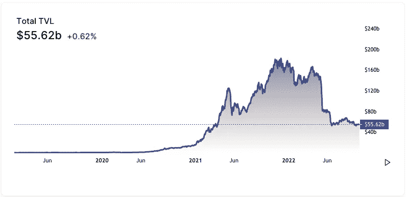

所有协议的 DeFi 市场锁定的**总价值**(美元)目前为 556.2 亿美元，比上周的市场状态上涨约 1.09%。MakerDAO 在所有连锁店中的优势为 13.95%，其次是 Curve Finance 和 AAve。

Marker，stablecoin DAI 背后的刀，截至本文发稿时，总价值已锁定 77.6 亿美元(较上周上涨 6.3%)。以低滑点 Stablecoin 指数闻名的 Curve Finance 在过去 7 天里也在 TVL 上涨了 2.25%，达到 60.4 亿美元

**一段时间内的 DeFi 用户总数**

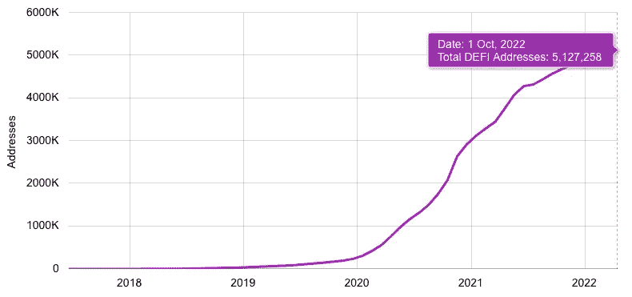

用户=唯一地址。由于一个用户可以有多个地址，下面的数字被高估了。

# 哪些 DeFi 项目是可靠的业务？

以下是按过去七天最高收入排名的协议。收益等于收入减去象征性激励。如果这个数字是负数，这个项目在代币发行上的花费将会超过它的收入。

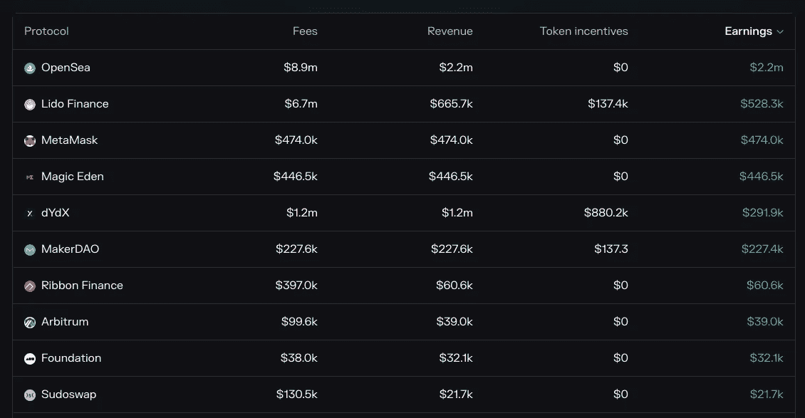

7-day leaderboard from [Tokenterminal](http://tokenterminal.com/leaderboards/earnings)

收益是任何企业的生命线。没有它们，企业将无法吸引投资者。这是公司财务报表中最重要、最受关注的数字。它显示了一家公司与其竞争对手和行业同行相比的实际盈利能力。

**现在，哪些代币有价值，有增长空间？**

在密码行业中，根据令牌组学，令牌的价值与其业务实体不同。收入是重要的衡量指标；然而，这些收入中有多少是直接与代币持有者分享的呢？

我创建了自定义指标来跟踪哪些令牌在 7 天内具有价值和增长空间。这个图表可能每周都有变化，所以我包含了 90d 趋势，以在更高的时间框架内可视化协议的收入和每日用户。

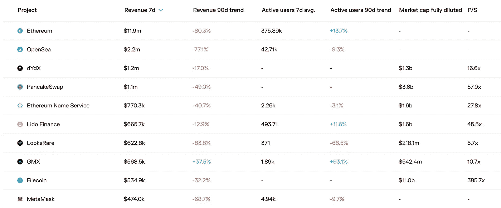

我不会深入讨论细节和例子，你可以查看我最近的文章。

TL:DR

*   确定哪些项目有令牌，哪些没有
*   找到前 3 名最低的完全稀释 mcap (FDV)
*   从最低的 3 个 FDV，检查最低的价格销售比

# 哪些是人们付费使用的？

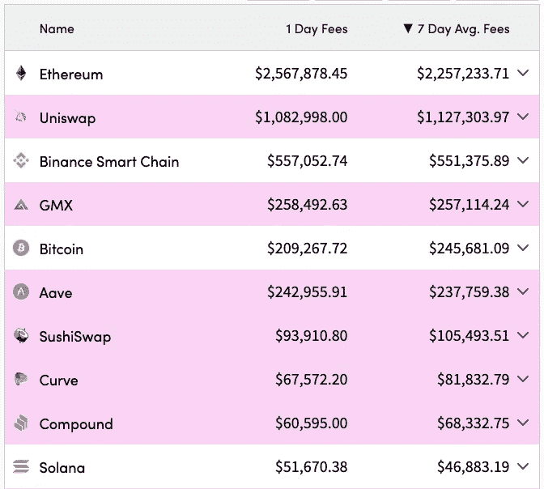

以太坊网络在过去七天中以 220 万美元的平均费用占据了最多的日常费用。基于 EIP-1559，交易费用的很大一部分将被烧掉，使得 ETH 代币成为一种通货紧缩资产。在这里阅读更多。

以太坊(Ethereum)的本土指数 Uniswap 仍是过去 7 天收费最多的，平均收费 112 万美元。币安智能连锁公司紧随其后，每周平均收费超过 50 万美元。

# 令牌解锁日历

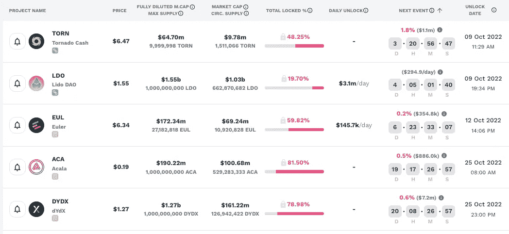

在加密中，令牌解锁事件通常会对市场造成抛售压力，因为令牌供应的增加会影响令牌的价值。

观察这些指标可以指导投资者和交易者何时买入或卖出代币市场。

# 本周新闻！

## Ribbon Finance 宣布期权交易所

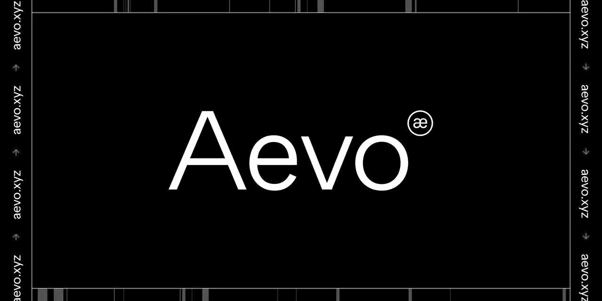

DeFi 衍生品协议 Ribbon Finance 推出了一个名为 Aevo 的“高性能”期权交易所。基于以太坊，第一次迭代将只提供以太网选项。它将在未来几个月提供其他密码(包括比特币)。

[期权是允许交易者在给定日期以特定价格购买或出售资产的金融合同。它们通常被用来对冲波动性，因为它们可以保证特定资产的价格。

Aevo 是 Ribbon Finance 推出的最新结构化 DeFi 产品。它基于“DeFi Option Vault”(DOV)，这是该平台基于加密期权、衍生品和固定利率加密货币投资产品的收益率生成工具。Ribbon 将该产品描述为加密期权交易的“高性能、基于订单簿的分散式交易所”。

## GMX 来到了 Pirex

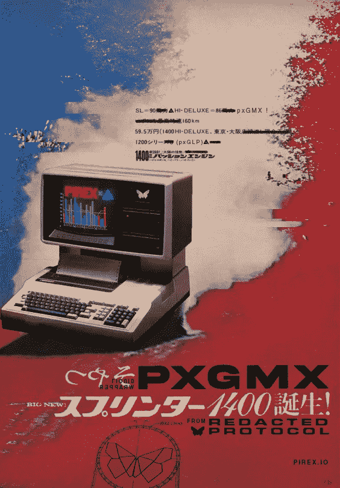

**关键见解:**

*   代表修订的 DAO(“DAO”)整合 GMX 作为下一个 Pirex 协议的修订开发团队
*   GMX 和 esGMX 将被包装成 pxGMX，GLP 将被包装成 pxGLP
*   与 Pirex Convex 类似，将有一个简单、标准和专家模式，针对不同类型的用户提供不同级别的功能

由于 GMX 在 Arbitrum 上的存在最大，而 GLP 在 Avalanche 上的存在与 Arbitrum 上的存在不可互换，GMX、esGMX 和 GLP Arbitrum 令牌将首先集成到 Pirex 中，以便将来有可能集成 Avalanche 对应令牌。

Pirex ***不会*** 利用 Pirex 直接拥有的 GMX/esGMX 之外的任何治理权力。如果将来有可贿赂的量表，Redacted 将制定一个委托系统，pxUsers 可以对量表进行投票，以最大化 pxUsers 的回报。

阅读[更多](https://commonwealth.im/redacted-cartel/discussion/7061-integrate-gmx-as-the-next-pirex-protocol)。

## Swivel Finance v3 时代即将到来

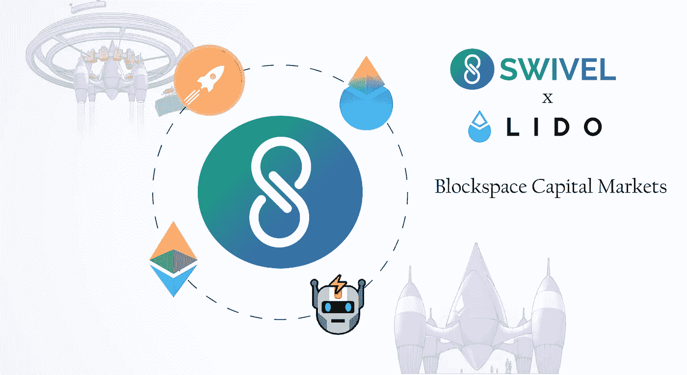

## 什么是 Swivel，v3 有什么新功能？

Swivel 是固定利率贷款和令牌化现金流的协议。它为贷款人提供了锁定固定和交易利率的最有效方法，为流动性提供者提供了管理其资本的最熟悉和有效的方法。

随着 Lido 的整合和 Rocketpool 的即将整合，Swivel v3 实现了真正可组合的块空间市场。赌注者可以安然入睡，没有削减风险，也没有不断增长的验证者池稀释其收益的风险。

虽然其他解决方案可能会从 DeFi 中分离流动性，但 Swivel 与 Lido 的合作伙伴关系实现了独特的可组合性，我们在 FiatDAO、Contango、Coop 和 Illuminate(还有其他几个秘密的公司)的朋友可以利用这一点。

此外，Swivel v3 为用户提供了一个极具吸引力的机会，可以利用 Euler 提供的优于其他货币市场的诸多优势。凭借可组合的用户界面、对长尾资产的访问、灵活的利率模型和优化的清算，Euler 已经成为借款人和贷款人的理想场所，也是收益率令牌化的理想场所。

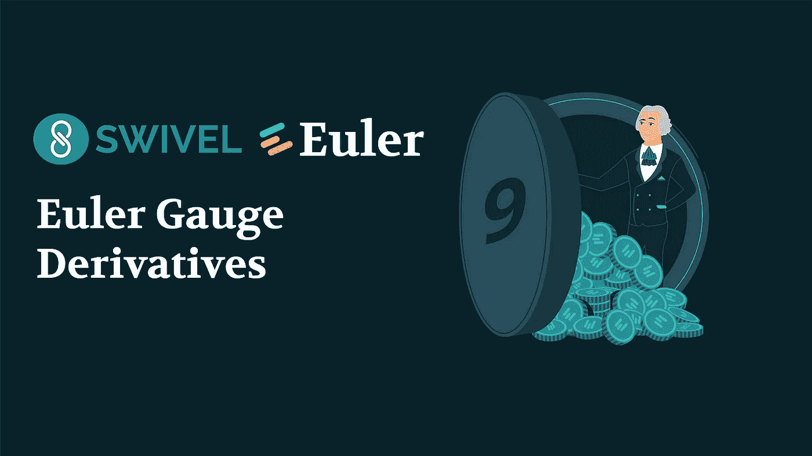

此外，欧拉利用投票为基础的措施，分配欧拉奖励借款人。

然后，Swivel v3 放大了这些量表提供的机会，允许 EUL 持有者利用他们的量表策略。

阅读[更多](https://swivel.substack.com/p/swivel-v3-report-integrations-and?utm_source=twitter&sd=pf):

## 欧拉，阿兹特克支持的第一个协议

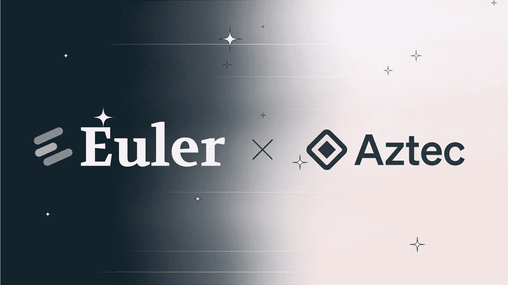

Aztec Network 是一个可编程的隐私层，用于 web3 和智能合约平台，默认情况下具有隐私，并由以太坊保护。

他们昨天从他们的[推特](https://twitter.com/aztecnetwork/status/1576997493987868672)账户宣布，欧拉金融是阿兹特克 4626 桥支持的第一个让步协议。

**什么是欧拉金融？**

Euler 是一个非托管的无权限借出协议，帮助用户在不依赖可信第三方的情况下从他们的加密资产中赚取利息。

Euler 不同于 Aave 和复合金融，它们是部分许可的。在这些市场中，治理必须手动批准新的市场。Euler 旨在允许无许可的非流动性或波动性资产交易——任何人都可以创建新的借贷市场。

那么——产量如何？

在任何借贷市场中，都有两方:支付利息的借款人和收取利息的贷款人。欧拉使用 ERC-4626 包装器实现了协议的借贷方。

这意味着 Euler 正在生产符合 ERC-4626 标准的 eTokens，并使 Aztec 非常容易集成。

# 本周迷因！

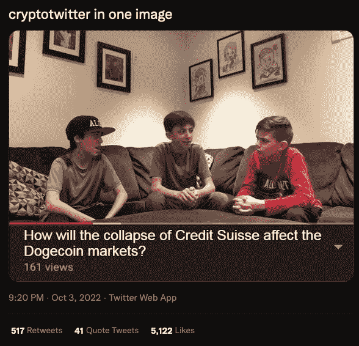

T[witter link](https://twitter.com/Cryptofung/status/1576925175882604546?s=20&t=xINIG_HU3uh5Z0Bpp2wu4w)

哦，好吧，我没什么好说的。🤷

# 好了，这就是本周的 DeFi 汇总。如果你喜欢更新，分享并关注每周时事通讯。

## 来源:

[https://tokenterminal.com/](https://tokenterminal.com/)

[https://cryptofees.info/](https://cryptofees.info/)

[https://medium.com/@BlockchainIST](/@BlockchainIST)

[https://defillama.com/](https://defillama.com/)

[https://token . unlocks . app](https://token.unlocks.app)

 [## 学习股票市场交易|初学者股票市场基础知识- marketfeed

### 选择你想学习的舒适的语言，安排你的免费咨询

marketfeed.com](https://marketfeed.com) 

> 交易新手？试试[加密交易机器人](/coinmonks/crypto-trading-bot-c2ffce8acb2a)或者[复制交易](/coinmonks/top-10-crypto-copy-trading-platforms-for-beginners-d0c37c7d698c)