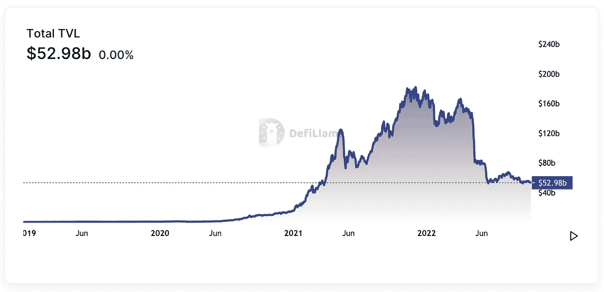
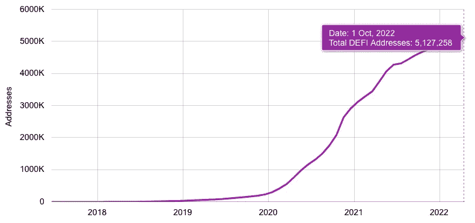
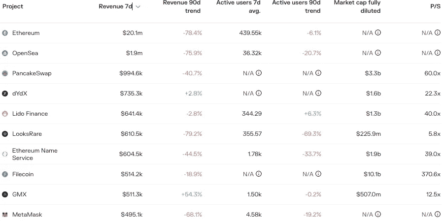
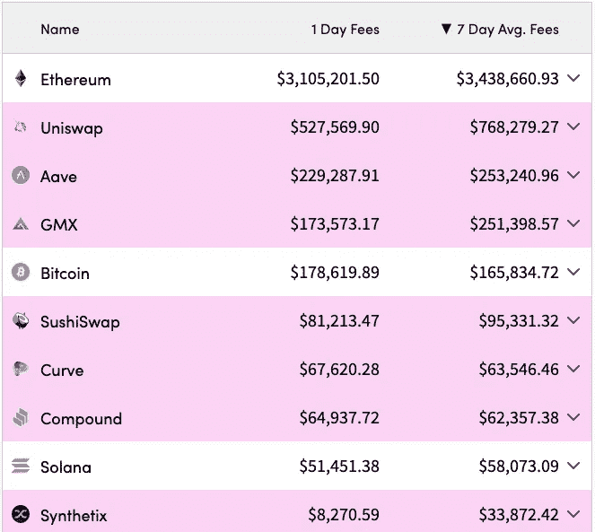
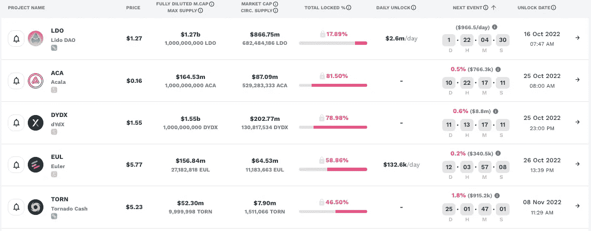
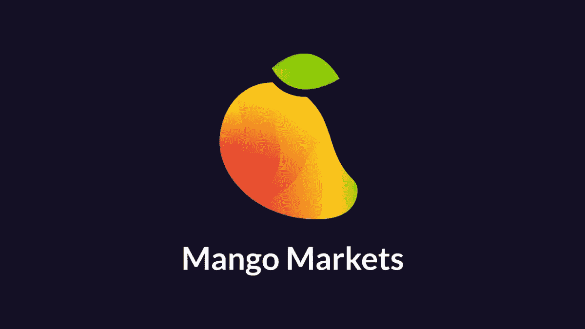
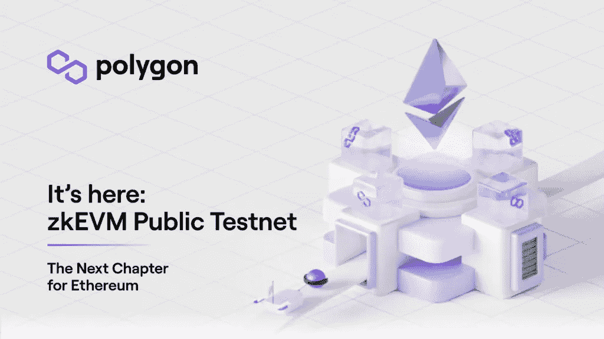
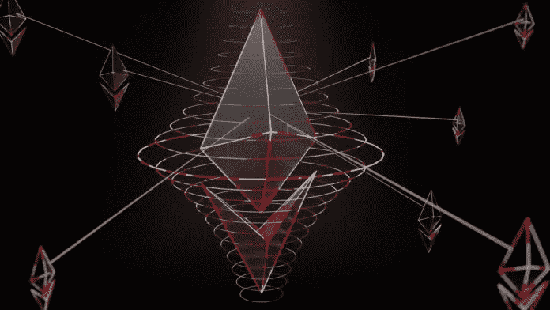
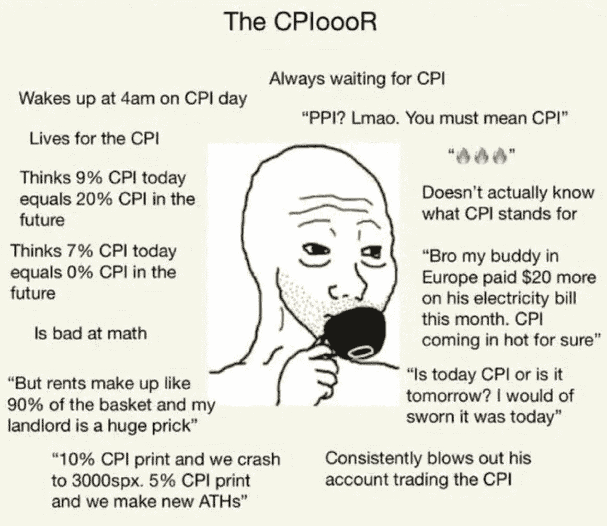

# DeFi 每周汇总(Mango Markets exploit，Arbitrum 收购以太坊合并背后的团队等等！)

> 原文：<https://medium.com/coinmonks/defi-weekly-rollup-mango-markets-exploit-arbitrum-acquires-the-team-behind-ethereum-merge-and-5a74b6ad1600?source=collection_archive---------32----------------------->

# 市场状况

*迪法研究公司分析师吉姆·佛朗哥*

所有协议的 DeFi 市场锁定的**总价值**(美元)目前为 529.8 亿美元，比上周的市场状态下降了约 4.74%。MakerDAO 在所有连锁店中的优势为 14.58%，其次是 Curve Finance 和 AAve。

Marker，stablecoin DAI 背后的刀，截至本文发稿时，总价值已锁定 77.2 亿美元(较上周下跌 0.5%)。在 AMM 以低滑点稳定著称的 Curve Finance 在 TVL 的股价也在过去 7 天下跌了 3.80%，至 58.4 亿美元

**一段时间内的 DeFi 用户总数**

用户=唯一地址。由于一个用户可以有多个地址，下面的数字被高估了。

# 哪些 DeFi 项目是可靠的业务？

以下是按过去七天最高收入排名的协议。收益等于收入减去象征性激励。如果这个数字是负数，这个项目在代币发行上的花费将会超过它的收入。

7-day leaderboard from [Tokenterminal](https://tokenterminal.com/leaderboards/earnings)

收益是任何企业的生命线。没有它们，企业将无法吸引投资者。这是公司财务报表中最重要、最受关注的数字。它显示了一家公司与其竞争对手和行业同行相比的实际盈利能力。

**现在，哪些代币有价值，有增长空间？**

在密码行业中，根据令牌组学，令牌的价值与其业务实体不同。收入是重要的衡量指标；然而，这些收入中有多少是直接与代币持有者分享的呢？

我创建了自定义指标来跟踪哪些令牌在 7 天内具有价值和增长空间。这个图表可能每周都有变化，所以我包含了 90d 趋势，以在更高的时间框架内可视化协议的收入和每日用户。

Data taken from tokenterminal.com

我不会深入细节和举例，你可以查看我最近的文章[来复习。](/coinmonks/defi-weekly-rollup-september-29-2022-133fd1a11a93)

**TL:DR**

*   确定哪些项目有令牌，哪些没有
*   找到前 3 名最低的完全稀释 mcap (FDV)
*   从最低的 3 个 FDV，检查最低的价格销售比

# 哪些是人们付费使用的？

以太坊网络以 340 万美元的平均费用占据了最多的每日费用，在过去七天里大幅上涨了约 55%。基于 EIP-1559，交易费用的很大一部分将被烧掉，使得 ETH 代币成为一种通货紧缩资产。点击阅读更多[。](https://legacy.ethgasstation.info/blog/eip-1559/)

以太坊的原生指数 Uniswap 仍是收费最多的，在过去七天里平均下降了 31%,为 76 . 8 万美元。其次是 AAve，平均每周收取 25 万美元的费用。

# 令牌解锁日历

Image taken from token.unlocks.app

在加密中，令牌解锁事件通常会对市场造成抛售压力，因为令牌供应的增加会影响令牌的价值。

观察这些指标可以指导投资者和交易者何时买入或卖出代币市场。

# 本周新闻！

# 据报道，索拉纳的 DeFi 交易所芒果市场遭受了 1 亿美元的剥削。

Solana 区块链上的一个分散交易平台 Mango Markets 看起来是加密领域大规模黑客攻击的最新受害者。

周二晚上，Mango [在 Twitter](https://twitter.com/mangomarkets/status/1579979345309102081?s=20) 上指出，发生了一起涉及攻击者提取资金的“事件”。周三，芒果得出结论，市场操纵让攻击者[榨取了“当时大约 1 亿美元”](https://twitter.com/mangomarkets/status/1580053215919607810?s=20&t=p7do-x1QWCsk7emYXE9Ozg)

> 截至目前，任何在协议上有存款的 Mango 用户都不能提取资产；芒果在推特上写道，这一事件实际上导致了所有可用股权的彻底流失。

区块链审计公司 OtterSec 也[指出](https://twitter.com/osec_io/status/1580019588913192960?s=20&t=y90oALBvBCMYFHJrdPYNAw)

> 看起来攻击者操纵了许多交易所 MNGO 的价格，借用他们未实现的 MNGO 收益来耗尽协议。

事件发生后，攻击者随后[提出芒果治理建议](https://app.realms.today/dao/DPiH3H3c7t47BMxqTxLsuPQpEC6Kne8GA9VXbxpnZxFE/proposal/3WZ5DpZXDvNAK4JwPS1HDPzSinEJUGpBC4XXx9vPtnVS)要求芒果令牌持有者放弃任何刑事调查，提供赏金，并放弃协议上的任何“坏账”。

# 谷歌将以太坊(ETH)加入其数据分析平台

互联网搜索巨头谷歌已经将以太坊(ETH)加入其 BigQuery 平台，用于分析大数据。

以前，通过 API 工具只能获得对信息的部分访问，例如，检查加密钱包中的交易或余额的状态，很难通过它们获得关于存储在区块链上的数据的全部信息。

但是现在，了解数据库编程的 BigQuery 用户拥有了高级功能，这将帮助他们了解更多有关以太坊区块链的过程。

**谷歌现在显示以太坊钱包的余额**

谷歌现在通过其搜索引擎提供以太坊地址的数据。现在，当你在搜索栏中输入以太坊地址时，世界上最大的网站会告诉你一些钱包的容量。

这项新功能通过 block explorer Etherscan 运行，这是一个提供以太坊区块链数据的网站。

# Polygon 发布其 zkEVM 公共测试网

Polygon 周一表示，其零知识 EVM 公共测试网上线，该公司将其描述为“以太坊的下一步”

Polygon 是一个旨在促进低成本交易的缩放工具，并使用以太坊区块链作为其基础协议。随着零知识(ZK)汇总技术的引入，Polygon 希望成为以太坊的主要可扩展系统。

根据他们最新的博客:

> 今天发布的公共测试网实现了这一愿景，我们很自豪地说，我们是第一个使用开源 ZK 证明系统访问公共测试网的 zkEVM。
> 
> 我们很期待你开始测试，你将会在一个很棒的公司。一些最大的 DeFi 平台，包括 Aave 和 Uniswap，以及 Web3 社交平台 Lens 和游戏工作室 Midnight Society，将成为首批部署在 zkEVM Testnet 上的协议之一，不久将有更多的协议加入。

**Uniswap，Aave 堆入 Polygon 的以太坊快速汇总测试网**

领先的 DeFi 平台 Aave 和 Uniswap 已经加入进来，还有 web3 社交平台 Lens 和游戏工作室 Midnight Society。

Polygon 的联合创始人 Mihailo Bjelic 鼓励开发人员“尝试 testnet，帮助我们测试它的极限，打破事物并识别错误，这样我们就可以一起向世界提供第一个 zkEVM！”

# Arbitrum 收购领先的以太坊客户团队 Prysmatic Labs

Offchain Labs **，**广受欢迎的以太坊第二层扩展解决方案开发商 Arbitrum 已经**签署了一项新协议，收购 Prysmatic Labs** ，这是以太坊合并背后的核心开发团队之一。

**谁是 Prysmatic labs？**

Prysmatic Labs 是设计合并和构建 Prysm 的核心开发团队之一，Prysm 是领先的以太坊共识客户端，现在为以太坊的利益相关共识提供支持。Prysm 是以太坊迄今为止最大的客户之一，也是以太坊节点跑步者的最爱。

未来会怎样？

根据 Offchain 实验室的数据

> Prysmatic Labs 团队正式加入 Offchain Labs，我们将继续将 Prysm 开发为完全开源和中立的共识客户端。Prysmatic 团队还深入参与了以太坊的进一步开发计划，并且是领导将 EIP-4844 数据分片投入生产的团队之一。所有这些工作都将不间断地继续下去，我们 Offchain Labs 非常兴奋能够更深入地为以太坊的核心开发做出贡献，并承诺长期继续这样做。
> 
> 我们计划共同实施其他几项联合倡议，以促进 L1 和 L2 的发展。

[阅读更多](https://offchain.medium.com/the-merge-2-0-offchain-labs-acquires-prysmatic-labs-the-leading-ethereum-consensus-client-team-9eab169c5fb6)

# 本周迷因！

乍得消费物价指数。

哦，好吧，我没什么好说的。🤷

# 好了，这就是本周的 DeFi 汇总。如果你喜欢更新，分享并关注每周时事通讯。

# 来源:

https://tokenterminal.com/

【https://cryptofees.info/ 

[https://medium.com/@BlockchainIST](/@BlockchainIST)

[https://defillama.com/](https://defillama.com/)

[https://token . unlocks . app](https://token.unlocks.app)

 [## 首页-CryptocyNews.com

### GMPortal 首先开始为没有经验和经验丰富的投资者提供简化交易的服务…

www.cryptocynews.com](https://www.cryptocynews.com/) 

> 交易新手？尝试[加密交易机器人](/coinmonks/crypto-trading-bot-c2ffce8acb2a)或[复制交易](/coinmonks/top-10-crypto-copy-trading-platforms-for-beginners-d0c37c7d698c)