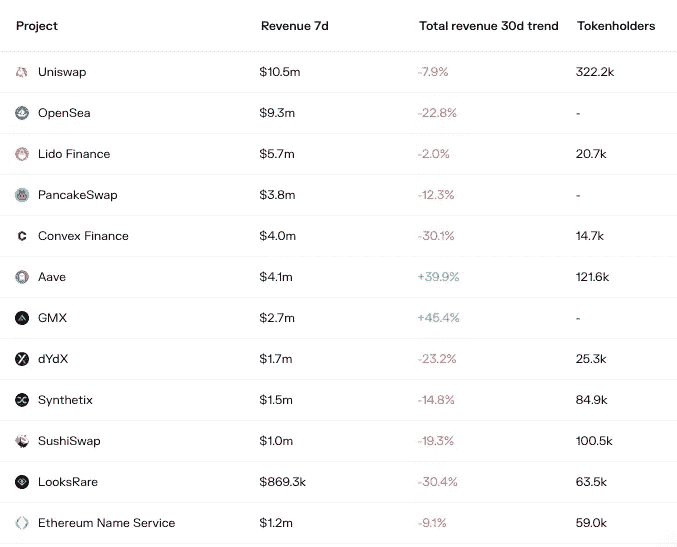

# DeFi 每周汇总(合并是活的，曲线美元，星巴克 X 多边形和更多！)

> 原文：<https://medium.com/coinmonks/defi-weekly-rollup-september-15-2022-6797ac2d7101?source=collection_archive---------36----------------------->

# 市场状况

*迪法研究公司分析师吉姆·佛朗哥*

所有协议的 DeFi 市场锁定的总价值(美元)目前为 467.8 亿美元，比上周的市场状况下降了约 20%。丽都优势为 15%，其次是 AAve 和 Uniswap。

宏观经济学扼杀了以太坊合并预期中的秘密价格上涨。与此同时，DeFi 市场在过去 24 小时内遭受了巨大打击，下跌了 16.92%。

> "*美国股市暴跌，此前最新通胀数据高于预期，增加了美联储本月晚些时候加息 100 个基点的可能性。道琼斯工业平均指数下跌近 4%。标准普尔 500 指数下跌超过 4%，是今年最糟糕的一天，纳斯达克指数下跌 5%。两年期美国国债收益率升至 2007 年 11 月 1 日周四以来的最高水平。*”—福克斯商业

**DeFi 收入排名**

Uniswap 仍然是过去 7 天收入最多的公司，收入为 1050 万美元，其次是 Opensea marketplace，收入为 930 万美元，其次是利多金融，收入为 570 万美元

永久性掉期交易新手 GMX 继续占据主导地位，过去 30 天总收入增长 45.4%。而借贷市场 AAVE 也表现不错，收入增长了 39.9%。

哪些是人们付费使用的？

在过去的七天里，以太坊网络仍然以 31 亿美元的价格占据着整个加密领域的最高日费。现在合并已经开始，以太坊已经在股权证明上运行，我们将在接下来的几周内监测这一机制如何影响平台费用。

在过去的 24 小时内，Aave 击败了 Uniswap，但是，Uniswap，一个以太坊的原生指数，仍然在过去的 7 天内收取了最多的费用，达到 15 亿美元。

值得注意的是，这些协议中的一些与它们的令牌持有者分享所收集的平台费用的百分比。GMX、Curve Finance 和 LooksRare marketplace 等等。

# 本周新闻！

# 合并现在在以太坊主网上直播！

以太坊期待已久、备受期待的合并现已激活。此次大规模更新将市值第二大的加密货币从工作证明共识模型转换为股权证明。

这一变化允许以太坊持有者用他们的硬币来换取奖励。它将网络转变为一个更节能的处理和验证交易的模型。以太坊的整体能耗预计将骤降约 99.9%。

转向股权证明也将极大地影响以太坊的通货膨胀率。合并前每天发放约 13，000 个 ETH，现在将降至每天约 1，600 个 ETH。

在未来实现进一步的更新之前，交易不会大幅降低费用。预计网络速度也将保持与更新实施前相同。

在以太坊基金会的一次观察聚会上，Vitalik Buterin 表示，该网络现在离实现其创始人的愿景又近了一大步。

> 这是以太坊迈向成熟系统的第一步。还有很多步骤要走。我们仍然需要扩大规模。我们还是要解决隐私问题。我们仍然必须保证普通用户和所有这些东西的安全。我认为我们都需要努力工作，尽我们的一份力量来实现所有这些事情。对我来说，合并象征着早期以太坊和我们一直希望早期以太坊成为的以太坊之间的差异。所以，让我们去构建这个生态系统的所有其他部分，把以太坊变成我们想要的样子。”

与此同时，ETHW Core 已经[承诺](https://twitter.com/EthereumPoW/status/1569427804764405761)将主以太坊区块链分叉，并在 24 小时内推出一个矿工供电的工作验证版本的网络。分叉为任何持有 ETH 的人提供了获得同等数量分叉令牌的可能性。

# Curve Finance 推出新的 crvUSD Stablecoin 计划

2022 年，稳定密码一直是密码市场的主要关注点。就波动性而言，它们是最安全的资产，具有无限的效用，最不容易受到监管剧变的冲击。在 DeFi 领域，他们是一个吸引人的赌博和赚取被动收入的工具。因此，难怪**曲线金融**正寻求推出稳定币产品。

在撰写本文时，关于 crvUSD 用法的细节还很少，Curve 开发人员拒绝与 CoinDesk 分享更多关于令牌的信息。

与此同时，一些市场观察人士已经权衡了 crvUSD 发行后在更广泛的加密生态系统中的影响。

> Orbs 的高级 DeFi 开发者 Daniel Zlotin 在一份电报中写道:“crvUSD 可能是一个非常有趣的发展，因为我们还没有看到由主要 DEX 发行的稳定币。
> 
> *将一个稳定的币与一个可行的[去中心化金融]平台连接起来，可以在新模式方面开辟一些有趣的可能性(例如使用 LP 代币作为支持系统的一部分)，*zlo tin 补充道，他警告说，实施这样一个概念“肯定会有一些挑战”。**

*其他人表示，Curve 的原生 stablecoin 将有助于提高平台的流动性，确保长期可持续性。*

> *GTON Capital 创始人亚历克斯·皮普舍夫(Alex Pipushev)在电报中表示:“Curve 选择的方法可能会使流动性更加可持续。*

*Stablecoins 是整个加密市场的重要组成部分，目前流通的此类令牌价值超过 1530 亿美元，[数据显示](https://www.coingecko.com/en/categories/stablecoins)。*

# *马克道从比特币基地获得 USDC 1.5%的利息*

**

*比特币基地主要加密交易所正在寻求与最大的分散式借贷协议 MakerDAO 合作。比特币基地提出，如果 Maker 将其持有的 USDC 股票转投比特币基地机构级投资平台 Prime，它将向 MakerDAO 支付 1.5%的利息。*

*在分散自治组织的在线论坛上发布的[提案](https://forum.makerdao.com/t/mipxx-coinbase-usdc-institutional-rewards/17703/13)中，*

> *“创客的资产负债表在很大程度上暴露于 USDC——换来的是零持股回报。该 MIP 勾勒出一条清晰的道路，以 USDC 回报的形式在 USDC 提供高达 1.5%的 APY，并以零成本优化流动性，为创客提供行业领先的安全性，”*

*具体来说，如果 Maker Improvement 提案(MIP)获得通过，MakerDAO 将成为 Prime 的机构投资者。它还将促进以太坊加密贷款公司 USDC 控股的 33%或 16 亿美元转移到 MakerDAO 在 Prime 的账户，一年内赚取约 2400 万美元。*

*其他条款包括，MakerDAO 支付零托管费，同时仍然能够按照比特币基地 Prime 的标准产品自由铸造、燃烧、提取并几乎立即与 USDC 结算。该提议补充称，比特币基地是一家历史悠久、声誉卓著且受到监管的公司，因此在提出收购要约方面处于“独特的位置”。*

## *MakerDAO 一直在谈判通过剥离其 USDC 储备来降低风险*

*值得注意的是，比特币基地的提议为 MakerDAO 减少其在 USDC 的风险敞口的持续审议增加了另一个层面。根据来自 [Daistats](https://daistats.com/#/) 的数据，由比特币基地合伙人圈子发行的 stablecoin 构成了 MakerDAO 用于支持其分散化 stablecoin DAI 的资产的最重要部分。*

# *星巴克为其“星巴克奥德赛”网络 3 体验开发 Polygon*

**

*Starbucks is set to begin a non-fungible token NFT-based loyalty program with the blockchain technology provided by Polygon.*

*星巴克将利用 Polygon 提供的区块链技术，开始一项不可替代的基于 NFT 的忠诚度计划。*

*该公司的 [Starbucks Odyssey](https://stories.starbucks.com/press/2022/starbucks-brewing-revolutionary-web3-experience-for-its-starbucks-rewards-members/) 将允许顾客以 NFT 的形式购买和获得数字收藏邮票，提供优惠和身临其境的体验。*

*作为合作的结果，这种基于 Web3 的新体验将允许美国的 [Starbucks Rewards](https://www.starbucks.com/rewards) 忠诚度计划成员和 Starbucks 合作伙伴(员工)以不可替代代币(NFT)的形式获得和购买数字可收藏邮票。这种独一无二的忠诚度计划体验得益于 Polygon PoS 网络的低费用和高交易速度。*

*星巴克在 5 月份暗示要开发 Web3 体验，当时它宣布计划推出一系列 NFT 系列，提供“*独特体验、社区建设和客户参与。**

## *网络 3 体验一个原因*

*实施 Web3 技术将为星巴克以令人兴奋的新方式与其星巴克奖励忠诚计划成员互动铺平道路，从独特的商品和艺术家合作到独家活动邀请，开启沉浸式咖啡体验。*

*从今天，9 月 12 日开始，顾客和合作伙伴可以[加入等待名单](https://waitlist.starbucks.com/)，有机会成为第一个获得星巴克奥德赛体验的人，该体验将于今年晚些时候推出。*

# *币安。美国宣布以太坊赌注*

**

*根据他们的[博客](https://blog.binance.us/eth-staking/)，在“*合并*”之前，以太坊现在可以在平台上下注，提供 6%的初始年百分比收益率(APY)。*

> *币安。美国通过大幅降低准入门槛，使数字资产的交易变得容易和容易。虽然直接通过以太坊网络下注有 32 ETH 的要求，但用户可以在币安下注。美国的最低竞争力仅为 0.001 ETH。通过推出 ETH 的赌注，这是世界上最广泛持有的代币之一。币安。美国正在进一步履行承诺，始终为客户提供最好的产品和服务。*

*币安提供的 6% APY 几乎是其他交易所的两倍。例如，比特币基地提供的 ETH staking 的 APY 为 3.28%，而丽都金融提供的 APY 为 3.5%。*

## *币安支持合并*

*币安支持瑞士联邦储备银行的时机。美国在 Ethereum 的 mainnet 上线前几天到来。*

*谈到支持，币安美国首席执行官 Brian Shroder 说:“ETH 在更广泛的 Web3 生态系统中发挥着关键作用，随着以太坊网络继续向合并过渡，我们很高兴现在提供 ETH staking。”*

## *另一方面*

*尽管支持 ETH staking，但币安已经宣布，它不会支持任何来自合并的分叉令牌，并且如果这些令牌被创建，用户将无法撤回它们。*

# **好了，这就是本周的 DeFi 汇总。如果你喜欢更新，分享并关注每周时事通讯。**

## *来源:*

*[https://medium.com/@BlockchainIST](/@BlockchainIST)*

*https://tokenterminal.com/terminal/markets/defi*

*【https://crypto-economy.com/ *

*[https://cryptofees.info/](https://cryptofees.info/)*

*[https://investorplace.com](https://investorplace.com)*

*[https://finance.yahoo.com](https://finance.yahoo.com)*

*[https://cryptonews.com](https://cryptonews.com)*

*[https://www.coindesk.com/](https://www.coindesk.com/)*

*[https://dailycoin.com](https://dailycoin.com)*

* [## 每日 Hodl -比特币、以太坊、Altcoin、DeFi 和区块链新闻

### 最新的加密新闻，分析和见解。涵盖比特币、以太坊、altcoins、DeFi、NFTs 和区块链…

dailyhodl.com](https://dailyhodl.com) 

> 交易新手？试试[加密交易机器人](/coinmonks/crypto-trading-bot-c2ffce8acb2a)或者[复制交易](/coinmonks/top-10-crypto-copy-trading-platforms-for-beginners-d0c37c7d698c)*