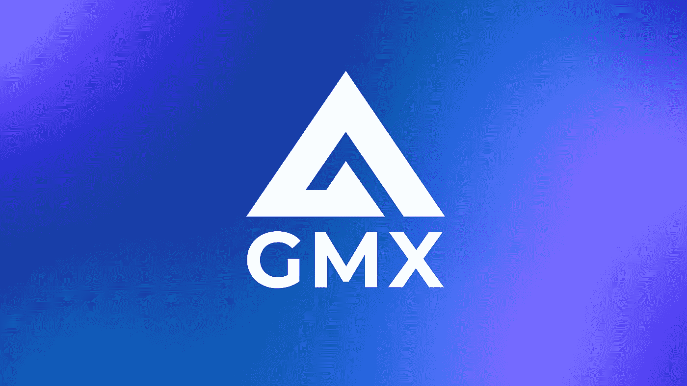
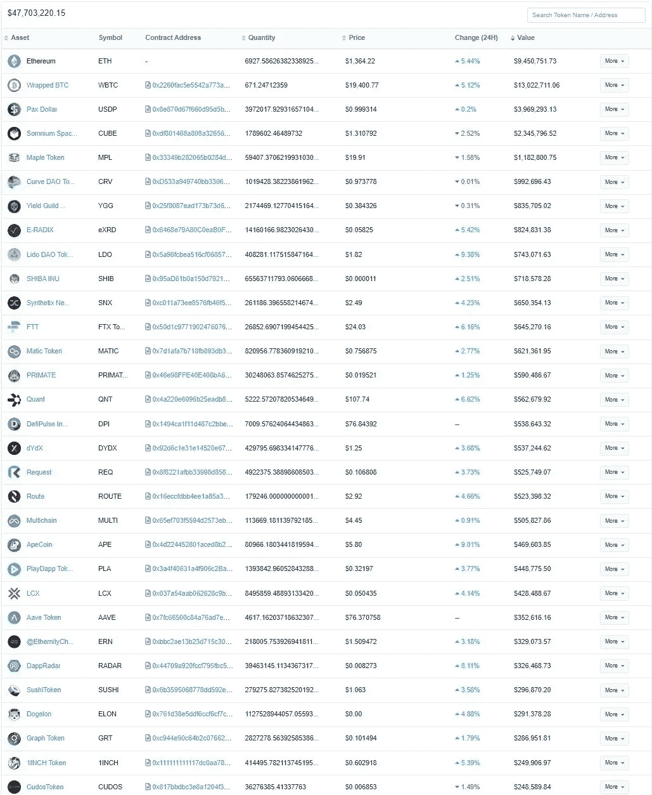

# DeFi 每周汇总(温特穆特和 GMX 利用，获得即时的前期收益与您的 ETH！)

> 原文：<https://medium.com/coinmonks/defi-weekly-rollup-september-22-2022-6b285edddcbc?source=collection_archive---------51----------------------->

# **市场状况**

*迪法研究公司分析师吉姆·弗兰科*

所有协议的 DeFi 市场锁定的总价值(美元)目前为 537.8 亿美元，比上周的市场状态下降了约 2.5%。除去丽都(Lido)的流动股份，MakerDAO 以 13.54%的优势登顶，其次是 Curve Finance 和 AAve。

## **DeFi 收入排名**

Uniswap 在过去 7 天中仍以 980 万美元的总收入遥遥领先，其次是 Opensea marketplace 和 Lido Finance，分别为 850 万美元和 610 万美元。

永久掉期新手 GMX 继续其上升趋势，在过去 30 天内收入增长 66.1%。而借贷市场 AAVE 也表现不错，收入增长了 42.7%。

## 哪些是人们付费使用的？

以太坊网络以过去七天平均 21 亿美元的价格占据了整个加密领域的最高日费。成功合并一周后，第一层网络的费用下降了 32.25%。传言以太坊第二层开始以更低的费用获得新用户。

以太坊的原生指数 Uniswap 在过去 7 天中仍以平均 1.28 亿美元的价格收取最多的费用。币安智能连锁领先于 GMX 和 AAVE，每周平均费用超过 60 万美元。

**注:**部分协议与其令牌持有者分享平台收取的一定比例的费用。GMX、Curve Finance 和 LooksRare marketplace 等等。

# 本周新闻！

## GMX 在 AVAX 上遭受了 565，000 美元的攻击！

**但是，发生了什么？**

最近，一个著名的交易者在流动性低的周末利用了 GMX 在 AVAX 上的零滑点定价。GMX 的这种局限性是众所周知的，也是既定的。

GMX 通过 GLP、一篮子 BTC、瑞士联邦储蓄银行、AVAX 和美元获得流动性。GMX 的交易流程是这样的:

1.  交易员向长 BTC 提交订单
2.  BTC 的价格取自顶级交易所
3.  交易的总规模以#2 中的价格执行(因此是“零滑点”)

GMX 不可能是交易特定资产流动性最强的地方，而且它受制于外部流动性。这个问题是低流动性代币特有的，从未影响到 GMX 的 BTC/ETH 交易，因为相对于 CEXs，流动性仍然非常小。

这个限制被利用了，用户重复输入 GMX 的 AVAX 头寸(零滑动),然后在集中交易中操纵价格上下波动。然后用户可以在 GMX 平仓(同样是零滑点),然后盈利。

这是因为 AVAX 的 CEX/外部流动性极低。操纵发生在令人尴尬的周末时段，CEXs 的流动性远远低于 GMX 提供的流动性(零滑点)。

据 Flood Capital 称，“*将实施解决方案，使 GMX 更加稳健，同时使 GLP 持有者和交易者的利益最大化。要理解这次攻击有多严重，那么看看 game 霍尔德，他们是游戏中皮肤最厚的人。自 16 日以来，GLP 的赎回量一直很小；Arbitrum 为 0.5%，雪崩为-6.5%。*此处阅读更多[。](https://twitter.com/FloodCapital/status/1571920476062072832)

## **金钱的时间旅行有多快？**

Flashstake 是一个无权限协议，允许任何人通过各种底层 Flash 策略获得即时的前期收益。

简而言之，每次用户下注，他们都会收到 fTokens。在给定的 Flashstake 策略中，这些 fTokens 可以按比例燃烧以赎回收益。要了解更多基础知识，你可以查看他们的文档[这里](https://docs.flashstake.io/getting-started/faq.html#what-is-flashstake)。

**通过您的 ETH 获得即时的前期收益！**

Flashstake 最近在他们的媒体文章[中宣布了一种新的下注方式。](/flashstake-protocol/introducing-the-eth-flashstake-strategy-41e1058fe238)

> “我们很高兴宣布 Flashstake 的最新战略:ETH。您现在可以使用 Flashstake 在您的 ETH 上获得即时的前期收益。
> 
> 这是我们推出该协议以来最受欢迎的功能之一。对于 Flashstake 社区和 Crypto 社区来说，我们很高兴在这样一个关键时刻发布它。
> 
> 为了庆祝以太坊合并**，**我们推出了特别的 15.59% 4 月以太坊赌注！但是你必须动作快点。此介绍性优惠仅限于先到先得的情况。"

**你需要知道的一切**

1.  当您使用 Flashstake ETH/WETH 时，您的令牌将部署到我们的 AAVE v2 战略中。
2.  dApp 允许用户在运行中包装 ETH，以使这变得快速简单(在两个事务中)。
3.  无论你是否冒险，你都会得到回报。
4.  由于新的前端改进，您现在可以用更低的汽油费来使用 Flashstake。
5.  Flashstake ETH/WETH 的过程是一样的！只需选择代币和赌注期限，就大功告成了！

## **Curve Finance 在 115% APY 的卡瓦网络上直播**

自从以太坊连锁店推出以来，卡瓦在区块链协议中经历了最快的增长。随着有史以来最伟大的 APY 池下周开始，DeFi 发电站曲线首次在卡瓦。全球第一个程序化的奖励计划，卡瓦崛起，预计将推动卡瓦区块链到前所未闻的高度，使曲线和卡瓦的历史性联盟成为可能。

卡瓦区块链完全是为扩张而设计的。对于卡瓦崛起计划，协议增长是唯一的目标。曲线选择卡瓦首次亮相与以前未发现的曲线池 APYs 和利用率，因为他们信任该计划。

Kava 的目标是集成和交互除雪崩、多边形之外的附加协议，最终是以太坊本身。卡瓦可以做到这一点，因为它是自下而上为扩展而设计的，今天发布的 Curve 是朝着这个方向迈出的一大步。

在所有其他 1 层区块链的曲线池中，卡瓦的曲线池拥有最高的 APYs。卡瓦的用户现在可以使用多链将资产连接到[卡瓦。Curve.fi 上的 Curve Pool](https://kava.curve.fi/factory/0) 在-20 资产(如)上赚取可观的 APY——用户可以在卡瓦网络上通过 Curve 在、和戴上赚取高达 115%的卡瓦奖励。

Curve.fi 是一个分散的流动性聚合器，它提供了一种高效的代币交换方式，同时通过仅容纳由行为相似的资产组成的流动性池来保持低费用和低滑点。Curve 在超过 10 个区块链网络中锁定了 55.7 亿美元的总价值(TVL)。

Curve.fi 上的用户可以通过一个在交易可变稳定债券时减少滑点的公式来交易稳定债券和不同版本的令牌化资产。

## 温特穆特在 DeFi 行动中窃取了约 1.6 亿美元

算法做市商服务 Wintermute 周二遭遇安全漏洞，黑客偷走了该平台投资组合内 90 项资产的约 1.6 亿美元。

在推特上发布的一份简短的[声明](https://twitter.com/EvgenyGaevoy/status/1572134273875951617?s=20&t=o_eM0wOjgi6hePMnvC6OxA)中，Wintermute 创始人兼首席执行官 Evgeny Gaevoy 表示

> “*我们在 defi 业务中被黑了大约 1.6 亿美元。Cefi 和 OTC 操作不受影响。*

虽然黑客已经挪用了大约 1.6 亿美元，但 Gaevoy 指出，在被黑客攻击的 90 项资产中，只有两项名义价值超过 100 万美元。因此，不应该出现大规模的资产抛售。

对区块链探索平台 EtherScan 的进一步调查显示，该钱包在过去几个小时内进行了 50 多次交易，并在钱包中持有过多的 80 个令牌，包括 ETH、包装比特币(WBTC)和 Stablecoins 等。

# 好了，这就是本周的 DeFi 汇总。如果你喜欢更新，分享并关注每周时事通讯。

## 来源:

[https://tokenterminal.com](https://tokenterminal.com/terminal)

[https://cryptofees.info/](https://cryptofees.info/)

[https://medium.com/@BlockchainIST](/@BlockchainIST)

[https://defillama.com/](https://defillama.com/)

[https://www.cryptonewsz.com](https://www.cryptonewsz.com)

 [## 比特币、以太坊和 Web 3.0 指南-解密

### 请阅读解密网站上最新的比特币和以太坊新闻。获取有关加密货币价格的最新信息、突发新闻和…

decrypt.co](https://decrypt.co) 

> 加入 Coinmonks [电报频道](https://t.me/coincodecap)和 [Youtube 频道](https://www.youtube.com/c/coinmonks/videos)了解加密交易和投资

# 此外，阅读

*   [WazirX vs coin dcx vs bit bns](/coinmonks/wazirx-vs-coindcx-vs-bitbns-149f4f19a2f1)|[block fi vs coin loan vs Nexo](/coinmonks/blockfi-vs-coinloan-vs-nexo-cb624635230d)
*   [本地比特币回顾](/coinmonks/localbitcoins-review-6cc001c6ed56) | [加密货币储蓄账户](https://coincodecap.com/cryptocurrency-savings-accounts)
*   [什么是融资融券](https://coincodecap.com/margin-trading) | [美元成本平均](https://coincodecap.com/dca)
*   [坚持卡评](https://coincodecap.com/uphold-card-review) | [信任钱包 vs 元面具](https://coincodecap.com/trust-wallet-vs-metamask)
*   [Exness Review](https://coincodecap.com/exness-review)|[moon xbt Vs bit get Vs bingbn](https://coincodecap.com/bingbon-vs-bitget-vs-moonxbt)