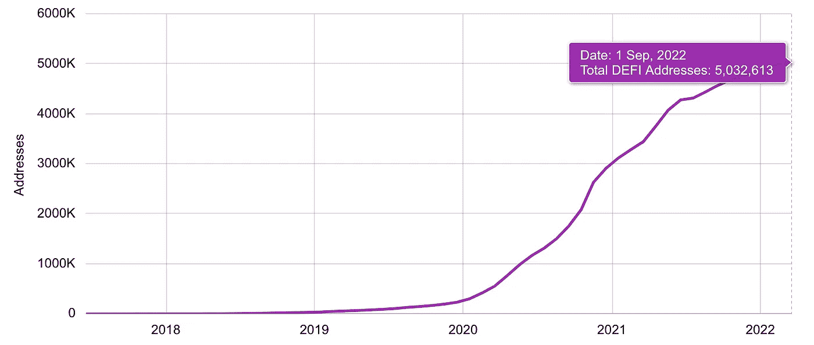
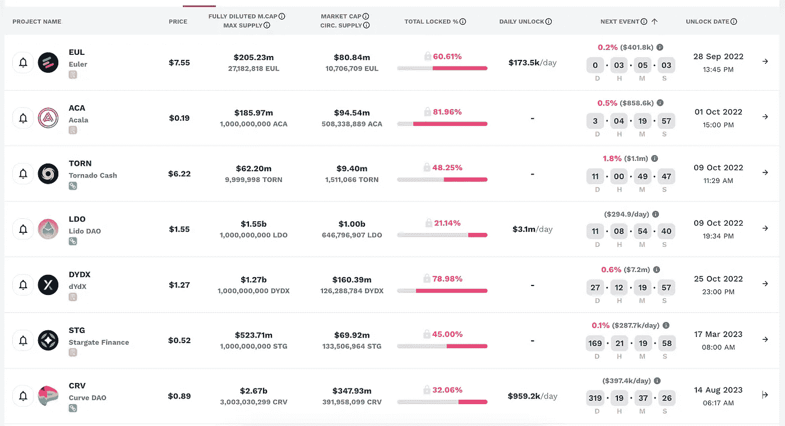

# DeFi 每周汇总(DeFi 上的健全企业，具有内在价值的代币，等等！)

> 原文：<https://medium.com/coinmonks/defi-weekly-rollup-september-29-2022-133fd1a11a93?source=collection_archive---------19----------------------->

# **市场状况**

*迪法研究公司分析师吉姆·弗兰科*

所有协议的 DeFi 市场锁定的总价值(美元)目前为 550.2 亿美元，比上周的市场状态增长约 2.3%。除去丽都(stETH)的流动股份，MakerDAO TVL 在所有连锁店中的主导地位是 13.27%，其次是 Curve Finance 和 AAve。

马克笔，stablecoin DAI 背后的刀，截止到本文写作时，总价值已锁定 73 亿美元(较上周上涨 2.26%)。以低滑点著称的 curve Finance stable coin 指数在过去 7 天里也在 TVL 上涨了 10%。

**一段时间内的 DeFi 用户总数**

Users = unique addresses. Since a user can have multiple addresses the numbers below are overestimates.

## 哪些 DeFi 项目是可靠的业务？

看看过去七天收益最高的协议。收益等于收入减去象征性激励。如果这个数字是负数，这个项目在代币发行上的花费将会超过它的收入。

7-day leaderboard taken from [tokenterminal.com/leaderboards/earnings](https://tokenterminal.com/leaderboards/earnings)

收益是任何企业的生命线。没有它们，企业将无法吸引投资者。这是公司财务报表中最重要、最受关注的数字。它显示了一家公司与其竞争对手和行业同行相比的实际盈利能力。

**现在，哪些代币有价值，有增长空间？**

在密码行业中，根据令牌组学，令牌的价值与其业务实体不同。收入是重要的衡量指标；然而，这些收入中有多少是直接与代币持有者分享的呢？

根据我对哪些令牌具有价值和增长空间的分析，我使用[令牌终端](https://tokenterminal.com/terminal/markets/defi)创建了自定义指标。

Top 10 DeFi projects based from the highest revenue in the past 7 days.

从数据表中，我将首先分类哪些项目有令牌，哪些没有。除了 OpenSea 和 Metamask 之外，其余的项目都有自己的本地令牌。这些项目我就不一一赘述了，但是我会举一个例子，解释一下为什么我觉得更有价值。

**LooksRare** 是 NFT 的一个市场，有一个名为 LOOKS 的本地令牌。

它目前在具有本地令牌的项目的最高**收入**中排名第六。**looks rare 平台产生的收入 100%与代币持有者分享。**

**与其他 5 亿至 30 亿美元的项目相比，Looksrare 只有 1.95 亿美元的完全稀释市值。数值越低，增长空间越大。**

**LooksRare 拥有最低的 **P/S** 。价格与销售额之比是一个估值比率，它将代币的价格与其收入进行比较。较低的比率可能意味着令牌被低估，而高于平均水平的比率可能表明股票被高估。**

**注:监控项目的活跃用户和收入趋势，以确定其令牌组学是否是长期可持续的，这也很重要。**

**这些指标是什么？**

****收入**等于分配给代币持有者或项目国库的费用数。**

****活跃用户****

**对于 dapp，活跃用户的数量等于与 dapp 的业务相关智能合同交互的唯一地址的数量。**

**对于区块链，活跃用户的数量等于发送事务的唯一地址的数量。**

****完全稀释的市值**等于代币的最大供应量乘以代币价格。**

****市净率(P/S)** 等于完全稀释的市值除以年化收入。年化收入的计算方法是 30 天的协议收入乘以 365/30。**

## ****哪些是人们付费使用的？****

****

**以太坊网络占据了整个加密领域最大的每日费用，过去 7 天的平均费用为 200 万美元。基于 EIP-1559，交易费用的很大一部分将被烧掉，使得 ETH 代币成为一种通货紧缩资产。点击阅读更多[。](https://legacy.ethgasstation.info/blog/eip-1559/)**

**成功合并后两周提供 ETH。**

****

**Image taken from [https://ultrasound.money/](https://ultrasound.money/)**

**以太坊(Ethereum)的本土指数 Uniswap 仍是过去 7 天收费最多的，平均收费 122 万美元。币安智能连锁领先于 GMX 和 AAVE，每周平均费用超过 50 万美元。**

## ****令牌解锁日历****

****

**在加密中，令牌解锁事件通常会对市场造成抛售压力，因为令牌供应的增加会影响令牌的价值。**

**观察这些指标可以指导投资者和交易者何时买入或卖出代币市场。**

# **本周新闻！**

## **Robinhood 使 MATIC 能够在多边形网络上进行交易**

****

**Robinhood 的客户最终将能够在应用程序中购买和交易 MATIC，并利用以太坊的所有第二层(L2)服务，如与以太网相比增加的吞吐量和降低的费用。**

**根据 Polygon 的媒体博客:**

> **今天，我们很高兴地宣布，美国流行的股票和加密投资应用程序 Robinhood 已经推出了对 Polygon Proof-of-stage(PoS)链上 MATIC 存款和取款的支持。此举将首次为罗宾汉用户带来以太坊第二层(L2)解决方案的所有好处，包括比以太坊更快的交易速度和更低的费用。**

**Polygon 非常适合 Robinhood，因为它允许用户节省费用，消除长时间的确认时间，同时使他们能够受益于以太坊强大的安全模型。**

**作为领先的扩展平台，Polygon 有助于减轻 Ethereum mainnet 的负载，并在链外执行交易，在不牺牲安全性的情况下，提供更低的燃气费和更高的吞吐量。**

## **寿司 v2 刚上线！**

****

**根据他们的[提案](https://forum.sushi.com/t/sushi-2-0-a-restructure-for-the-road-ahead/10111)，V2 包括组织结构重组和新功能路线图。**

**这一提议是寿司走向充满希望和责任的未来的第一步。该提案被有效地分解为三个要投票表决的可操作项目:**

1.  **留住将 Sushi 带入未来所需的人才，涵盖工程、设计、业务开发、营销、社区参与、shyu、运营和咨询等整个职能领域。**
2.  **建立一个正式的薪酬委员会，检查所有预算事项的透明度和问责制。**
3.  **随着提案的实施，标准的高管和领导人才搜寻流程将开始补充保留的团队。**

## **作为用户，期待什么？**

****多连锁店首次应用** —在这个不可知的连锁店未来，今天，Sushi 宣布发布 Sushi 2.0 的第一阶段，以改进的外观为特色，通过互换、赌注和分析改善用户体验，所有 15 个连锁店都在一个地方。**

****Invest:Pools&Farms**——通过新的 Invest 仪表板，用户现在可以在一个地方看到每个链上的每个游泳池。简单的导航简化了寻找好的游泳池进入，并提供了对寿司 AMM 下的每一对扩展分析的访问。**

****分析** —拥有准确的历史和当前数据对于该领域的任何协议都极其重要，Sushi 也不例外。同样重要的是能够在一个地方看到每个链的所有信息。**

***链接到分析:*[*sushi.com/analytics*](https://sushi.com/analytics)**

## **备受期待的债券协议发布**

****

**绑定协议是绑定即服务的下一个发展。奥林巴斯式债券彻底改变了协议收购资产的方式。**

> **通过与 OlympusDAO 合作，我们开发了统一的债券架构，允许任何协议部署和管理债券市场。我们是充满激情的建设者，努力解决 DeFi 中的系统性问题，为协议和令牌持有者创造长期价值。**

**链接到网站:[https://bondprotocol.finance/](https://bondprotocol.finance/)**

## **解决国债稀释和代币发行的问题**

**1.天桥骄子，降低破产风险**

**大多数协议过度暴露于其本地治理令牌，大多数国债拥有<10% diversification. Issuing bonds allows funds for development and investment in strategic initiatives to increase protocol viability and longevity.**

**2\. Acquire liquidity at lower long-term cost**

**Protocols pay a lot to rent liquidity via inflationary incentives paid in their native governance token. High incentives paid to mercenary capital can create negative feedback loops that destroy value for the protocol and token holders.**

## **Why use Bond Protocol?**

****协议拥有的流动性** —流动性所有权减少了对池 2 激励的依赖，提供了长期稳定性，并控制了令牌膨胀**

****资金多样化** —对多样化资产(ETH、Stables、LP Pairs)的敞口增加了保险&额外的创收机会**

****战略资产** —获得共生协议的治理权增加了项目的长期可行性并加强了合作**

****跨链** —资产累积和流动性控制允许在其他链上轻松部署，以增加 TVL 和用户获取**

****激励措施** —通过向令牌持有者提供长期授予的折扣令牌，让他们获得长期协议成功**

# **MetaMask 与去中心化社交网络 DeSo 整合**

****

**DeSo 与领先的 Web 3.0 钱包的集成有效地将 MetaMask 变成了一个成熟的去中心化社交网络。它也为 [DeSo](https://www.deso.com/) 成为所有 Web 3.0 的跨链社交层铺平了道路。**

> **由比特币基地、红杉和安德森·霍洛维茨支持的新区块链 DeSo 公司宣布与 MetaMask 合并。因此，数百万以太坊用户现在可以享受一键访问加密的链上消息和完整的类似 Twitter 的功能集。**

**据 DeSo 创始人 Nader Al-Naji 称**

> **现有的区块链不能有效地存储内容。在以太坊上存储一条 200 个字符的推文大约需要 50 美元，在 Solana、Avalanche 或 Polygon 上存储大约需要 15 美分。相比之下，DeSo 只有万分之一，这使得它成为第一个能够破坏社交等存储密集型应用的区块链。**

**今天的社交媒体由少数几家私营公司控制——但随着 MetaMask 这样的钱包从仅仅处理金钱扩展到社会身份和社会互动，这种情况可能会改变。在以太坊生态系统中获得一席之地后，DeSo 计划通过与 Phantom wallet 整合，将业务扩展到 Solana。**

# ****本周迷因！****

**几乎在合并两周后，以太坊变成了一种通缩资产和环境友好型资产。**

****

**忘记价格；人们希望看到联邦理工学院的供给被烧掉。**

# **好了，这就是本周的 DeFi 汇总。如果你喜欢更新，分享并关注每周时事通讯。**

## **来源:**

**https://tokenterminal.com/**

**【https://cryptofees.info/ **

**[https://medium.com/@BlockchainIST](/@BlockchainIST)**

**[https://defillama.com/](https://defillama.com/)**

**[https://www.namecoinnews.com](https://www.namecoinnews.com)**

**[https://dailyhodl.com](https://dailyhodl.com)**

**[https://token . unlocks . app](https://token.unlocks.app)**

**[https://moneyprinter.info/](https://moneyprinter.info/)**

**[https://cryptobeholder.com](https://cryptobeholder.com)**

> **交易新手？试试[加密交易机器人](/coinmonks/crypto-trading-bot-c2ffce8acb2a)或者[复制交易](/coinmonks/top-10-crypto-copy-trading-platforms-for-beginners-d0c37c7d698c)**