# 迪菲拉马:屈服是我最好的朋友。

> 原文：<https://medium.com/coinmonks/defillama-yield-is-my-best-friend-6444e0e07935?source=collection_archive---------20----------------------->

# DeFi 101

*迪法研究公司分析师吉姆·佛朗哥*

在本文中，我们将深入探讨用于跟踪各种区块链 DeFi 产量的最佳分析仪表盘之一。

## **什么是不毛之地？**

DefiLlama 是一个区块链和应用程序监控平台。

它利用 TVL(管理下的资产)来确定哪些 DeFi 协议是最重要的，提供最高的收益，以及它们如何随着时间的推移而发展。

该平台收集所有链的跨链数据和累积知识，并向 DeFi 用户免费开放。

美洲驼是你在🦙最好的朋友

该平台为 DeFi 用户提供了一个一站式方案，可监控他们所有首选的区块链和方案。它致力于准确的信息和透明度，不使用广告或赞助内容。

## 如何使用 DeFiLlama？

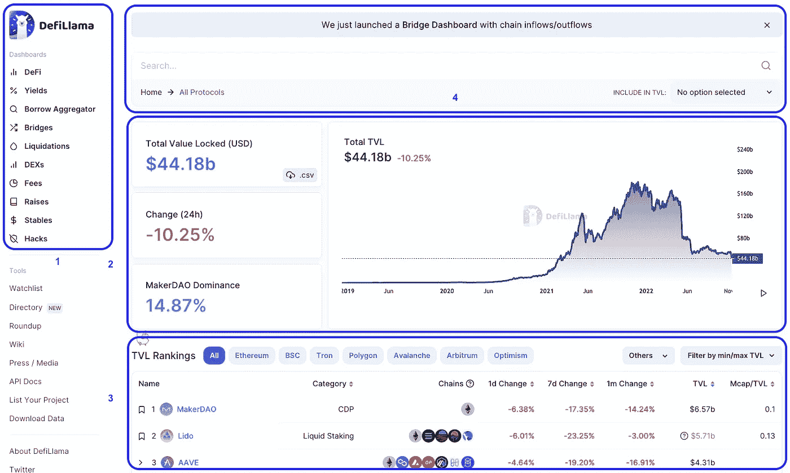

理解 DefiLlama 最具挑战性的方面是其主页上的大量信息。每次你访问这个平台，你都会发现新的信息。

你需要花时间探索每一部分。

**让我们从基础开始:**

1.当您访问网站时，数据被组织到列表中。示例包括 DeFi 协议、Yields、Stablecoin 和 Hacks。这些可以在左侧导航栏中找到。

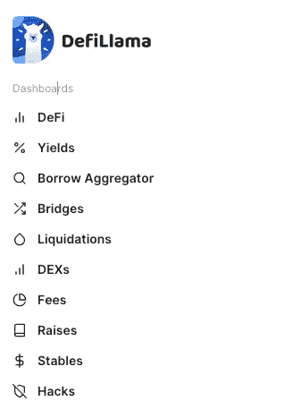

此部分帮助您更有效地浏览平台，并过滤您想要查找的类别。

2.使用搜索栏，您可以找到该平台支持的任何 DeFi 协议。该部分还会显示横幅和最新更新。

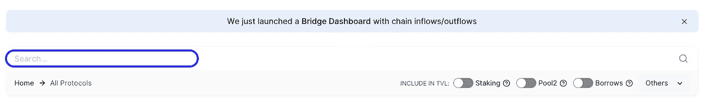

3.这可能是网站视觉上最吸引人的部分。此部分显示所有区块链协议的总历史值。

TVL 或 AUM 是用户在协议中锁定的资产数量。

4.底部包含 DefiLlama 支持的所有协议的列表。排序选项包括类别、本地令牌价格变化和锁定的总价值。

用户可以转到每个网络选项卡(如以太坊、BSC 等)来了解有关使用该网络的项目的更多信息。

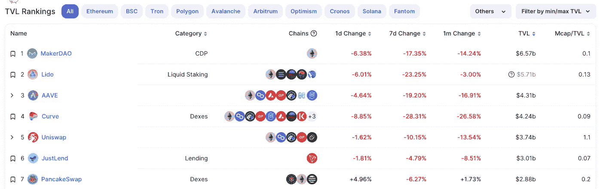

**等等还有更多！**

用户可以进一步向下钻取以获得项目级数据。例如，通过选择以太坊网络，您可以查看基于以太坊的项目。

然后，在“协议”下，选择 Uniswap 以获取详细的协议信息、其网站的链接以及受管理的价值锁定资产。

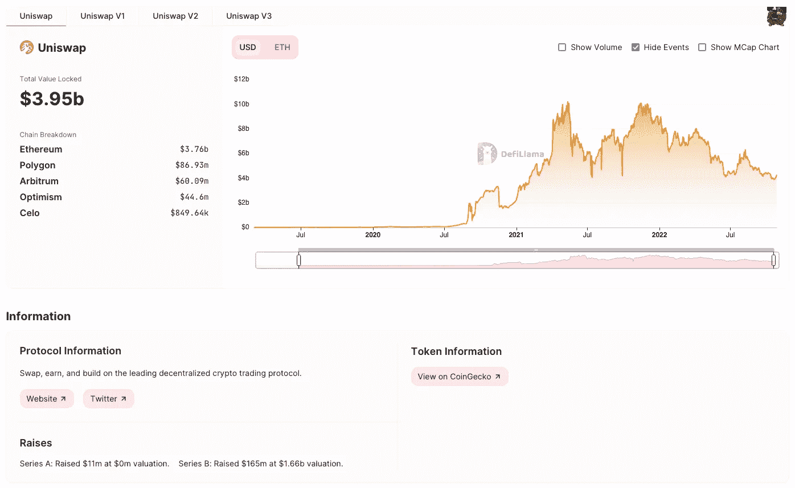

向下滚动以查看该协议的历史交易量，包括费用和收入产生的美元价值。

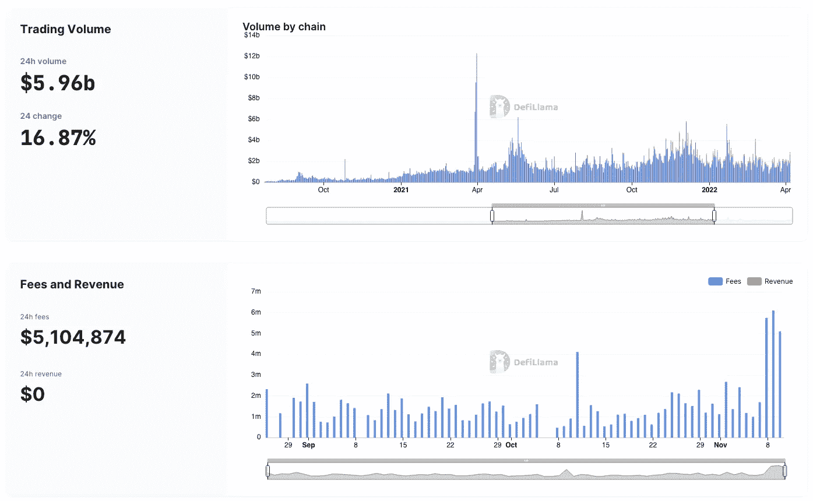

如果信息太多，让我们来看看好东西。

**链**部分展示了各种区块链，包括 EVM 兼容的区块链，如以太坊、nonEVM、Rollup 或第 2 层解决方案，以及宇宙生态系统。

导航到[https://defillama.com](https://defillama.com)并点击 DeFi，然后链。

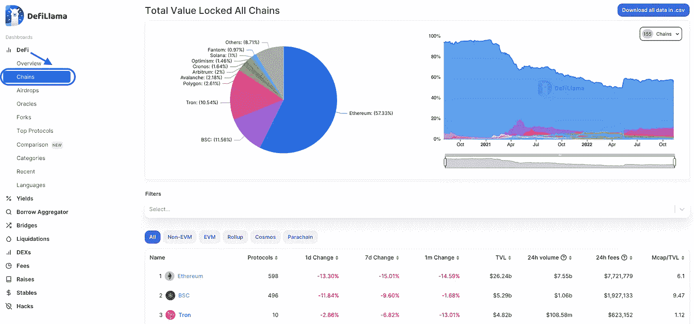

此部分显示了哪些链在构建于其上的协议数量以及管理下锁定的总价值方面最有价值。

在撰写本文时，以太坊区块链是最重要的 DeFi 连锁店，拥有 58%的市场份额和 240 亿美元的 TVL。

以太坊支持 EVM 链，允许开发者创建 ERC-20 令牌、DApps 和其他应用。

DeFi 始于以太坊，它允许开发者构建像 UniSwap、OpenSea 和 MakerDAO 这样的应用。这一创新实现了令牌和 NFT 等数字资产的分散购买和销售，而无需中介。

**类别**显示 DeFi 协议中内置的各种实用程序。

从 DefiLlama 主页中，选择 DeFi，然后选择类别。这一节描述了指数、桥梁、液体桩、产量、算法稳定和许多其他概念。

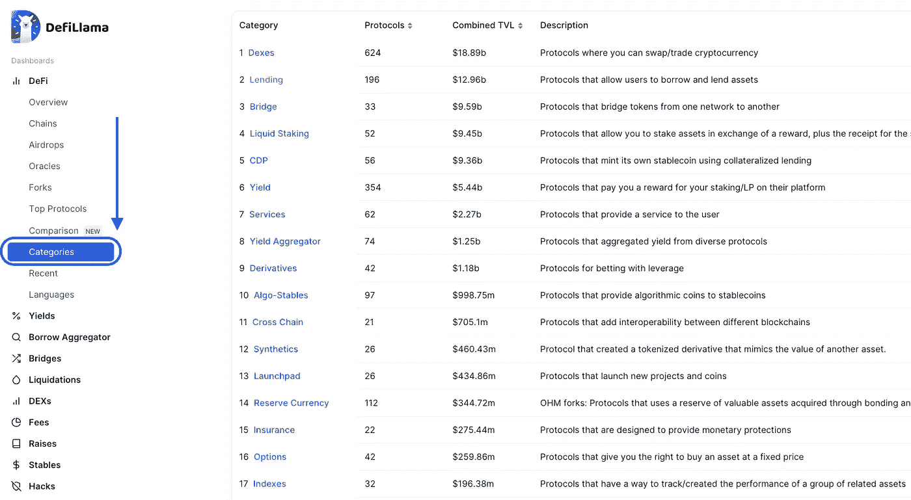

它还显示所管理资产的总价值，以及基于每个类别构建的协议数量。

## **得到了收益？**

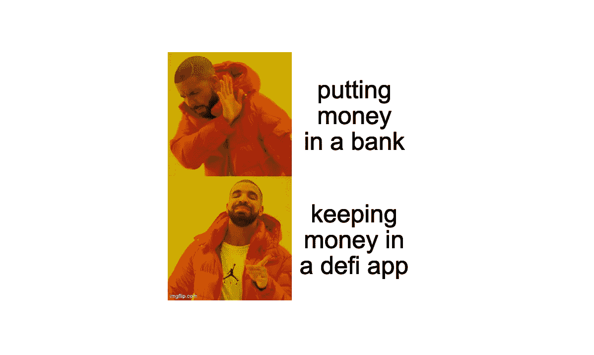

**产量**毫无疑问是 DeFi 最有价值的特性之一，DefiLlama 为您聚合了所有的 dapps。

如果您想在 DeFi 中获得最佳产量，此功能正是您所需要的。

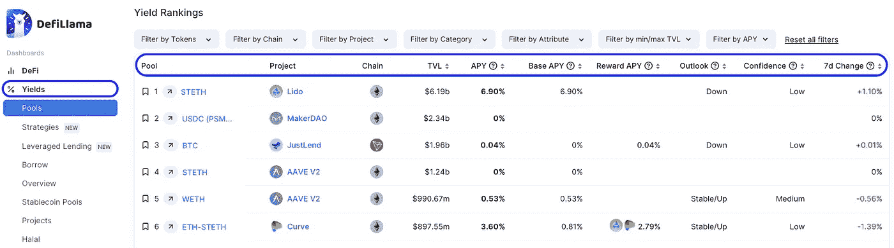

该选项卡显示了各种网络中可用的资金池列表，按照锁定价值、利率、前景和市场信心进行排名。

以丽都为例，它拥有最高的 TVL 和诱人的 6.90%的 APY。

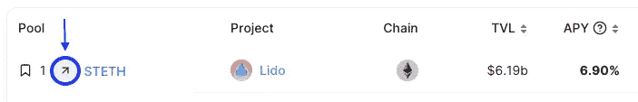

DefiLlama 为用户简化了流程，包括一个小箭头按钮，单击该按钮，用户可直接进入协议标注页面。

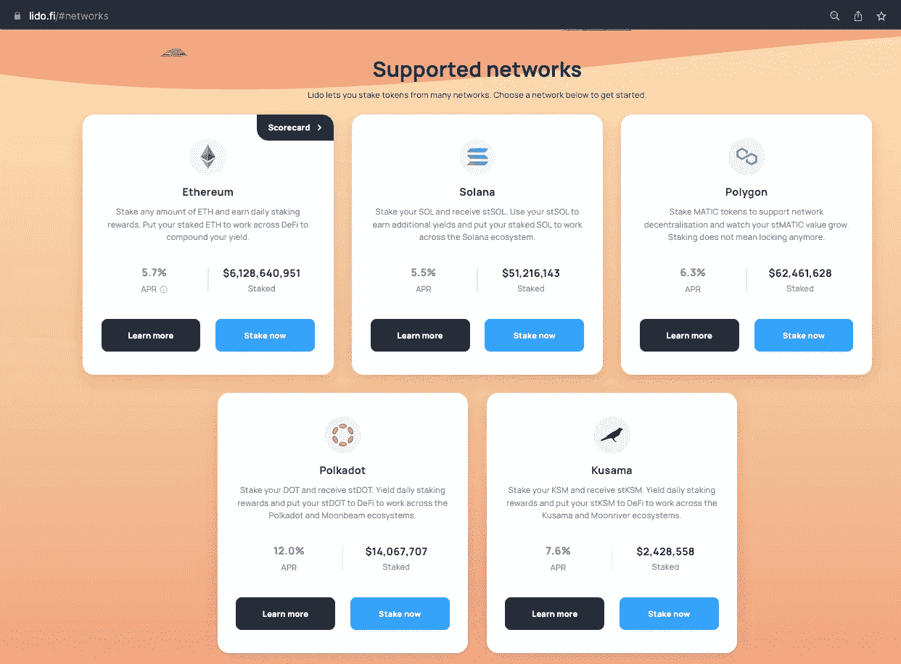

**不喜欢冒险？**

当然，Stablecoins 为您提供最低风险的 defi 暴露。**稳定硬币池**部分包含关于稳定硬币的汇总数据。

该表按照与 Yields Pools 相同的方式分为多个选项卡。查看接受稳定债券的协议列表，并根据其锁定价值、利率、前景和市场信心对其进行排名。

对于这个例子，让我们筛选并寻找一个稳定的硬币收益率，只需要单一的资产赌注。选择“按属性过滤”,然后选中“单次曝光”复选框。

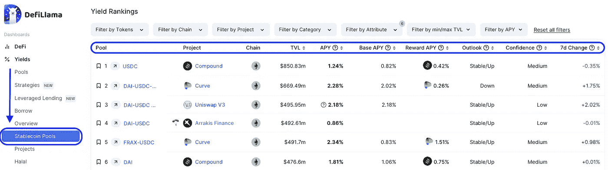

USDC 似乎对管理着 8.5 亿美元资产的 Compound 提出了上诉。该协议将为他们平台上的每一个 USDC 支付 1.24%的 APY。与池类似，小箭头按钮可用于导航至协议标注页面。

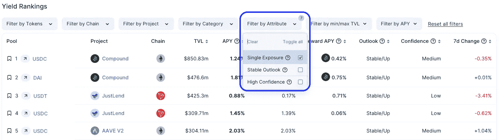

**清算**

用户可以查看清算级别仪表板，了解不同的借出协议将如何在任何清算点清算许多资产。

用户可以通过选择顶部的抵押品资产，将网络设置为使用所选资产作为抵押品。

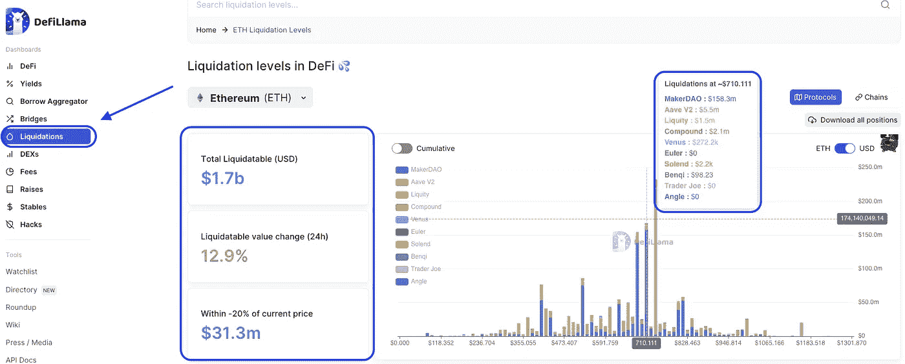

DefiLlama 还提供了探索 DeFi 空间的有用工具。您可以使用观察列表部分创建令牌投资组合进行跟踪。

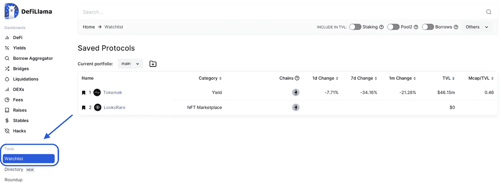

**为了避免恶意链接或诈骗，**该目录具有搜索功能，可引导用户访问正确的协议网站。

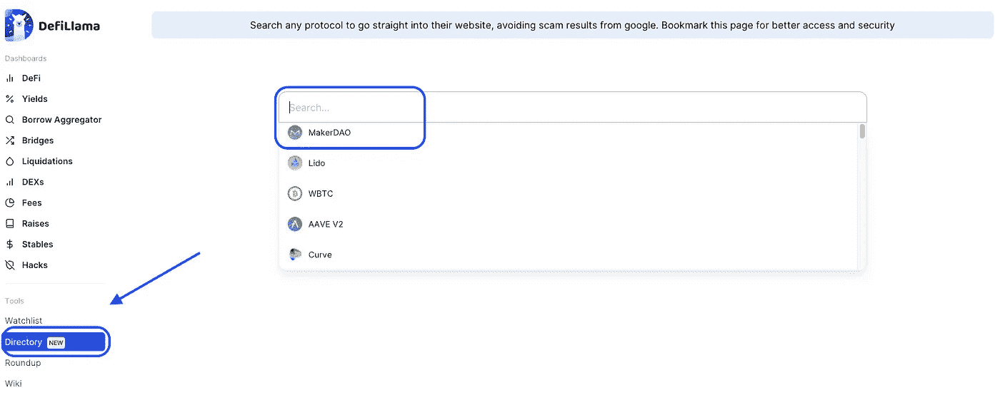

最后，如果你想了解最新的 DeFi 新闻，这一部分将让你了解行业内的最新动态。

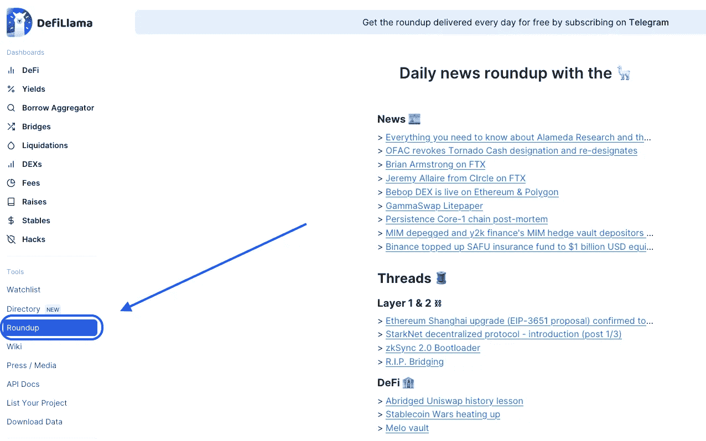

## 结论

DeFiLlama 正迅速成为在每种 DeFi 方案中测量总锁定值(TVL)的最有效的聚合器之一。这是网上最重要和最值得信赖的工具之一，用于跟踪每个 DeFi 协议。

使用他们的工具可以揭示哪些协议和区块链越来越受欢迎，以及他们如何处理排名。这将是你在 DeFi 空间耕作产量的终极指南。

如果你有兴趣了解更多关于代币奖励和耕作的知识，你可以在这里阅读我以前的文章。[https://themoneylego . medium . com/defi-101-token-rewards-and-yield-farming-E0 B1 c 99 c 4059](https://themoneylego.medium.com/defi-101-token-rewards-and-yield-farming-e0b1c99c4059)

好了，这就是开始使用 DefiLlama 所需要知道的全部内容。

> *交易新手？试试* [*密码交易机器人*](/coinmonks/crypto-trading-bot-c2ffce8acb2a) *或* [*复制交易*](/coinmonks/top-10-crypto-copy-trading-platforms-for-beginners-d0c37c7d698c)
> 
> *加入 Coinmonks* [*电报频道*](https://t.me/coincodecap)*[*Youtube 频道*](https://www.youtube.com/c/coinmonks/videos) *获取每日* [*加密新闻*](http://coincodecap.com/)*

# *另外，阅读*

*   *[复制交易](/coinmonks/top-10-crypto-copy-trading-platforms-for-beginners-d0c37c7d698c) | [加密税务软件](/coinmonks/crypto-tax-software-ed4b4810e338)*
*   *[网格交易](https://coincodecap.com/grid-trading) | [加密硬件钱包](/coinmonks/the-best-cryptocurrency-hardware-wallets-of-2020-e28b1c124069)*
*   *[密码电报信号](/coinmonks/top-3-telegram-channels-for-crypto-traders-in-2021-8385f4411ff4) | [密码交易机器人](/coinmonks/crypto-trading-bot-c2ffce8acb2a)*
*   *[最佳加密交易所](/coinmonks/crypto-exchange-dd2f9d6f3769) | [印度最佳加密交易所](/coinmonks/bitcoin-exchange-in-india-7f1fe79715c9)*
*   *[开发者最佳加密 API](/coinmonks/best-crypto-apis-for-developers-5efe3a597a9f)*