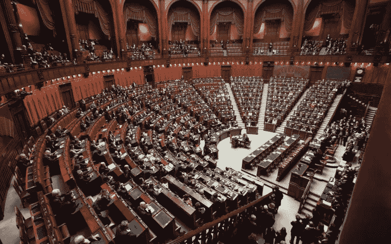

# 定义分权治理和各种不同的模型

> 原文：<https://medium.com/coinmonks/defining-decentralized-governance-and-the-multitude-of-different-models-3d631bb255e2?source=collection_archive---------29----------------------->

B 锁链治理在其分散应用中由两部分组成:“社会治理”，即治理和激励模型，以及“算法治理管理”，即通过智能合同管理模型的电子代码。

如果你想了解道是什么，你可以阅读我以前的文章:“[去中心化自治组织(DAO):简史、挑战、教训](https://liberlion.medium.com/decentralized-autonomous-organization-dao-the-brief-history-challenges-and-lessons-learned-7574b7ec3814)”。

在自主配置中，令牌化激励是形成协议的经济协调博弈的核心。

治理结构经历了几个世纪的演变，有不同的适用模式。区块链网络仅存在了 12 年，而第一个自治和去中心化治理的电子编程是 DAO，仅在 5 年前。

历史短暂的区块链技术面临着治理系统算法管理的巨大挑战，其条件会随着时间的推移、人为错误或复杂的多利益主体环境中的信息不对称而变化。

这种社会治理，伴随着算法的迭代过程，既可以在“链外”进行，也可以在“链上”进行。

# 链外和链上治理

早期的区块链协议，如比特币和以太坊，有一个相当自发而不是非常制度化的社会共识过程，它发生在链外，其中关于协议更改的决定是开发者之间的共识，并由矿工批准实施，所有这一切都是以非正式的方式进行的，没有区块链网络方法。

在传统模型的链外治理中，任何开发人员都可以向社区提交改进建议，即所谓的拉式请求。

最近的几个区块链项目已经引入了关于如何利用各种链上治理模型来减轻这些过程缺陷的替代提议，在这些模型中，决策至少部分地在协议级别被监管和实施。

链上治理指的是允许开发人员在链上传播他们的改进建议，进行投票表决，并在批准后在测试网上部署一段时间，之后该建议将再次进行投票表决，如有必要，部署在主网上。

链上治理解决方案可以增加协调性和公平性，但是它们也是有风险的，因为它们一旦制定就更难改变，并且可能更容易被利用。

另一方面，链外治理相对集中，排除了许多小令牌持有者，特别是那些缺乏正确评估网络决策的技术专业知识的人。

据推测，一定程度的链上协调有利于整体协调，但它不能解决人的因素。链上模式和链下模式各有利弊，其中一种模式的适用性将取决于区块链的可扩展性、治理模式以及采用该模式的生态系统。这两种方法的组合可能适合于解决决策过程。

Cardano 的 project Catalyst 是一种链外投票模式，但如果我们与当前的模式进行比较，它是治理的混合模式，因为任何拥有最低资金的令牌持有者都可以参与，即使他们不具备开发人员的技术能力。

# 用例

DAO 治理可以为任何需要治理的结构实现，只要有决策。因此，对 Dao 的使用没有限制。

但是为什么要使用 DAO 结构呢？决策的透明性、运营的成本效率和组织的创建是其主要优势，并且对于那些不需要层级化、分散决策的组织来说具有更大的效用。

有许多场景可以说明如何使用 DAO。我将举一个简单的例子来说明这个应用程序，一个邻里协会。

在这种类型的传统组织中，每个家庭都要缴纳会费，用于支付社区各种故障和改善的费用。

使用 DAO 的结构，参与者通过他们的治理令牌进行投票，根据协会的章程和居住条件，一些参与者拥有更多的投票权。然后，通过消费代币和智能合约，所有邻居将资金存入银行。这些资金不会掌握在一个人手中，而是以透明和可审计的方式掌握在区块链手中。聪明的合同会把他们关起来，等待民主决策。

对于每一项新费用(例如维修或改进)，都会生成一个请求，由供应商提供不同的预算。邻居将能够在确定的时间内以民主的方式决定他们感兴趣的预算，将资金解冻给得票最高的一方。

在这个模型中，有一个管理员的角色，他只被允许生成投票提案，但是资金的管理是在合同协议中根据参与者费用的批准来定义的。

最重要的用例是应用于一个国家政府的用例。

民主有几个世纪的历史，它诞生于古希腊。间接或代议制模式建立在权力分立的基础上，这是我们现代民主的基石，也是一种权力下放的形式。

为什么不把民主的模式带给道教徒？这是经过验证的，可以改进的。

“流动民主”模式将在 DAOs 中成为现实。这是一种永久参与的民主形式，包括可以立即撤销的代理投票，因此有流动性的概念。

就立法而言，公民有可能对代表的提案进行表决，在代表机构处理之前批准或否决这些提案，甚至提出自己的提案由代表推动。所有的投票都是透明的，甚至保持法律的保密性。

这一模式减少了腐败案件，并赋予公民权力，他们可以拒绝自己选出的代表推行的违背其竞选承诺的法律。

# 治理模式

不可能描述所有的治理模型，因为还没有发明出所有的模型。模型及其变体是无限的。但我会告诉你几个。

**优先投票**

优先投票也称为排序选择投票，选民使用他们的排序选择投票来选择要投票的选项。这种方法的一些变体要求投票者对所有提案进行排序，另一些变体限制他们可以排序的数量，还有一些变体允许投票者对他们认为合适的数量进行排序，将其余的放在最后。这种方法有助于从大量不同的项目中进行选择，并根据偏好对它们进行排序。

**预算箱**

提案是根据分配给每个项目的资金进行投票的。提供的资金越多，选择就越多，如果一个项目被认为超出预算，资金就会减少。此方法对于开发项目的投票很有用。

**定罪投票**

根据群体成员的偏好为提案提供资金，以滚动方式表达，即投票人陈述他们的偏好，而不是在一次有时间限制的会议中投票。一个成员可以在任何时候改变他的偏好，但他对同一提案保持偏好的时间越长，他的信念就越“强”。确信投票防止 Sybil 攻击，并提供对共谋的抵抗。

**最低反共谋基础设施(MACI)**

最初由维塔利克·布特林(Vitalik Buterin)提出，与 MACI 一起构建的系统让参与者之间的共谋变得更加困难，同时保留了审查阻力和正确执行智能合同的好处。名为 Alice、Bob 和 Charlie 的白名单投票者通过向智能合同发送他们的公钥来注册投票。此外，还有一个中央协调器 Dave，他的公钥是众所周知的。当 Alice 投票时，她用自己的私钥签署她的投票，用 Dave 的公钥加密她的签名，并将结果发送到智能合约。每个投票人可以随时改变她的密钥对。为此，他创建并签署了密钥更改命令，对其进行加密并将其发送到智能合约。这使得行贿者不可能确定他的贿赂对受贿者的投票有任何影响。例如，如果 Bob 贿赂 Alice 以某种方式投票，Alice 可以简单地使用她记录的第一个公钥(现在是空的)来投票。由于这样的投票是加密的，正如 Alice 先前发送给 Dave 的密钥更改消息一样，Bob 无法知道 Alice 是否真的按照他的意图投票了。即使 Alice 将她投票的明文透露给 Bob，她也只需要不给他看她先前用来使该密钥无效的更新的密钥命令。简而言之，只要她在投票前发送了一个加密的命令，就没有办法知道那个投票是否有效。

**二次投票**

选民通过分配选票来表达他们的偏好程度，而不仅仅是偏好方向，让用户为给定问题的额外投票“买单”，以更强烈地表达对某些问题的支持。投票的支付是通过治理令牌完成的。二次投票是基于市场原则的，每个投票人都收到一份他们有权决定的投票信用预算，以及个人授权来影响一系列决定的结果。如果某个参与者强烈支持或反对某个特定的决定，则可以分配额外的投票来按比例显示投票者的支持。投票定价规则决定了额外投票的成本，每一票都变得越来越昂贵，从而表明个人对特定决策的支持。二次投票工作原理的简化公式是:投票人的成本=(票数)2。二次方的性质暗示了一种更有效的投票形式，将选择权分散到许多问题上。二次投票也是限制基于令牌投票的财阀效应的一种方式，同时给游戏中更有影响力的人一种表达他们偏好的方式。Gitcoin 已经成功地将其用于众筹活动。

**快照**

最广泛使用的投票方法基于每个用户持有的令牌量，称为投票权，验证用户的令牌余额，然后创建链外信令投票。这个模型是在卡尔达诺的催化剂项目中使用的。DAOs 中的 Sybil 攻击指的是具有多个身份的单个投票者投票，这是在匿名或伪匿名区块链中发生的问题，这就是为什么基于令牌的投票是抵抗这些攻击的有效方式，因为加密资产不能随意创建。然而，基于令牌的投票被批评为有利于财阀统治，投票权可以集中在少数选民身上，对分权产生不利影响，但人们可以将这种模式与二次投票结合起来，以避免这一问题。

*本文由我署名，原载于*[*【AdaPulse】*](https://adapulse.io/defining-decentralized-governance-and-the-multitude-of-different-models/)*。*

[liberlion.com](http://liberlion.com)

> 交易新手？尝试[加密交易机器人](/coinmonks/crypto-trading-bot-c2ffce8acb2a)或[复制交易](/coinmonks/top-10-crypto-copy-trading-platforms-for-beginners-d0c37c7d698c)