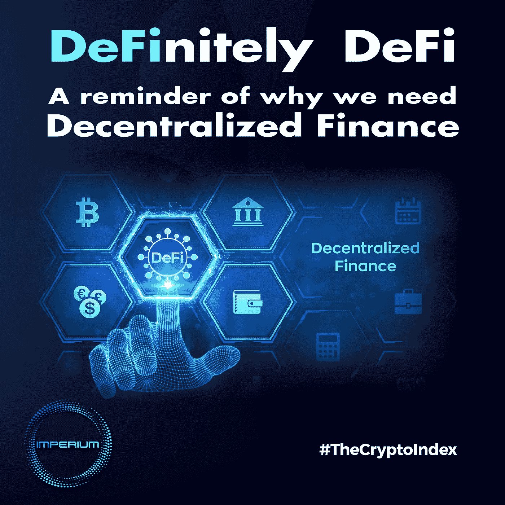

# 肯定是 DeFi——提醒我们为什么需要分散的金融

> 原文：<https://medium.com/coinmonks/definitely-defi-a-reminder-of-why-we-need-decentralized-finance-4a35f6aa0c30?source=collection_archive---------24----------------------->

11 月 11 日，世界第二大加密货币交易所 FTX 申请破产，就在几天前，CEX 流动性的不确定性引发了大规模银行挤兑。

这是 2022 年崩溃的一系列加密项目中的最新一个，导致数百亿美元的损失和数百万客户受到影响。

首先是 Terra Luna 的垮台及其算法稳定性，随后是三箭资本的破产。

除此之外，三家中央加密货币提供商也崩溃了:Celsius Network、BlockFi 和 Voyager Digital。

这部分是因为 2022 年的加密冬天整合，但主要是因为这些中央实体行为不端或管理不善用户资金。

这是集权财政的失败，再次提醒我们需要分权的原因。

但是这些更确切的是什么，它在金融方面带来的解决方案是什么？

让我们回到比特币，这一切开始的地方…

加密货币的想法是对传统中央金融系统引发的 2008 年金融危机的反应。

当中本聪推出比特币时，它想到的是一个不需要中央机构监管的金融系统，以防止第三方干预改变它。

分布式账本技术(DLT)解决了这个问题，它使用一个分散的计算机网络来解决密码难题，以便验证网络上的交易。

因此，不再需要中介，取而代之的是民主的计算系统，只需要信任协议的底层数学。

第一个分散自律的金融体系就是这样诞生的。

后来，以太坊的发展带来了更多相同方向的创新，带来了智能合约，使得大量不可信金融产品和系统的开发成为可能。

这进一步推动了这一概念，并为后来被称为分散金融(DeFi)的概念奠定了基础。

# 为什么 DeFi？

DeFi 旨在确保比特币带来并被以太坊放大的好处:无许可验证、透明、抵制审查以及资产的自我保管。

## “未经许可”

无许可(或无信任)是一个描述区块链协议或 DeFi 平台的质量的术语，其不需要来自中央机构的许可或不需要对第三方的信任投资(如算法提供的)。

## 透明度

由于 DeFi 的性质及其分布式验证的需要，所有区块链数据都是公开的，从而确保了全球透明度。因此，一个地址的余额和它在区块链上执行的交易在任何时候都很容易验证。

## 抵制审查

政府可以审查或限制实体提供的某些服务，但他们不能对计算机程序这样做。你不能控制没有中心控制点的东西。

## 自我监护

“强大的力量伴随着巨大的责任”。

在分散的空间中，自我保管是必要的，这意味着用户是唯一负责存储和管理其资产的人。

“不是你的钥匙，不是你的硬币”成了密码领域的一句口号，而 FTX 的崩溃又一次提醒了这一事实。如果你不拥有存储你的密码的钱包的私钥，这意味着你并不真正拥有那个密码。

由于这些原则，像 Uniswap 这样的 dex 或像 Aave 或 Compound 这样的贷款平台的用户永远不会担心失去对他们资产的访问权。这些协议是透明的，由不可变的智能契约逻辑管理，不允许区块链资产以最初编程的其他方式使用。

因此，即使在不确定性和市场动荡的情况下，DeFi 平台和应用程序也能继续正常运行。因为这正是它所带来的:确定性、安全性、透明度和所有权。这就是 DeFi 的力量。

由于它有其缺点，如复杂的可用性或可扩展性和流动性问题，我们必须在它的基础上找到解决这些问题的创新解决方案，并使分散化融资在全球范围内容易获得，为任何相信它的人提供分散化的好处。

> 交易新手？试试[加密交易机器人](/coinmonks/crypto-trading-bot-c2ffce8acb2a)或者[复制交易](/coinmonks/top-10-crypto-copy-trading-platforms-for-beginners-d0c37c7d698c)