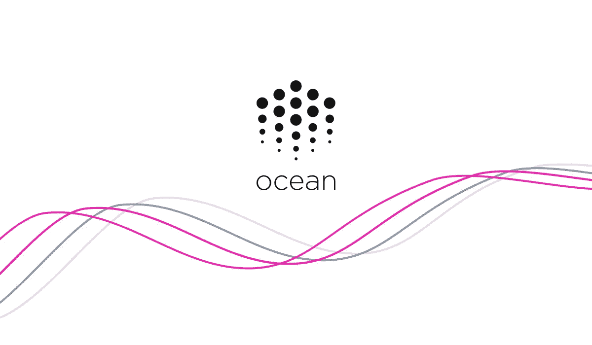

# 大数据民主化。海洋协议和分散数据共享介绍

> 原文：<https://medium.com/coinmonks/democratizing-big-data-an-introduction-to-ocean-protocol-and-decentralized-data-sharing-8a2c5adc1af3?source=collection_archive---------22----------------------->

人工智能是一项变革性技术，将颠覆大多数行业。人工智能是计算机科学的一个领域，其中心是设计能够解决通常需要人类智能才能解决的问题的机器。人工智能驱动的技术可以自动化繁重的任务，增强人类决策，最大限度地减少错误，并识别复杂数据中的关键趋势。2021 年，人工智能增强创造了超过 2.7 万亿美元的商业价值，预计到 2025 年将取代 T2 8500 万个工作岗位。

然而，人工智能的未来受到创新者和拥有参与大数据计划所需资源的人之间不一致的制约。人工智能行业严重私有化，由云服务提供商和社交媒体巨头主导。对大数据和可扩展计算基础设施的需求造成了巨大的进入壁垒，阻止了大多数创新者参与自举式开发。虽然云服务为大众提供了可扩展的计算资源，但人工智能创新受到了无法访问大型、相关、潜在敏感数据集的阻碍。目前所缺少的是一个经济框架，在这个框架中，数据可以对创新者开放，并在安全、道德和流动的环境中进行交换。

根据[数字世界研究](https://www.theguardian.com/news/datablog/2012/dec/19/big-data-study-digital-universe-global-volume)，世界上不到 1%的数据被分析过。法律障碍、道德困境和不当的货币化渠道阻碍了数据巨头分享/出售他们的数据。因此，今天的人工智能市场领导者是 AWS、IBM 和谷歌，或者那些拥有开发突破性深度学习模型所需数据的公司。虽然计算和算法创新使人工智能应用多样化，但鉴于大数据的限制，人工智能行业的潜力表现不佳。

**海洋协议**

进入海洋协议，这是一个基于令牌的分散网络，旨在通过民主化大数据来传播人工智能的好处。Ocean 的目标是通过在数据服务上提供适当的激励、控制和安全结构来刺激数据共享。海洋协议的核心是一个基于区块链的数据经济，它连接了提供商(拥有数据的人)和消费者(人工智能创新者)。通过对数据服务进行令牌化，网络为数据提供商打开了赚钱的机会，同时保留了完全的控制和隐私机制。因此，海洋数据经济为人工智能创新者提供了对分布式、潜在敏感数据集的访问，否则这些数据集将永远无法获得。Ocean 利用加密令牌、分散式服务协议和访问控制基础设施来评估数据服务和策划功能性数据经济。

Ocean Protocol 的核心创新是其计算到数据的功能，这使得人工智能创新者可以在不需要访问或查看原始数据的情况下运行计算作业。更具体地说，计算到数据(Compute-to-Data)是联合学习的一种补充技术，它允许创新者从私人数据中训练他们的模型，而原始信息永远不需要离开数据所有者的内部设施。这个想法是支持边缘设备，如智能手机、IOT 设备、服务器等。在一个共享的机器学习模型上合作。每个设备下载模型的当前状态，从中学习，并更新它，而原始数据永远不需要离开所有者的房屋。这种形式的分散模型训练通过绕过将敏感数据聚集到一个集中源的需要，使人工智能发生了革命性的变化。计算到数据提供了必要的所有权和隐私结构来刺激大规模数据共享，而不是解决法律和隐私问题。这种对原始数据的前所未有的访问为人工智能创新者从高度敏感的信息(如遗传数据、个人财务信息、医疗报告等)中构建革命性的模型提供了可能性。

Ocean 利用以太坊区块链的可编程性和令牌化特性来构建数据经济的后端。数据集的所有权由不可替代的“数据 NFTs”表示，并代表数据资产的不可改变的版权。然后，提供商铸造“数据令牌”,代表“访问”数据服务的权利。Datatokens 是可替换的，并被编程为授予消费者对数据集的永久、一次性或计算到数据的访问权限。由于 Ocean 的数据令牌是用以太坊的可替换令牌标准 ERC-20 构建的，创新者可以用加密货币购买数据令牌，并将其存储在传统的 Web-3 钱包中。名为 Ocean Market 的分散式应用程序(dApp)促进了数据令牌的制造、发现和销售，该应用程序允许任何拥有 Web-3 钱包的人参与数据经济。

**计算到数据的力量——遗传学数据模型训练**

作为海洋协议如何变革人工智能的一个例子，想象一下一个医学研究团队刚刚开发了一个专门为遗传学数据设计的深度学习模型。将原始数据集中到一个单一、集中的来源的传统方法是不可能的。有关数据隐私和传输的法律障碍以及购买高度敏感数据的明显经济障碍会阻止研究团队访问所需信息。有了海洋协议，通过适当的经济激励和安全功能，这种形式的数据共享成为可能。

这一过程将从遗传学实验室或其他数据提供商开始，将他们的链上数据集创建为数据 NFT。这些 NFT 不包括数据集本身，而是存储元数据，并伴随有 DID(唯一的分散标识符)。然后，数据提供商将铸造数据令牌(访问令牌的权利),研究团队将浏览海洋市场，使用 Web-3 钱包购买这些数据令牌。

购买后，研究团队会将 Datatoken 发送到提供商的钱包，并发送一个参与给定计算服务的请求。然后，数据提供商对研究团队的 Web-3 钱包和 Datatoken 执行一系列身份验证步骤。这些步骤可能包括确认向智能合同地址付款、签署服务协议，以及验证其他凭据，如本地化的身份信息。一旦获得批准，研究团队就会像 DID 一样发布他们的算法，消费过程就开始了。

数据提供商将利用研究团队的算法完全在本地运行计算作业。然后，提供者将模型输出和执行日志上传到 AWS S3 存储桶。S3 桶的 URL 将与研究团队共享，智能合同将向数据提供商支付费用。然后，研究团队可以与其他数据提供商重复这一过程，用必要的敏感遗传学数据来充分训练他们的模型。

其核心是，Ocean 的分散令牌模型旨在通过激励数据共享来发展人工智能。Ocean Protocol 的创始人 Bruce Pon 写道:“数据具有巨大的价值，但没有人分享它，因为每个人都害怕失去控制。通过创建一个分散的网络，任何人都可以安全地共享，同时保持控制和隐私，一个新的数据经济可以出现。”

在过去的十年里，人工智能一直在改变计算的格局，无论是从能力角度还是从基础设施角度。这些机器变得越来越强大，对高度可扩展的计算资源、大数据和强大算法的需求前所未有。有了有效的数据共享技术，人工智能的未来是无限的。有了海洋协议，数据可以成为流动资产，让提供商和消费者都受益。对于企业来说，数据中心可以从一个主要的支出项目转变为一个收入流，而创新者可以购买数据作为服务。在未来几年，分散的数据共享可以有助于新的人工智能技术，这些技术可以减少能源排放，识别癌症的遗传倾向，生产有效的自动驾驶汽车，以及许多更令人兴奋的创新。

> 交易新手？试试[加密交易机器人](/coinmonks/crypto-trading-bot-c2ffce8acb2a)或者[复制交易](/coinmonks/top-10-crypto-copy-trading-platforms-for-beginners-d0c37c7d698c)